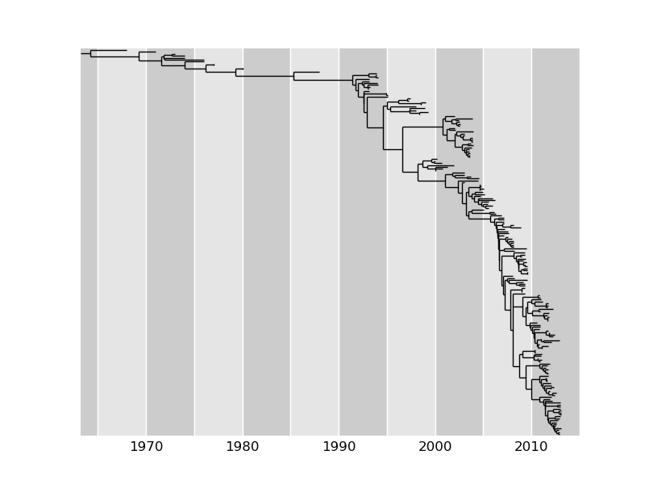

[](https://travis-ci.org/neherlab/treetime)

## TreeTime: maximum likelihood dating and ancestral inference for phylogenetic trees

### Overview

TreeTime provides routines for ancestral sequence reconstruction and the inference of molecular-clock phylogenies, i.e., a tree where all branches are scaled such that the locations of terminal nodes correspond to their sampling times and internal nodes are placed at the most likely time of divergence.

TreeTime is implemented in Python 2.7 -- an experimental port to [Python 3 is available in a separate branch](https://github.com/neherlab/treetime/tree/py3).
TreeTime aims at striking a compromise between sophisticated probabilistic models of evolution and fast heuristics. It implements GTR models of ancestral inference and branch length optimization, but takes the tree topology as given.
To optimize the likelihood of time-scaled phylogenies, TreeTime uses an iterative approach that first infers ancestral sequences given the branch length of the tree, then optimizes the positions of unconstrained nodes on the time axis, and then repeats this cycle.
The only topology optimization are (optional) resolution of polytomies in a way that is most (approximately) consistent with the sampling time constraints on the tree.
The package is designed to be used as a stand-alone tool or as a library used in larger phylogenetic analysis work flows.

#### Features
* ancestral sequence reconstruction (marginal and joint maximum likelihood)
* molecular clock tree inference (marginal and joint maximum likelihood)
* inference of GTR models
* rerooting to obtain best root-to-tip regression
* auto-correlated relaxed molecular clock (with normal prior)

## Table of contents
  * [Installation and prerequisites](#installation-and-prerequisites)
  * [Basic usage](#basic-usage)
    + [Ancestral sequence reconstruction:](#ancestral-sequence-reconstruction-)
    + [Molecular clock phylogenies](#molecular-clock-phylogenies)
    + [Quantify temporal signal in phylogenies and reroot to the maximize "clock-i-ness"](#quantify-temporal-signal-in-phylogenies-and-reroot-to-the-maximize--clock-i-ness-)
  * [Example scripts](#example-scripts)
  * [Comparable/related Tools](#comparable-tools)
  * [Projects using TreeTime](#projects-using-treetime)
  * [Developer info](#developer-info)




### Installation and prerequisites
TreeTime is written in Python 2.7 and currently doesn't support Python 3.
* The package depends on several python libraries:
    - numpy, scipy: for all kind of mathematical operations as matrix operations, numerical integration, interpolation, minimization, etc.

    - BioPython: for parsing multiple sequence alignments and all phylogenetic functionality

    - matplotlib: optional dependency for plotting
  If you do not have these libraries, you can install them by typing in the terminal:
    ```bash
    $pip install numpy scipy biopython matplotlib
    ```

* To install the package, run `setup.py` script from the terminal:
    ```bash
    $python setup.py install
    ```

You might need root privileges for system wide installation. Alternatively, you can simply use it TreeTime locally without installation. In this case, just download and unpack it, and then add the TreeTime folder to your $PYTHONPATH.

#### Building the documentation

The API documentation for the TreeTime package is generated created with Sphinx. The source code for the documentaiton is located in doc folder.

##### Requirements

  - sphinx-build to generate static html pages from source. Installed as

  ```bash
  $pip install Sphinx
  ```

  - basicstrap Html theme for sphinx:

  ```bash
  $pip install sphinxjp.themes.basicstrap
  ```

After required packages are installed, navifgate to doc directory, and build the docs by typing:

```bash
$make html
```

Instead of html, another target as `latex` or `epub` can be specified to build the docs in the desired format.


##### Requirements

To build the documentation, sphinx-build tool should be installed. The doc pages are using basicstrap html theme to have the same design as the TreeTime web server. Therefore, the basicstrap theme should be also available in the system


### Basic usage
TreeTime can be used as part of python programs that create and interact with tree time objects. How TreeTime can be used to address typical questions like ancestral sequence reconstruction, rerooting, timetree inference etc is illustrated by a collection of example scripts described below.

In addition, we provide scripts that can be run from the command line with arguments specifying input data and parameters.


#### Ancestral sequence reconstruction:

  To perform ancestral sequence reconstruction, use the script `ancestral_inference.py`.
  ```
  usage: ancestral_reconstruction.py [-h] --aln ALN [--tree TREE] [--marginal]
                                     [--infer_gtr]

  Reconstructs ancestral sequences and maps mutations to the tree. The output
  consists of a file ending with _ancestral.fasta with ancestral sequences and a
  tree ending with _mutation.newick with mutations appended to node names as
  _A45G_... The inferred GTR model is written to stdout

  optional arguments:
    -h, --help   show this help message and exit
    --aln ALN    fasta file with input sequences
    --tree TREE  newick file with tree
    --marginal   marginal instead of joint ML reconstruction
    --infer_gtr  infer substitution model
    --keep_overhangs  keep 5' and 3' gaps rather than filling them with ancestral sequence
  ```

  Alternatively, you can directly interact with the class `TreeAnc` from treetime as follows
    ```python
    from treetime import TreeAnc
    ta = TreeAnc(tree='my_tree.nwk', aln='my_seqs.nwk', gtr='JC69')
    ta.infer_ancestral_sequences(infer_gtr=True, marginal=False)
    ```
  Every node of `ta.tree` now has a `node.sequence` attached. With the optional argument `infer_gtr=True`, a maximum likelihood GTR model is inferred and overwrites the initial one, the option `marginal=True` can be used to construct a marginal rather than joint maximum likelihood reconstruction.

  The tree and alignment arguments can be either file names (newick and fasta) or Biopython tree and alignment objects.

  After running `ta.infer_ancestral_sequences()`, the each node in the tree
  will have a `node.sequence` attached and `node.mutations` contains the difference
  of that sequence to the sequence of the parent node.
  Other useful options to the constructor include `fill_overhangs`. If `TreeAnc` is
  initialized with `fill_overhangs=True`, 5' or 3' gaps will be treated as missing data and filled with the sequence of the nearest ancestral node.

  The inferred substitution model is accessible via `print(tt.gtr)` and the equilibrium character frequencies are stored in `tt.gtr.pi`, the symmetric substitution matrix in `tt.gtr.W`.

  A longer example of the usage is available in [`examples/ancestral_inference.py`](https://github.com/neherlab/treetime/blob/master/examples/ancestral_inference.py)

#### Molecular clock phylogenies

  To infer molecular clock phylogenies, use the script `timetree_inference.py`:
  ```
    usage: timetree_inference.py [-h] --aln ALN --dates DATES [--tree TREE]
                                 [--infer_gtr] [--reroot REROOT]
                                 [--optimize_branch_length] [--keep_polytomies]
                                 [--relax [RELAX [RELAX ...]]]
                                 [--max_iter MAX_ITER] [--verbose VERBOSE]
                                 [--Tc TC] [--plot]

    Reconstructs ancestral sequences and infers a molecular clock tree. The script
    produces an alignment file ending on _ancestral.fasta which contains the
    inferred ancestral sequences and a tree file ending on _timetree.nexus.
    Inferred mutations are included as comments. The molecular clock, along with
    the inferred GTR model, is written to stdout)

    optional arguments:
      -h, --help            show this help message and exit
      --aln ALN             fasta file with input sequences
      --tree TREE           newick file with tree
      --dates DATES         csv with dates for nodes with 'node_name, date' where
                            date is float (as in 2012.15)
      --infer_gtr           infer substitution model
      --reroot REROOT       reroot the tree. Valid arguments are 'best',
                            'midpoint', or a node name
      --optimize_branch_length
                            Reoptimize branch length. Note that branch length
                            optimized by TreeTime are only accurate at short
                            evolutionary distances.
      --keep_polytomies     Don't resolve polytomies using temporal information.
      --relax [RELAX [RELAX ...]]
                            use an autocorrelated molecular clock. Prior strength
                            and coupling of parent and offspring rates can be
                            specified e.g. as --relax 1.0 0.5
      --max_iter MAX_ITER   maximal number of iterations the inference cycle is
                            run
      --verbose VERBOSE     verbosity of output 0-6
      --Tc TC               coalescent time scale -- sensible values are on the
                            order of the average hamming distance of
                            contemporaneous sequences. In addition, "opt"
                            "skyline" are valid options and estimate a constant
                            coalescent rate or a piecewise linear coalescent rate
                            history
      --plot                plot the tree on a time axis and save as pdf
  ```
  Alternatively, you can interact directly with the `TreeTime` class from within a script or the python console. `TreeTime` is a subclass of `TreeAnc`, so all its methods are available.

    ```python
    from treetime import TreeTime
    tt = TreeTime(dates=mydates, tree='my_tree.nwk', aln='my_seqs.nwk', gtr='JC69')
    tt.run(root='best', infer_gtr=True, Tc='skyline', resolve_polytomies=True, max_iter=2)
    ```
  Every node of `tt.tree` will be assigned a `numdate` and `time_before_present` attribute.
  The `numdate` attribute has units of years, the `time_before_present` attribute has units of (inverse) substitution rate. The molecular clock estimate can be obtained by `print(tt.date2dist)`.

  The additional argument `resolve_polytomies` specifies whether TreeTime will attempt to resolve multiple mergers using the temporal constraints on leaves.

  The optional argument `Tc` specifies if TreeTime will use a coalescent prior. `Tc` can either be a float, which is interpreted as coalescence time scale in units of the inverse clock rate (values similar to average pairwise sequence distance are sensible), or `Tc='opt'` in which case TreeTime will optimize `Tc` to maximize the likelihood. Finally, `Tc='skyline'` will fit a piecewise linear function as coalescent rate history. To access the result, use
    ```
    skyline = tt.merger_model.skyline_inferred(gen=50)
    ```
  The result will be an interpolation object the return the "effective population size", its pivots are available as `skyline.x` and `skyline.y`.
  The argument `gen=50` specifies the number of generations per year to convert the rate estimate into population size.

  The optional argument `niqd` takes a float and will activate a filter that marks all nodes that deviate more than `niqd` inter-quartile distance from the molecular clock. This is done via the method `tt.clock_filter` that optionally plots a root-to-tip distance vs time scatter plot.

  In addition, an autocorrelated relaxed clocks can be used by passing a tuple of two numbers `(slack, coupling)`. `slack` is the strength of the normal prior on rate variation, coupling penalizes rate variation between parents and children.

  Longer examples of TreeTime usage are available in the scripts [`examples/relaxed_clock.py`](https://github.com/neherlab/treetime/blob/master/examples/relaxed_clock.py), [`examples/rerooting_and_timetrees.py`](https://github.com/neherlab/treetime/blob/master/examples/rerooting_and_timetrees.py), and [`examples/ebola.py`](https://github.com/neherlab/treetime/blob/master/examples/ebola.py).


#### Quantify temporal signal in phylogenies and reroot to the maximize "clock-i-ness"

  The script `temporal_signal.py` provides functionality analogous to TempEst by Andrew Rambaut.
  ```
      usage: temporal_signal.py [-h] --tree TREE --dates DATES [--aln ALN]
                                [--infer_gtr] [--reroot] [--plot]
                                [--verbose VERBOSE]

      Calculates the root-to-tip regression and quantifies the 'clock-i-ness' of the
      tree. It will optionally reroot the tree to maximize the clock-like signal and
      recalculate branch length.

      optional arguments:
        -h, --help         show this help message and exit
        --tree TREE        newick file with tree
        --dates DATES      csv with dates for nodes with 'node_name, date' where
                           date is float (as in 2012.15)
        --aln ALN          fasta file with input sequences
        --infer_gtr        infer substitution model
        --reroot           reroot the tree to maximize the correlation of root-to-
                           tip distance with sampling time
        --plot
        --verbose VERBOSE  verbosity of output 0-6
  ```
  The slope of the regression of root-to-tip distance vs sampling date will be printed to stdout along with the fraction of variance explained by the linear regression. By passing the flag `--reroot`, treetime will search for the root that maximizes the correlation of root-to-tip distance with time and reroot the tree. The option `--plot` will produce a scatter plot with the best regression and save it to file.

#### Scan sequences for homoplasies
  The term homoplasies refers to mutations that occurred multiple times in parallel.
  This is for example common for drug resistance mutations that arise independently in different individuals under treatment.
  However, homoplasies can also indicate recombination or contamination and a basic scan for excess homoplasies is a useful sanity check

  The script `homoplasy_scanner.py` reconstructs ancestral sequences, maps the mutations to the tree and outputs statistics on how often different sites are hit.
  ```
    usage: homoplasy_scanner.py [-h] --aln ALN [--tree TREE] [--detailed]
                                [--gtr GTR]
                                [--gtr_params GTR_PARAMS [GTR_PARAMS ...]]
                                [--prot] [--zero_based] [-n N] [--verbose VERBOSE]

    Reconstructs ancestral sequences and maps mutations to the tree. The tree is
    then scanned for homoplasies. An excess number of homoplasies might suggest
    contamination, recombination, culture adaptation or similar.

    optional arguments:
      -h, --help            show this help message and exit
      --aln ALN             fasta file with input nucleotide sequences
      --tree TREE           newick file with tree (optional if tree builders
                            installed)
      --detailed            generate a more detailed report
      --gtr GTR             GTR model to use. Type 'infer' to infer the model from
                            the data. Or, specify the model type. If the specified
                            model requires additional options, use '--gtr_args' to
                            specify those
      --gtr_params GTR_PARAMS [GTR_PARAMS ...]
                            GTR parameters for the model specified by the --gtr
                            argument. The parameters should be feed as 'key=value'
                            list of parameters. Example: '--gtr K80 --gtr_params
                            kappa=0.2 pis=0.25,0.25,0.25,0.25'. See the exact
                            definitions of the parameters in the GTR creation
                            methods in treetime/nuc_models.py. Only nucleotide
                            models supported at present
      --prot                protein alignment
      --zero_based          zero based SNP indexing
      -n N                  number of mutations/nodes that are printed to screen
      --verbose VERBOSE     verbosity of output 0-6
  ```

#### Discrete character reconstruction and "mugration" models
  Sequences often have discrete characters attached to them, for example `country of isolation`, `continent`, `host` etc.
  The `mugration.py` script provides functionality to reconstruct ancestral states of such characters.
  ```
      usage: mugration.py [-h] --tree TREE --states STATES [--attribute ATTRIBUTE]
                          [--weights WEIGHTS] [--confidence] [--verbose VERBOSE]

      Reconstructs discrete ancestral states, for example geographic location, host, or similar.

      optional arguments:
        -h, --help            show this help message and exit
        --tree TREE           newick file with tree
        --attribute ATTRIBUTE
                              attribute to reconstruct, e.g. country
        --states STATES       csv or tsv file with discrete characters.
                              #name,country,continent taxon1,micronesia,oceania ...
        --weights WEIGHTS     csv or tsv file with probabilities of that a randomly
                              sampled sequence has a particular state. E.g.
                              population of different continents or countries. E.g.:
                              #country,weight micronesia,0.1 ...
        --confidence          output confidence of mugration inference
        --verbose VERBOSE     verbosity of output 0-6
  ```
  The script will save the tree in nexus format with the inferred attribute added as comments to each node (internal and external).
  In addition, the inferred GTR model and the marginal probability of each state for each node will be written to file.

### Example scripts
The following scripts illustrate how treetime can be used to solve common problem with short python scripts. They are meant to be used in an interactive ipython environment and run as `run examples/ancestral_inference.py`.
 * [`ancestral_inference.py`](https://github.com/neherlab/treetime/blob/master/examples/ancestral_inference.py) illustrates how ancestral sequences are inferred and likely mutations are assigned to branches in the tree,
 * [`relaxed_clock.py`](https://github.com/neherlab/treetime/blob/master/examples/relaxed_clock.py) walks the user through the usage of relaxed molecular clock models.
 * [`examples/rerooting_and_timetrees.py`](https://github.com/neherlab/treetime/blob/master/examples/rerooting_and_timetrees.py) illustrates the rerooting and root-to-tip regression scatter plots.
 * [`ebola.py`](https://github.com/neherlab/treetime/blob/master/examples/ebola.py) uses about 300 sequences from the 2014-2015 Ebola virus outbreak to infer a timetree. This example takes a few minutes to run.


### Comparable/related Tools

There are several other tools which estimate molecular clock phylogenies.
* [Beast](http://beast.bio.ed.ac.uk/) relies on the MCMC-type sampling of trees. It is hence rather slow for large data sets. But BEAST allows the flexible inclusion of prior distributions, complex evolutionary models, and estimation of parameters.
* [Least-Square-Dating](http://www.atgc-montpellier.fr/LSD/) (LSD) emphasizes speed (it scales as O(N) as **TreeTime**), but provides limited scope for customization.
* [treedater](https://github.com/emvolz/treedater) by Eric Volz and Simon Frost is an R package that implements time tree estimation and supports relaxed clocks.

### Projects using TreeTime

  * TreeTime is an integral part of the [nextstrain.org](http://nextstrain.org) project to track and analyze viral sequence data in  real time.
  * [panX](http://pangenome.de) uses TreeTime for ancestral reconstructions and inference of gene gain-loss patterns.


### Developer info

  - Credits -- .
  - Copyright and License: Pavel Sagulenko and Richard Neher, MIT Licence
  - References
    * [TreeTime: Maximum-likelihood phylodynamic analysis](https://academic.oup.com/ve/article/4/1/vex042/4794731) by Pavel Sagulenko Vadim Puller Richard A Neher. Virus Evolution.
    * [NextStrain: real-time tracking of pathogen evolution](https://www.biorxiv.org/content/early/2017/11/22/224048) by James Hadfield et al. bioRxiv.

