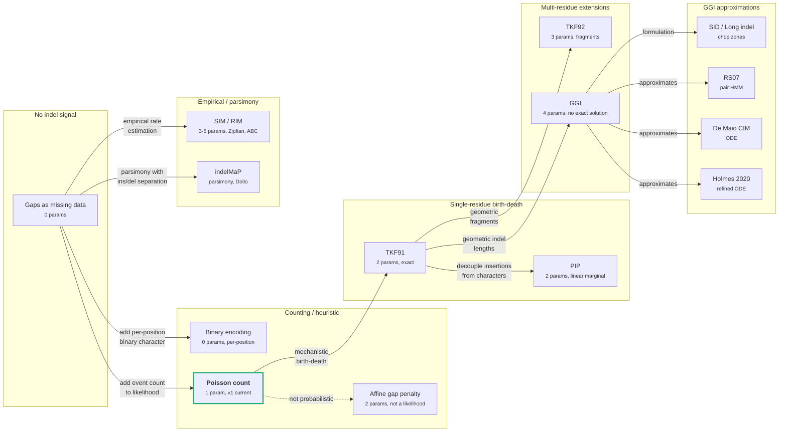

# Indel Models in Phylogenetics

[Back to index](_index.md)

> This document is AI-generated and may contain factual errors, misattributions, or outdated information. Verify claims against cited sources before relying on them.

## Scope and purpose

Standard phylogenetic substitution models (JC69 through GTR) treat sequence length as fixed and model only character-state changes at individual sites. Insertions and deletions (indels) are handled separately: either discarded as missing data, penalized heuristically during alignment, or modeled by dedicated stochastic processes.

This document is an in-depth survey of indel modeling approaches in phylogenetics. It covers the mathematical foundations of each model, the pair HMM and transducer formalisms that connect them to practical algorithms, the software that implements them, and their applicability to branch length optimization in TreeTime.

The document is organized from simplest to most complex: gap penalties and counting models, then single-residue birth-death processes (TKF91, PIP), then multi-residue extensions (TKF92, GGI, SID), then empirical rate models (SIM/RIM), and parsimony approaches (indelMaP). A comparative analysis at the end evaluates each model's suitability for TreeTime's use case.

## Notation

| Symbol     | Meaning                                                       |
| :--------- | :------------------------------------------------------------ |
| $\lambda$  | Insertion (birth) rate per site per unit time                 |
| $\mu$      | Deletion (death) rate per site per unit time                  |
| $t$        | Branch length (evolutionary distance, substitutions per site) |
| $k$        | Number of observed indel events on an edge                    |
| $L$        | Alignment length                                              |
| $N$        | Number of taxa (sequences)                                    |
| $\beta(t)$ | TKF91 absorption probability (see TKF91 section)              |

## 1. Gaps as missing data

Most phylogenetic ML software treats gap characters as missing data. At a gapped position, the partial likelihood vector is set to all 1.0 (uniform over states), contributing zero information to the site likelihood. The site likelihood at a gap position marginalizes over all possible states, which is equivalent to excluding that position from the substitution likelihood product.

### Why this is problematic

[Warnow 2012](https://doi.org/10.1371/currents.rrn1308) [[1](#ref-1)] constructed a four-taxon counterexample where ML phylogeny estimation treating indels as missing data is statistically inconsistent: the ML tree converges to the wrong topology as sequence length increases, because the missing-data treatment systematically underestimates distances between sequences with different gap patterns.

[Truszkowski and Goldman 2015](https://doi.org/10.1093/sysbio/syv089) [[27](#ref-27)] subsequently proved that ML IS consistent on gapped MSAs under broader (and more realistic) conditions: substitution rates $> 0$ on all edges and each site category observed infinitely often as the alignment grows. The Warnow counterexample relies on zero substitution rates on specific edges, which violates these conditions.

The consistency debate concerns tree topology estimation, not branch length optimization. Regardless of consistency, the practical consequence for branch length optimization remains: a branch with zero substitutions but one or more indels is assigned zero length, collapsing topology that the indel evidence supports. This is the direct motivation for TreeTime v1's Poisson indel contribution.

### Software using this approach

RAxML-NG, IQ-TREE, PhyML, BEAST (default), MrBayes, HyPhy, FastTree, TreeTime v0. In IQ-TREE, `STATE_UNKNOWN` sets the partial likelihood to `1.0` for all states (`model/modelsubst.cpp`). In libpll-2 (RAxML-NG), gap `-` maps to bitmask `1111` (all nucleotide states) in `src/maps.c`. In TreeTime v0, `GTR.state_pair()` uses `ignore_gaps=True` (default) to exclude gap positions from the compressed state-pair representation used by `optimal_t_compressed()`.

### v0/v1 status

v0: gaps as missing data. v1: gaps as missing data for substitution likelihood; Poisson indel contribution added to branch length optimization (see section 2).

---

## 2. Poisson indel count model (implemented in v1)

Models the number of indel events on each edge as an independent Poisson process with a single global rate. Each indel event contributes equally regardless of length or direction (insertion vs deletion). This is a TreeTime v1 design-doc feature with no counterpart in v0 or other phylogenetic software.

### Mathematical formulation

For a branch with $k$ indel events and length $t$, and global indel rate $\mu_{\text{indel}}$:

$$\ell_{\text{indel}}(t) = k \ln(\mu_{\text{indel}} t) - \mu_{\text{indel}} t - \ln(k!)$$

First and second derivatives with respect to $t$:

$$\frac{d\ell}{dt} = \frac{k}{t} - \mu_{\text{indel}}, \qquad \frac{d^2\ell}{dt^2} = -\frac{k}{t^2}$$

The global rate is estimated by the Poisson MLE over all edges:

$$\hat{\mu}_{\text{indel}} = \frac{\sum_e k_e}{\sum_e t_e}$$

where $k_e$ is the indel count on edge $e$ and $t_e$ is the current branch length estimate. The rate is re-estimated at each optimization round as branch lengths converge.

### Properties relevant to branch length optimization

The Poisson log-likelihood $\ell(t)$ is strictly concave in $t$ for $k > 0$ (the second derivative $-k/t^2 < 0$), guaranteeing a unique optimum at $t^* = k / \mu_{\text{indel}}$. At $t = 0$ with $k > 0$, $\ell \to -\infty$ and $d\ell/dt \to +\infty$, which forces the Newton optimizer away from zero. The indel contribution is additive with the substitution log-likelihood: the combined Newton step uses $\ell_{\text{sub}}(t) + \ell_{\text{indel}}(t)$ with summed derivatives. This additive structure means the Poisson term integrates into the existing eigendecomposition-based optimizer without restructuring the per-edge likelihood evaluation.

### Assumptions and their consequences

**Equal-weight events.** A 100-base deletion counts the same as a 1-base deletion. This means the model cannot distinguish between a branch with one long indel and a branch with one short indel. For typical viral phylodynamics (TreeTime's primary use case), indels are rare and short, so this has negligible impact. For bacterial genomics or gene family evolution with frequent long indels, the model underweights long events. See [proposal for length-weighted extensions](../port-proposals/optimize-indel-model-alternatives.md).

**Symmetric ins/del.** Insertions and deletions share a single rate. Empirical data consistently shows deletion rate exceeds insertion rate (see SIM/RIM section below). The symmetric assumption is acceptable for the branch-length-prevents-zero use case because the Poisson optimum $t^* = k/\mu$ depends on total event count, not on the ins/del ratio.

**Constant rate across tree.** No branch-specific variation. The rate is a global average, re-estimated each round.

### Implementation

v1: [`packages/treetime/src/commands/optimize/optimize_indel.rs`](../../packages/treetime/src/commands/optimize/optimize_indel.rs) (Poisson log-likelihood and rate estimation), [`packages/treetime/src/commands/optimize/optimize_unified.rs`](../../packages/treetime/src/commands/optimize/optimize_unified.rs) (Newton integration).

### Related known issues

- [Grid search zero-comparison ignores indel likelihood](../port-known-issues/M-optimize-grid-zero-ignores-indels.md)
- [Timetree branch length distribution ignores indels](../port-known-issues/N-timetree-branch-length-distribution-ignores-indels.md)

### Cross-references

- [Intentional change](../port-intentional-changes/optimize-indel-contribution-to-likelihood.md)
- [Alternatives proposal](../port-proposals/optimize-indel-model-alternatives.md)

---

## 3. Affine gap penalty

Assigns a cost per indel event (gap opening penalty $d$) plus a per-position extension cost ($e$), where $d > e$. The $O(MN)$ DP algorithm was introduced by [Gotoh 1982](<https://doi.org/10.1016/0022-2836(82)90398-9>) [[2](#ref-2)] for pairwise sequence alignment. Affine gap penalties are a scoring heuristic for alignment algorithms, not an evolutionary model: they define a cost function for placing gaps in an alignment, not a probability distribution over evolutionary events.

### Mathematical formulation

For a gap of length $g$: $\text{cost}(g) = d + (g - 1) \cdot e$

This cost function is equivalent to a log-probability under a geometric distribution [2](#gloss-2) on gap lengths: $P(g) \propto \exp(-d) \cdot \exp(-e)^{g-1}$, with the ratio $e/d$ controlling the expected length. The alignment DP uses three matrices (match, insert-in-X, insert-in-Y) to track gap state transitions.

### Why affine gaps are not an evolutionary model

[Rivas 2005](https://doi.org/10.1186/1471-2105-6-63) [[3](#ref-3)] proved a fundamental limitation: single insertion events with geometric instantaneous length distributions do NOT produce geometric insert lengths at finite evolutionary times. The finite-time gap length distribution is a convolution of multiple overlapping indel events, which makes it heavier-tailed than geometric. No consistent continuous-time Markov process produces exactly affine gap costs. The affine model is an approximation that becomes worse at larger evolutionary distances where multiple overlapping indels are common.

### Empirical indel length distributions

The geometric distribution implied by affine gaps does not match observed data:

- [Qian and Goldstein 2001](https://doi.org/10.1002/prot.1129) [[4](#ref-4)]: structural alignment gap lengths are multi-exponential (four components), not geometric
- [Cartwright 2009](https://doi.org/10.1093/molbev/msn275) [[5](#ref-5)]: Zipf [1](#gloss-1) (power-law) model fits far better than geometric across multiple organisms
- [Wygoda et al. 2024](https://doi.org/10.1093/bioinformatics/btae043) [[6](#ref-6)]: ABC [7](#gloss-7) model-selection across multiple datasets confirms Zipf fits better than geometric in most cases. No efficient alignment programs exist for Zipf-distributed indel lengths.

### Role in phylogenetic software

Affine gap penalties are used in alignment tools (MAFFT, MUSCLE, ClustalW) to produce the fixed alignment that phylogenetic inference then operates on. They are not used in the tree likelihood computation. The gap penalties influence branch length estimates indirectly: different gap penalties produce different alignments, which produce different substitution patterns, which produce different branch lengths. But the gap penalties themselves do not enter the likelihood function.

PRANK is a special case: it uses a phylogeny-aware progressive alignment strategy that places gaps according to the tree topology, but its gap penalties are still heuristic, not derived from a birth-death model. PRANK defaults to inferring ancestral residues as absent when ambiguous, which reduces the tendency to over-align unrelated regions (a common problem with other progressive aligners).

### v0/v1 status

v0: affine gap penalties not used in likelihood (gaps as missing data). v1: affine gap penalties not used in likelihood (Poisson indel count model used instead, see section 2).

---

## 4. TKF91 (Thorne-Kishino-Felsenstein 1991)

The first continuous-time Markov chain model jointly modeling substitutions and indels as a single evolutionary process. Introduced by [Thorne, Kishino, and Felsenstein 1991](https://doi.org/10.1007/BF02193625) [[7](#ref-7)].

### Biological model

Sequence evolution is modeled as a linear birth-death process on a chain of characters, anchored by an "immortal link" [6](#gloss-6) at the left end (preventing the entire sequence from being deleted):

- Each existing character can spawn a new adjacent character (insertion) at rate $\lambda$
- Each existing character can be removed (deletion) at rate $\mu$
- Constraint: $\lambda < \mu$ for stationarity (finite expected sequence length)
- Substitutions at each site follow a standard model (JC69, HKY85, GTR, etc.) independently of the indel process

The equilibrium sequence length distribution is geometric with parameter $\sigma = \lambda/\mu$: $P(L = l) = (1 - \sigma)\sigma^l$.

### Transition probabilities

The finite-time transition probabilities for a branch of length $t$ are analytically tractable. The key intermediate quantity:

$$\beta(t) = \frac{1 - e^{(\lambda - \mu)t}}{\mu - \lambda e^{(\lambda - \mu)t}}$$

From $\beta$, the event probabilities are:

$$p_1(t) = e^{-\mu t}(1 - \lambda \beta) \quad \text{(homolog survival: ancestor residue present in descendant)}$$
$$p_0'(t) = \mu \beta \quad \text{(deletion: ancestor residue absent in descendant)}$$
$$p_1''(t) = 1 - \lambda \beta \quad \text{(no insertion to right of immortal link)}$$

The insertion probability (a new residue appears in the descendant to the right of a surviving ancestor residue) is $\lambda\beta$. The deletion-then-insertion correction factor $\eta$ accounts for the case where an ancestor residue is deleted but a new residue is inserted in its place. The intermediate product $n_1$ is:

$$n_1 = (1 - e^{-\mu t} - \mu\beta)(1 - \lambda\beta)$$
$$\eta = \ln(n_1) - \ln(\lambda\beta) - \ln(\mu\beta)$$

### Pair HMM representation

TKF91 can be represented as a three-state pair HMM [3](#gloss-3) with states Match (M), Insert (G1), and Delete (G2). The transition matrix, as implemented in BAli-Phy (`src/imodel/imodel.cc:579-638`):

| From \ To  | M                                               | G1             | G2                                                  | End                                       |
| :--------- | :---------------------------------------------- | :------------- | :-------------------------------------------------- | :---------------------------------------- |
| Start/M/G2 | $(1-\lambda\beta)\frac{\lambda}{\mu}e^{-\mu t}$ | $\lambda\beta$ | $(1-\lambda\beta)\frac{\lambda}{\mu}(1-e^{-\mu t})$ | $(1-\lambda\beta)(1-\frac{\lambda}{\mu})$ |
| G1         | $\frac{\lambda\beta e^{-\mu t}}{1-e^{-\mu t}}$  | $\lambda\beta$ | $\frac{1-e^{-\mu t}-\mu\beta}{1-e^{-\mu t}}$        | $\frac{(\mu-\lambda)\beta}{1-e^{-\mu t}}$ |

The Start, Match, and G2 rows are identical (the probability of the next column type depends only on whether the ancestor residue survived, not on how it was created). The G1 row is different because it conditions on the ancestor residue having been inserted (not a continuation of a surviving lineage).

The pairwise alignment likelihood under TKF91 is the forward probability of this pair HMM, computed in $O(L_1 \cdot L_2)$ time.

### Multi-sequence complexity

For $N$ sequences on a tree, the exact marginal likelihood (summing over all possible alignments) requires an $N$-dimensional DP hypercube: $O(L^N)$, which is exponential in the number of taxa. This is equivalent to Sankoff's [1975](https://doi.org/10.1137/0128004) [[8](#ref-8)] simultaneous alignment and phylogeny problem, which is NP-complete for the optimal-scoring path.

With a fixed alignment (treating the alignment as observed data, not marginalizing over it), the likelihood computation reduces to an $O(L \cdot N)$ postorder traversal. [Rivas 2008](https://doi.org/10.1371/journal.pcbi.1000172) [[9](#ref-9)] showed how to extend Felsenstein's peeling [5](#gloss-5) algorithm to handle single-residue indel events per alignment column under a non-reversible birth-death model.

[Westesson et al. 2012](https://doi.org/10.1371/journal.pone.0034572) [[10](#ref-10)] showed the equivalence of TKF91 to a pair HMM and generalized Felsenstein's peeling from single sites to entire sequences via phylogenetic transducers [4](#gloss-4), reducing the multi-sequence complexity to $O(L^2 N)$ under MCMC.

### Software implementations

**[BAli-Phy](https://github.com/bredelings/BAli-Phy)** (C++). Bayesian joint alignment and phylogeny inference via MCMC. Implements TKF91 as `TKF1` in `src/imodel/imodel.cc:579-638`. Parameters: $\lambda = \exp(\text{parameter}[0])$ (log-scale), mean sequence length from which $\mu = \lambda/\sigma$ is derived. Builds the full pair HMM transition matrix. Branch lengths are jointly estimated with alignment and indel parameters via MCMC, not Newton-Raphson. Reference: [Redelings and Suchard 2005](https://doi.org/10.1080/10635150590947041) [[11](#ref-11)].

**[BEAST](https://github.com/beast-dev/beast-mcmc)** (Java). `dr.oldevomodel.indel.TKF91Likelihood` wraps `HomologyRecursion` (680 lines). Uses `BFloat` arbitrary-precision arithmetic to avoid underflow in the DP table. Parameters: `lambda = deathRate * lengthDistributionValue`, `mu = deathRate`. Precomputes per-node arrays ($\beta$, $\mu\beta$, $e^{-\mu t}(1-\lambda\beta)$, etc.) for the tree recursion.

**[rust-phylo](https://github.com/acg-team/rust-phylo)** (Rust). `TKF91IndelModel` in `phylo/src/tkf_model/tkf91.rs`. Uses `nalgebra` `DMatrix` for intermediate storage. The TKF likelihood factorizes over alignment blocks via subtree products: root term $\ln(1-\lambda/\mu)$, plus immortal link terms $\sum \ln(1-\lambda\beta)$, plus per-block event factors accumulated in a postorder traversal. Branch length optimization uses Brent's method (`argmin::BrentOpt`) with the combined TKF+substitution cost function. Supports TKF92 extension via a fragment length parameter $r$.

**[CRAN/TKF](https://github.com/cran/TKF)** (C/R). Pairwise distance estimation. Three DP matrices (gap-in-B, match, gap-in-A) in log space. Uses GSL Brent minimizer for 1D or Nelder-Mead/BFGS for 2D ML estimation of $(\lambda, \mu)$ or $(t, \mu)$.

**[StatAlign](https://github.com/statalign/statalign)** (Java). Bayesian MCMC statistical alignment. Uses TKF92 (fragment model). Reference: [Novak et al. 2008](https://doi.org/10.1093/bioinformatics/btn457) [[12](#ref-12)].

### Applicability to TreeTime branch length optimization

TKF91 distinguishes insertions from deletions (separate $\lambda$ and $\mu$), which is more biologically realistic than the Poisson count model's single rate. The pair HMM formalism integrates naturally with tree likelihood computation. The main barriers to adoption in TreeTime:

1. **Architectural mismatch.** TreeTime's per-edge optimizer uses eigendecomposition-based coefficients cached once per edge. TKF91 requires pair HMM DP per edge, which has different data flow (sequence-level, not site-level).
2. **Parameter estimation.** TKF91 adds two parameters ($\lambda$, $\mu$) that must be estimated jointly with branch lengths. The current Poisson model estimates one parameter ($\mu_{\text{indel}}$) analytically.
3. **Single-residue limitation.** TKF91 allows only single-residue indels. This is less realistic than the Poisson count model for datasets with multi-residue indels (the Poisson model at least counts each multi-residue event as one event; TKF91 cannot represent them at all without the TKF92 extension).

### References

- [Thorne, Kishino, and Felsenstein 1991](https://doi.org/10.1007/BF02193625) [[7](#ref-7)] (TKF91 original paper)
- [Holmes 2005](https://doi.org/10.1093/bioinformatics/bti177) [[13](#ref-13)] (EM estimation of TKF91 insertion/deletion rates)

---

## 5. TKF92 (Thorne-Kishino-Felsenstein 1992)

Extension of TKF91 to multi-residue indels via indivisible "fragments." Introduced by [Thorne, Kishino, and Felsenstein 1992](https://doi.org/10.1007/BF00163848) [[14](#ref-14)].

### Biological model

Sequences are composed of fragments: contiguous blocks of linked residues. An entire fragment is inserted or deleted as a unit. Fragment lengths follow a geometric distribution with parameter $r$ (probability of extending by one residue). TKF91 is the special case $r = 0$ (all fragments have length 1).

The indel process operates on fragments, not individual residues: an insertion creates a new fragment adjacent to an existing one, a deletion removes an entire fragment. Substitutions within fragments follow the standard site-independent model.

### Parameters

$\lambda$ (fragment insertion rate), $\mu$ (fragment deletion rate), $r$ (geometric fragment extension probability). The constraint $\lambda < \mu$ still applies.

### Computational complexity

Pairwise: $O(L_1 \cdot L_2)$ via pair HMM. Multi-sequence: approximate (no exact polynomial solution for general trees).

### Software implementations

**[BAli-Phy](https://github.com/bredelings/BAli-Phy)** implements TKF2 (`src/imodel/imodel.cc:686-732`) by building the TKF1 pair HMM and applying `fragmentize(Q, e)`, which adds geometric self-loops to the M, G1, and G2 states with probability $e = r$. The `lengthp` method is marked `FIXME - this is wrong` and calls `std::abort()`, indicating the equilibrium length distribution for TKF2 is not fully implemented.

**[rust-phylo](https://github.com/acg-team/rust-phylo)** implements TKF92 via `TKF92IndelModel` with fragment length parameter $r$. In TKF92, contiguous gap/non-gap regions are grouped into blocks (vs TKF91 where each column is its own block). The likelihood factorization uses the same subtree product structure as TKF91 but with modified insertion factors: $\lambda\beta(1-r)/r$ replaces $\lambda\beta$.

**[StatAlign](https://github.com/statalign/statalign)** uses TKF92 as its indel model for Bayesian MCMC statistical alignment.

### Relationship to TKF91

The fragment structure addresses TKF91's main biological limitation (single-residue indels) but introduces an approximation: in reality, fragment boundaries are not fixed, and the geometric fragment length distribution is a simplification. The fragment model also does not account for overlapping indels (an insertion within a previously inserted fragment).

### v0/v1 status

v0: not implemented. v1: not implemented.

---

## 6. RS07 (Redelings-Suchard 2007)

A pair HMM approximation to the General Geometric Indel (GGI) model. Used as the default indel model in BAli-Phy and Historian. Introduced by [Redelings and Suchard 2007](https://doi.org/10.1186/1471-2148-7-40) [[15](#ref-15)].

### Mathematical formulation

RS07 parameterizes a 5-state pair HMM (Start, Match, Gap-in-1, Gap-in-2, End) with two user-facing parameters: `rate` (indel rate relative to substitution rate) and `mean_length` (expected indel length). The geometric extension probability is $\epsilon = (\text{mean\_length} - 1) / \text{mean\_length}$.

The pair HMM is constructed in three steps (as implemented in BAli-Phy `src/builtins/Alignment.cc:166-245`):

1. Compute the scaled rate $\mu = D / (1 - \epsilon)$ where $D = \text{rate} \times t$
2. Compute indel opening probability $\delta = P_{\text{indel}} / (1 + P_{\text{indel}})$ where $P_{\text{indel}} = 1 - e^{-\mu}$
3. Build transition matrix: $Q(S, M) = 1 - 2\delta$, $Q(S, G1) = Q(S, G2) = \delta$
4. Apply `fragmentize(Q, \epsilon)` to add geometric self-loops to M, G1, G2 states
5. Remove the silent Start state by marginalization

### Difference from TKF91

| Aspect           | RS07                                                         | TKF91                              |
| :--------------- | :----------------------------------------------------------- | :--------------------------------- |
| Parameterization | rate + mean_length                                           | $\lambda$ + $\mu$ (birth-death)    |
| Time dependence  | Linear: $D = \text{rate} \times t$, then Poisson gap opening | Exact continuous-time Markov chain |
| Indel lengths    | Geometric via self-loops                                     | Single residue only                |
| Ins/del symmetry | Symmetric ($\delta$ for both)                                | Asymmetric (different G1 row)      |
| Model class      | Phenomenological approximation to GGI                        | Exact birth-death process          |

RS07 is a practical approximation designed for Bayesian MCMC: it captures the essential features of the GGI model (geometric indel lengths, rate proportional to branch length) without the computational cost of solving the GGI differential equations. The approximation is accurate for short branches and deteriorates for long branches where multiple overlapping indels are common.

### Software

**[BAli-Phy](https://github.com/bredelings/BAli-Phy)**: default indel model. **[Historian](https://github.com/ihh/dart)**: uses RS07 for progressive alignment with MCMC refinement. Reference for Historian: [Holmes 2017](https://doi.org/10.1186/s12859-017-1665-1) [[16](#ref-16)].

### v0/v1 status

v0: not implemented. v1: not implemented.

---

## 7. Poisson Indel Process (PIP, Bouchard-Cote and Jordan 2013)

A continuous-time Markov process that achieves tractable marginal likelihood computation by decoupling insertions from existing characters. Introduced by [Bouchard-Cote and Jordan 2013](https://doi.org/10.1073/pnas.1220450110) [[17](#ref-17)]. 52 citations.

### Biological model

PIP differs from TKF91 in how insertions are modeled. In TKF91, each existing character can spawn a new adjacent character (linked birth process), making the fates of adjacent positions dependent. In PIP, insertions are a Poisson process along tree branches: new characters appear at rate $\lambda$ per unit branch length, independent of existing characters. Each character (whether original or inserted) has an independent exponential lifetime with rate $\mu$ (deletion follows the same dynamics as TKF91).

The decoupling of insertions from existing characters is the key theoretical contribution: it makes the marginal likelihood (summing over all possible alignments) computable in time linear in the number of taxa, vs $O(L^N)$ for TKF91.

### Tradeoff vs TKF91

The price of tractability is that PIP's equilibrium sequence length distribution is Poisson (vs geometric for TKF91). The Poisson distribution has lighter tails than geometric, which means PIP predicts less length variation at equilibrium. In practice, this matters less than the computational advantage, especially for Bayesian inference where marginalizing over alignments is essential.

### Software

**[ProPIP](https://github.com/acg-team/ProPIP)**: ML progressive alignment under PIP. The first polynomial-time progressive aligner with a rigorous indel model. [Maiolo et al. 2018](https://doi.org/10.1186/s12859-018-2357-1) [[18](#ref-18)]. Estimates indel rates from data. Supports Gamma rate heterogeneity.

**[ARPIP](https://github.com/acg-team/bpp-arpip)**: ancestral sequence reconstruction under PIP. [Jowkar et al. 2022](https://doi.org/10.1093/sysbio/syac050) [[19](#ref-19)]. Two-step approach: find most probable indel points, then reconstruct on the pruned subtree. [Jowkar et al. 2024](https://doi.org/10.1186/s12859-024-05986-1) [[20](#ref-20)] showed that the single-character indel assumption still captures long indel patterns on mammalian protein orthologs.

**[rust-phylo](https://github.com/acg-team/rust-phylo)** implements PIP alongside TKF91/TKF92.

### Applicability to TreeTime

PIP's linear-time marginal likelihood is attractive compared to TKF91's exponential cost. But PIP still requires alignment-aware likelihood computation (tracking which characters are present on which branches), not just a per-edge scalar. The integration would change TreeTime's optimization architecture: the current per-edge eigendecomposition coefficients cache would need to be replaced or augmented with PIP's column-based likelihood. For the branch-length-prevents-zero use case, the Poisson count model achieves the same practical effect with negligible implementation cost.

### v0/v1 status

v0: not implemented. v1: not implemented.

---

## 8. General Geometric Indel model (GGI)

The natural generalization of TKF91 to geometrically distributed indel lengths. Parameters: insertion rate $\lambda$, deletion rate $\mu$, mean insertion length $\bar{X}$, mean deletion length $\bar{Y}$. TKF91 is the special case $\bar{X} = \bar{Y} = 1$.

### Why GGI has no exact solution

When deletions remove more than one residue, adjacent residue fates become dependent: a single deletion event simultaneously removes multiple residues, correlating their evolutionary histories. The finite-time gap length distribution becomes a convolution of multiple overlapping indel events and is no longer geometric. No finite-state pair HMM can represent GGI exactly.

Time-reversibility holds iff $\lambda(\bar{X} - 1) = \mu(\bar{Y} - 1)$, which constrains the parameter space.

### Approximations to GGI

The intractability of exact GGI has motivated several approximation strategies:

- **TKF92**: fragments (see section 5)
- **Knudsen and Miyamoto 2003, Redelings and Suchard 2005/2007 (RS07)**: guessed pair HMM forms matching GGI moments (see section 6)
- **De Maio 2020**: moment-matching differential equations for best-fit pair HMM. The Cumulative Indel Model approximates GGI dynamics via ODEs with adaptive banding. [De Maio 2020](https://doi.org/10.1093/sysbio/syaa050) [[21](#ref-21)]. 18 citations.
- **Holmes 2020**: refined ODEs via coarse-graining of pair HMM state spaces. [Holmes 2020](https://doi.org/10.1534/genetics.120.303630) [[22](#ref-22)]. Currently the best known approximation to GGI.

### The Redelings 2024 review

[Redelings 2024](https://doi.org/10.1093/molbev/msae177) [[23](#ref-23)] provides a taxonomy of GGI and its approximations (27 citations). Key recommendation from the review: indel information should only be used when the alignment was inferred with a phylogeny-aware aligner. Ideally MSA and tree should be co-estimated. Indel rates should be inferred from data, not fixed to defaults. Single-character indel models conflate indel rate and indel length into one parameter, making the parameter uninterpretable as a biological rate.

### v0/v1 status

v0: not implemented. v1: not implemented.

---

## 9. Long indel model (SID, Miklos-Lunter-Holmes 2004)

A continuous-time Markov model allowing indels of arbitrary length with geometric length distributions. Introduced by [Miklos, Lunter, and Holmes 2004](https://doi.org/10.1093/molbev/msh043) [[24](#ref-24)].

### Mathematical formulation

Extends TKF91 by allowing single insertion and deletion events of any length, with geometric length distributions parameterized separately for insertions and deletions. Parameters: insertion rate $\lambda$, deletion rate $\mu$, mean insertion length $\bar{X}$, mean deletion length $\bar{Y}$. Uses an infinite sequence embedding to make rates position-independent and introduces "rate grammar" notation.

The key algorithmic contribution is the "chop zone" decomposition: the alignment is partitioned into zones where the trajectory likelihood can be computed independently, yielding $O(L^2)$ pairwise complexity.

### Relationship to GGI

The SID model and GGI describe the same underlying process. "SID" refers specifically to the Miklos-Lunter-Holmes formulation and algorithmic approach (chop zones, rate grammars). "GGI" is the broader model class. TKF91 is the special case $\bar{X} = \bar{Y} = 1$ of both.

### v0/v1 status

v0: not implemented. v1: not implemented.

---

## 10. SIM/RIM (Loewenthal et al. 2021)

An empirical indel rate model that separates insertion from deletion dynamics and uses power-law (Zipfian) length distributions. Introduced by [Loewenthal et al. 2021](https://doi.org/10.1093/molbev/msab266) [[25](#ref-25)]. 30 citations.

### Models

**SIM (Simple Indel Model)** - 3 parameters:

- $R_{ID}$: indel-to-substitution-rate ratio (insertion rate = deletion rate)
- $A_{ID}$: Zipfian length distribution exponent (same for insertions and deletions)
- $RL$: root sequence length

**RIM (Rich Indel Model)** - 5 parameters:

- $R_I$: insertion-to-substitution-rate ratio
- $R_D$: deletion-to-substitution-rate ratio
- $A_I$: Zipfian length distribution exponent for insertions
- $A_D$: Zipfian length distribution exponent for deletions
- $RL$: root sequence length

Both models parameterize indel rates relative to the substitution rate, not as absolute rates. The truncated Zipfian distribution assigns probability $P(k) \propto k^{-a}$ to indel length $k$, with maximum indel size of 50 amino acids.

### Key empirical findings

Analysis of 4,823 protein datasets across 15 taxonomic groups:

- 35% of datasets favor RIM over SIM (separate ins/del parameters)
- Among RIM datasets: **74% have deletion rate > insertion rate** ($R_D > R_I$)
- The rate asymmetry ($R_D/R_I \approx 2$ in Drosophilidae) is the dominant signal; length asymmetry is weak (only 55% of RIM datasets show $A_D > A_I$)
- Exception: Saccharomycetaceae coding genes show $R_I > R_D$ in 56% of RIM datasets (yeast introns reverse this: 89.5% show $R_D > R_I$)

### Parameter estimation

Inference uses ABC (Approximate Bayesian Computation), not maximum likelihood. The pipeline simulates 100,000 MSAs by drawing parameters from priors and evolving indels along the input phylogeny via the Gillespie algorithm [8](#gloss-8), computes 27 summary statistics for each, accepts the closest 0.1%, and averages accepted parameters. LASSO regression corrects for alignment-induced bias in summary statistics. Running time: ~328 minutes per dataset.

### Why SIM/RIM matters for TreeTime

The SIM/RIM findings validate the direction of TreeTime v1's Poisson indel model but highlight its limitations:

1. **Separate rates matter.** The empirical $R_D/R_I \approx 2$ ratio means the symmetric Poisson model's single rate $\mu_{\text{indel}}$ is a compromise between two distinct processes.
2. **Zipfian lengths matter.** The equal-weight assumption (all events count as 1) discards the signal in indel lengths. A length-weighted Poisson model would better capture the contribution of long indels.
3. **Rate-relative parameterization.** SIM/RIM parameterize indel rates relative to the substitution rate. This is more interpretable than the absolute rate $\mu_{\text{indel}}$ used in v1, because it scales naturally with evolutionary distance.

These observations motivate the [extensions E1 and E2 in the alternatives proposal](../port-proposals/optimize-indel-model-alternatives.md).

### Software

**[SpartaABC](https://github.com/gilloe/SpartaABC)** (C++ + Python). Webserver: https://spartaabc.tau.ac.il/. Uses the Gillespie algorithm for simulation and scikit-learn for LASSO regression.

### v0/v1 status

v0: not implemented. v1: not implemented.

---

## 11. Indel-aware parsimony (indelMaP, Iglhaut et al. 2024)

A parsimony criterion that treats insertions and deletions as separate evolutionary events with affine gap costs for long indels. Introduced by [Iglhaut et al. 2024](https://doi.org/10.1093/molbev/msae109) [[26](#ref-26)]. 14 citations.

### Approach

Uses the Dollo principle [9](#gloss-9): a deleted character cannot reappear (no re-insertion). Insertions and deletions are inferred separately on the tree using affine gap penalties (opening + extension costs). This avoids the conflation inherent in standard gap-as-missing-data treatment, where it is impossible to distinguish an ancestral insertion from an ancestral deletion.

### Practical performance

According to the Redelings 2024 review, indelMaP outperforms competitors on large densely sampled datasets, where the parsimony assumption (few changes per branch) holds well. For sparse datasets with long branches, probabilistic models (TKF91, RS07, PIP) are more accurate.

### Relevance to TreeTime

TreeTime v1's Fitch parsimony uses majority rule for gap/non-gap resolution at internal nodes, which does not distinguish insertions from deletions. indelMaP's approach (separate tracking of ins/del events) could improve the quality of indel event detection fed into the Poisson model, but would not affect the branch length likelihood directly.

### v0/v1 status

v0: not implemented. v1: not implemented.

---

## 12. Binary encoding of indels

Encodes gap presence/absence as a two-state character (0/1) at each alignment position, then analyzes under a two-state substitution model (Cavender-Farris-Neyman). Used by [FastML](http://fastml.tau.ac.il/) for indel reconstruction (web server only, no public repository).

This approach ignores indel length (treating each gapped position independently, not grouping contiguous gaps into events), loses information about insertion vs deletion direction, and cannot model overlapping indels. It is the simplest approach that treats indels as evolutionary signal rather than missing data, but the per-position independence assumption is biologically wrong (indel events affect contiguous blocks).

### v0/v1 status

v0: not implemented. v1: not implemented.

---

## Comparative analysis

### Model hierarchy

The models span a range from no indel signal (gaps as missing data) to full mechanistic birth-death processes (GGI). They relate by extension ("adds multi-residue indels to TKF91") and approximation ("RS07 approximates GGI via pair HMM"). Complexity increases left to right; vertical grouping shows model families.

The key question for TreeTime: where on this spectrum does the marginal return on realism drop below the implementation and computational cost?

### Impact on branch length estimates

The models differ in how they affect branch length optimization:

**No impact (gaps as missing data).** Branches with only indel evidence get zero length. This is the status quo in most software and in v0.

**Scalar correction (Poisson count, v1).** Branches with indels get positive length proportional to event count. The correction is a single scalar added to the substitution likelihood. The optimum $t^* = k/\mu$ depends on event count only. Simple, effective for preventing zero-length assignment.

**Length-aware correction (Poisson with weights, proposed E1).** Branches with long indels get proportionally more length than branches with short indels. Still a scalar correction. More accurate for datasets with variable indel lengths.

**Rate-aware correction (separate ins/del, proposed E2).** Allows deletion-dominated branches to be distinguished from insertion-dominated branches. Two scalars added to the substitution likelihood. More accurate when the ins/del rate ratio departs from 1.

**Full pair HMM (TKF91, RS07, PIP).** Branch length is jointly estimated with alignment and indel parameters. The indel model influences not just the branch length optimum but also the shape of the likelihood surface (curvature, multimodality). This is the most accurate approach but requires a fundamentally different optimizer architecture.

### Software landscape

#### ML phylogenetic inference (gaps as missing data)

**[RAxML-NG](https://github.com/amkozlov/raxml-ng)** (C++, 461 stars). The standard ML tree inference tool. Gaps map to bitmask `1111` (all nucleotide states) in libpll-2 (`src/maps.c`), contributing zero information to site likelihoods. Branch lengths optimized by Newton-Raphson with six NR variants (`nr_fast`, `nr_safe`, `FALLBACK`) and per-branch rollback. Indels have no effect on branch length estimates. The `FALLBACK` mode starts with `nr_fast` and switches to `nr_safe` when overall likelihood decreases.

**[IQ-TREE](https://github.com/iqtree/iqtree3)** (C++, 120 stars for v3). ML tree inference with model selection. `STATE_UNKNOWN` sets partial likelihoods to `1.0` for all states (`alignment/pattern.cpp`). Branch lengths optimized by Newton-Raphson (inherited from PLL) with bisection fallback when the Hessian is non-negative, and per-round monotonicity check (reverts all branch lengths if total likelihood decreases). Indels have no effect on branch length estimates. v3 adds no indel model relative to v2.

**[PhyML](https://github.com/stephaneguindon/phyml)** (C, 195 stars). ML tree inference. Gaps as missing data. Branch lengths optimized by Brent's method. Indels have no effect on branch length estimates.

**[FastTree](http://www.microbesonline.org/fasttree/)** (C, distributed via microbesonline.org, no GitHub repo). Approximate ML for large trees. Gaps as missing data. Uses a minimum-evolution criterion for initial branch lengths, then NNI with branch length optimization. Indels have no effect on branch length estimates.

#### Bayesian phylogenetic inference

**[BEAST](https://github.com/beast-dev/beast-mcmc)** (Java, 239 stars). Bayesian MCMC phylogenetics. Default: gaps as missing data. Optional: TKF91 via `dr.oldevomodel.indel.TKF91Likelihood`, which wraps `HomologyRecursion` (680-line DP over alignment columns). Uses `BFloat` arbitrary-precision arithmetic to avoid underflow. When TKF91 is enabled, branch lengths are jointly estimated with indel parameters ($\lambda$, $\mu$) via MCMC proposals. The TKF91 module is in the `oldevomodel` package, indicating it is legacy code not actively maintained.

**[MrBayes](https://github.com/NBISweden/MrBayes)** (C, 260 stars). Bayesian MCMC phylogenetics. Gaps as missing data only. No indel model. Branch lengths sampled via MCMC with substitution likelihood only.

**[HyPhy](https://github.com/veg/hyphy)** (C++, 251 stars). Selection analysis framework. Gaps as missing data. Branch lengths from substitution model only. Focused on dN/dS estimation, not indel modeling.

#### Bayesian joint alignment and phylogeny

**[BAli-Phy](https://github.com/bredelings/BAli-Phy)** (C++, 49 stars). Bayesian co-estimation of alignment, phylogeny, and evolutionary parameters via MCMC. Supports three indel models, more than any other phylogenetic inference tool. Supports three indel models: RS07 (default), TKF91 (`TKF1`), and TKF92 (`TKF2`). All implemented as pair HMMs with 5 states (Start, Match, Gap-in-1, Gap-in-2, End) in `src/imodel/imodel.cc`. Branch lengths are jointly sampled with alignment, topology, and indel parameters. MCMC moves include alignment realignment (`AlignmentMove`), topology changes (`TopologyMove`), edge length proposals (`EdgeMove`), and per-parameter moves for $\lambda$, $\mu$, $r$ (TKF92), and $\rho = \lambda + \mu$. The RS07 model's `fragmentize` operation adds geometric self-loops to pair HMM states, making indel lengths geometric with parameter $\epsilon$. Indel parameters directly influence the branch length posterior: higher indel rates widen the branch length distribution because the same alignment is consistent with a broader range of evolutionary distances.

**[StatAlign](https://github.com/statalign/statalign)** (Java, 5 stars). Bayesian MCMC statistical alignment. Uses TKF92 pair HMMs (`HmmTkf92` with 5 states). Parameters: fragment length $r$, insertion rate $\lambda$, deletion rate $\mu$. MCMC moves over alignment columns, topology, edge lengths, and TKF92 parameters. Alignment stored as linked lists of `AlignColumn` objects with `orphan` flags distinguishing homologous from inserted columns. Felsenstein likelihoods cached per column. Supports structural alignment (`StructAlign` plugin) and RNA structure prediction (`PPFold`, `RNAAliFold`). Low activity since 2020.

#### Progressive alignment with indel models

**[PRANK](https://github.com/ariloytynoja/prank-msa)** (C++, 33 stars). Phylogeny-aware progressive alignment. Does not use a formal indel model (TKF91/PIP/etc.) for gap placement. Instead uses a heuristic strategy that infers ancestral sequences and places gaps on tree branches, defaulting to inferring ancestral residues as absent when ambiguous. This reduces the "gap attraction" problem where unrelated regions get aligned. Branch lengths are taken from the input guide tree and not re-estimated. Indels influence the alignment but not the branch lengths. PRANK is a major influence on modern phylogeny-aware alignment tools but uses heuristic gap costs, not probabilistic indel models.

**[Historian](https://github.com/ihh/dart)** (C++, 32 stars, part of the DART toolkit). Progressive alignment with MCMC refinement using the RS07 pair HMM. Computes a fast initial alignment via progressive application of the pair HMM forward-backward algorithm, then refines via MCMC moves. Uses phylogenetic transducers (composition of pair HMMs along tree edges) for multi-sequence likelihood. Branch lengths are taken from the input tree. The `ihh/trajectory-likelihood` repository (14 stars) implements the related trajectory likelihood calculations from Miklos, Lunter & Holmes 2004, De Maio 2020, and Holmes 2020.

**[ProPIP](https://github.com/acg-team/ProPIP)** (C++, 7 stars). ML progressive alignment under the Poisson Indel Process. The first polynomial-time progressive aligner with a rigorous indel model. Estimates indel rates ($\lambda$, $\mu$) from the data during alignment, unlike PRANK which uses fixed heuristic gap costs. Supports Gamma rate heterogeneity across sites. Branch lengths and alignment are jointly estimated in the progressive ML framework. ProPIP tends to infer shorter gaps than tools using multi-residue indel models because PIP assumes single-character insertions.

#### Ancestral sequence reconstruction with indels

**[ARPIP](https://github.com/acg-team/bpp-arpip)** (C++, 11 stars). ML ancestral sequence reconstruction under PIP. Two-step DP: first find the most probable indel points on each branch, then reconstruct ancestral sequences on the pruned subtree. Produces uncertainty profiles for inferred sequences. Branch lengths are fixed from the input tree. Indels influence which ancestral positions are inferred as present or absent, but do not feed back into branch length estimation.

**[FastML](http://fastml.tau.ac.il/)** (web server only, no public repository). ML ancestral reconstruction. Uses binary encoding of indels (two-state character per alignment position) for indel reconstruction, analyzed under a simple substitution model. Branch lengths from substitution model only.

**[GRASP](https://github.com/bodenlab/GRASP)** (Java, 12 stars). Ancestral reconstruction using partial-order graphs [10](#gloss-10) (POGs). Handles alternative splicings and repeat variation. Does not use a probabilistic indel model. Branch lengths from input tree.

#### ML phylogenetic inference with indel models

**[rust-phylo](https://github.com/acg-team/rust-phylo)** (Rust, 11 stars). ML phylogenetics library implementing TKF91, TKF92, and PIP as pluggable indel models alongside substitution models (JC69, K80, TN93, HKY, GTR, WAG, HIVB, BLOSUM). The combined TKF+substitution cost function (`TKFCost`) sums indel and substitution log-likelihoods. Branch length optimization uses Brent's method (`argmin::BrentOpt`) per edge with the combined cost function, so indels directly influence branch length estimates. Model parameter optimization ($\lambda$, $\mu$, $r$) also uses Brent's method. Caches per-node TKF intermediate values (`TKFIndelModelInfo`) and invalidates selectively for dirty nodes. Includes a reference implementation for testing (`tkf91_indel_logl_without_aggregation`). The most architecturally relevant comparison for TreeTime: same language (Rust), same per-edge optimization approach (Brent vs Newton-Raphson), similar caching strategy.

**[indelMaP](https://github.com/acg-team/indelMaP)** (Python, 5 stars). Indel-aware parsimony for ancestral reconstruction. Also available in Rust: [rust-indelMaP](https://github.com/acg-team/rust-indelMaP) (1 star). Uses the Dollo principle with affine gap penalties to separate insertion from deletion events on the tree. Branch lengths are not estimated (parsimony, not ML).

#### Indel parameter estimation

**[SpartaABC](https://github.com/gilloe/SpartaABC)** (C++ + Python, 4 stars). ABC-based estimation of indel rates and length distributions under the SIM/RIM models. Webserver: https://spartaabc.tau.ac.il/. Simulates 100,000 MSAs via Gillespie algorithm, computes 27 summary statistics, accepts closest 0.1%. Does not perform branch length optimization; estimates indel parameters conditional on a fixed tree with known branch lengths. Running time ~328 minutes per dataset.

**TreeTime v0** (Python). Gaps as missing data. Branch lengths optimized by Brent's method (`scipy.optimize.minimize_scalar`) in $\sqrt{t}$ space. Indels have no effect on branch length estimates. `GTR.state_pair()` uses `ignore_gaps=True` to exclude gap positions.

**TreeTime v1** (Rust). Poisson indel count model (see section 2). Branch lengths optimized by Newton-Raphson with analytical derivatives. The Poisson indel log-likelihood and its derivatives are added to the substitution log-likelihood in the Newton step. The only ML phylogenetics tool that integrates indel likelihood into per-edge Newton-Raphson optimization without requiring joint alignment-phylogeny inference.

### Software at a glance

| Software                                             |   ★ | Tech        | Last active | Indel model          | BL method      | Indels in BL? |
| :--------------------------------------------------- | --: | :---------- | :---------- | :------------------- | :------------- | :------------ |
| [RAxML-NG](https://github.com/amkozlov/raxml-ng)     | 461 | C++         | 2026-03-27  | Missing data         | Newton-Raphson | No            |
| [IQ-TREE](https://github.com/iqtree/iqtree3)         | 120 | C++         | 2026-03-27  | Missing data         | Newton-Raphson | No            |
| [PhyML](https://github.com/stephaneguindon/phyml)    | 195 | C           | 2026-03-19  | Missing data         | Brent          | No            |
| [BEAST](https://github.com/beast-dev/beast-mcmc)     | 239 | Java        | 2026-03-20  | Missing data / TKF91 | MCMC           | Optional      |
| [MrBayes](https://github.com/NBISweden/MrBayes)      | 260 | C           | 2026-01-09  | Missing data         | MCMC           | No            |
| [BAli-Phy](https://github.com/bredelings/BAli-Phy)   |  49 | C++/Haskell | 2026-03-29  | RS07 / TKF91 / TKF92 | MCMC (joint)   | Yes           |
| [StatAlign](https://github.com/statalign/statalign)  |   5 | Java        | 2020-04-12  | TKF92                | MCMC (joint)   | Yes           |
| [Historian](https://github.com/ihh/dart)             |  32 | C++         | 2020-06-13  | RS07                 | Fixed tree     | No            |
| [PRANK](https://github.com/ariloytynoja/prank-msa)   |  33 | C++         | 2026-03-19  | Heuristic            | Fixed tree     | No            |
| [ProPIP](https://github.com/acg-team/ProPIP)         |   7 | C++         | 2021-08-04  | PIP                  | ML (joint)     | Yes           |
| [ARPIP](https://github.com/acg-team/bpp-arpip)       |  11 | C++         | 2023-10-02  | PIP                  | Fixed tree     | No            |
| [rust-phylo](https://github.com/acg-team/rust-phylo) |  11 | Rust        | 2026-03-25  | TKF91 / TKF92 / PIP  | Brent (joint)  | Yes           |
| [indelMaP](https://github.com/acg-team/indelMaP)     |   5 | Python      | 2023-11-07  | Parsimony            | N/A            | N/A           |
| [SpartaABC](https://github.com/gilloe/SpartaABC)     |   4 | C++/Python  | 2021-08-10  | SIM/RIM              | Fixed tree     | No            |
| TreeTime v0                                          |   - | Python      | -           | Missing data         | Brent          | No            |
| TreeTime v1                                          |   - | Rust        | -           | Poisson count        | Newton-Raphson | Yes           |

---

## File Index

| File                                                                                                                               | Algorithms                                    |
| :--------------------------------------------------------------------------------------------------------------------------------- | :-------------------------------------------- |
| [`packages/treetime/src/commands/optimize/optimize_indel.rs`](../../packages/treetime/src/commands/optimize/optimize_indel.rs)     | Poisson indel log-likelihood, rate estimation |
| [`packages/treetime/src/commands/optimize/optimize_unified.rs`](../../packages/treetime/src/commands/optimize/optimize_unified.rs) | Newton integration of indel contribution      |

---

## Glossary

1.  **Zipf distribution (power law).** A discrete probability distribution where the probability of observing value $k$ is $P(k) \propto k^{-a}$ for exponent $a > 1$. Larger $a$ means shorter indels dominate; smaller $a$ means long indels are more frequent. Empirical indel length data fits Zipf better than geometric in most datasets ([Cartwright 2009](https://doi.org/10.1093/molbev/msn275) [[5](#ref-5)]; [Wygoda et al. 2024](https://doi.org/10.1093/bioinformatics/btae043) [[6](#ref-6)]). [↩](#gloss-use-1)
2.  **Geometric distribution.** $P(k) = (1-p)p^{k-1}$. The distribution implied by affine gap penalties and by TKF92 fragment lengths. Lighter-tailed than Zipf: long indels are rarer under geometric than under Zipf for the same mean. [Rivas 2005](https://doi.org/10.1186/1471-2105-6-63) [[3](#ref-3)] proved that geometric instantaneous rates do not produce geometric finite-time distributions. [↩](#gloss-use-2)
3.  **Pair HMM (pair hidden Markov model).** A hidden Markov model that generates two sequences simultaneously. States correspond to alignment column types: Match (both sequences have a residue), Insert (residue in sequence 1 only), Delete (residue in sequence 2 only). Transition probabilities encode the indel model; emission probabilities encode the substitution model. The forward algorithm computes the alignment likelihood in $O(L_1 \cdot L_2)$ time. TKF91 ([Thorne et al. 1991](https://doi.org/10.1007/BF02193625) [[7](#ref-7)]), TKF92, RS07, and PIP can all be expressed as pair HMMs. [↩](#gloss-use-3)
4.  **Phylogenetic transducer.** A finite-state machine that transforms an ancestor sequence into a descendant sequence. Transducers compose: the transducer for a path through the tree is the composition of edge transducers. This enables Felsenstein-like peeling over entire sequences (not just single sites), generalizing the pruning algorithm to handle indels. Introduced by [Bradley and Holmes 2007](https://doi.org/10.1093/bioinformatics/btm402) [[28](#ref-28)]; applied to indel history reconstruction by [Westesson et al. 2012](https://doi.org/10.1371/journal.pone.0034572) [[10](#ref-10)]. [↩](#gloss-use-4)
5.  **Felsenstein peeling (pruning algorithm).** The standard postorder tree traversal for computing phylogenetic likelihoods ([Felsenstein 1981](https://doi.org/10.1007/BF01734359) [[29](#ref-29)]). At each internal node, partial likelihoods from child subtrees are combined via the transition probability matrix $P(t) = e^{Qt}$. For substitution-only models, each site is processed independently. Extending peeling to indels requires tracking which alignment columns are present at each node, which is what pair HMMs and transducers accomplish ([Rivas 2008](https://doi.org/10.1371/journal.pcbi.1000172) [[9](#ref-9)]). [↩](#gloss-use-5)
6.  **Immortal link.** A TKF91 concept ([Thorne et al. 1991](https://doi.org/10.1007/BF02193625) [[7](#ref-7)]): a permanent anchor at the left end of the sequence that cannot be deleted. Without it, the birth-death process could delete all characters, leaving an empty sequence with no way to restart insertions. The immortal link ensures the sequence always has at least a starting point for new insertions. [↩](#gloss-use-6)
7.  **ABC (Approximate Bayesian Computation).** An inference method that bypasses likelihood computation by simulating data from prior parameter draws, comparing simulated and observed summary statistics, and accepting parameter values that produce close matches. Used by [SpartaABC](https://github.com/gilloe/SpartaABC) for SIM/RIM parameter estimation ([Loewenthal et al. 2021](https://doi.org/10.1093/molbev/msab266) [[25](#ref-25)]). [↩](#gloss-use-7)
8.  **Gillespie algorithm.** A stochastic simulation algorithm for continuous-time Markov chains ([Gillespie 1977](https://doi.org/10.1021/j100540a008) [[30](#ref-30)]). Generates exact sample paths by drawing exponentially distributed waiting times between events and choosing the next event type proportional to its rate. Used by SpartaABC to simulate indel evolution along phylogenetic branches. [↩](#gloss-use-8)
9.  **Dollo principle (Dollo parsimony).** The assumption that a complex feature, once lost, cannot be regained. Applied to indels by indelMaP ([Iglhaut et al. 2024](https://doi.org/10.1093/molbev/msae109) [[26](#ref-26)]): a deleted character cannot be re-inserted at the same position. This separates insertions (which create new characters) from deletions (which remove existing characters), avoiding the ambiguity of standard parsimony where a gap could be either. [↩](#gloss-use-9)
10.  **POG (partial order graph).** A directed acyclic graph representing a multiple sequence alignment where each path through the graph corresponds to one sequence. POGs naturally handle insertions relative to different subsets of sequences, unlike flat matrix alignments. Used by [GRASP](https://github.com/bodenlab/GRASP) and [ProGraphMSA](https://github.com/acg-team/ProGraphMSA). [↩](#gloss-use-10)

---

## References

1.  Warnow, Tandy. 2012. "Standard Maximum Likelihood Analyses of Alignments with Gaps Can Be Statistically Inconsistent." _PLOS Currents Tree of Life_. https://doi.org/10.1371/currents.rrn1308 [↩](#cite-1)
2.  Gotoh, Osamu. 1982. "An Improved Algorithm for Matching Biological Sequences." _Journal of Molecular Biology_ 162(3):705-708. https://doi.org/10.1016/0022-2836(82)90398-9 [↩](#cite-2)
3.  Rivas, Elena. 2005. "Evolutionary Models for Insertions and Deletions in a Probabilistic Modeling Framework." _BMC Bioinformatics_ 6:63. https://doi.org/10.1186/1471-2105-6-63 [↩](#cite-3)
4.  Qian, Bin, and Richard A. Goldstein. 2001. "Distribution of Indel Lengths." _Proteins: Structure, Function, and Genetics_ 45(1):102-104. https://doi.org/10.1002/prot.1129 [↩](#cite-4)
5.  Cartwright, Reed A. 2009. "Problems and Solutions for Estimating Indel Rates and Length Distributions." _Molecular Biology and Evolution_ 26(2):473-480. https://doi.org/10.1093/molbev/msn275 [↩](#cite-5)
6.  Wygoda, Elya, Gil Noll, Haim Ashkenazy, Oren Haritan, Jasper Leal, Jotun Hein, Gerton Lunter, and Tal Pupko. 2024. "Statistical Framework to Determine Indel-Length Distribution." _Bioinformatics_ 40(2):btae043. https://doi.org/10.1093/bioinformatics/btae043 [↩](#cite-6)
7.  Thorne, Jeffrey L., Hirohisa Kishino, and Joseph Felsenstein. 1991. "An Evolutionary Model for Maximum Likelihood Alignment of DNA Sequences." _Journal of Molecular Evolution_ 33(2):114-124. https://doi.org/10.1007/BF02193625 [↩](#cite-7)
8.  Sankoff, David. 1975. "Minimal Mutation Trees of Sequences." _SIAM Journal on Applied Mathematics_ 28(1):35-42. https://doi.org/10.1137/0128004 [↩](#cite-8)
9.  Rivas, Elena. 2008. "Probabilistic Phylogenetic Inference with Insertions and Deletions." _PLOS Computational Biology_ 4(9):e1000172. https://doi.org/10.1371/journal.pcbi.1000172 [↩](#cite-9)
10.  Westesson, Oscar, Gerton Lunter, Benedict Paten, and Ian Holmes. 2012. "Accurate Reconstruction of Insertion-Deletion Histories by Statistical Phylogenetics." _PLOS ONE_ 7(4):e34572. https://doi.org/10.1371/journal.pone.0034572 [↩](#cite-10)
11.  Redelings, Benjamin D., and Marc A. Suchard. 2005. "Joint Bayesian Estimation of Alignment and Phylogeny." _Systematic Biology_ 54(3):401-418. https://doi.org/10.1080/10635150590947041 [↩](#cite-11)
12.  Novak, Adam, Istvan Miklos, Rune Lyngsoe, and Jotun Hein. 2008. "StatAlign: An Extendable Software Package for Joint Bayesian Estimation of Alignments and Evolutionary Trees." _Bioinformatics_ 24(20):2403-2404. https://doi.org/10.1093/bioinformatics/btn457 [↩](#cite-12)
13.  Holmes, Ian. 2005. "Using Evolutionary EM to Estimate Indel Rates." _Bioinformatics_ 21(10):2294-2300. https://doi.org/10.1093/bioinformatics/bti177 [↩](#cite-13)
14.  Thorne, Jeffrey L., Hirohisa Kishino, and Joseph Felsenstein. 1992. "Inching toward Reality: An Improved Likelihood Model of Sequence Evolution." _Journal of Molecular Evolution_ 34(1):3-16. https://doi.org/10.1007/BF00163848 [↩](#cite-14)
15.  Redelings, Benjamin D., and Marc A. Suchard. 2007. "Incorporating Indel Information into Phylogeny Estimation for Rapidly Emerging Pathogens." _BMC Evolutionary Biology_ 7(1):40. https://doi.org/10.1186/1471-2148-7-40 [↩](#cite-15)
16.  Holmes, Ian. 2017. "Solving the Master Equation for Indels." _BMC Bioinformatics_ 18:255. https://doi.org/10.1186/s12859-017-1665-1 [↩](#cite-16)
17.  Bouchard-Cote, Alexandre, and Michael I. Jordan. 2013. "Evolutionary Inference via the Poisson Indel Process." _Proceedings of the National Academy of Sciences_ 110(4):1160-1166. https://doi.org/10.1073/pnas.1220450110 [↩](#cite-17)
18.  Maiolo, Massimo, Xiaolei Zhang, Manuel Gil, and Maria Anisimova. 2018. "Progressive Multiple Sequence Alignment with Indel Evolution." _BMC Bioinformatics_ 19:331. https://doi.org/10.1186/s12859-018-2357-1 [↩](#cite-18)
19.  Jowkar, Gholamhossein, Jitka Pecerska, Massimo Maiolo, Manuel Gil, and Maria Anisimova. 2022. "ARPIP: Ancestral Sequence Reconstruction with Insertions and Deletions under the Poisson Indel Process." _Systematic Biology_ 72(2):460-472. https://doi.org/10.1093/sysbio/syac050 [↩](#cite-19)
20.  Jowkar, Gholamhossein, Nicola De Maio, and Maria Anisimova. 2024. "Single-Character Insertion-Deletion Model Preserves Long Indels in Ancestral Sequence Reconstruction." _BMC Bioinformatics_ 25:273. https://doi.org/10.1186/s12859-024-05986-1 [↩](#cite-20)
21.  De Maio, Nicola. 2020. "The Cumulative Indel Model: Fast and Accurate Statistical Evolutionary Alignment." _Systematic Biology_ 70(2):236-257. https://doi.org/10.1093/sysbio/syaa050 [↩](#cite-21)
22.  Holmes, Ian. 2020. "A Model of Indel Evolution by Finite-State, Continuous-Time Machines." _Genetics_ 215(4):1187-1204. https://doi.org/10.1534/genetics.120.303630 [↩](#cite-22)
23.  Redelings, Benjamin D. 2024. "Insertions and Deletions: Computational Methods, Evolutionary Dynamics, and Biological Applications." _Molecular Biology and Evolution_ 41(9):msae177. https://doi.org/10.1093/molbev/msae177 [↩](#cite-23)
24.  Miklos, Istvan, Gerton A. Lunter, and Ian Holmes. 2004. "A 'Long Indel' Model for Evolutionary Sequence Alignment." _Molecular Biology and Evolution_ 21(3):529-540. https://doi.org/10.1093/molbev/msh043 [↩](#cite-24)
25.  Loewenthal, Gil, Dana Rapoport, Oren Avram, Asher Moshe, Alon Diament, Tal Pupko, and Itay Mayrose. 2021. "A Probabilistic Model for Indel Evolution: Differentiating Insertions from Deletions." _Molecular Biology and Evolution_ 38(12):5769-5781. https://doi.org/10.1093/molbev/msab266 [↩](#cite-25)
26.  Iglhaut, Fynn, Jitka Pecerska, Manuel Gil, and Maria Anisimova. 2024. "Please Mind the Gap: Indel-Aware Parsimony for Fast and Accurate Ancestral Sequence Reconstruction." _Molecular Biology and Evolution_ 41(7):msae109. https://doi.org/10.1093/molbev/msae109 [↩](#cite-26)
27.  Truszkowski, Jakub, and Nick Goldman. 2015. "Maximum Likelihood Phylogenetic Inference is Consistent on Multiple Sequence Alignments, with or without Gaps." _Systematic Biology_ 65(2):328-333. https://doi.org/10.1093/sysbio/syv089 [↩](#cite-27)
28.  Bradley, Robert K., and Ian Holmes. 2007. "Transducers: An Emerging Probabilistic Framework for Modeling Indels on Trees." _Bioinformatics_ 23(23):3258-3262. https://doi.org/10.1093/bioinformatics/btm402 [↩](#cite-28)
29.  Felsenstein, Joseph. 1981. "Evolutionary Trees from DNA Sequences: A Maximum Likelihood Approach." _Journal of Molecular Evolution_ 17(6):368-376. https://doi.org/10.1007/BF01734359 [↩](#cite-29)
30.  Gillespie, Daniel T. 1977. "Exact Stochastic Simulation of Coupled Chemical Reactions." _Journal of Physical Chemistry_ 81(25):2340-2361. https://doi.org/10.1021/j100540a008 [↩](#cite-30)
