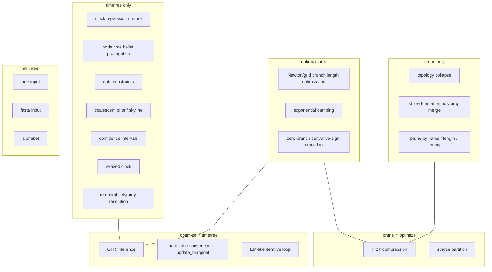
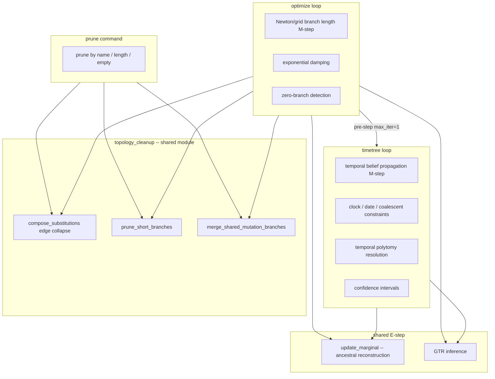

# Command relationships: ancestral, prune, optimize, timetree

Scientific and architectural relationships between the four main tree-refinement commands. Covers current implementation, ideal design, the two EM-like loops, the role of `ancestral` as the shared foundation, and a gap table mapping known issues to required changes.

## Current implementation: Venn diagram



## Current key intersections

| Intersection        | Shared scientific components                                                                         |
| :------------------ | :--------------------------------------------------------------------------------------------------- |
| prune ∩ optimize    | Fitch-compressed sparse partition (structure, no inference)                                          |
| optimize ∩ timetree | GTR inference + `update_marginal` ancestral reconstruction (shared code, different M-step objective) |
| prune ∩ timetree    | -- (none beyond I/O)                                                                                 |
| all three           | tree input, fasta input, alphabet                                                                    |

## The two EM-like loops compared

Both optimize and timetree use an EM-like alternating optimization. The E-step is identical. The M-steps differ fundamentally.

| Phase            | optimize                                                                          | timetree                                                                                           |
| :--------------- | :-------------------------------------------------------------------------------- | :------------------------------------------------------------------------------------------------- |
| E-step           | `update_marginal()` -- ancestral reconstruction                                   | `update_marginal()` -- same call, same code                                                        |
| M-step           | `run_optimize_mixed()` -- Newton/grid on **branch lengths** (free, unconstrained) | `run_timetree()` -- belief propagation on **node times** (constrained by clock, dates, coalescent) |
| Primary variable | branch length $b_e$ (substitution units)                                          | node time $t_v$ (calendar units)                                                                   |
| Constraint       | none -- free $b_e \geq 0$                                                         | clock: $b_e = \Delta t \cdot \mu \cdot \gamma$; date bounds; coalescent prior                      |
| Topology cleanup | zero-branch collapse + shared-mutation merge (`prune_and_merge_in_loop`)          | temporal greedy polytomy resolution                                                                |
| Damping          | explicit post-sweep blending (`d = 0.75`)                                         | absent                                                                                             |
| Convergence      | $\|\Delta \ell\| < \epsilon$                                                      | `n_diff == 0 && n_resolved == 0`                                                                   |

The two loops are **siblings** sharing an E-step, not parent/child. Running optimize's M-step inside timetree's loop would optimize the wrong objective -- unconstrained per-edge substitution rate when the constraint is a molecular clock.

## Current objective functions

| Command  | Primary optimization variable       | Objective                                                                           |
| :------- | :---------------------------------- | :---------------------------------------------------------------------------------- |
| prune    | --                                  | topology manipulation only                                                          |
| optimize | branch lengths (substitution space) | $\ell(\text{branch lengths} \mid \text{sequences, GTR})$                            |
| timetree | node times (calendar space)         | $\ell(\text{node times} \mid \text{sequences, GTR, clock rate, dates, coalescent})$ |

---

## Ideal implementation

### The ideal relationship hierarchy

```
topology_cleanup/               ← shared module, no GTR, no ML
  collapse_edge()               ← composition-correct (not union), sparse + dense
  prune_short_branches()
  merge_shared_mutation_branches()

prune/
  run_prune()
    topology_cleanup::prune_nodes()      ← by name / length / empty
    topology_cleanup::merge_shared()     ← optional

optimize/
  run_optimize()
    initial_guess_mixed()
    loop:
      update_marginal()                  ← E-step
      run_optimize_mixed()               ← M-step
      apply_damping(0.75)
      topology_cleanup::prune_short()    ← NEW: inside loop, after damping
      topology_cleanup::merge_shared()   ← NEW: after prune exposes polytomies
      graph.build()                      ← only if topology changed

timetree/
  run_timetree_estimation()
    optimize(max_iter=1)                 ← NEW: pre-step, seeds branch lengths
    clock_regression + reroot
    loop:
      update_marginal()                  ← E-step (shared with optimize)
      resolve_polytomies_temporal()      ← M-step topology (time-domain, distinct)
      run_timetree()                     ← M-step time inference
      coalescent / relaxed_clock
```

### Why prune ⊆ optimize (topology cleanup inside the loop)

EM theory (Dempster et al. 1977) guarantees monotonic likelihood increase only when the E-step and M-step operate on a consistent topology. Zero-length edges left in the tree cause the E-step to reconstruct ancestors for nodes that should not exist, and the M-step to optimize branch lengths for phantom edges. **Pruning inside the loop is required for the EM convergence argument to hold**, not just a quality-of-life feature.

Order within topology cleanup: **prune first, then merge**. Merging before pruning hides shared mutations behind short internal nodes that pruning would have exposed as part of the same polytomy (`M-prune-wrong-operation-order`).

The `prune` command as a user-facing entry point retains value -- users want topology cleanup without full ML. Its implementation should delegate to the same shared `topology_cleanup` module used inside optimize's loop (Chapter 10 of the iterative tree refinement report, Recommendation R3).

### Why optimize(max_iter=1) precedes timetree's loop

Time inference uses branch-length distributions $P(b_e) = \exp(Q b_e)$ to inform node time posteriors. If the input tree carries raw neighbor-joining or parsimony branch lengths, these distributions are poorly centered so the initial time posteriors are inaccurate. One ML optimization pass seeds the loop with branch lengths already close to the ML optimum (`M-timetree-missing-initial-branch-optimization`). This matches v0's design exactly (`treetime.py:243, 266`).

---

## Current vs ideal: gap table

| Gap                                                              | Severity | Tracking issue                                   | Status |
| :--------------------------------------------------------------- | :------- | :----------------------------------------------- | :----- |
| Topology cleanup not in a shared module                          | Medium   | `L-optimize-prune-duplicate-collapse`            | Open   |
| Timetree skips optimize(max_iter=1) pre-step                     | Medium   | `M-timetree-missing-initial-branch-optimization` | Open   |
| Timetree has no branch re-optimization after polytomy resolution | Low      | Chapter 10 (iterative-tree-refinement)           | Open   |

---

## Ideal Venn diagram

In the ideal design, prune is a proper subset of optimize (shared topology_cleanup module), and optimize provides a one-pass initialization to timetree before its own loop begins. The two loops remain siblings sharing an E-step.



---

## Where ancestral fits

`ancestral` is not a fourth Venn circle. It is what the two shared intersection zones _are_ -- made into a standalone user-facing command.

| ancestral mode           | What it runs                                   | Corresponds to                                                   |
| :----------------------- | :--------------------------------------------- | :--------------------------------------------------------------- |
| `--method-anc=parsimony` | `compress_sequences` + Fitch forward/backward  | The prune ∩ optimize zone                                        |
| `--method-anc=marginal`  | `initialize_marginal` + `update_marginal` once | The optimize ∩ timetree zone: one iteration of the shared E-step |

Adding `ancestral` as a fourth Venn circle would produce a shape that covers both existing intersections and nothing else. That is equivalent to labeling those intersections "ancestral" directly, which is precisely what is meant.

### Why ancestral has no unique Venn region

A unique region would mean "something `ancestral` does that nothing else needs." In the ideal design, optimize and timetree call `ancestral`'s internals as a subroutine -- they do not reimplement the E-step, they invoke it. Every component of `ancestral` is consumed by at least one other command by construction. The more faithfully the ideal module structure is implemented, the more completely `ancestral` disappears into shared code with no residual unique behavior. This is true in both the current and ideal implementations.

### ancestral in the hierarchy

`ancestral` sits at the **bottom** of the dependency chain -- everything depends on it. This is the opposite of a unique Venn region, which would signal independence.

```
ancestral/
  parsimony:  compress_sequences()   ← used by prune, optimize
  marginal:   initialize_marginal()
              update_marginal()       ← E-step of optimize and timetree

prune    ──parsimony──→  topology_cleanup
optimize ──E-step (loop)──→ update_marginal  ──M-step──→ run_optimize_mixed
timetree ──E-step (loop)──→ update_marginal  ──M-step──→ run_timetree
```

The hierarchy diagram is the correct representation for `ancestral`. The Venn diagram remains valid for prune, optimize, and timetree; `ancestral` is a label for the intersections between those three.
