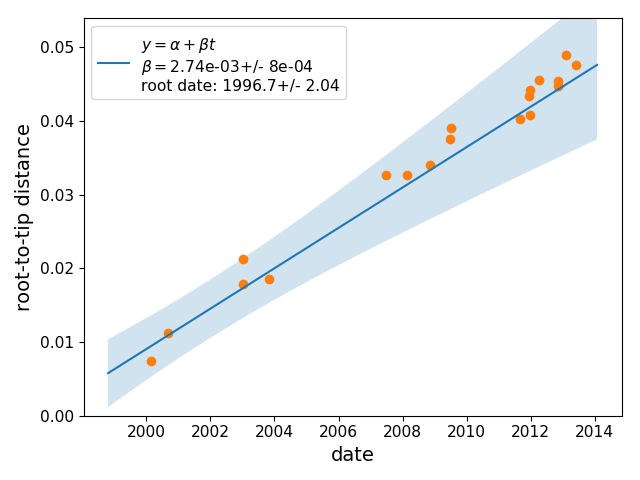
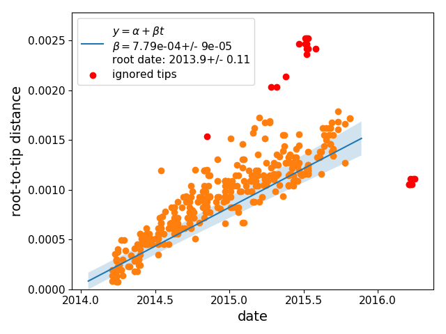

## Estimation of evolutionary rates and tree rerooting

Treetime can estimate substitution rates and determine which rooting of the tree is most consistent with the sampling dates of the sequences.
This functionality is implemented as subcommand `clock`:
```bash
treetime clock --tree data/h3n2_na/h3n2_na_20.nwk --dates data/h3n2_na/h3n2_na_20.metadata.csv --sequence-len 1400 --outdir clock_results
```
This command will print the following output:
```
 Root-Tip-Regression:
 --rate:	2.742e-03 +/- 3.81e-04 (one std-dev)
 --chi^2:	18.06
 --r^2:  	0.98

The R^2 value indicates the fraction of variation in
root-to-tip distance explained by the sampling times.
Higher values corresponds more clock-like behavior (max 1.0).

The rate is the slope of the best fit of the date to
the root-to-tip distance and provides an estimate of
the substitution rate. The rate needs to be positive!
Negative rates suggest an inappropriate root.


The estimated rate and tree correspond to a root date:

--- root-date:	 1996.70 +/- 1.02 (one std-dev)


--- re-rooted tree written to
	clock_results/rerooted.newick

--- wrote dates and root-to-tip distances to
	clock_results/rtt.csv

--- root-to-tip plot saved to
	clock_results/root_to_tip_regression.pdf
```
and save a number of files to disk:
  * a rerooted tree in newick format
  * a table with the root-to-tip distances and the dates of all terminal nodes
  * a graph showing the regression of root-to-tip distances vs time



### Confidence intervals
In its default setting, `treetime clock` estimates confidence intervals of the evolutionary rate and the Tmrca by maximizing the approximate likelihood while accounting for covariation in root-to-tip distances.
However, this requires estimation of a timetree and can take a while.
For a quick estimate without confidence intervals, use `--reroot least-squares`.

The timetree estimation can be skipped if branches are sufficiently long.
In this case, divergences along branches are good estimators of the branch length can can be used to calculate the covariation structure among tips.
This option is as fast as the `least-squares` option, provides confidence intervals, but is susceptible to a downward bias in rate estimates since less diverged tips tend to be over-weighted.

### Filtering of tips
More often than not, a subset of sequences in an alignment are outliers and don't follow the molecular clock model.
Such outliers can badly skew rerooting and estimation of the substitution rates.
To guard against such problems, `treetime clock` marks sequences as suspect if they deviate more than a certain amount from the clock model.
TreeTime first performs a least-square root-to-tip vs date regression and then marks tips whose residuals are greater than `n` inter-quartile distances of the residual distribution.
The parameter `n` is set via
```bash
	--clock-filter <n>
```
and is 3 by default.
For the example Ebola virus data set, the command
```bash
treetime clock --tree data/ebola/ebola.nwk --dates data/ebola/ebola.metadata.csv --sequence-len 19000
```



### Complete list of parameters and options

```bash
\:> treetime clock -h
usage: TreeTime: Maximum Likelihood Phylodynamics clock [-h] --tree TREE
                                                        --dates DATES
                                                        [--sequence-length SEQUENCE_LENGTH]
                                                        [--aln ALN]
                                                        [--vcf-reference VCF_REFERENCE]
                                                        [--clock-filter CLOCK_FILTER]
                                                        [--reroot REROOT | --keep-root]
                                                        [--allow-negative-rate]
                                                        [--plot-rtt PLOT_RTT]
                                                        [--verbose VERBOSE]
                                                        [--outdir OUTDIR]

Calculates the root-to-tip regression and quantifies the 'clock-i-ness' of the
tree. It will reroot the tree to maximize the clock-like signal and
recalculate branch length unless run with --keep_root.

optional arguments:
  -h, --help            show this help message and exit
  --tree TREE           Name of file containing the tree in newick, nexus, or
                        phylip format. If none is provided, treetime will
                        attempt to build a tree from the alignment using
                        fasttree, iqtree, or raxml (assuming they are
                        installed)
  --dates DATES         csv file with dates for nodes with 'node_name, date'
                        where date is float (as in 2012.15)
  --sequence-length SEQUENCE_LENGTH
                        length of the sequence, used to calculate expected
                        variation in branch length. Not required if alignment
                        is provided.
  --aln ALN             alignment file (fasta)
  --vcf-reference VCF_REFERENCE
                        only for vcf input: fasta file of the sequence the VCF
                        was mapped to.
  --clock-filter CLOCK_FILTER
                        ignore tips that don't follow a loose clock, 'clock-
                        filter=number of interquartile ranges from regression'
  --reroot REROOT       reroot the tree. Valid choices are 'ML', 'ML-rough',
                        'least-squares', 'min_dev', 'midpoint' or a node name
                        to be used as outgroup. Use --keep-root to keep the
                        current root.
  --keep-root           don't reroot the tree. Otherwise, reroot to minimize
                        the the residual of the regression of root-to-tip
                        distance and sampling time
  --allow-negative-rate
                        By default, rates are forced to be positive. For trees
                        with little temporal signal it is advisable to remove
                        this restriction to achieve essentially mid-point
                        rooting.
  --plot-rtt PLOT_RTT   filename to save the plot to. Suffix will determine
                        format (choices pdf, png, svg, default=pdf)
  --verbose VERBOSE     verbosity of output 0-6
  --outdir OUTDIR       directory to write the output to

```