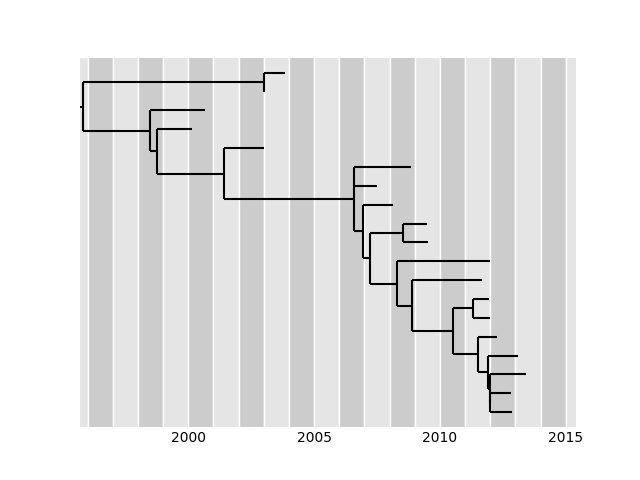
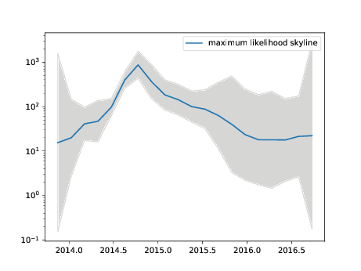

Estimation of time scaled phylogenies
-------------------------------------

The principal functionality of TreeTime is estimating time trees from an initial tree topology, a set of date constraints (e.g. tip dates), and an alignment (optional).
This tutorial uses data provided in the github repository `github.com/neherlab/treetime_examples <https://github.com/neherlab/treetime_examples>`_.

.. code-block:: bash

   treetime --tree data/h3n2_na/h3n2_na_20.nwk --dates data/h3n2_na/h3n2_na_20.metadata.csv --aln data/h3n2_na/h3n2_na_20.fasta --outdir h3n2_timetree

The tree can be in newick or nexus format, the alignment in fasta or phylip, and the dates should be given as a tsv or csv file.
TreeTime will attempt to parse dates, preferred formats are are "%Y-%m-%d" or numerical as in 2016.45.
This command will estimate an GTR model, a molecular clock model, and a time-stamped phylogeny.
The results are saved to several files in the directory specified as `outdir` and printed to standard out:

.. code-block::

   Inferred GTR model:
   Substitution rate (mu): 1.0

   Equilibrium frequencies (pi_i):
     A: 0.2983
     C: 0.1986
     G: 0.2353
     T: 0.2579
     -: 0.01

   Symmetrized rates from j->i (W_ij):
       A   C   G   T   -
     A 0   0.8273  2.8038  0.4525  1.031
     C 0.8273  0   0.5688  2.8435  1.0561
     G 2.8038  0.5688  0   0.6088  1.0462
     T 0.4525  2.8435  0.6088  0   1.0418
     - 1.031   1.0561  1.0462  1.0418  0

   Actual rates from j->i (Q_ij):
       A   C   G   T   -
     A 0   0.2468  0.8363  0.135   0.3075
     C 0.1643  0   0.1129  0.5646  0.2097
     G 0.6597  0.1338  0   0.1432  0.2462
     T 0.1167  0.7332  0.157   0   0.2686
     - 0.0103  0.0106  0.0105  0.0104  0

   Root-Tip-Regression:
    --rate:    2.613e-03
    --chi^2:   22.16

    --r^2: 0.98

   --- saved tree as
        h3n2_timetree/timetree.pdf

   --- alignment including ancestral nodes saved as
        h3n2_timetree/ancestral_sequences.fasta

   --- saved divergence times in
        h3n2_timetree/dates.tsv

   --- tree saved in nexus format as
        h3n2_timetree/timetree.nexus

   --- root-to-tip plot saved to
       h3n2_timetree/root_to_tip_regression.pdf

Other output files include an alignment with reconstructed ancestral sequences, an annotated tree in nexus format in which branch length correspond to years and mutations and node dates are added as comments to each node.
In addition, the root-to-tip vs time regression and the tree are drawn and saved to file.

Accounting for phylogenetic covariance
^^^^^^^^^^^^^^^^^^^^^^^^^^^^^^^^^^^^^^

The root-to-tip distances of samples are expected to increase with sampling date and TreeTime uses this behavior to estimate clock rates.
However, these root-to-tip distances are correlated due to shared ancestry.
This can be efficiently accounted if the sequence data set is consistent with a simple strict molecular clock model, but can give misleading results when the molecular clock model is violated.
This feature is hence off by default and can be switched on using the flag

.. code-block::

   --covariation

Fixed evolutionary rate
^^^^^^^^^^^^^^^^^^^^^^^

If the temporal signal in the data is weak and the clock rate can't be estimated confidently from the data, it is advisable to specify the rate explicitly.
This can be done using the argument

.. code-block::

   --clock-rate <rate>

Specify or estimate coalescent models
^^^^^^^^^^^^^^^^^^^^^^^^^^^^^^^^^^^^^

TreeTime can be run either without a tree prior or with a Kingman coalescent tree prior.
The later is parameterized by a time scale 'Tc' which can vary in time.
This time scale is often called 'effective population size' Ne, but the appropriate Tc has very little to do with census population sizes.
To activate the Kingman Coalescent model in TreeTime, you need to add the flag

.. code-block::

    --coalescent <arg>

where the argument is either a floating point number giving the time scale of coalescence in units of divergence, 'const' to have TreeTime estimate a constant merger rate, or 'skyline'.
In the latter case, TreeTime will estimate a piece-wise linear merger rate trajectory and save this in files ending on 'skyline.tsv' and 'skyline.pdf'

The following command will run TreeTime on the ebola example data set and estimate a time tree along with a skyline (this will take a few minutes).

.. code-block:: bash

   treetime --tree data/ebola/ebola.nwk --dates data/ebola/ebola.metadata.csv --aln data/ebola/ebola.fasta --outdir ebola  --coalescent skyline

Confidence intervals
^^^^^^^^^^^^^^^^^^^^

In its default setting, ``treetime`` does not estimate confidence intervals of divergence times.
Such estimates require calculation of the marginal probability distributions of the dates of the internal nodes that take about 2-3 times as long as calculating only the jointly maximally likely dates.
To switch on confidence estimation, pass the flag ``--confidence``.
TreeTime will run another round of marginal timetree reconstruction and determine the region that contains 90% of the marginal probability distribution of the node dates.
These intervals are drawn into the tree graph and written to the dates file.

VCF files as input
^^^^^^^^^^^^^^^^^^

In addition to standard fasta files, TreeTime can ingest sequence data in form of vcf files which is common for bacterial data sets where short reads are mapped against a reference and only variable sites are reported.
The following example with a set of MtB sequences uses a fixed evolutionary rate of 1e-7 per site and year.

.. code-block:: bash

   treetime --aln data/tb/lee_2015.vcf.gz --vcf-reference data/tb/tb_ref.fasta --tree data/tb/lee_2015.nwk --clock-rate 1e-7 --dates data/tb/lee_2015.metadata.tsv

For many bacterial data set were the temporal signal in the data is weak, it is advisable to fix the rate of the molecular clock explicitly.
Divergence times, however, will depend on this choice.

