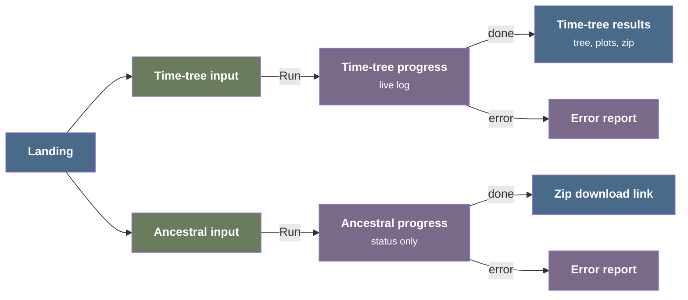

# UI/UX inventory of the legacy TreeTime web application

The legacy TreeTime web application ran at `https://treetime.biozentrum.unibas.ch`. It was a Flask server with a React 0.14 and D3 3 frontend around TreeTime 0.5.1. This document lists its user-facing pages, controls, visualizations, interactions, and feedback. It is input for the design of the v1 desktop and web applications ([multi-target-desktop-web-architecture.md](multi-target-desktop-web-architecture.md)).

Scope:

- The inventory covers UI and UX only. It does not record the analysis behavior of TreeTime 0.5.1, because that version is older than the v0 reference and has known defects
- The v1 application UI is a placeholder, so v1 has none of the items below. The inventory therefore has no parity markers
- Evidence comes from the source at commit `abcd1de` of `neherlab/treetime_web` and from runs of the containerized application with the bundled examples

Source links point to [git.scicore.unibas.ch/neherlab/treetime_web](https://git.scicore.unibas.ch/neherlab/treetime_web/-/tree/abcd1dea43ea3a5668c646513c894ab22539a466).

## Workflows

The application has two independent workflows. Each workflow has an input page, a progress page, and a result.

## Site structure and navigation

- **Pages**: landing `/`, time-tree input `/treetime/<id>`, time-tree progress `/treetime/<id>/progress`, time-tree results `/treetime/<id>/results`, ancestral input `/ancestral/<id>`, ancestral progress `/ancestral/<id>/progress`, and about `/about`. The routes are in [treetime_server.py](https://git.scicore.unibas.ch/neherlab/treetime_web/-/blob/abcd1dea43ea3a5668c646513c894ab22539a466/treetime_server.py#L46-L389)
- **Header bar**: the title "TreeTime: Maximum-likelihood phylodynamic analysis", and links to Home, About, and "API doc" (the external TreeTime documentation), each with an icon ([js/components/header.js#L33-L51](https://git.scicore.unibas.ch/neherlab/treetime_web/-/blob/abcd1dea43ea3a5668c646513c894ab22539a466/js/components/header.js#L33-L51))
- **Footer**: an "About/Impressum" link and a copyright line that cites the TreeTime publication ([js/components/footer.js](https://git.scicore.unibas.ch/neherlab/treetime_web/-/blob/abcd1dea43ea3a5668c646513c894ab22539a466/js/components/footer.js))
- **About page**: collapsible panels for people and funding (photos, affiliations, email addresses, funder logos), source code and issue links, and a legal notice in German and English with a web analytics statement ([js/components/about.js#L15-L156](https://git.scicore.unibas.ch/neherlab/treetime_web/-/blob/abcd1dea43ea3a5668c646513c894ab22539a466/js/components/about.js#L15-L156))
- **Crawler exclusion**: `robots.txt` excludes session, workflow, and download paths ([html/robots.txt](https://git.scicore.unibas.ch/neherlab/treetime_web/-/blob/abcd1dea43ea3a5668c646513c894ab22539a466/html/robots.txt))
- **Usage analytics**: every page loads a Plausible script that also tracks file downloads and outbound links (for example [templates/results_treetime.html#L9](https://git.scicore.unibas.ch/neherlab/treetime_web/-/blob/abcd1dea43ea3a5668c646513c894ab22539a466/templates/results_treetime.html#L9))

## Landing page

- **Workflow cards**: two panels, "Time-tree inference" and "Ancestral state reconstruction". Each card has a large button, a "Features" list, and a "Requires" list of input files. A click anywhere on a card starts the workflow ([js/components/welcome.js#L93-L142](https://git.scicore.unibas.ch/neherlab/treetime_web/-/blob/abcd1dea43ea3a5668c646513c894ab22539a466/js/components/welcome.js#L93-L142))
- **Session start**: the click requests a new session identifier from the server and replaces the page with the workflow input page for that identifier ([js/components/welcome.js#L18-L81](https://git.scicore.unibas.ch/neherlab/treetime_web/-/blob/abcd1dea43ea3a5668c646513c894ab22539a466/js/components/welcome.js#L18-L81))

## Sessions

- **Session in the URL**: each run has a 12-letter identifier with a workflow prefix (`tt_`, `anc_`) in every page URL. A user can reload, bookmark, or share the progress and results pages ([treetime_server.py#L40-L44](https://git.scicore.unibas.ch/neherlab/treetime_web/-/blob/abcd1dea43ea3a5668c646513c894ab22539a466/treetime_server.py#L40-L44))
- **Session files by URL**: every file in the session directory, including the uploaded inputs, downloads from `/sessions/<id>/<file>` ([treetime_server.py#L337-L344](https://git.scicore.unibas.ch/neherlab/treetime_web/-/blob/abcd1dea43ea3a5668c646513c894ab22539a466/treetime_server.py#L337-L344))
- **Retention**: a daily timer deletes session directories older than two days ([infra/treetime-cleanup.service](https://git.scicore.unibas.ch/neherlab/treetime_web/-/blob/abcd1dea43ea3a5668c646513c894ab22539a466/infra/treetime-cleanup.service))
- **Stored configuration**: the server saves the submitted settings as `config.json` in the session ([treetime_server.py#L266-L272](https://git.scicore.unibas.ch/neherlab/treetime_web/-/blob/abcd1dea43ea3a5668c646513c894ab22539a466/treetime_server.py#L266-L272))

## Time-tree input page

The page stacks three collapsible panels above a run button ([js/components/welcome_treetime.js#L710-L745](https://git.scicore.unibas.ch/neherlab/treetime_web/-/blob/abcd1dea43ea3a5668c646513c894ab22539a466/js/components/welcome_treetime.js#L710-L745)).

### Upload data panel

Expanded by default ([js/components/welcome_treetime.js#L78-L121](https://git.scicore.unibas.ch/neherlab/treetime_web/-/blob/abcd1dea43ea3a5668c646513c894ab22539a466/js/components/welcome_treetime.js#L78-L121)).

- **File slots**: three file buttons labeled "Newick", "Fasta", and "CSV". A text beside each button shows the slot state: a hint before selection ("Select alignment file (ALIGNED!)"), the uploaded file name after upload, and "Error uploading file" after a failed upload
- **Upload on select**: each file uploads to the session when the user selects it, before the run starts ([js/components/welcome_treetime.js#L509-L606](https://git.scicore.unibas.ch/neherlab/treetime_web/-/blob/abcd1dea43ea3a5668c646513c894ab22539a466/js/components/welcome_treetime.js#L509-L606))
- **Build tree option**: a "Build tree" checkbox under the tree slot. When checked, the tree slot shows "Will be built from alignment" and the server builds the tree with FastTree. Selecting a tree file clears the checkbox
- **Metadata format tooltip**: hovering the CSV button shows a tooltip with an example table and the format rules: one header row; the first column holds sequence names; the first column whose name contains "date" holds the sampling dates, as a decimal year (`2015.7`) or a date string (`YYYY-MM-DD`); other columns may hold any data and appear in the results ([js/components/welcome_treetime.js#L41-L73](https://git.scicore.unibas.ch/neherlab/treetime_web/-/blob/abcd1dea43ea3a5668c646513c894ab22539a466/js/components/welcome_treetime.js#L41-L73))

### Example datasets panel

Collapsed by default ([js/components/welcome_treetime.js#L128-L213](https://git.scicore.unibas.ch/neherlab/treetime_web/-/blob/abcd1dea43ea3a5668c646513c894ab22539a466/js/components/welcome_treetime.js#L128-L213)).

- **Example table**: the columns are species, genomic region, alignment length, number of sequences, date range, and a "Load" button. The rows are:
  - Influenza H3N2 NA, 20 sequences, 2000-2013
  - Influenza H3N2 HA, 100 sequences, 2011-2013
  - HIV subtype B RT, 186 sequences, 1978-2016
  - HIV subtype B p17, 183 sequences, 1978-2016
  - Zika full genome, 65 sequences, 2013-2016
  - Ebola full genome, 362 sequences, 2014-2016
- **Load action**: "Load" copies the tree, alignment, and metadata of the example into the session, fills all three file slots with the example file names, and clears "Build tree". The user can then change the settings before the run

### Advanced configuration panel

Collapsed by default ([js/components/welcome_treetime.js#L330-L445](https://git.scicore.unibas.ch/neherlab/treetime_web/-/blob/abcd1dea43ea3a5668c646513c894ab22539a466/js/components/welcome_treetime.js#L330-L445)). The server provides the defaults ([static/py/tree_time_config.py#L20-L40](https://git.scicore.unibas.ch/neherlab/treetime_web/-/blob/abcd1dea43ea3a5668c646513c894ab22539a466/static/py/tree_time_config.py#L20-L40)).

- **Root optimization**: the checkbox "Optimize tree root position", on by default, with the tooltip "Re-root tree to optimal root-to-tip regression"
- **Polytomy resolution**: the checkbox "Resolve polytomies using temporal constraints", on by default
- **Substitution model**: a "GTR model" dropdown with "Infer from tree" (default) and the named models JC69, K80, F81, HKY85, T92, TN93, and JTT92, shown by their full citation names (for example "Hasegawa, Kishino, Yano 1985")
  - When a model with parameters is selected, number inputs for its parameters appear, each with a tooltip: base frequencies `[A]`, `[C]`, `[G]`, `[T]`, the transition-transversion ratio `kappa`, the G+C content, and `kappa1`/`kappa2` ([js/components/gtr.js#L61-L136](https://git.scicore.unibas.ch/neherlab/treetime_web/-/blob/abcd1dea43ea3a5668c646513c894ab22539a466/js/components/gtr.js#L61-L136), [static/py/tree_time_config.py#L2-L18](https://git.scicore.unibas.ch/neherlab/treetime_web/-/blob/abcd1dea43ea3a5668c646513c894ab22539a466/static/py/tree_time_config.py#L2-L18))
- **Fixed clock rate**: the checkbox "Fix substitution rate" shows a number input with the unit "(#/year)", default `1e-3`, step `1e-4`, range `1e-9` to `1e-2`
- **Coalescent prior**: the checkbox "Use coalescent prior" shows a number input for the time scale, default `0.01`, with the unit "(Hamming distance)"
- **Relaxed clock**: the checkbox "Relax molecular clock" shows two number inputs, "Slack: α" and "Coupling: β"
- **Scope note**: a text line says that more features, such as skyline inference, are available in the TreeTime package but not in the web interface
- **Conditional inputs**: each numeric input is visible only while its checkbox is on

### Run

- **Run button**: "Run treetime" ([js/components/welcome_treetime.js#L743](https://git.scicore.unibas.ch/neherlab/treetime_web/-/blob/abcd1dea43ea3a5668c646513c894ab22539a466/js/components/welcome_treetime.js#L743))
- **Input validation**: before submission, the page checks that a tree (or "Build tree"), an alignment, and a metadata file are present. It then shows one message that lists every missing file ([js/components/welcome_treetime.js#L657-L672](https://git.scicore.unibas.ch/neherlab/treetime_web/-/blob/abcd1dea43ea3a5668c646513c894ab22539a466/js/components/welcome_treetime.js#L657-L672))
- **Submission**: the page sends the settings and replaces itself with the progress page

## Ancestral reconstruction input page

A reduced form of the time-tree input page ([js/components/welcome_ancestral_reconstruction.js#L8-L271](https://git.scicore.unibas.ch/neherlab/treetime_web/-/blob/abcd1dea43ea3a5668c646513c894ab22539a466/js/components/welcome_ancestral_reconstruction.js#L8-L271)).

- **Inputs**: the "Newick" and "Fasta" file slots with the "Build tree" checkbox, and the "GTR model" dropdown with its parameter inputs in the same panel
- **Omitted parts**: no metadata slot, no example datasets, and no advanced configuration panel
- **Run button**: "Run ancestral reconstruction", with the same missing-file validation

## Progress pages

### Time-tree progress

([js/components/progress_treetime.js](https://git.scicore.unibas.ch/neherlab/treetime_web/-/blob/abcd1dea43ea3a5668c646513c894ab22539a466/js/components/progress_treetime.js))

- **Running banner**: "TreeTime is running..." with the note that the page goes to the results automatically
- **Live log**: the page polls the computation log every 5 seconds and shows it below the banner. Lines that contain "ERROR" show in red and lines that contain "WARNING" show in orange ([js/components/progress_treetime.js#L65-L95](https://git.scicore.unibas.ch/neherlab/treetime_web/-/blob/abcd1dea43ea3a5668c646513c894ab22539a466/js/components/progress_treetime.js#L65-L95))
- **Status polling**: the page polls the run state (`reading config`, `running`, `saving results`, `done`, `error`) every 10 seconds and goes to the results page when the state is `done` ([js/components/progress_treetime.js#L160-L192](https://git.scicore.unibas.ch/neherlab/treetime_web/-/blob/abcd1dea43ea3a5668c646513c894ab22539a466/js/components/progress_treetime.js#L160-L192))
- **Client time limit**: after 30 minutes, polling stops and the page shows a timeout message that suggests a smaller dataset
- **Error report**: on the `error` state the banner changes to an error report ([js/components/progress_treetime.js#L23-L62](https://git.scicore.unibas.ch/neherlab/treetime_web/-/blob/abcd1dea43ea3a5668c646513c894ab22539a466/js/components/progress_treetime.js#L23-L62)):
  - an explanation of the possible causes
  - an email link with the session identifier in the subject
  - a collapsible "Server output" panel with the server-side error trace
  - a list of common input problems: tree and alignment names that do not match, illegal characters in names, unaligned sequences, and metadata names that do not match the tree
  - the live log stays visible below the report

### Ancestral progress

([js/components/progress_ancestral.js](https://git.scicore.unibas.ch/neherlab/treetime_web/-/blob/abcd1dea43ea3a5668c646513c894ab22539a466/js/components/progress_ancestral.js))

- **Three banners**: running, finished, and error, each with the same error report elements as the time-tree page except the live log
- **Download on completion**: when the state is `done`, the page shows a "Download results (.zip)" button. The ancestral workflow has no results page

## Time-tree results page

The page has a tree section, a root-to-tip plot, a node date distribution plot, a download section, and a citation line ([js/components/results_treetime.js#L800-L834](https://git.scicore.unibas.ch/neherlab/treetime_web/-/blob/abcd1dea43ea3a5668c646513c894ab22539a466/js/components/results_treetime.js#L800-L834)). All views redraw when the window size changes.

### Tree view

A D3 rectangular tree with a control pane at its left ([js/components/results_treetime.js#L119-L270](https://git.scicore.unibas.ch/neherlab/treetime_web/-/blob/abcd1dea43ea3a5668c646513c894ab22539a466/js/components/results_treetime.js#L119-L270), [js/components/phylo_tree.js](https://git.scicore.unibas.ch/neherlab/treetime_web/-/blob/abcd1dea43ea3a5668c646513c894ab22539a466/js/components/phylo_tree.js)).

- **Time axis**: in time-tree mode the horizontal axis shows calendar years with vertical grid lines and the label "Date"
- **Time or divergence**: the checkbox "Toggle time-tree" switches the horizontal position between the inferred date and the divergence from the root. The axis shows only in time mode. Branches and tips move with a 400 ms animation
- **Color by**: a dropdown with these color sources ([js/components/results_treetime.js#L171-L268](https://git.scicore.unibas.ch/neherlab/treetime_web/-/blob/abcd1dea43ea3a5668c646513c894ab22539a466/js/components/results_treetime.js#L171-L268)):
  - the inferred date (default)
  - the nucleotide at an alignment position, selected with a "Pos:" number input that is enabled only for this source
  - each metadata column from the uploaded CSV, found automatically
  - the branch length stretch (ratio of the time-tree branch length to the divergence branch length)
  - the local substitution rate, present only when the relaxed clock is on
- **Color scales**: an all-numeric source uses a continuous 12-color scale in quantile bins. Any other source uses a categorical palette with 10 colors, or 20 colors when there are more than 10 values. Nodes without a value are gray
- **Legend**: the "Color codes" pane shows a color swatch and a label for each bin or category ([js/components/tree_legend.js](https://git.scicore.unibas.ch/neherlab/treetime_web/-/blob/abcd1dea43ea3a5668c646513c894ab22539a466/js/components/tree_legend.js))
- **Tip tooltip**: hovering a tip shows the sequence name and all node metadata (the uploaded columns, the inferred date, and the branch length stretch) ([js/components/phylo_tree.js#L39-L61](https://git.scicore.unibas.ch/neherlab/treetime_web/-/blob/abcd1dea43ea3a5668c646513c894ab22539a466/js/components/phylo_tree.js#L39-L61))
- **Branch tooltip**: hovering a branch shows its mutations (the first 10 and a count of the rest), the name of the node below the branch, that node's metadata, and the hint "click to zoom into clade" ([js/components/phylo_tree.js#L63-L111](https://git.scicore.unibas.ch/neherlab/treetime_web/-/blob/abcd1dea43ea3a5668c646513c894ab22539a466/js/components/phylo_tree.js#L63-L111))
- **Clade zoom**: a click on a branch rescales both axes to the clade below it. The "Reset Layout" button restores the full tree ([js/components/phylo_tree.js#L517-L523](https://git.scicore.unibas.ch/neherlab/treetime_web/-/blob/abcd1dea43ea3a5668c646513c894ab22539a466/js/components/phylo_tree.js#L517-L523))
- **Linked selection**: hovering a tip or branch selects that node in all views. The tree enlarges the selected tip, the root-to-tip plot enlarges its point, and the date distribution plot shows that node

### Root-to-tip plot

([js/components/mu_plot.js](https://git.scicore.unibas.ch/neherlab/treetime_web/-/blob/abcd1dea43ea3a5668c646513c894ab22539a466/js/components/mu_plot.js))

- **Scatter**: the divergence from the root ("Distance to root") against the date ("Sampling date") for all nodes. Internal and terminal nodes have different colors
- **Regression**: a least-squares line through the terminal nodes, computed in the browser ([js/components/mu_plot.js#L127-L178](https://git.scicore.unibas.ch/neherlab/treetime_web/-/blob/abcd1dea43ea3a5668c646513c894ab22539a466/js/components/mu_plot.js#L127-L178))
- **Inset legend**: node type symbols, the slope as the substitution rate μ, and the squared correlation R² ([js/components/mu_plot.js#L261-L321](https://git.scicore.unibas.ch/neherlab/treetime_web/-/blob/abcd1dea43ea3a5668c646513c894ab22539a466/js/components/mu_plot.js#L261-L321))
- **Point tooltip**: hovering a point shows the node name and selects the node in the linked views

### Node date distribution plot

([js/components/root_lh.js](https://git.scicore.unibas.ch/neherlab/treetime_web/-/blob/abcd1dea43ea3a5668c646513c894ab22539a466/js/components/root_lh.js))

- **Curve**: the normalized marginal likelihood of the node date ("Normalized likelihood" against "node date"), within three full widths at half maximum of the peak ([static/py/tree_time_process.py#L403-L428](https://git.scicore.unibas.ch/neherlab/treetime_web/-/blob/abcd1dea43ea3a5668c646513c894ab22539a466/static/py/tree_time_process.py#L403-L428))
- **Node selection**: the plot shows the root first and then follows the hovered node in the tree

### Download section

- **Zip button**: "Download results (.zip)" opens the session archive in a new tab ([js/components/results_treetime.js#L615-L624](https://git.scicore.unibas.ch/neherlab/treetime_web/-/blob/abcd1dea43ea3a5668c646513c894ab22539a466/js/components/results_treetime.js#L615-L624))
- **File descriptions**: a collapsible panel "List of files in download archive" with one row of description per file ([js/components/results_treetime.js#L626-L691](https://git.scicore.unibas.ch/neherlab/treetime_web/-/blob/abcd1dea43ea3a5668c646513c894ab22539a466/js/components/results_treetime.js#L626-L691))
- **Citation**: a line under the downloads asks users to cite the TreeTime publication and links to it

## Result archive

The archive gives the user all results in one download ([static/py/tree_time_process.py#L215-L259](https://git.scicore.unibas.ch/neherlab/treetime_web/-/blob/abcd1dea43ea3a5668c646513c894ab22539a466/static/py/tree_time_process.py#L215-L259)).

- **Time-tree archive**: seven files
  - `out_tree.nwk`: the time tree
  - `out_tree.nexus`: the time tree with the mutations of each branch as a `[&mutations="..."]` comment
  - `out_aln.fasta`: the sequences of all nodes, tips and internal nodes
  - `out_metadata.csv`: one row per node that joins the uploaded metadata columns with the inferred date, the branch length stretch, and the local substitution rate (relaxed clock only)
  - `out_tree.json`: the tree with the layout coordinates, sequences, mutations, and metadata that the results page draws
  - `out_likelihoods.json`: the date distribution of each node that the date distribution plot draws
  - `out_GTR.txt`: the substitution model as text
- **Ancestral archive**: four files, `out_tree.nwk`, `out_tree.nexus`, `out_aln.fasta`, and `out_GTR.txt` ([static/py/tree_time_process.py#L514-L544](https://git.scicore.unibas.ch/neherlab/treetime_web/-/blob/abcd1dea43ea3a5668c646513c894ab22539a466/static/py/tree_time_process.py#L514-L544))
- **Visualization data in the archive**: the files that the results page draws (`out_tree.json`, `out_likelihoods.json`) are also in the archive, so a user can reproduce the plots offline

## Feedback and error messages

- **Blocking dialogs**: failed uploads, failed session starts, failed run submissions, and missing inputs show browser `alert()` dialogs with a specific message for each case (for example "Tree file upload error. Please, try once more.")
- **Missing session**: a 404 response during polling sends the user to a not-found page
- **Server-side input check**: a metadata file whose first column header does not contain "name", "strain", or "accession" writes a readable message to the log, and the error report shows it ([static/py/tree_time_process.py#L64-L80](https://git.scicore.unibas.ch/neherlab/treetime_web/-/blob/abcd1dea43ea3a5668c646513c894ab22539a466/static/py/tree_time_process.py#L64-L80))
