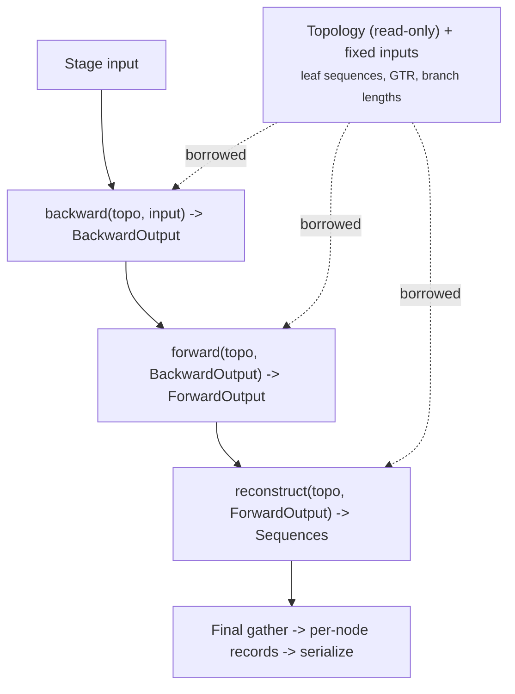

# Pure transform architecture for graph traversals

Separate graph topology from inference data. Each pass borrows or takes ownership of typed input and returns typed output. Topology stays read-only during a pass and can change between passes.

Status: **proposal awaiting approval**. The sections below describe the current code, proposed design choices, and required validation. They do not authorize implementation.

## Motivation

Graph payloads use `Arc<RwLock<>>`, which permits mutation through a shared graph reference. Lock guards protect access, but they do not restrict a pass to its declared inputs and outputs. Parallel passes already move payloads into owned slots and access them without holding the payload lock.

`struct NodeTimetree` [packages/treetime/src/payload/timetree.rs#L19](../../packages/treetime/src/payload/timetree.rs#L19) contains optional results for ancestral inference, time inference, clock regression, relaxed clock, outlier detection, and confidence estimation. Field availability depends on which passes have run. Stage-specific types could express those dependencies.

The reference implementation also stores inference results as node attributes. <a id="cite-1a"></a>[Sagulenko et al. 2018](https://doi.org/10.1093/ve/vex042) [[1](#ref-1)] describes TreeTime. Reference behavior and storage details must be checked in its source before using them as implementation requirements.

A pure transform API declares each pass's input and output types. Temporary inference data belongs to the pass or its returned result.

## Current architecture

### Graph payloads and partition maps

Per-node and per-edge state lives in two disjoint places, and which one a command uses is not uniform.

The **graph payload storage** stores payloads inside the graph. `struct Graph<N, E, D>` [packages/treetime-graph/src/graph.rs#L32](../../packages/treetime-graph/src/graph.rs#L32) holds `nodes: Vec<Option<Arc<RwLock<Node<N>>>>>`, and each `struct Node<N>` [packages/treetime-graph/src/node.rs#L80](../../packages/treetime-graph/src/node.rs#L80) wraps its payload in a second `Arc<RwLock<N>>`, separate from the topology (the inbound and outbound edge-key lists). `struct Edge<E>` [packages/treetime-graph/src/edge.rs#L82](../../packages/treetime-graph/src/edge.rs#L82) follows the same pattern. The concrete payloads are `NodeAncestral`/`EdgeAncestral` [packages/treetime/src/payload/ancestral.rs#L16](../../packages/treetime/src/payload/ancestral.rs#L16), `NodeTimetree`/`EdgeTimetree` [packages/treetime/src/payload/timetree.rs#L19](../../packages/treetime/src/payload/timetree.rs#L19), and `NodeClock`/`EdgeClock` [packages/treetime/src/clock/clock_graph.rs#L15](../../packages/treetime/src/clock/clock_graph.rs#L15). Clock and timetree mutate these in place during traversal.

The **partition maps** store inference data outside the graph. `trait PartitionCompressed` [packages/treetime/src/partition/traits.rs#L228](../../packages/treetime/src/partition/traits.rs#L228) exposes `nodes: BTreeMap<GraphNodeKey, SparseNodePartition>` and `edges: BTreeMap<GraphEdgeKey, SparseEdgePartition>` keyed by graph key. Ancestral, marginal, and Fitch keep their profiles, messages, substitutions, and likelihood contributions here, and instantiate the graph as `Graph<N, E, ()>`, using it only for topology through `trait BranchTopology` [packages/treetime/src/partition/traits.rs#L50](../../packages/treetime/src/partition/traits.rs#L50). This storage already separates partition data from topology.

The graph-level `D` slot holds a result bundle, such as `struct TimetreeGraphData` or `struct AncestralGraphData`, assigned by `fn map_data` at the end of a command.

Passes exchange data between graph payloads and partition maps:

- Marginal passes read branch lengths from graph edge payloads and write profiles and messages to partition maps
- Branch-length optimization reads partition contributions and writes optimized lengths to graph edge payloads
- Timetree inference reads partition data and writes distributions to graph edge payloads
- Annotation reads partition substitutions and writes mutation strings to graph node payloads

### Two traversal mechanisms

Serial traversals are the `iter_*` methods on the graph: `fn iter_depth_first_postorder_forward` and its pre-order and breadth-first siblings [packages/treetime-graph/src/graph_traverse.rs#L215](../../packages/treetime-graph/src/graph_traverse.rs#L215). They construct a `GraphNodeForward` [packages/treetime-graph/src/graph_traverse.rs#L15](../../packages/treetime-graph/src/graph_traverse.rs#L15) per node, acquiring write guards on the node payload and child-edge payloads, and mutate in place. These support per-node metadata updates and output generation.

Parallel traversal runs through the work-first pass. `struct GraphPass` [packages/treetime-graph/src/pass.rs#L65](../../packages/treetime-graph/src/pass.rs#L65) extracts payloads into owned `GraphPassSlot` values [packages/treetime-graph/src/pass.rs#L73](../../packages/treetime-graph/src/pass.rs#L73), and `run_dependency_queue` [packages/treetime-graph/src/dependency_queue.rs#L8](../../packages/treetime-graph/src/dependency_queue.rs#L8) schedules them across a `rayon::scope` worker pool as their tree dependencies complete. A backward pass processes children before parents; a forward pass the reverse. Each node is scheduled once (its slot is taken from a `Mutex<Option<slot>>`), and a completed slot is published to its successors through a `OnceLock`. The payload `RwLock` is not held during this pass; the slot owns the data. The heavy inference already runs here: `fn marginal_process_backward_indexed` [packages/treetime/src/partition/marginal/shared/pass.rs#L15](../../packages/treetime/src/partition/marginal/shared/pass.rs#L15), Fitch, the timetree passes, and clock regression. A convenience wrapper `fn with_graph_payloads` [packages/treetime-graph/src/pass.rs#L14](../../packages/treetime-graph/src/pass.rs#L14) moves graph payloads into maps, runs a pass, and writes them back.

### Topology mutations and the refinement loop

Reroot, polytomy resolution, and edge collapse restructure the graph between passes. `fn reparent_edge` [packages/treetime-graph/src/graph_ops.rs#L123](../../packages/treetime-graph/src/graph_ops.rs#L123) preserves the edge key; `fn collapse_edge` [packages/treetime-graph/src/graph_ops.rs#L214](../../packages/treetime-graph/src/graph_ops.rs#L214) removes nodes and edges. Node and edge keys are append-only and never reused: `fn add_node` [packages/treetime-graph/src/graph_ops.rs#L23](../../packages/treetime-graph/src/graph_ops.rs#L23) assigns `GraphNodeKey(self.nodes.len())`, and removal leaves a `None` hole rather than compacting. After a topology change, `fn reconcile_topology` [packages/treetime/src/partition/traits.rs#L330](../../packages/treetime/src/partition/traits.rs#L330) adds partition entries for new keys and drops entries for removed ones.

The timetree refinement loop [packages/treetime/src/timetree/pipeline.rs#L324](../../packages/treetime/src/timetree/pipeline.rs#L324) cycles marginal update, branch-length optimization, reroot, and time inference until convergence. Each step reads the previous step's mutations from the same shared structures.

## Target: a pure transform pipeline

The pipeline expresses inference as a chain of functions, each consuming the previous stage's output and producing the next, with intermediates created and dropped as they are consumed:



The target has these properties:

**Stages return intermediate results.** A stage returns a keyed collection for downstream consumers. The collection is dropped after its last use. Currently, `fn update_marginal` [packages/treetime/src/ancestral/marginal.rs#L30](../../packages/treetime/src/ancestral/marginal.rs#L30) runs backward, log-likelihood, and forward passes through a mutable partition. Explicit return types would identify which pass produces each result.

**Owned inputs can support buffer reuse.** The assignment `slot.node.profile = DenseSeqDistribution { .. }` at [packages/treetime/src/partition/marginal/shared/pass.rs#L81](../../packages/treetime/src/partition/marginal/shared/pass.rs#L81) replaces a whole value. This does not establish the allocation cost of a transform API. A pass that takes ownership of its input can reuse compatible buffers, provided downstream consumers do not still need their contents. Measure allocations and peak memory for each proposed layout.

**Passes borrow fixed inputs.** Pass signatures expose their dependencies through immutable references. Inputs can include topology, the GTR model, branch lengths, and node times. A final pass assembles retained inference results into per-node records for serialization.

The functional form matches how the algorithm is defined. Marginal reconstruction is the <a id="gloss-use-3"></a>sum-product algorithm <sup>[3](#gloss-3)</sup> on a tree <a id="cite-2a"></a>[Höhna et al. 2014](https://doi.org/10.1093/sysbio/syu039) [[2](#ref-2)], and Felsenstein pruning <a id="cite-3a"></a>[Felsenstein 1981](https://doi.org/10.1007/BF01734359) [[3](#ref-3)] computes each node's <a id="gloss-use-1"></a>conditional likelihood vector <sup>[1](#gloss-1)</sup> as a pure function of its children's:

$$L_u(s) = \prod_{c \,\in\, \mathrm{ch}(u)} \sum_{s'} P(s \to s' \mid t_{uc}) \, L_c(s')$$

where:

- $L_u(s)$: likelihood of the subtree below node $u$ given state $s$ at $u$
- $\mathrm{ch}(u)$: children of node $u$
- $P(s \to s' \mid t_{uc})$: substitution probability along the branch of length $t_{uc}$
- $t_{uc}$: branch length from $u$ to child $c$

The backward pass computes subtree likelihoods. The forward pass combines them with evidence from outside each subtree to compute node posteriors. These equations describe data dependencies. They do not prescribe buffer ownership or verify the proposed implementation.

## Design dimensions

### Topology and payload separation

Separate the immutable topology index (adjacency, keys, root and leaf sets) from mutable payload storage. Pre-compute a static adjacency structure once per topology epoch so traversals consult it directly instead of locking nodes to read edge keys. Topology mutations produce a new index; payload storage is re-indexed to match. `trait BranchTopology` is the existing read-only view; the partition maps already relies on it.

### Payload mutability model

Replace `Arc<RwLock<N>>` interior mutability with either a transform pass (callback receives `&InputPayload`, returns `OutputPayload`, engine collects outputs into a new store) or exclusive ownership (engine moves payloads out, hands them to the callback as owned values, collects them back). `GraphPass` already implements the exclusive-ownership variant within a pass. The proposed callback returns a distinct output type. The current callback already has exclusive mutable access to its slot.

### Traversal callback signature

Current callbacks carry write guards on the current node and neighbor edges. The transform signature reads immutable references and returns a value:

```rust
Fn(TraversalContext<'_>) -> NodeOutput

struct TraversalContext<'a> {
    key: GraphNodeKey,
    is_root: bool,
    is_leaf: bool,
    node: &'a NodeInput,
    parent_edges: &'a [(GraphNodeKey, &'a EdgeInput)],
    child_outputs: &'a [(GraphNodeKey, &'a NodeOutput)],  // backward pass: children already computed
}
```

### Pipeline type staging

Today one `NodeTimetree` type spans all passes with `Option` fields populated at different stages. Distinct types per stage, `FitchBackwardOutput -> FitchForwardOutput -> MarginalBackwardOutput -> MarginalForwardOutput`, give each type exactly the fields that stage produces and a compile-time guarantee that downstream code cannot read a field an upstream pass has not written.

### Partition storage layout

`BTreeMap<GraphNodeKey, _>` has $O(\log n)$ lookup. A `Vec` indexed by `GraphNodeKey.as_usize()` has $O(1)$ lookup, with empty slots for absent nodes, matching the graph's `Vec<Option<>>`. Its memory use depends on the largest allocated key, including removed nodes. A per-field <a id="gloss-use-2"></a>structure-of-arrays <sup>[2](#gloss-2)</sup> layout stores each field contiguously. Compare lookup cost, memory use, and numerical-kernel access patterns before choosing a layout.

### Parallel passes without payload locks

A transform pass can compute each node's output without locking its input payload. The scheduler must still publish completed outputs before dependent nodes read them. The current dependency queue uses channels, atomics, and a mutex for errors. Immutable inputs alone do not make the scheduler lock-free.

### Graph and partition storage

Two mutable stores per node (graph payload plus partition map) could unify into one per-stage composite type, or stay separate with an explicit typed handoff. Separation preserves multiple partitions per graph (multi-gene analysis), where each partition owns its per-node data but shares graph-level topology. A middle ground keeps graph-level data as one typed layer and partition data as another, with interface types for reads between them.

### Topology mutation strategy

Use an immutable topology index between topology changes. A topology change produces an updated index and records added keys, removed keys, and changed connections. Surviving keys retain their identity, but their adjacency and dependent inference results can change. Payload stores must update their entries and invalidate affected results before the next pass.

## Traversal generalizations

The inference passes share a dependency order, but their numerical operations and forward passes differ. The backward operations are:

- **Marginal**: log-space profile product; matrix propagation across the branch
- **Dating**: distribution product [packages/treetime/src/timetree/inference/backward_pass.rs#L117](../../packages/treetime/src/timetree/inference/backward_pass.rs#L117); convolution across the branch
- **Fitch**: state-set intersection with union fallback [packages/treetime/src/ancestral/fitch_sub.rs#L81](../../packages/treetime/src/ancestral/fitch_sub.rs#L81); identity
- **Clock regression**: moment sum [packages/treetime/src/clock/clock_regression.rs#L132](../../packages/treetime/src/clock/clock_regression.rs#L132); affine map

These operations suggest a possible shared traversal driver. Its interface must also account for:

- **Leaf initializer**: the observation a leaf contributes
- **Child-inclusion predicate**: dating skips bad branches [packages/treetime/src/timetree/inference/backward_pass.rs#L94](../../packages/treetime/src/timetree/inference/backward_pass.rs#L94)
- **Node-finalize step**: dating multiplies a role-specific coalescent prior and the input date constraint [packages/treetime/src/timetree/inference/backward_pass.rs#L136](../../packages/treetime/src/timetree/inference/backward_pass.rs#L136); marginal multiplies the root by the equilibrium frequencies; regression does neither
- **Point-estimate commit**: dating projects onto the parent time [packages/treetime/src/timetree/inference/forward_pass.rs#L151](../../packages/treetime/src/timetree/inference/forward_pass.rs#L151)
- **Pass-level reduction**: dating counts contradicted dates [packages/treetime/src/timetree/inference/forward_pass.rs#L24](../../packages/treetime/src/timetree/inference/forward_pass.rs#L24)

Message type and normalization also vary:

- **Marginal**: an explicit `(profile, log-likelihood)` pair [packages/treetime/src/partition/storage/dense.rs#L54](../../packages/treetime/src/partition/storage/dense.rs#L54)
- **Dating**: peak-normalized, the offset discarded by shift-invariance [packages/treetime/src/timetree/inference/backward_pass.rs#L68](../../packages/treetime/src/timetree/inference/backward_pass.rs#L68)
- **Regression and Fitch**: no normalizer

The forward contribution-removal diverges most:

- **Regression**: subtraction [packages/treetime/src/clock/clock_regression.rs#L184](../../packages/treetime/src/clock/clock_regression.rs#L184). Numerical error requires separate validation
- **Marginal and dating**: division, the <a id="gloss-use-4"></a>cavity distribution <sup>[4](#gloss-4)</sup> clamped away from zero [packages/treetime/src/partition/marginal/shared/pass.rs#L164](../../packages/treetime/src/partition/marginal/shared/pass.rs#L164) and guarded against disjoint support [packages/treetime/src/timetree/inference/forward_pass.rs#L138](../../packages/treetime/src/timetree/inference/forward_pass.rs#L138)
- **Fitch**: a top-down resolution that removes nothing [packages/treetime/src/ancestral/fitch_sub.rs#L177](../../packages/treetime/src/ancestral/fitch_sub.rs#L177)

Compare the callback requirements of clock regression and marginal inference before extracting a shared numerical driver. Keep separate callbacks if a common interface requires pass-specific conditionals. Scheduling is already separate: `fn run_dependency_queue` accepts a per-node closure [packages/treetime-graph/src/dependency_queue.rs#L8](../../packages/treetime-graph/src/dependency_queue.rs#L8). Any replacement schedule must preserve dependencies and be measured on balanced and unbalanced trees.

Changing payload ownership leaves the parent-child dependency chain unchanged. Deep caterpillar trees therefore retain a long serial dependency path, although reduced payload-access costs could still improve runtime. Reassociating edge operations or batching dense tensor operations would require separate algorithm analysis and approval.

## Concurrency and parallelism

Parallel traversal is a core requirement of the inference commands, and the transform model preserves it. The system runs two distinct kinds of parallelism, and in both the payload lock is incidental.

The first kind is the **tree wavefront** behind `GraphPass`: children before parents, scheduled by `run_dependency_queue` over the rayon pool. Marginal, Fitch, clock regression, and the timetree passes use it.

The second kind is **independent map or reduce** through `par_iter` over elements with no tree dependency: edges in branch-length optimization `fn optimize` [packages/treetime/src/optimize/dispatch.rs#L94](../../packages/treetime/src/optimize/dispatch.rs#L94), candidate roots in `fn find_best_root` [packages/treetime/src/clock/find_best_root/find_best_root.rs#L63](../../packages/treetime/src/clock/find_best_root/find_best_root.rs#L63), per-edge time and clock-length updates in `fn` runner passes [packages/treetime/src/timetree/inference/runner.rs#L124](../../packages/treetime/src/timetree/inference/runner.rs#L124), partitions in `fn graph_log_lh` [packages/treetime/src/partition/traits.rs#L365](../../packages/treetime/src/partition/traits.rs#L365), and leaves in Fitch initialization [packages/treetime/src/ancestral/fitch.rs#L72](../../packages/treetime/src/ancestral/fitch.rs#L72).

For independent maps, the proposed contract is that each worker reads completed inputs and returns its own result. Cross-element reads include endpoint node times in the per-edge update [packages/treetime/src/timetree/inference/runner.rs#L124](../../packages/treetime/src/timetree/inference/runner.rs#L124). Fitch leaf setup [packages/treetime/src/ancestral/fitch.rs#L96](../../packages/treetime/src/ancestral/fitch.rs#L96) builds a fresh `BTreeMap` with `par_iter().map(..).collect()` before extending the partition. Verify this read/write separation at each call site during conversion.

Independent maps would use `par_iter().map(|e| compute(e, &immutable)).collect()` to return a result table. Dependency-ordered passes would keep scheduler synchronization and borrow fixed inputs through `&` references. Both forms require explicit output ownership and publication rules.

Per command:

- **ancestral and mugration**: dependency-ordered marginal and Fitch passes, with independent maps for leaf setup and GTR counts. Borrow GTR and branch lengths and publish per-node outputs once
- **clock**: regression is a wavefront reduction (child clock sets into parent); root search and clock filter are read-only independent maps whose result collections carry no locks
- **timetree**: a serial refinement loop contains dependency-ordered marginal passes, independent per-edge and per-partition work, and serial polytomy and reroot operations
- **optimize**: independent per-edge branch-length and indel optimization; the iterative loop and the collapse and polytomy steps are serial
- **prune**: mostly serial topology mutation with a wavefront marginal pass

Topology changes and result application remain serial in this proposal. Their share of runtime requires measurement. Nested partition, traversal, and per-edge work also requires testing for scheduling overhead and progress when workers wait on dependencies. Use `dev/bench-graph-pass-cli` to compare runtime and outputs across thread counts.

## Prior art

The recurring architecture in high-performance phylogenetics engines separates a topology index from per-node numeric data held in an index-addressed buffer pool. The Phylogenetic Likelihood Library stores conditional likelihood vectors, transition matrices, and scaling buffers in arrays owned by the partition object, while the tree nodes carry only integer handles (`clv_index`, `pmatrix_index`, `scaler_index`) <a id="cite-4a"></a>[Flouri et al. 2015](https://doi.org/10.1093/sysbio/syu084) [[4](#ref-4)].

RAxML-NG builds on that library and reuses stored vectors across branch-length trials and rerootings by recomputing only the vectors on the changed path <a id="cite-5a"></a>[Kozlov et al. 2019](https://doi.org/10.1093/bioinformatics/btz305) [[5](#ref-5)].

BEAGLE has no tree data structure at all: the client issues an ordered sequence of operations over integer-indexed partial-likelihood buffers <a id="cite-6a"></a>[Ayres et al. 2019](https://doi.org/10.1093/sysbio/syz020) [[6](#ref-6)].

IQ-TREE attaches partial-likelihood vectors to directed edges drawn from a central pool, which maps onto marginal up-and-down messages where each direction of an edge carries one message <a id="cite-7a"></a>[Nguyen et al. 2015](https://doi.org/10.1093/molbev/msu300) [[7](#ref-7)].

Storing per-node numeric data inside node objects is another storage model; the reference implementation decorates tree nodes with attributes mutated during traversal and documents that they must be updated after every topology change <a id="cite-1b"></a>[Sagulenko et al. 2018](https://doi.org/10.1093/ve/vex042) [[1](#ref-1)], which requires explicit invalidation when topology changes.

The Rust ecosystem uses the same topology-core-plus-side-table pattern outside phylogenetics. petgraph stores weights inline but exposes an integer `NodeIndex`, and the idiomatic external-data pattern keeps per-node data in a parallel structure indexed by that key [[doc](https://docs.rs/petgraph/latest/petgraph/graph/struct.NodeIndex.html)].

The Rust compiler defines typed indices with `newtype_index!` and keeps computed data in parallel `IndexVec` side tables [[doc](https://doc.rust-lang.org/nightly/nightly-rustc/rustc_index/macro.newtype_index.html)], and rust-analyzer pairs an `Arena<T>` of elements with an `ArenaMap` of computed data keyed by the same handle [[doc](https://rust-lang.github.io/rust-analyzer/la_arena/struct.ArenaMap.html)]. Separate component arrays offer another storage comparison. Their suitability depends on the access patterns of each tree pass.

Side tables must preserve key identity and track removal. The current graph leaves empty slots and appends new keys, so removal does not renumber surviving entries or reuse a removed key. A stale key can still refer to a removed entry. If key reuse is proposed, it needs a separate stale-key detection policy.

## Impact

The change touches the `treetime-graph` crate (`struct Graph`, `Node`, `Edge`, the traversal methods, and the pass API), the `treetime` crate (partition types, payload types, and the traversal callbacks in every command), and the test code that constructs graphs or uses traversal callbacks.

Typed stage outputs would make data dependencies explicit and restrict which results downstream code can read. Immutable inputs would permit payload access without locks. Runtime and memory benefits depend on the storage layout, buffer reuse, and scheduler.

The design must account for result-application cost, stage-specific types, and peak memory while inputs and outputs coexist. Profiling must establish whether payload locks or keyed lookups limit runtime. Whole-value assignments in the current code do not predict allocation cost in the proposed design.

## Migration and validation plan

Before implementation, resolve the open design choices and approve a behavior-preserving target. Validation must cover:

- **Runtime and memory**: measure payload access, keyed lookup, allocation, and peak memory on `sc2/4500` and `dengue/2000`. Compare balanced and unbalanced trees across thread counts
- **Storage and topology**: test stable keys, removed entries, changed connections, and invalidation of dependent results
- **Callback contracts**: compare clock regression, which uses moment accumulation and subtraction, with marginal and dating passes, which also require normalization and contribution removal
- **Shared driver suitability**: retain separate numerical callbacks where their contracts differ. Share dependency scheduling independently of numerical operations

Convert all consumers of the approved API and verify each command before completing the change. Use reference comparisons where a valid counterpart exists, analytical and invariant tests for numerical correctness, and integration tests for command behavior. Compare outputs across thread counts with a fixed traversal order. A numerical divergence above $10^{-6}$ is a defect under project rules. This threshold does not authorize smaller unexplained differences or replace tighter test-specific tolerances.

Preserving behavior is an acceptance requirement, not a consequence of calling the change a refactor. Investigate every observed divergence and obtain approval before changing scientific behavior or reference parity.

## Open questions

- Index scheme for messages: keying per node versus per directed edge. Marginal up-and-down messages fit per-directed-edge storage, as IQ-TREE does; deciding this precedes moving the message buffers
- Buffer reuse across rerooting and optimization: a persistent index-addressed pool that recomputes only the changed path (as libpll and IQ-TREE do) versus allocate-fresh per pass. Compare reuse and invalidation costs with allocation cost
- Graph and partition storage: resolved. The graph carries topology only; per-node, per-edge, and graph-level inference data live outside the graph in value maps keyed by node and edge identity and in per-command result values. See [kb/decisions/graph-topology-only-value-pipeline.md](../decisions/graph-topology-only-value-pipeline.md)

## Related documents

- [kb/decisions/graph-based-phylogenetic-representation.md](../decisions/graph-based-phylogenetic-representation.md): the directed-graph topology model and DAG-support rationale
- [kb/decisions/graph-topology-only-value-pipeline.md](../decisions/graph-topology-only-value-pipeline.md): topology-only graph, inference data in key-addressed value maps
- [kb/decisions/partition-system-architecture.md](../decisions/partition-system-architecture.md): separation of topology from per-partition state and trait-based dispatch
- [kb/decisions/sequence-representation-dense-sparse.md](../decisions/sequence-representation-dense-sparse.md): dense and sparse duality and trait-object interchangeability
- [kb/algo/graph.md](../algo/graph.md): traversal algorithms, path finding, edge contraction
- [kb/issues/H-core-command-module-shared-ops-entanglement.md](../issues/H-core-command-module-shared-ops-entanglement.md): cross-command coupling that cleaner data flow would reduce
- [kb/issues/N-representation-dense-sparse-partition-asymmetry.md](../issues/N-representation-dense-sparse-partition-asymmetry.md): partition type asymmetries a unified transform pipeline could resolve
- [kb/issues/N-ancestral-sparse-remove-insert-pattern.md](../issues/N-ancestral-sparse-remove-insert-pattern.md): in-place mutation in sparse passes that a transform model would replace
- [kb/proposals/optimize-convergence-and-robustness.md](optimize-convergence-and-robustness.md): the refinement loop where graph and partition data flow bidirectionally
- [kb/proposals/parallelize-multi-partition-marginal-reconstruction.md](parallelize-multi-partition-marginal-reconstruction.md): multi-partition parallelism, relevant to the nested-parallelism concern

## Glossary

1. <a id="gloss-1"></a> **Conditional likelihood vector (CLV).** Per site and per node, the probability of the observed data in that node's subtree given each possible ancestral state; the array that Felsenstein pruning computes and that high-performance engines store in indexed buffer pools ([Felsenstein 1981](https://doi.org/10.1007/BF01734359) [[3](#ref-3)]). [Return](#gloss-use-1)
2. <a id="gloss-2"></a> **Structure-of-arrays (SoA).** A memory layout that stores each field of a record in its own contiguous array, rather than storing whole records contiguously, so a pass touching one field reads it with a sequential, vectorizable access pattern. [Return](#gloss-use-2)
3. <a id="gloss-3"></a> **Sum-product algorithm.** On a tree, the two-pass message-passing algorithm that computes the marginal of a product of factors, inward then outward; Felsenstein pruning is its phylogenetic instance ([Höhna et al. 2014](https://doi.org/10.1093/sysbio/syu039) [[2](#ref-2)]). [Return](#gloss-use-3)
4. <a id="gloss-4"></a> **Cavity distribution.** In belief propagation, a node's accumulated evidence with its own outgoing contribution removed, so a message flowing back into the node is not counted twice. [Return](#gloss-use-4)

## References

1. <a id="ref-1"></a> Sagulenko, Pavel, Vadim Puller, and Richard A. Neher. 2018. "TreeTime: Maximum-Likelihood Phylodynamic Analysis." _Virus Evolution_ 4(1):vex042. https://doi.org/10.1093/ve/vex042 [Return to citation 1](#cite-1a) [Return to citation 2](#cite-1b)
2. <a id="ref-2"></a> Höhna, Sebastian, et al. 2014. "Probabilistic Graphical Model Representation in Phylogenetics." _Systematic Biology_ 63(5):753-771. https://doi.org/10.1093/sysbio/syu039 [Return](#cite-2a)
3. <a id="ref-3"></a> Felsenstein, Joseph. 1981. "Evolutionary Trees from DNA Sequences: A Maximum Likelihood Approach." _Journal of Molecular Evolution_ 17:368-376. https://doi.org/10.1007/BF01734359 [Return](#cite-3a)
4. <a id="ref-4"></a> Flouri, Tomáš, et al. 2015. "The Phylogenetic Likelihood Library." _Systematic Biology_ 64(2):356-362. https://doi.org/10.1093/sysbio/syu084 [Return](#cite-4a)
5. <a id="ref-5"></a> Kozlov, Alexey M., et al. 2019. "RAxML-NG: A Fast, Scalable and User-Friendly Tool for Maximum Likelihood Phylogenetic Inference." _Bioinformatics_ 35(21):4453-4455. https://doi.org/10.1093/bioinformatics/btz305 [Return](#cite-5a)
6. <a id="ref-6"></a> Ayres, Daniel L., et al. 2019. "BEAGLE 3: Improved Performance, Scaling, and Usability for a High-Performance Computing Library for Statistical Phylogenetics." _Systematic Biology_ 68(6):1052-1061. https://doi.org/10.1093/sysbio/syz020 [Return](#cite-6a)
7. <a id="ref-7"></a> Nguyen, Lam-Tung, et al. 2015. "IQ-TREE: A Fast and Effective Stochastic Algorithm for Estimating Maximum-Likelihood Phylogenies." _Molecular Biology and Evolution_ 32(1):268-274. https://doi.org/10.1093/molbev/msu300 [Return](#cite-7a)
