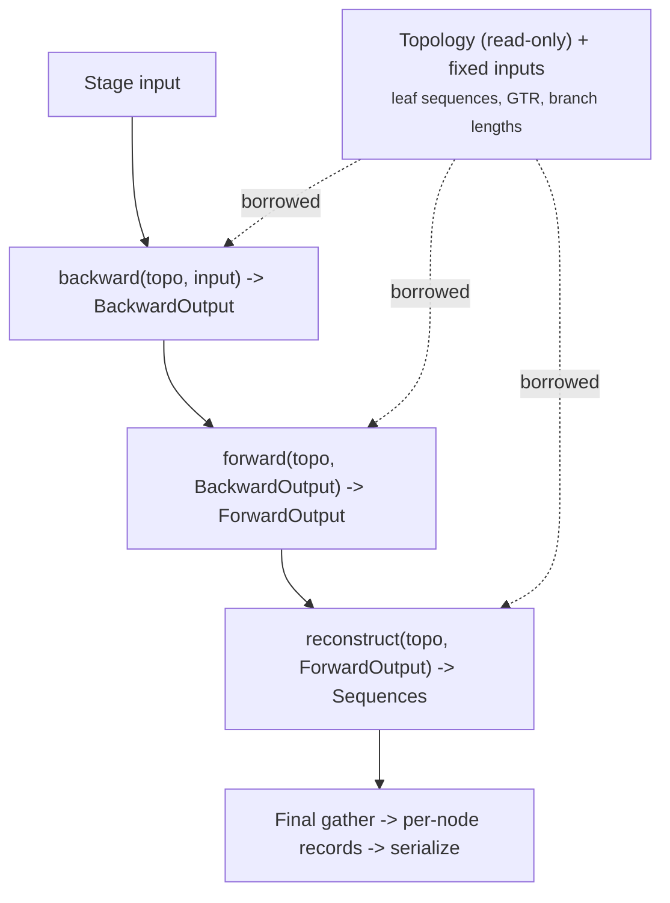

# Pure transform architecture for graph traversals

Replace the mutable-shared-state traversal model, where every node and edge payload lives behind `Arc<RwLock<>>` and inference passes mutate it in place, with a pure transform pipeline: each pass consumes typed input and produces typed output, `fn transform(input: &InputType) -> OutputType`, and the topology is a read-only substrate shared by every pass.

The proposal is **not accepted** and **not implemented**. It records the motivation, the current architecture as it stands after the work-first pass unification, the target design, the concurrency consequences per command, the prior art, and the migration path.

## Motivation

Every payload access today goes through `Arc<RwLock<>>`. Any code holding a `&Graph` can read or write any node or edge field at any time through `Arc::clone` plus `write_arc()`. This is the Rust equivalent of the reference implementation's monkey-patched node attributes <a id="cite-1a"></a>[Sagulenko et al. 2018](https://doi.org/10.1093/ve/vex042) [[1](#ref-1)]: the type system enforces that a field exists, not that a pass may touch it. The consequences are a locking cost on every access even in single-threaded passes, no compile-time guarantee that a pass reads only its inputs and writes only its outputs, and a payload type such as `struct NodeTimetree` [packages/treetime/src/payload/timetree.rs#L19](../../packages/treetime/src/payload/timetree.rs#L19) that accumulates the state of six unrelated inference stages behind `Option` fields populated at different times. Which fields are valid depends on which passes have run, and nothing in the type records that.

A pure transform model makes data flow explicit at the type level. Each pass declares what it reads and what it produces, the payload lock disappears where the data is immutable during a pass, and the transient scratch that inference writes stops being permanent state on the node.

## Current architecture

### Two data planes

Per-node and per-edge state lives in two disjoint places, and which one a command uses is not uniform.

The **graph payload plane** stores payloads inside the graph. `struct Graph<N, E, D>` [packages/treetime-graph/src/graph.rs#L32](../../packages/treetime-graph/src/graph.rs#L32) holds `nodes: Vec<Option<Arc<RwLock<Node<N>>>>>`, and each `struct Node<N>` [packages/treetime-graph/src/node.rs#L80](../../packages/treetime-graph/src/node.rs#L80) wraps its payload in a second `Arc<RwLock<N>>`, separate from the topology (the inbound and outbound edge-key lists). `struct Edge<E>` [packages/treetime-graph/src/edge.rs#L82](../../packages/treetime-graph/src/edge.rs#L82) follows the same pattern. The concrete payloads are `NodeAncestral`/`EdgeAncestral` [packages/treetime/src/payload/ancestral.rs#L16](../../packages/treetime/src/payload/ancestral.rs#L16), `NodeTimetree`/`EdgeTimetree` [packages/treetime/src/payload/timetree.rs#L19](../../packages/treetime/src/payload/timetree.rs#L19), and `NodeClock`/`EdgeClock` [packages/treetime/src/clock/clock_graph.rs#L15](../../packages/treetime/src/clock/clock_graph.rs#L15). Clock and timetree mutate these in place during traversal.

The **partition side-table plane** stores heavy scientific state outside the graph. `trait PartitionCompressed` [packages/treetime/src/partition/traits.rs#L228](../../packages/treetime/src/partition/traits.rs#L228) exposes `nodes: BTreeMap<GraphNodeKey, SparseNodePartition>` and `edges: BTreeMap<GraphEdgeKey, SparseEdgePartition>` keyed by graph key. Ancestral, marginal, and Fitch keep their profiles, messages, substitutions, and likelihood contributions here, and instantiate the graph as `Graph<N, E, ()>`, using it only for topology through `trait BranchTopology` [packages/treetime/src/partition/traits.rs#L50](../../packages/treetime/src/partition/traits.rs#L50). This plane is already the target architecture for the most performance-critical inference.

The graph-level `D` slot is a third, benign case: it is a late-bound result bundle (`TimetreeGraphData`, `AncestralGraphData`) assigned once by `map_data` at the end of a command, not a mutable store.

The two planes read each other bidirectionally. Marginal passes read branch lengths from graph edge payloads and write profiles and messages to partition maps. Branch-length optimization reads partition contributions and writes optimized lengths to graph edge payloads. Timetree inference reads partition data and writes distributions to graph edge payloads. Annotation reads partition substitutions and writes mutation strings to graph node payloads.

### Two traversal mechanisms

Serial traversals are the `iter_*` methods on the graph: `fn iter_depth_first_postorder_forward` and its pre-order and breadth-first siblings [packages/treetime-graph/src/graph_traverse.rs#L215](../../packages/treetime-graph/src/graph_traverse.rs#L215). They construct a `GraphNodeForward` [packages/treetime-graph/src/graph_traverse.rs#L15](../../packages/treetime-graph/src/graph_traverse.rs#L15) per node, acquiring write guards on the node payload and child-edge payloads, and mutate in place. These carry the light per-node metadata and output emission.

Parallel traversal runs through the work-first pass. `struct GraphPass` [packages/treetime-graph/src/pass.rs#L65](../../packages/treetime-graph/src/pass.rs#L65) extracts payloads into owned `GraphPassSlot` values [packages/treetime-graph/src/pass.rs#L73](../../packages/treetime-graph/src/pass.rs#L73), and `run_dependency_queue` [packages/treetime-graph/src/dependency_queue.rs#L8](../../packages/treetime-graph/src/dependency_queue.rs#L8) schedules them across a `rayon::scope` worker pool as their tree dependencies complete. A backward pass processes children before parents; a forward pass the reverse. Each node is scheduled once (its slot is taken from a `Mutex<Option<slot>>`), and a completed slot is published to its successors through a `OnceLock`. The payload `RwLock` is not held during this pass; the slot owns the data. The heavy inference already runs here: `fn marginal_process_backward_indexed` [packages/treetime/src/partition/marginal/shared/pass.rs#L15](../../packages/treetime/src/partition/marginal/shared/pass.rs#L15), Fitch, the timetree passes, and clock regression. A convenience wrapper `fn with_graph_payloads` [packages/treetime-graph/src/pass.rs#L14](../../packages/treetime-graph/src/pass.rs#L14) hoists graph payloads into maps, runs a pass, and writes them back.

A stale doc comment at [packages/treetime-graph/src/graph_traverse.rs#L263](../../packages/treetime-graph/src/graph_traverse.rs#L263) still refers to a removed `par_iter_breadth_first_forward`; parallelism now runs only through `GraphPass`.

### Topology mutations and the refinement loop

Reroot, polytomy resolution, and edge collapse restructure the graph between passes. `fn reparent_edge` [packages/treetime-graph/src/graph_ops.rs#L123](../../packages/treetime-graph/src/graph_ops.rs#L123) preserves the edge key; `fn collapse_edge` [packages/treetime-graph/src/graph_ops.rs#L214](../../packages/treetime-graph/src/graph_ops.rs#L214) removes nodes and edges. Node and edge keys are append-only and never reused: `fn add_node` [packages/treetime-graph/src/graph_ops.rs#L23](../../packages/treetime-graph/src/graph_ops.rs#L23) assigns `GraphNodeKey(self.nodes.len())`, and removal leaves a `None` hole rather than compacting. After a topology change, `fn reconcile_topology` [packages/treetime/src/partition/traits.rs#L330](../../packages/treetime/src/partition/traits.rs#L330) adds partition entries for new keys and drops entries for removed ones.

The timetree refinement loop [packages/treetime/src/timetree/pipeline.rs#L324](../../packages/treetime/src/timetree/pipeline.rs#L324) cycles marginal update, branch-length optimization, reroot, and time inference until convergence. Each step reads the previous step's mutations from the same shared structures.

## Target: a pure transform pipeline

The pipeline expresses inference as a chain of functions, each consuming the previous stage's output and producing the next, with intermediates created and dropped as they are consumed:



Three properties define the target.

**Intermediates are moved, not stored.** A stage returns a fresh keyed collection that the next stage consumes and drops. The `struct GraphPass` slot exists only to schedule this within one pass; between passes, state already flows through the partition maps. Today `fn update_marginal` [packages/treetime/src/ancestral/marginal.rs#L30](../../packages/treetime/src/ancestral/marginal.rs#L30) runs backward, then log-likelihood, then forward, carrying the intermediates through the mutable partition. Making each stage return its output removes the partition as a hidden carrier and turns each field into a value with exactly one producer.

**Move semantics keep purity free of a memory penalty.** A pass builds fresh outputs already: `slot.node.profile = DenseSeqDistribution { .. }` at [packages/treetime/src/partition/marginal/shared/pass.rs#L81](../../packages/treetime/src/partition/marginal/shared/pass.rs#L81) is a whole-value assignment, not an in-place accumulation. A transform pass that takes its input by value can reuse the input's buffers to hold the output, so purity at the function boundary does not force a second allocation. Local mutation of an owned, moved-in value is not shared mutation; it is what the current slot mutation should have been from the start, minus the shared scheduler-owned cell that aliases input and output.

**Fixed inputs are borrowed, not stored per pass, and gather happens once.** Topology, the GTR model, branch lengths, and node times are read by several stages. They are threaded as immutable `&` parameters so a signature states its true dependencies, rather than a stage silently reading `partition.gtr`. During computation each stage holds one input collection and builds one output; assembling a node's full record from its ancestral, time, and clock results is a single final pass before serialization, not a scatter across live per-concern tables.

The functional form is the algorithm's native shape. Marginal reconstruction is the sum-product algorithm on a tree <a id="cite-2a"></a>[Höhna et al. 2014](https://doi.org/10.1093/sysbio/syu039) [[2](#ref-2)], and Felsenstein pruning <a id="cite-3a"></a>[Felsenstein 1981](https://doi.org/10.1007/BF01734359) [[3](#ref-3)] computes each node's <a id="gloss-use-1"></a>conditional likelihood vector <sup>[1](#gloss-1)</sup> as a pure function of its children's:

$$L_u(s) = \prod_{c \,\in\, \mathrm{ch}(u)} \sum_{s'} P(s \to s' \mid t_{uc}) \, L_c(s')$$

where:

- $L_u(s)$ -- likelihood of the subtree below node $u$ given state $s$ at $u$
- $\mathrm{ch}(u)$ -- children of node $u$
- $P(s \to s' \mid t_{uc})$ -- substitution probability along the branch of length $t_{uc}$
- $t_{uc}$ -- branch length from $u$ to child $c$

The marginal two-pass, inside message up and outside message down, produces every node's posterior in the same form. No node needs to own its array; the array is the output of a function of topology, model, and children's arrays.

## Design dimensions

### D1: Topology and payload separation

Separate the immutable topology index (adjacency, keys, root and leaf sets) from mutable payload storage. Pre-compute a static adjacency structure once per topology epoch so traversals consult it directly instead of locking nodes to read edge keys. Topology mutations produce a new index; payload storage is re-indexed to match. `trait BranchTopology` is the existing read-only view; the partition plane already relies on it.

### D2: Payload mutability model

Replace `Arc<RwLock<N>>` interior mutability with either a transform pass (callback receives `&InputPayload`, returns `OutputPayload`, engine collects outputs into a new store) or exclusive ownership (engine moves payloads out, hands them to the callback as owned values, collects them back). `GraphPass` already implements the exclusive-ownership variant within a pass. The remaining work is to make the callback return its output rather than mutate a slot, so input and output stop aliasing.

### D3: Traversal callback signature

Current callbacks carry write guards on the current node and neighbor edges. The transform signature reads immutable references and returns a value:

```rust
Fn(TraversalContext<'_>) -> NodeOutput

struct TraversalContext<'a> {
    key: GraphNodeKey,
    is_root: bool,
    is_leaf: bool,
    node: &'a NodeInput,
    parent_edges: &'a [(GraphNodeKey, &'a EdgeInput)],
    child_outputs: &'a [(GraphNodeKey, &'a NodeOutput)],  // backward pass: children already computed
}
```

### D4: Pipeline type staging

Today one `NodeTimetree` type spans all passes with `Option` fields populated at different stages. Distinct types per stage, `FitchBackwardOutput -> FitchForwardOutput -> MarginalBackwardOutput -> MarginalForwardOutput`, give each type exactly the fields that stage produces and a compile-time guarantee that downstream code cannot read a field an upstream pass has not written.

### D5: Partition storage layout

`BTreeMap<GraphNodeKey, _>` costs $O(\log n)$ per access. A dense `Vec` indexed by `GraphNodeKey.as_usize()` gives $O(1)$ lookup and cache-friendly sequential access, with empty slots for absent nodes, matching the graph's `Vec<Option<>>`. A per-field <a id="gloss-use-2"></a>structure-of-arrays <sup>[2](#gloss-2)</sup> layout suits vectorizable kernels. This is the layout the fastest engines use (see Prior art).

### D6: Parallel passes without payload locks

A transform pass where each node produces output from immutable input is lock-free by construction: the engine writes outputs to slots indexed by key, and nodes at the same dependency frontier write to disjoint slots. The dependency queue already provides the frontier scheduling; the change is that its slots stop being read-modify-write cells and become write-once output cells.

### D7: Dual-plane unification

Two mutable stores per node (graph payload plus partition map) could unify into one per-stage composite type, or stay separate with an explicit typed handoff. Separation preserves multiple partitions per graph (multi-gene analysis), where each partition owns its per-node data but shares graph-level topology. A middle ground keeps graph-level data as one typed layer and partition data as another, with interface types for cross-plane reads.

### D8: Topology mutation strategy

Topology mutations cannot produce new output from old input without touching structure. Because keys are append-only and never reused, a mutation is a delta on a keyed collection, not a remap: reroot and polytomy resolution only add keys, collapse only removes them. An epoch-based scheme fits: a mutation produces a new topology index plus the set of added and removed keys, payload stores extend and prune accordingly, and traversal passes within an epoch operate on an immutable topology. Topology changes are infrequent (once per refinement iteration); passes are frequent.

## Concurrency and parallelism

Parallel traversal is a core requirement of the inference commands, not an optional optimization, and the transform model preserves it. The system runs two distinct kinds of parallelism, and in both the payload lock is incidental.

The first kind is the **tree wavefront** behind `GraphPass`: children before parents, scheduled by `run_dependency_queue` over the rayon pool. Marginal, Fitch, clock regression, and the timetree passes use it.

The second kind is **independent map or reduce** through `par_iter` over elements with no tree dependency: edges in branch-length optimization `fn optimize` [packages/treetime/src/optimize/dispatch.rs#L94](../../packages/treetime/src/optimize/dispatch.rs#L94), candidate roots in `fn find_best_root` [packages/treetime/src/clock/find_best_root/find_best_root.rs#L63](../../packages/treetime/src/clock/find_best_root/find_best_root.rs#L63), per-edge time and clock-length updates in `fn` runner passes [packages/treetime/src/timetree/inference/runner.rs#L124](../../packages/treetime/src/timetree/inference/runner.rs#L124), partitions in `fn graph_log_lh` [packages/treetime/src/partition/traits.rs#L365](../../packages/treetime/src/partition/traits.rs#L365), and leaves in Fitch initialization [packages/treetime/src/ancestral/fitch.rs#L72](../../packages/treetime/src/ancestral/fitch.rs#L72).

In every parallel site, each worker reads immutable shared or prior-phase data and writes its own element. No two workers write the same cell; cross-element reads, such as an edge worker reading its two endpoint node times at [packages/treetime/src/timetree/inference/runner.rs#L124](../../packages/treetime/src/timetree/inference/runner.rs#L124), are of a frozen prior phase. No parallel loop writes into a shared accumulator: reductions use lock-free `collect` and `sum`, and `fn` Fitch leaf setup [packages/treetime/src/ancestral/fitch.rs#L96](../../packages/treetime/src/ancestral/fitch.rs#L96) already builds a fresh `BTreeMap` with `par_iter().map(..).collect()` before extending the partition. The `Arc<RwLock<>>` exists only to write results back into the shared graph payload.

Therefore the transform model removes the payload locks while keeping the parallelism. Independent maps become `par_iter().map(|e| compute(e, &immutable)).collect()` into a fresh table, applied in one serial commit; the read and write guards vanish. The wavefront keeps its scheduler, because the channel and atomics encode the real parent-needs-children dependency, but that is a write-once publication barrier, not a per-node `RwLock`, and the immutable inputs a pass reads (topology, GTR, branch lengths) become `&` borrows.

Per command:

- **ancestral and mugration**: wavefront for the marginal and Fitch passes, independent maps for leaf setup and GTR counts. Lock-free passes; GTR and branch lengths borrowed; per-node outputs in write-once cells.
- **clock**: regression is a wavefront reduction (child clock sets into parent); root search and clock filter are read-only independent maps whose result collections carry no locks.
- **timetree**: nested. The outer refinement loop is serial; inside it, the marginal passes are wavefront, three per-edge runner updates and the per-partition work are independent maps, and polytomy and reroot are serial topology mutations. This command holds the most incidental locks and gains the most.
- **optimize**: independent per-edge branch-length and indel optimization; the iterative loop and the collapse and polytomy steps are serial.
- **prune**: mostly serial topology mutation with a wavefront marginal pass.

Two synchronization concerns are genuine rather than incidental. Topology-mutating stages (collapse, reroot, polytomy, and the new commit step) restructure shared state and stay serial; they are cheap relative to the numeric passes. And nested parallelism (partitions times wavefront times per-edge) can oversubscribe the global rayon pool. This exists today; `dev/bench-graph-pass-cli` sweeps thread counts and compares outputs, so it is the place to measure rather than guess.

## Prior art

The recurring architecture in high-performance phylogenetics engines separates a lightweight topology index from per-node numeric data held in an index-addressed buffer pool. The Phylogenetic Likelihood Library stores conditional likelihood vectors, transition matrices, and scaling buffers in arrays owned by the partition object, while the tree nodes carry only integer handles (`clv_index`, `pmatrix_index`, `scaler_index`) <a id="cite-4a"></a>[Flouri et al. 2015](https://doi.org/10.1093/sysbio/syu084) [[4](#ref-4)]. RAxML-NG builds on that library and reuses stored vectors across branch-length trials and rerootings by recomputing only the vectors on the changed path <a id="cite-5a"></a>[Kozlov et al. 2019](https://doi.org/10.1093/bioinformatics/btz305) [[5](#ref-5)]. BEAGLE goes further and has no tree data structure at all: the client issues an ordered sequence of operations over integer-indexed partial-likelihood buffers <a id="cite-6a"></a>[Ayres et al. 2019](https://doi.org/10.1093/sysbio/syz020) [[6](#ref-6)]. IQ-TREE attaches partial-likelihood vectors to directed edges drawn from a central pool, which maps onto marginal up-and-down messages where each direction of an edge carries one message <a id="cite-7a"></a>[Nguyen et al. 2015](https://doi.org/10.1093/molbev/msu300) [[7](#ref-7)]. Storing per-node numeric data inside fat node objects is the scripting-tier pattern; the reference implementation decorates tree nodes with attributes mutated during traversal and documents that they must be updated after every topology change <a id="cite-1b"></a>[Sagulenko et al. 2018](https://doi.org/10.1093/ve/vex042) [[1](#ref-1)], which is the temporal-coupling hazard this redesign removes.

The Rust ecosystem uses the same topology-core-plus-side-table pattern outside phylogenetics. petgraph stores weights inline but exposes an integer `NodeIndex`, and the idiomatic external-data pattern keeps per-node data in a parallel structure indexed by that key [[doc](https://docs.rs/petgraph/latest/petgraph/graph/struct.NodeIndex.html)]. The Rust compiler mints typed indices with `newtype_index!` and keeps computed data in parallel `IndexVec` side tables [[doc](https://doc.rust-lang.org/nightly/nightly-rustc/rustc_index/macro.newtype_index.html)], and rust-analyzer pairs an `Arena<T>` of elements with an `ArenaMap` of computed data keyed by the same handle [[doc](https://rust-lang.github.io/rust-analyzer/la_arena/struct.ArenaMap.html)]. The entity-component-system argument (separate component arrays, systems as functions over them) supports the transform passes and structure-of-arrays storage, but an archetypal engine is the wrong literal fit for a low-cardinality, heterogeneous, order-sensitive tree; take the storage idea, not the engine.

Two library-level pitfalls transfer. Index stability: a keyed side table desynchronizes if the container compacts indices on removal; the graph avoids this by leaving holes, so the pattern is safe here. Liveness: reusing a slot for a new value while a stale key still points at it is the ABA hazard that generational-index crates solve, and it is a concern only for the delete-and-re-add paths (prune, optimize), not the build-once, read-many inference tree.

## Impact

The change touches the `treetime-graph` crate (`struct Graph`, `Node`, `Edge`, the traversal methods, and the pass API), the `treetime` crate (partition types, payload types, and the traversal callbacks in every command), and the test code that constructs graphs or uses traversal callbacks.

The benefits are that data flow becomes visible in types, payload locks disappear where data is immutable during a pass, independent parallel maps and the wavefront both lose their incidental locks, pipeline staging catches read-before-write at compile time, and dense keyed storage improves cache locality over `BTreeMap`.

The costs are a large refactor across every command and its tests, a commit step that applies collected results where workers previously wrote live, and more types from pipeline staging (mitigated by type aliases for common combinations). The risks are that incremental migration is awkward because the traversal API is pervasive, that output allocation could dominate for the largest datasets (unlikely given whole-value assignment already occurs, but it needs measurement), and that the locking overhead may not be a real bottleneck until profiled.

## Migration and validation plan

Profile first, on the largest datasets (`sc2/4500`, `dengue/2000`), to quantify the lock and `BTreeMap` costs with `dev/bench-graph-pass-cli`, which already sweeps thread counts and diffs outputs. Prototype D1 and D5 in isolation, since a dense keyed store and a pre-computed adjacency index are independently valuable and measurable. Prototype D3 on one pass (marginal backward) to validate the transform ergonomics.

Migrate command by command behind a behavior-preserving guardrail rather than in one cut. The existing safety net supports this: a reference-differential test `fn test_python_parity` and golden-master tests pin current behavior, per-dataset integration tests and smoke tests exercise the commands, and the graph-pass benchmark checks output equivalence across thread counts. The dominant risk in a numerical refactor is float determinism, so pin a fixed traversal order and the project's tolerance (a numerical divergence above $10^{-6}$ is a defect) in every comparison. Keep the `Arc<RwLock>` graph alive until the last in-place consumer of a command is migrated, then remove the payload locks. Timetree is the highest-value target because it holds the most incidental locks across its wavefront passes and per-edge maps.

This refactor is behavior-preserving by definition; it changes no science and no reference parity. Any observed divergence from current output is a defect until the team decides otherwise.

## Open questions

- Index scheme for messages: keying per node versus per directed edge. Marginal up-and-down messages fit per-directed-edge storage, as IQ-TREE does; deciding this precedes moving the message buffers.
- Buffer reuse across rerooting and optimization: a persistent index-addressed pool that recomputes only the changed path (as libpll and IQ-TREE do) versus allocate-fresh per pass. The engines all chose persistent pools for selective recompute.
- Scope of D7: whether to unify the two planes into one per-stage type or keep them separate with a typed handoff, given multi-partition analysis needs per-partition data over shared topology.

## Related documents

- [kb/decisions/graph-based-phylogenetic-representation.md](../decisions/graph-based-phylogenetic-representation.md) -- the current `Graph<N, E, D>` design, `Arc<RwLock<>>` storage, and DAG-support rationale
- [kb/decisions/partition-system-architecture.md](../decisions/partition-system-architecture.md) -- separation of topology from per-partition state and trait-based dispatch
- [kb/decisions/sequence-representation-dense-sparse.md](../decisions/sequence-representation-dense-sparse.md) -- dense and sparse duality and trait-object interchangeability
- [kb/algo/graph.md](../algo/graph.md) -- traversal algorithms, path finding, edge contraction
- [kb/issues/H-core-command-module-shared-ops-entanglement.md](../issues/H-core-command-module-shared-ops-entanglement.md) -- cross-command coupling that cleaner data flow would reduce
- [kb/issues/N-representation-dense-sparse-partition-asymmetry.md](../issues/N-representation-dense-sparse-partition-asymmetry.md) -- partition type asymmetries a unified transform pipeline could resolve
- [kb/issues/N-ancestral-sparse-remove-insert-pattern.md](../issues/N-ancestral-sparse-remove-insert-pattern.md) -- in-place mutation in sparse passes that a transform model would replace
- [kb/proposals/optimize-convergence-and-robustness.md](optimize-convergence-and-robustness.md) -- the refinement loop where graph and partition data flow bidirectionally
- [kb/proposals/parallelize-multi-partition-marginal-reconstruction.md](parallelize-multi-partition-marginal-reconstruction.md) -- multi-partition parallelism, relevant to the nested-parallelism concern

## Glossary

1. <a id="gloss-1"></a> **Conditional likelihood vector (CLV).** Per site and per node, the probability of the observed data in that node's subtree given each possible ancestral state; the array that Felsenstein pruning computes and that high-performance engines store in indexed buffer pools ([Felsenstein 1981](https://doi.org/10.1007/BF01734359) [[3](#ref-3)]). [↩](#gloss-use-1)
2. <a id="gloss-2"></a> **Structure-of-arrays (SoA).** A memory layout that stores each field of a record in its own contiguous array, rather than storing whole records contiguously, so a pass touching one field reads it with a sequential, vectorizable access pattern. [↩](#gloss-use-2)

## References

1. <a id="ref-1"></a> Sagulenko, Pavel, Vadim Puller, and Richard A. Neher. 2018. "TreeTime: Maximum-Likelihood Phylodynamic Analysis." _Virus Evolution_ 4(1):vex042. https://doi.org/10.1093/ve/vex042 [↩¹](#cite-1a) [↩²](#cite-1b)
2. <a id="ref-2"></a> Höhna, Sebastian, et al. 2014. "Probabilistic Graphical Model Representation in Phylogenetics." _Systematic Biology_ 63(5):753-771. https://doi.org/10.1093/sysbio/syu039 [↩](#cite-2a)
3. <a id="ref-3"></a> Felsenstein, Joseph. 1981. "Evolutionary Trees from DNA Sequences: A Maximum Likelihood Approach." _Journal of Molecular Evolution_ 17:368-376. https://doi.org/10.1007/BF01734359 [↩](#cite-3a)
4. <a id="ref-4"></a> Flouri, Tomáš, et al. 2015. "The Phylogenetic Likelihood Library." _Systematic Biology_ 64(2):356-362. https://doi.org/10.1093/sysbio/syu084 [↩](#cite-4a)
5. <a id="ref-5"></a> Kozlov, Alexey M., et al. 2019. "RAxML-NG: A Fast, Scalable and User-Friendly Tool for Maximum Likelihood Phylogenetic Inference." _Bioinformatics_ 35(21):4453-4455. https://doi.org/10.1093/bioinformatics/btz305 [↩](#cite-5a)
6. <a id="ref-6"></a> Ayres, Daniel L., et al. 2019. "BEAGLE 3: Improved Performance, Scaling, and Usability for a High-Performance Computing Library for Statistical Phylogenetics." _Systematic Biology_ 68(6):1052-1061. https://doi.org/10.1093/sysbio/syz020 [↩](#cite-6a)
7. <a id="ref-7"></a> Nguyen, Lam-Tung, et al. 2015. "IQ-TREE: A Fast and Effective Stochastic Algorithm for Estimating Maximum-Likelihood Phylogenies." _Molecular Biology and Evolution_ 32(1):268-274. https://doi.org/10.1093/molbev/msu300 [↩](#cite-7a)
