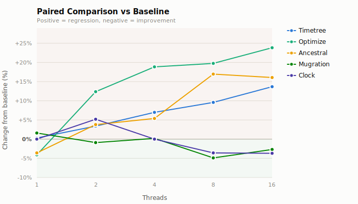
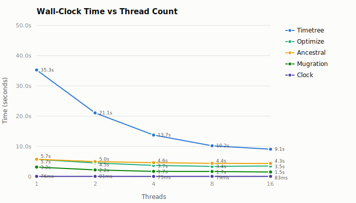
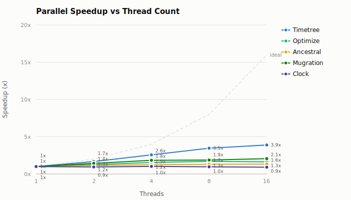
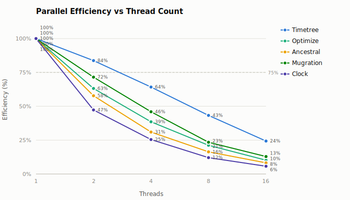
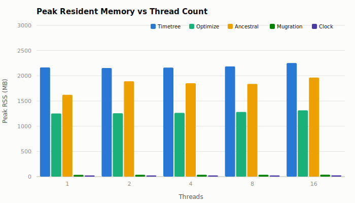
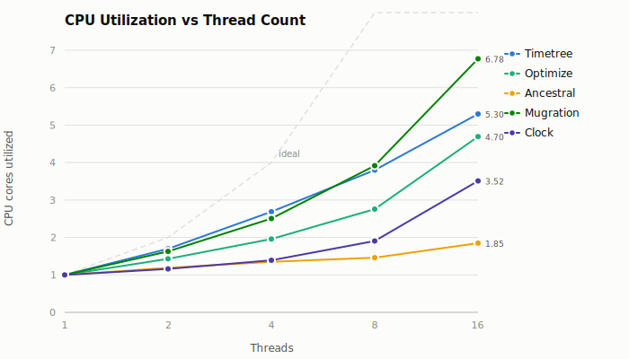

# Informative Fitch Positions: mpox-2000

**Baseline:** `e0601306b492bc425eac29c553cae24d37cc378a`
**Changed:** `46e60670345c0f7bedff3289b2b27f384ff6f12f`
**Dataset:** `data/mpox/clade-ii/2000`
**Threads:** 1, 2, 4, 8, 16
**Runs:** 3 measured + 1 warmup per configuration

## Verdict

Precomputing informative Fitch positions reduces single-threaded work, improving `ancestral` by 3.6% and `optimize` by 4.1% at one thread. It also introduces a serial pass before the parallel tree traversal. The changed implementation becomes slower as thread count increases: `ancestral` regresses by 3.8% at 2 threads and 16–17% at 8–16 threads. The regression propagates to `optimize` and `timetree`, reaching 23.9% and 13.7%, respectively, at 16 threads.

The change does not meet its performance objective on this dataset. Its one-thread reduction in total work is outweighed by reduced parallel scaling.

### Paired comparison

| Workload      | 1 thread | 2 threads | 4 threads | 8 threads | 16 threads |
| ------------- | -------: | --------: | --------: | --------: | ---------: |
| **Ancestral** |    -3.6% |     +3.8% |     +5.4% |    +17.0% |     +16.1% |
| **Optimize**  |    -4.1% |    +12.4% |    +18.9% |    +19.8% |     +23.9% |
| **Timetree**  |    +0.3% |     +3.4% |     +7.0% |     +9.6% |     +13.7% |
| **Mugration** |    +1.6% |     -0.9% |     +0.2% |     -4.9% |      -2.7% |
| **Clock**     |    +0.0% |     +5.2% |     +0.0% |     -3.6% |      -3.7% |

Positive values are regressions. `mugration` and `clock` do not use the changed Fitch path and serve as controls; their small, non-monotonic differences indicate ordinary host variation rather than a systematic change.

## Methodology

Exact release binaries for the baseline and changed commits were built in Docker and benchmarked on the host with `dev/bench-graph-pass-cli`. Each of five CLI subcommands ran at thread counts 1, 2, 4, 8, and 16 using [hyperfine](https://github.com/sharkdp/hyperfine), with 3 measured runs after 1 warmup. Peak RSS was captured separately with `/usr/bin/time`.

The `ancestral` 2-thread and 8-thread wall times use a confirmation run with 7 measurements after 3 warmups. The corresponding 4-thread and 16-thread confirmation samples exceeded the variance acceptance criterion, so those cells retain the complete primary matrix measurements. Peak RSS and CPU utilization come from the primary matrix for every configuration.

The binaries were verified before measurement:

- baseline SHA-256: `776c0a563c54f559ca7bb7fa7baaec136193d7cf17faeb70465dd4b7194d2e70`
- changed SHA-256: `8609a1aa7b55bcd5ca929f6763bd5e9e4479c05d0a1cb4de1287a79a5d62c550`

### Workloads

| Subcommand    | Description                                | Key parameters                        |
| ------------- | ------------------------------------------ | ------------------------------------- |
| **ancestral** | Marginal ancestral sequence reconstruction | `--method-anc=marginal --dense=false` |
| **mugration** | Discrete trait reconstruction (country)    | `--attribute=country --pc=1.0`        |
| **clock**     | Molecular clock inference                  | default                               |
| **optimize**  | Branch length optimization                 | `--dense=false`                       |
| **timetree**  | Full time-scaled phylogeny                 | all output formats                    |

## Results

The tables and charts below show the changed implementation's absolute scaling. The paired comparison above is the appropriate measure of the change's effect.

### Wall-clock time

| Workload      | 1 thread | 2 threads | 4 threads | 8 threads | 16 threads |
| ------------- | -------: | --------: | --------: | --------: | ---------: |
| **Timetree**  | 35.259 s |  21.057 s |  13.734 s |  10.185 s |    9.064 s |
| **Optimize**  |  5.711 s |   4.520 s |   3.704 s |   3.367 s |    3.499 s |
| **Ancestral** |  5.728 s |   4.956 s |   4.622 s |   4.377 s |    4.341 s |
| **Mugration** |  3.163 s |   2.211 s |   1.721 s |   1.687 s |    1.534 s |
| **Clock**     |  76.3 ms |   80.6 ms |   74.9 ms |   78.9 ms |    83.5 ms |

### Speedup

| Workload      | 1 thread | 2 threads | 4 threads | 8 threads | 16 threads |
| ------------- | -------: | --------: | --------: | --------: | ---------: |
| **Timetree**  |    1.00x |     1.67x |     2.57x |     3.46x |      3.89x |
| **Optimize**  |    1.00x |     1.26x |     1.54x |     1.70x |      1.63x |
| **Ancestral** |    1.00x |     1.16x |     1.24x |     1.31x |      1.32x |
| **Mugration** |    1.00x |     1.43x |     1.84x |     1.87x |      2.06x |
| **Clock**     |    1.00x |     0.95x |     1.02x |     0.97x |      0.91x |

### Parallel efficiency

Efficiency = speedup / thread count.

| Workload      | 1 thread | 2 threads | 4 threads | 8 threads | 16 threads |
| ------------- | -------: | --------: | --------: | --------: | ---------: |
| **Timetree**  |     100% |       84% |       64% |       43% |        24% |
| **Optimize**  |     100% |       63% |       39% |       21% |        10% |
| **Ancestral** |     100% |       58% |       31% |       16% |         8% |
| **Mugration** |     100% |       72% |       46% |       23% |        13% |
| **Clock**     |     100% |       47% |       25% |       12% |         6% |

### Peak resident memory

| Workload      | 1 thread | 2 threads | 4 threads | 8 threads | 16 threads |
| ------------- | -------: | --------: | --------: | --------: | ---------: |
| **Timetree**  |  2165 MB |   2155 MB |   2163 MB |   2186 MB |    2253 MB |
| **Optimize**  |  1252 MB |   1257 MB |   1265 MB |   1282 MB |    1315 MB |
| **Ancestral** |  1623 MB |   1892 MB |   1853 MB |   1839 MB |    1964 MB |
| **Mugration** |    35 MB |     36 MB |     36 MB |     36 MB |      38 MB |
| **Clock**     |    23 MB |     24 MB |     23 MB |     23 MB |      26 MB |

### CPU utilization

User + system time / wall-clock time. Values above 1.0 indicate parallel CPU use.

| Workload      | 1 thread | 2 threads | 4 threads | 8 threads | 16 threads |
| ------------- | -------: | --------: | --------: | --------: | ---------: |
| **Timetree**  |     1.00 |      1.70 |      2.69 |      3.80 |       5.30 |
| **Optimize**  |     1.00 |      1.43 |      1.96 |      2.76 |       4.70 |
| **Ancestral** |     1.00 |      1.19 |      1.35 |      1.46 |       1.85 |
| **Mugration** |     1.00 |      1.63 |      2.51 |      3.92 |       6.78 |
| **Clock**     |     1.00 |      1.16 |      1.39 |      1.91 |       3.52 |

## Output equivalence

`ancestral`, `mugration`, `optimize`, and `timetree` produced byte-identical output between the baseline and changed binaries at 1 and 16 threads. `clock` output differed at 16 threads both between binaries and between thread counts within each binary; this existing thread-dependent behavior is unrelated to the Fitch change.

## Analysis

The changed implementation moves site classification into the serial construction of [`FitchSiteIndex`](../../../packages/treetime/src/ancestral/fitch.rs#L34). Its nested leaf-by-site scan runs before the parallel backward traversal ([`fitch.rs#L55`](../../../packages/treetime/src/ancestral/fitch.rs#L55)), while the traversal subsequently restricts its recurrence to the resulting informative positions ([`fitch.rs#L262`](../../../packages/treetime/src/ancestral/fitch.rs#L262)).

This trade changes where work occurs:

- At one thread, skipping non-informative positions in the recurrence reduces elapsed time.
- At higher thread counts, the serial classification pass limits the fraction of the workload available to Rayon. Changed `ancestral` CPU utilization reaches only 1.85 cores at 16 threads, and its speedup plateaus at 1.32x.
- `optimize` invokes ancestral reconstruction and shows the same amplified regression. `timetree` contains more independently parallel work, so the regression is smaller but still increases monotonically with thread count.

The implementation needs a parallel site-classification strategy, or a representation that derives informative positions without adding a serial full-alignment pass, before the optimization is performance-positive across supported thread counts.
