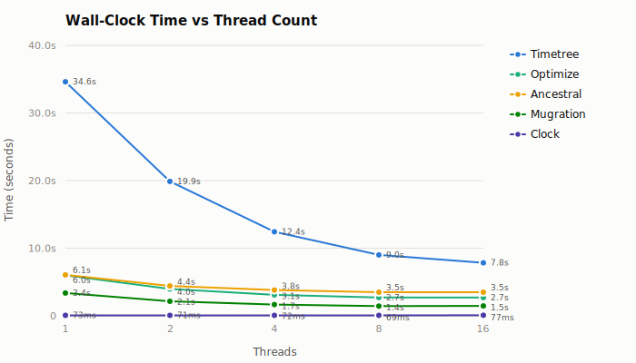
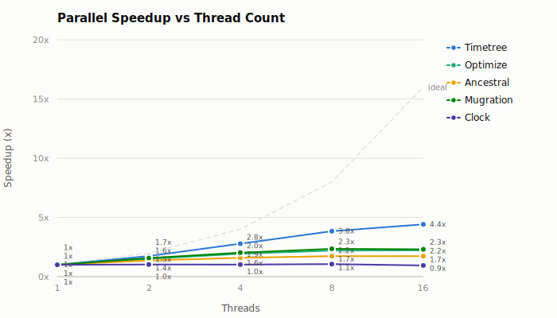
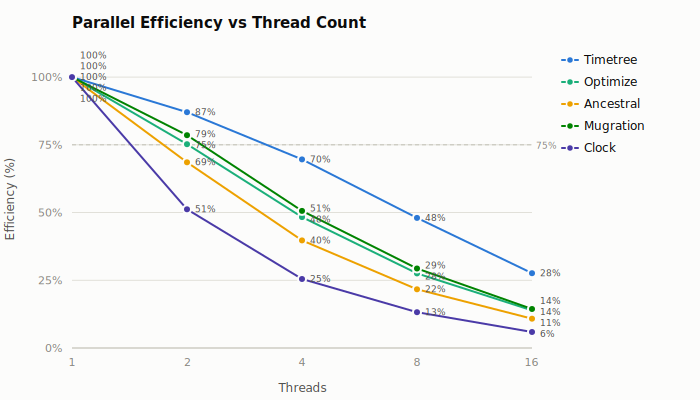
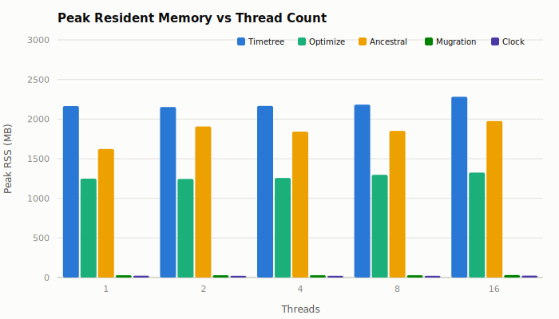

# Parallel Sparse Leaf Setup: mpox-2000

**Verdict:** parallel leaf construction materially improves multi-threaded sparse ancestral reconstruction, but the implementation does not fully meet the validation criterion of lower multi-thread wall time without a one-thread regression: `-j 1` regressed by 5.7%. At 2–16 threads, ancestral wall time improves by 12.9–21.2%. The affected outputs are byte-identical.

- **Baseline:** `7e2a4e4b29322eba4a06d9a72fa0e3a5766f997d`
- **Changed:** `ac1632682aa0e3c8444dc173d0112ded32491e91`
- **Dataset:** `data/mpox/clade-ii/2000`
- **Threads:** 1, 2, 4, 8, 16
- **Runs:** 3 measured + 1 warmup per binary and configuration

## Result

### Ancestral before and after

| Threads | Baseline | Changed | Wall-time change | Changed speedup | Changed CPU use | Changed peak RSS |
| ------: | -------: | ------: | ---------------: | --------------: | --------------: | ---------------: |
|       1 |  5.732 s | 6.057 s |            +5.7% |           1.00x |            1.00 |          1623 MB |
|       2 |  5.072 s | 4.419 s |           -12.9% |           1.37x |            1.33 |          1907 MB |
|       4 |  4.564 s | 3.814 s |           -16.4% |           1.59x |            1.62 |          1843 MB |
|       8 |  4.372 s | 3.494 s |           -20.1% |           1.73x |            1.87 |          1852 MB |
|      16 |  4.439 s | 3.496 s |           -21.2% |           1.73x |            2.47 |          1976 MB |

The changed binary reaches its minimum at 8 threads. Sixteen threads add CPU work without reducing mean wall time, so 8 threads remains the useful limit for standalone ancestral reconstruction on this dataset.

### Effect on all benchmarked commands

Negative values are improvements. Optimize and timetree call sparse ancestral reconstruction and inherit the change; mugration and clock are unaffected controls.

| Workload      | 1 thread | 2 threads | 4 threads | 8 threads | 16 threads |
| ------------- | -------: | --------: | --------: | --------: | ---------: |
| **Ancestral** |    +5.7% |    -12.9% |    -16.4% |    -20.1% |     -21.2% |
| **Optimize**  |    -0.5% |    -11.3% |    -21.1% |    -25.4% |     -26.3% |
| **Timetree**  |    +0.2% |     -2.6% |     -7.3% |    -10.5% |     -12.3% |
| **Mugration** |    +5.2% |     -0.0% |     +2.5% |     +1.1% |     -17.4% |
| **Clock**     |    +2.7% |     +0.4% |     +4.1% |     -3.3% |      +4.1% |

The mugration and clock fluctuations do not form a thread-dependent trend. Mugration's isolated 16-thread difference is paired with high baseline variance (standard deviation 0.226 s on a 1.770 s mean), so it is not evidence of an effect from code that mugration does not execute.

## Changed-binary scaling

### Wall-clock time

| Workload      | 1 thread | 2 threads | 4 threads | 8 threads | 16 threads |
| ------------- | -------: | --------: | --------: | --------: | ---------: |
| **Timetree**  | 34.611 s |  19.885 s |  12.428 s |   9.011 s |    7.834 s |
| **Optimize**  |  5.982 s |   3.975 s |   3.094 s |   2.715 s |    2.696 s |
| **Ancestral** |  6.057 s |   4.419 s |   3.814 s |   3.494 s |    3.496 s |
| **Mugration** |  3.371 s |   2.146 s |   1.665 s |   1.437 s |    1.462 s |
| **Clock**     |  73.0 ms |   71.3 ms |   71.6 ms |   69.0 ms |    77.0 ms |

### Speedup

| Workload      | 1 thread | 2 threads | 4 threads | 8 threads | 16 threads |
| ------------- | -------: | --------: | --------: | --------: | ---------: |
| **Timetree**  |    1.00x |     1.74x |     2.78x |     3.84x |      4.42x |
| **Optimize**  |    1.00x |     1.50x |     1.93x |     2.20x |      2.22x |
| **Ancestral** |    1.00x |     1.37x |     1.59x |     1.73x |      1.73x |
| **Mugration** |    1.00x |     1.57x |     2.02x |     2.35x |      2.31x |
| **Clock**     |    1.00x |     1.02x |     1.02x |     1.06x |      0.95x |

### Parallel efficiency

| Workload      | 1 thread | 2 threads | 4 threads | 8 threads | 16 threads |
| ------------- | -------: | --------: | --------: | --------: | ---------: |
| **Timetree**  |     100% |       87% |       70% |       48% |        28% |
| **Optimize**  |     100% |       75% |       48% |       28% |        14% |
| **Ancestral** |     100% |       69% |       40% |       22% |        11% |
| **Mugration** |     100% |       79% |       51% |       29% |        14% |
| **Clock**     |     100% |       51% |       25% |       13% |         6% |

### Peak resident memory

| Workload      | 1 thread | 2 threads | 4 threads | 8 threads | 16 threads |
| ------------- | -------: | --------: | --------: | --------: | ---------: |
| **Timetree**  |  2164 MB |   2152 MB |   2167 MB |   2182 MB |    2282 MB |
| **Optimize**  |  1248 MB |   1245 MB |   1257 MB |   1297 MB |    1325 MB |
| **Ancestral** |  1623 MB |   1907 MB |   1843 MB |   1852 MB |    1976 MB |
| **Mugration** |    29 MB |     29 MB |     29 MB |     30 MB |      31 MB |
| **Clock**     |    23 MB |     22 MB |     22 MB |     22 MB |      24 MB |

Ancestral peak RSS is within 55 MB of baseline at 1, 4, 8, and 16 threads. The changed 2-thread run is 109 MB higher; peak RSS is a separate single run, and the non-monotonic series does not show persistent memory growth from the parallel collection.

## Output equivalence

Ancestral, optimize, timetree, and mugration outputs are byte-identical:

- between baseline and changed binaries at 1 and 16 threads;
- between 1 and 16 threads within each binary.

Clock is identical between binaries at one thread. Its 16-thread output differs both between binaries and between thread counts within each binary. Because the baseline shows the same thread-dependent behavior and the changed code is outside clock, this is an existing clock determinism issue rather than a result of sparse leaf construction.

## Methodology

`dev/bench-graph-pass-cli` alternated two release binaries in each hyperfine configuration. Each binary received one warmup and three measured runs at 1, 2, 4, 8, and 16 threads. Peak RSS was measured separately with `/usr/bin/time`; output directories were compared after the timing runs.

| Binary   | Commit                                     | SHA-256                                                            |
| -------- | ------------------------------------------ | ------------------------------------------------------------------ |
| Baseline | `7e2a4e4b29322eba4a06d9a72fa0e3a5766f997d` | `02c0167c255f83ffd3a1fa6194b418320c0cdfe0c228cf9fa5e978c2e0561ada` |
| Changed  | `ac1632682aa0e3c8444dc173d0112ded32491e91` | `9f4a35d3f4c4ac659ca1995a0b55d32b93634d37a63f3aecc06c34c93afc7a11` |

The workload definitions and dataset are identical to [mpox-2000.md](mpox-2000.md). The charts show the changed binary only; the before/after tables use the direct paired benchmark results.
