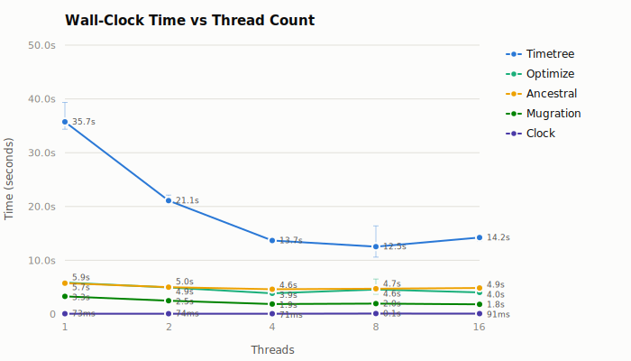
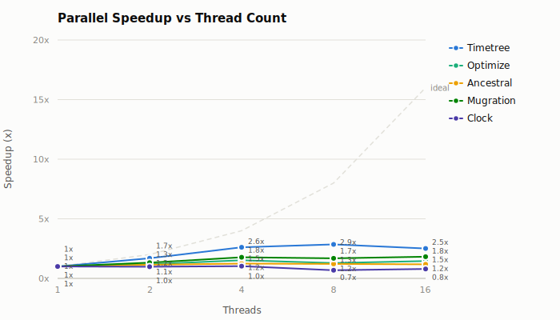
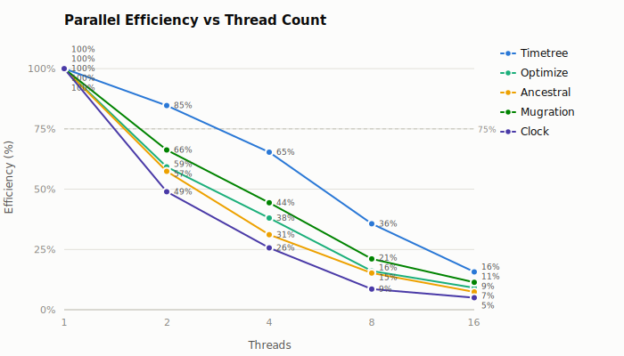
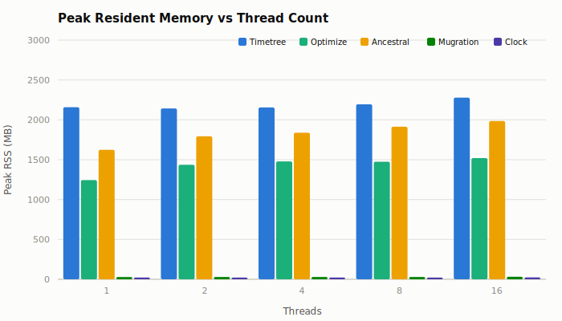

# Parallel Scaling: mpox-2000-zstd

**Commit:** `7e8a78ca6d068dafba5f31946cc25becde0217ec`
**Dataset:** `data/mpox/clade-ii/2000`
**Alignment:** `data/mpox/clade-ii/2000/aln.fasta.zst`
**Compression:** zstd level 1 (fast-compression preset), 24,910,268 bytes
**Threads:** 1, 2, 4, 8, 16
**Runs:** 3 measured + 1 warmup per configuration

## Methodology

A single release binary was benchmarked across five CLI subcommands at thread counts 1, 2, 4, 8, 16 using [hyperfine](https://github.com/sharkdp/hyperfine) (3 measured runs, 1 warmup). Peak RSS was captured separately via `/usr/bin/time`. The benchmark harness (`dev/bench-graph-pass-cli`) ran each workload twice per configuration; results are the mean of both runs. The two harness binary slots contained the same executable, with SHA-256 `02c0167c255f83ffd3a1fa6194b418320c0cdfe0c228cf9fa5e978c2e0561ada`.

The source alignment was recompressed with `xz -dc aln.fasta.xz | zstd -1 > aln.fasta.zst`. Decompressing either file produces the same SHA-256 digest, `0be5e75cb1b2c3d01c7d0c53528d3bb16493febcc5765459805677c6eeb5640e`. The zstd file replaces the xz alignment argument in `ancestral`, `optimize`, and `timetree`; all other arguments and workloads match [mpox-2000.md](mpox-2000.md).

### Workloads

| Subcommand | Description | Key parameters |
|---|---|---|
| **ancestral** | Marginal ancestral sequence reconstruction | `--method-anc=marginal --dense=false` |
| **mugration** | Discrete trait reconstruction (country) | `--attribute=country --pc=1.0` |
| **clock** | Molecular clock inference | default |
| **optimize** | Branch length optimization | `--dense=false` |
| **timetree** | Full time-scaled phylogeny | all output formats |

## Results

### Wall-clock time

| Workload | 1 thread | 2 threads | 4 threads | 8 threads | 16 threads |
|---|---:|---:|---:|---:|---:|
| **Timetree** | 35.732 s | 21.098 s | 13.673 s | 12.529 s | 14.220 s |
| **Optimize** | 5.855 s | 4.942 s | 3.851 s | 4.556 s | 4.024 s |
| **Ancestral** | 5.738 s | 4.999 s | 4.610 s | 4.720 s | 4.854 s |
| **Mugration** | 3.292 s | 2.484 s | 1.855 s | 1.952 s | 1.812 s |
| **Clock** | 72.7 ms | 74.2 ms | 70.9 ms | 106.0 ms | 91.4 ms |

### Speedup

| Workload | 1 thread | 2 threads | 4 threads | 8 threads | 16 threads |
|---|---:|---:|---:|---:|---:|
| **Timetree** | 1.00x | 1.69x | 2.61x | 2.85x | 2.51x |
| **Optimize** | 1.00x | 1.18x | 1.52x | 1.29x | 1.46x |
| **Ancestral** | 1.00x | 1.15x | 1.24x | 1.22x | 1.18x |
| **Mugration** | 1.00x | 1.32x | 1.77x | 1.69x | 1.82x |
| **Clock** | 1.00x | 0.98x | 1.03x | 0.69x | 0.79x |

### Parallel efficiency

Efficiency = speedup / thread count.

| Workload | 1 thread | 2 threads | 4 threads | 8 threads | 16 threads |
|---|---:|---:|---:|---:|---:|
| **Timetree** | 100% | 85% | 65% | 36% | 16% |
| **Optimize** | 100% | 59% | 38% | 16% | 9% |
| **Ancestral** | 100% | 57% | 31% | 15% | 7% |
| **Mugration** | 100% | 66% | 44% | 21% | 11% |
| **Clock** | 100% | 49% | 26% | 9% | 5% |

### Peak resident memory

| Workload | 1 thread | 2 threads | 4 threads | 8 threads | 16 threads |
|---|---:|---:|---:|---:|---:|
| **Timetree** | 2159 MB | 2143 MB | 2155 MB | 2195 MB | 2278 MB |
| **Optimize** | 1244 MB | 1436 MB | 1479 MB | 1475 MB | 1520 MB |
| **Ancestral** | 1624 MB | 1794 MB | 1839 MB | 1914 MB | 1986 MB |
| **Mugration** | 29 MB | 29 MB | 29 MB | 29 MB | 31 MB |
| **Clock** | 23 MB | 21 MB | 22 MB | 21 MB | 23 MB |

### CPU utilization

User + system time / wall-clock time. Values above 1.0 indicate parallel CPU use.

| Workload | 1 thread | 2 threads | 4 threads | 8 threads | 16 threads |
|---|---:|---:|---:|---:|---:|
| **Timetree** | 1.00 | 1.70 | 2.68 | 3.36 | 3.17 |
| **Optimize** | 1.00 | 1.41 | 1.87 | 2.43 | 4.03 |
| **Ancestral** | 1.00 | 1.17 | 1.28 | 1.43 | 1.67 |
| **Mugration** | 1.00 | 1.60 | 2.47 | 3.45 | 5.47 |
| **Clock** | 1.00 | 1.17 | 1.39 | 1.80 | 3.24 |

## Output equivalence

The harness compared outputs at 1 and 16 threads. `ancestral`, `mugration`, `optimize`, and `timetree` were byte-identical across the duplicate binary slots and across thread counts. `clock` was byte-identical between duplicate runs at 1 thread, while its SVG and `rerooted.clock.csv` varied at 16 threads and between 1 and 16 threads. This variation is independent of alignment compression because `clock` does not read the alignment.

## Summary and Discussion

### Fast zstd decompression does not remove the scaling limits

The strongest results occur at four threads: timetree reaches 2.61x, optimize 1.52x, and ancestral 1.24x. Beyond four threads, all three alignment-reading workloads plateau or regress in this run. Timetree finishes in 13.7 s at four threads, compared with 35.7 s at one thread; its 16-thread result rises to 14.2 s.

The profile in [profiling-findings.md](profiling-findings.md) attributes 18.8% of single-thread ancestral self-time to xz input and decompression, but only 25.6% to parallel Fitch computation. Replacing xz reduces one serial component; it does not change the serial sparse-partition setup, output serialization, or the per-tree-level Rayon barriers. The observed ancestral speedup therefore remains limited to 1.24x at four threads and 1.18x at 16 threads.

### Comparison with xz

Relative to [mpox-2000.md](mpox-2000.md), zstd changes one-thread wall time by -1.6% for ancestral, -0.7% for optimize, and +2.2% for timetree. These differences are small relative to run-to-run variation, so this benchmark does not establish an end-to-end one-thread speedup from recompression. Results at higher thread counts are irregular in both reports; the 16-thread timetree result is 45.9% slower with zstd despite identical decoded input, indicating benchmark noise or system contention rather than a decompression effect.

The storage tradeoff is large: `aln.fasta.zst` is 24,910,268 bytes versus 431,188 bytes for `aln.fasta.xz`, or 57.8x larger. Level-1 zstd prioritizes decode speed and is unsuitable here if compact distribution size is the primary constraint.

## Conclusion

Level-1 zstd preserves results for every alignment-reading workload, but it does not materially improve end-to-end single-thread runtime in this benchmark. Four threads gives the best consistent scaling point for the zstd input. The profiling conclusions remain unchanged: serial sparse setup and fine-grained frontier barriers dominate once alignment decompression is reduced.
