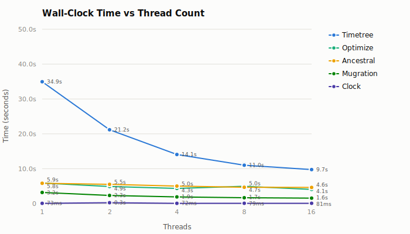
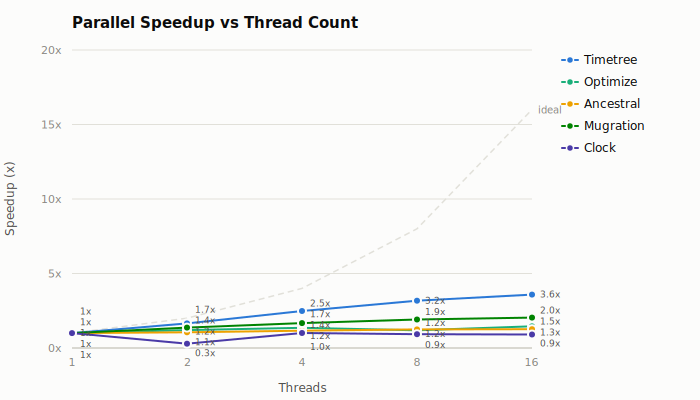
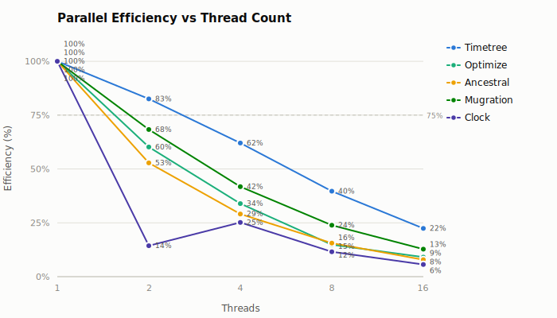
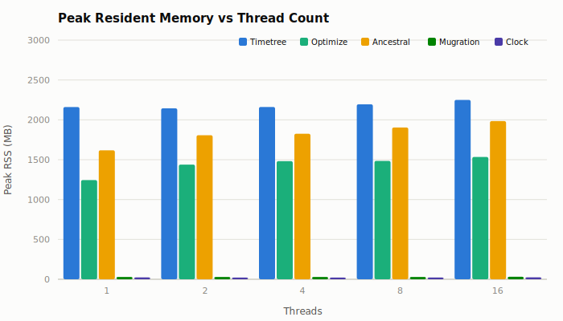

# Parallel Scaling: mpox-2000

**Commit:** `3f1820a5ee5f443691624e00ab4aad4e4012a049`
**Dataset:** `data/mpox/clade-ii/2000`
**Threads:** 1, 2, 4, 8, 16
**Runs:** 3 measured + 1 warmup per configuration

## Methodology

A single release binary was benchmarked across five CLI subcommands at thread counts 1, 2, 4, 8, 16 using [hyperfine](https://github.com/sharkdp/hyperfine) (3 measured runs, 1 warmup). Peak RSS was captured separately via `/usr/bin/time`. The benchmark harness (`dev/bench-graph-pass-cli`) ran each workload twice per configuration; results are the mean of both runs.

### Workloads

| Subcommand    | Description                                | Key parameters                        |
| ------------- | ------------------------------------------ | ------------------------------------- |
| **ancestral** | Marginal ancestral sequence reconstruction | `--method-anc=marginal --dense=false` |
| **mugration** | Discrete trait reconstruction (country)    | `--attribute=country --pc=1.0`        |
| **clock**     | Molecular clock inference                  | default                               |
| **optimize**  | Branch length optimization                 | `--dense=false`                       |
| **timetree**  | Full time-scaled phylogeny                 | all output formats                    |

## Results

### Wall-clock time

| Workload      | 1 thread | 2 threads | 4 threads | 8 threads | 16 threads |
| ------------- | -------: | --------: | --------: | --------: | ---------: |
| **Timetree**  | 34.947 s |  21.171 s |  14.079 s |  11.011 s |    9.748 s |
| **Optimize**  |  5.897 s |   4.899 s |   4.347 s |   4.967 s |    4.054 s |
| **Ancestral** |  5.830 s |   5.518 s |   5.012 s |   4.681 s |    4.627 s |
| **Mugration** |  3.191 s |   2.335 s |   1.909 s |   1.671 s |    1.563 s |
| **Clock**     |  73.0 ms |  254.3 ms |   72.4 ms |   78.9 ms |    80.7 ms |

### Speedup

| Workload      | 1 thread | 2 threads | 4 threads | 8 threads | 16 threads |
| ------------- | -------: | --------: | --------: | --------: | ---------: |
| **Timetree**  |    1.00x |     1.65x |     2.48x |     3.17x |      3.59x |
| **Optimize**  |    1.00x |     1.20x |     1.36x |     1.19x |      1.45x |
| **Ancestral** |    1.00x |     1.06x |     1.16x |     1.25x |      1.26x |
| **Mugration** |    1.00x |     1.37x |     1.67x |     1.91x |      2.04x |
| **Clock**     |    1.00x |     0.29x |     1.01x |     0.92x |      0.90x |

### Parallel efficiency

Efficiency = speedup / thread count.

| Workload      | 1 thread | 2 threads | 4 threads | 8 threads | 16 threads |
| ------------- | -------: | --------: | --------: | --------: | ---------: |
| **Timetree**  |     100% |       83% |       62% |       40% |        22% |
| **Optimize**  |     100% |       60% |       34% |       15% |         9% |
| **Ancestral** |     100% |       53% |       29% |       16% |         8% |
| **Mugration** |     100% |       68% |       42% |       24% |        13% |
| **Clock**     |     100% |       14% |       25% |       12% |         6% |

### Peak resident memory

| Workload      | 1 thread | 2 threads | 4 threads | 8 threads | 16 threads |
| ------------- | -------: | --------: | --------: | --------: | ---------: |
| **Timetree**  |  2160 MB |   2144 MB |   2162 MB |   2194 MB |    2250 MB |
| **Optimize**  |  1244 MB |   1439 MB |   1482 MB |   1485 MB |    1534 MB |
| **Ancestral** |  1618 MB |   1807 MB |   1825 MB |   1904 MB |    1985 MB |
| **Mugration** |    29 MB |     29 MB |     29 MB |     29 MB |      31 MB |
| **Clock**     |    23 MB |     21 MB |     21 MB |     22 MB |      24 MB |

### CPU utilization

User + system time / wall-clock time. Values above 1.0 indicate parallel CPU use.

| Workload      | 1 thread | 2 threads | 4 threads | 8 threads | 16 threads |
| ------------- | -------: | --------: | --------: | --------: | ---------: |
| **Timetree**  |     1.00 |      1.70 |      2.65 |      3.81 |       4.85 |
| **Optimize**  |     1.00 |      1.38 |      1.90 |      2.82 |       3.90 |
| **Ancestral** |     1.00 |      1.17 |      1.28 |      1.40 |       1.66 |
| **Mugration** |     1.00 |      1.62 |      2.44 |      3.72 |       6.08 |
| **Clock**     |     1.00 |      0.98 |      1.38 |      1.91 |       3.35 |

## Summary and Discussion

### Comparison with mpox-500

The 4x increase in dataset size (463 to ~2000 tips) yields these changes:

- **Timetree** wall-clock scales from 7.2s to 35s (4.9x), parallel behavior nearly identical (3.59x vs 3.69x at 16T)
- **Mugration** improves from 1.40x to 1.91x speedup at 8 threads, crossing 2x at 16 -- the larger state space benefits from parallelism
- **Optimize** and **ancestral** scale roughly with dataset size but show no parallel scaling improvement
- **Clock** has an anomalous 254 ms outlier at 2 threads (vs 73 ms at 1 thread), likely a measurement artifact from warmup or scheduling noise on the longer-running benchmark session

### Timetree: still the strongest scaler

3.59x at 16 threads, 83% efficiency at 2 threads, 40% at 8. Similar to mpox-500, confirming timetree's parallel behavior is stable across dataset sizes. The absolute time (35s single-threaded to 9.7s at 16 threads) makes parallelism practically valuable here. Memory is flat at ~2.2 GB, barely affected by thread count.

### Mugration: improved scaling at larger size

Mugration benefits from the larger dataset: 2.04x at 16 threads (vs 1.33x on mpox-500) and 68% efficiency at 2 threads. The state space for 2000 tips provides enough per-thread work to justify the coordination overhead. Memory stays under 31 MB.

### Optimize and ancestral: still limited

Optimize reaches 1.45x at 16 threads but shows irregular scaling (drops to 1.19x at 8 threads, recovers at 16). Ancestral reaches 1.26x at 16 threads, nearly identical to mpox-500. Memory for both grows with thread count: ancestral from 1.6 GB to 2.0 GB, optimize from 1.2 GB to 1.5 GB.

### Clock: still too fast

At 73 ms single-threaded, clock remains too fast for parallelism on this dataset. The 254 ms at 2 threads is an anomaly.

## Conclusion

| Category                      | Workloads           | Recommendation                       |
| ----------------------------- | ------------------- | ------------------------------------ |
| Scales well (>2x at 8T)       | timetree            | 4-8 threads; 16 still marginal gain  |
| Improved at scale (2x at 16T) | mugration           | 4-8 threads worthwhile at 2000+ tips |
| Limited scaling               | optimize, ancestral | 2-4 threads at best                  |
| No scaling                    | clock               | Single-threaded                      |

For the 2000-tip dataset, **8 threads** is the sweet spot: timetree reaches 3.17x (11s vs 35s), mugration reaches 1.91x (1.7s vs 3.2s). Beyond 8, only timetree shows meaningful gain.
