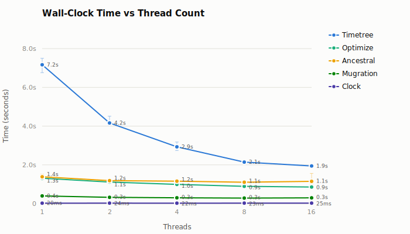
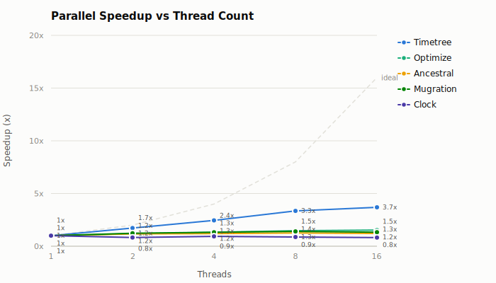
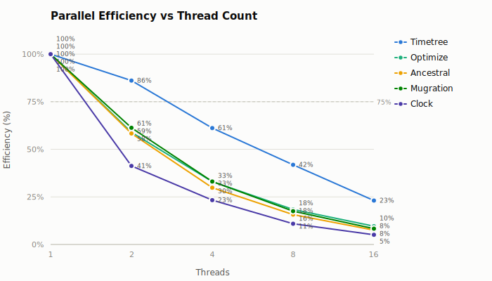
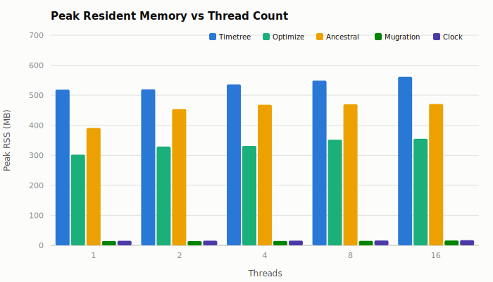

# Parallel Scaling: mpox-500

**Commit:** `3f1820a5ee5f443691624e00ab4aad4e4012a049`
**Dataset:** `data/mpox/clade-ii/500`
**Threads:** 1, 2, 4, 8, 16
**Runs:** 3 measured + 1 warmup per configuration

## Methodology

A single release binary was benchmarked across five CLI subcommands at thread counts 1, 2, 4, 8, 16 using [hyperfine](https://github.com/sharkdp/hyperfine) (3 measured runs, 1 warmup). Peak RSS was captured separately via `/usr/bin/time`. The benchmark harness (`dev/bench-graph-pass-cli`) ran each workload twice per configuration; results are the mean of both runs.

### Workloads

| Subcommand    | Description                                | Key parameters                        |
| ------------- | ------------------------------------------ | ------------------------------------- |
| **ancestral** | Marginal ancestral sequence reconstruction | `--method-anc=marginal --dense=false` |
| **mugration** | Discrete trait reconstruction (country)    | `--attribute=country --pc=1.0`        |
| **clock**     | Molecular clock inference                  | default                               |
| **optimize**  | Branch length optimization                 | `--dense=false`                       |
| **timetree**  | Full time-scaled phylogeny                 | all output formats                    |

## Results

### Wall-clock time

| Workload      | 1 thread | 2 threads | 4 threads | 8 threads | 16 threads |
| ------------- | -------: | --------: | --------: | --------: | ---------: |
| **Timetree**  |  7.165 s |   4.161 s |   2.928 s |   2.140 s |    1.941 s |
| **Optimize**  |  1.309 s |   1.110 s |  990.0 ms |  890.1 ms |   853.6 ms |
| **Ancestral** |  1.382 s |   1.185 s |   1.158 s |   1.101 s |    1.146 s |
| **Mugration** | 395.6 ms |  322.5 ms |  298.9 ms |  282.5 ms |   297.4 ms |
| **Clock**     |  20.2 ms |   24.4 ms |   21.6 ms |   23.1 ms |    24.7 ms |

### Speedup

| Workload      | 1 thread | 2 threads | 4 threads | 8 threads | 16 threads |
| ------------- | -------: | --------: | --------: | --------: | ---------: |
| **Timetree**  |    1.00x |     1.72x |     2.45x |     3.35x |      3.69x |
| **Optimize**  |    1.00x |     1.18x |     1.32x |     1.47x |      1.53x |
| **Ancestral** |    1.00x |     1.17x |     1.19x |     1.26x |      1.21x |
| **Mugration** |    1.00x |     1.23x |     1.32x |     1.40x |      1.33x |
| **Clock**     |    1.00x |     0.83x |     0.93x |     0.87x |      0.82x |

### Parallel efficiency

Efficiency = speedup / thread count.

| Workload      | 1 thread | 2 threads | 4 threads | 8 threads | 16 threads |
| ------------- | -------: | --------: | --------: | --------: | ---------: |
| **Timetree**  |     100% |       86% |       61% |       42% |        23% |
| **Optimize**  |     100% |       59% |       33% |       18% |        10% |
| **Ancestral** |     100% |       58% |       30% |       16% |         8% |
| **Mugration** |     100% |       61% |       33% |       18% |         8% |
| **Clock**     |     100% |       41% |       23% |       11% |         5% |

### Peak resident memory

| Workload      | 1 thread | 2 threads | 4 threads | 8 threads | 16 threads |
| ------------- | -------: | --------: | --------: | --------: | ---------: |
| **Timetree**  |   519 MB |    520 MB |    536 MB |    549 MB |     562 MB |
| **Optimize**  |   302 MB |    329 MB |    331 MB |    352 MB |     355 MB |
| **Ancestral** |   391 MB |    454 MB |    468 MB |    470 MB |     471 MB |
| **Mugration** |    14 MB |     14 MB |     15 MB |     15 MB |      16 MB |
| **Clock**     |    15 MB |     15 MB |     16 MB |     16 MB |      17 MB |

### CPU utilization

User + system time / wall-clock time. Values above 1.0 indicate parallel CPU use.

| Workload      | 1 thread | 2 threads | 4 threads | 8 threads | 16 threads |
| ------------- | -------: | --------: | --------: | --------: | ---------: |
| **Timetree**  |     1.00 |      1.69 |      2.59 |      3.67 |       4.90 |
| **Optimize**  |     1.00 |      1.39 |      1.86 |      2.48 |       3.90 |
| **Ancestral** |     1.00 |      1.15 |      1.27 |      1.36 |       1.60 |
| **Mugration** |     1.00 |      1.54 |      2.28 |      3.65 |       6.69 |
| **Clock**     |     0.99 |      1.12 |      1.36 |      1.84 |       3.25 |

## Summary and Discussion

### Timetree: strong scaling

Timetree is the only workload that scales well: 3.69x speedup at 16 threads, with 86% efficiency at 2 threads and 42% at 8 (above the 75% threshold only at 2 threads). The timetree pipeline iterates over branch-length optimization, ancestral reconstruction, and clock fitting, so the parallelizable fraction dominates serial overhead. CPU utilization reaches 4.9 cores at 16 threads, confirming real parallel work. Peak RSS grows modestly from 519 MB (1 thread) to 562 MB (16 threads), an 8% increase.

### Optimize and mugration: moderate scaling, quick saturation

Both reach ~1.5x and ~1.4x respectively and plateau around 8 threads. The parallelizable portion of these workloads is smaller relative to serial setup and I/O. Mugration regresses from 8 to 16 threads (282 ms to 297 ms), suggesting thread coordination overhead exceeds the marginal gain. Mugration CPU utilization at 16 threads (6.69 cores) is high relative to its wall-clock improvement, pointing to contention. Optimize uses 302-355 MB across thread counts; mugration stays under 16 MB throughout.

### Ancestral: minimal scaling

Ancestral reconstruction reaches only 1.26x at 8 threads and regresses at 16. With `--dense=false` (sparse/Fitch compression), per-site work is reduced to variable sites only, making work units too fine-grained for profitable parallelism at this dataset size. CPU utilization stays below 1.6 even at 16 threads, confirming most cores sit idle. Peak RSS jumps from 391 MB (1 thread) to 454 MB (2 threads), then flattens around 470 MB, indicating a one-time per-thread workspace allocation.

### Clock: no scaling

Clock completes in ~20 ms, too fast for parallelism to help. Thread creation and synchronization overhead exceeds the workload itself. Negligible memory footprint (15-17 MB) confirms this is a lightweight metadata-only pass.

## Conclusion

| Category                | Workloads           | Recommendation                                |
| ----------------------- | ------------------- | --------------------------------------------- |
| Scales well (>2x at 8T) | timetree            | 4-8 threads; diminishing returns beyond       |
| Moderate (1.2-1.5x)     | optimize, mugration | 2-4 threads; beyond is wasted CPU             |
| No meaningful scaling   | ancestral, clock    | Single-threaded optimal for this dataset size |

For the 463-tip dataset, **4 threads** is the sweet spot balancing throughput against CPU waste. At 8+ threads only timetree continues to benefit. Larger datasets (2000+ tips) would likely show improved parallel efficiency as the work-per-thread ratio increases.
