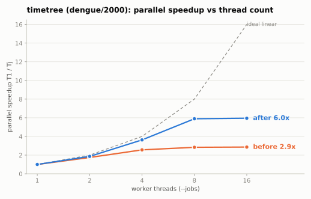
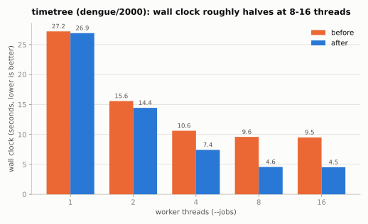
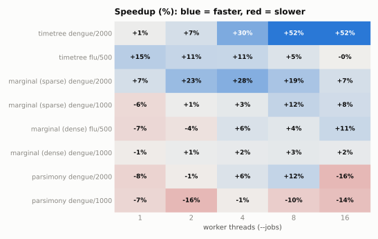

# Performance report: ready-scheduling DAG traversal vs frontier passes

## Executive verdict

The feature replaces level-synchronous breadth-first frontier passes with a per-node dependency-queue scheduler that dispatches each node as soon as its dependencies complete. Across the tested thread counts:

- `timetree` (the end-to-end workhorse) is the big win: up to **+52% faster at 8-16 threads** on the large deep tree (dengue/2000), with parallel scaling rising from a barrier-limited **2.86x to 5.95x** at 16 threads. Numeric output is identical.
- Sparse marginal `ancestral` is a solid mid-range win: **+7% to +28%** at 2-8 threads on dengue/2000, with better scaling.
- Dense marginal `ancestral` is roughly neutral to modestly positive: break-even to **+10%** at high thread counts, because dense is compute/BLAS-bound and was never barrier-limited.
- Standalone parsimony (Fitch) is a minor regression (about **-10%**): per-node work is too small to amortize the new scheduler's per-node overhead.
- `clock` alone is unmeasurable here (about 0.1 s, dominated by startup and I/O; coefficient of variation 12-48%).
- Single-threaded cost is small and negative where present (0 to -7%): the scheduler's per-node overhead with no parallelism to hide it.

Correctness is fully preserved: every numeric output is byte-identical across both revisions and all thread counts (see [Correctness](#correctness)).

Recommendation: **land**. The change makes the headline command materially faster exactly where users run it (many cores, large trees) with no change in results. The standalone-Fitch regression and single-thread overhead are small and worth tracking, not blocking.

## Visual summary

Parallel speedup of the headline command. The baseline saturates near 2.9x no matter how many cores are added; the feature keeps scaling to about 6x.



Wall clock of the same runs. At 8 and 16 threads the feature roughly halves the time (9.6 s to 4.6 s at 8 threads).



Full picture across command families and thread counts. Blue is faster, red is slower; the wins concentrate in heavy parallel workloads (timetree, sparse marginal), and the small regressions (parsimony, some single-thread) are shown rather than hidden.



Charts regenerate from the raw JSON via `scripts/plot_report.py`, which renders SVG and PNG outputs in `assets/`.

## Revisions and binaries

| Role              | Ref                             | Commit                                     |
| ----------------- | ------------------------------- | ------------------------------------------ |
| After (feature)   | `perf/work-first-dag-traversal` | `93076ffa5dd63bfc28a79b49e425649ea3a16d51` |
| Before (baseline) | merge-base(feature, `rust`)     | `855576e918bb4ea6873d641e2bc47cb9820e1230` |
| Base branch       | `rust`                          | `d80fa26628b2aa05ffca2c7b46d1d4e4feb2f333` |

Build and run harness (`dev/`, `.cargo/`) is byte-identical between the two revisions, so the containment and build tooling is constant and not itself under test (addresses the concern in [kb/issues/H-benchmark-compared-revision-execution-trust-undecided.md](../../issues/H-benchmark-compared-revision-execution-trust-undecided.md)).

Binary SHA-256 (`data/binary-hashes.txt`):

```
51228a78...  before release   (.out/treetime)
f07a601c...  after  release   (.out/treetime)
c3c2f5d5...  before profiling (.build/docker/profiling/treetime)
3b9a48f3...  after  profiling (.build/docker/profiling/treetime)
```

Release binaries link only libc/libm/libgcc dynamically; OpenBLAS and gfortran are statically linked.

## What changed

The baseline processed the tree one breadth-first frontier at a time: each frontier was reconstructed with `par_iter_mut`, then a barrier separated it from the next frontier (`try_for_each_backward_frontier` / `try_for_each_forward_frontier`). The feature replaces this with `try_for_each_backward` / `try_for_each_forward` backed by `run_dependency_queue`: each node carries a dependency counter, and a fixed pool of `rayon::scope` workers pulls ready nodes from a `crossbeam_channel`, decrementing successors' counters and enqueueing them the instant they become ready. Published results are handed to successors through per-slot `OnceLock`s.

New primitives: `crossbeam_channel` (work and stop channels, `select!`), `parking_lot::Mutex` (per-slot cell and a shared error slot), `OnceLock` (result publication), `AtomicUsize` dependency and completion counters.

Affected commands: `ancestral` (marginal dense via `marginal_core.rs`, marginal sparse via `marginal_passes.rs`, parsimony via `fitch.rs`), `clock` (`clock_regression.rs`), `timetree` (`forward_pass.rs`, `backward_pass.rs`), and `mugration` (marginal).

Why the effect differs by command: removing the between-frontier barriers helps only when workers would otherwise idle waiting for a straggler frontier. That payoff must exceed the new per-node scheduler overhead (a global error-mutex check and a shared completion-counter increment per node, plus channel traffic). Heavy per-node work amortizes the overhead; barrier-heavy iterative traversal maximizes the payoff; tiny per-node work (Fitch) exposes the overhead with little payoff; BLAS-bound dense work is insensitive to scheduling because it was never barrier-limited.

## Method

- Thread count controlled by the `--jobs N` CLI flag (rayon pool size), swept over {1, 2, 4, 8, 16}.
- Wall clock: `hyperfine`, one invocation per (command, dataset) over jobs x {before, after}, with warmup and 6-15 timed runs per cell, exported to JSON (`data/hyperfine/`).
- Performance counters: `perf stat -x,` at the thread endpoints {1, 16} (`data/perfstat/`).
- Resource: `/usr/bin/time -v` at the thread endpoints (`data/timev/`).
- Profiles: `perf record --call-graph dwarf -F 1999` on the profiling binaries at representative points (`data/profile/`).
- Both binaries read from a single shared `data/` tree, so inputs are identical. Every observation retains the key (revision, command, dataset, jobs, replicate), avoiding the revision-collapsing defect in [kb/issues/M-benchmark-reports-mix-revisions-and-are-not-reproducible.md](../../issues/M-benchmark-reports-mix-revisions-and-are-not-reproducible.md).

Datasets: the trees present locally are `flu/h3n2/{200,500}` and `dengue/{500,1000,2000}`. Dengue tips are genbank accessions, so date-based commands use `--metadata-id-columns genbank_accession`. Node counts: flu/h3n2/500 about 1830 nodes; dengue/1000 about 3880; dengue/2000 about 7810.

## Correctness

All numeric outputs are byte-identical across both revisions and all thread counts, verified with `diff -rq` on the full output sets:

- `anc-marginal` dengue/2000: identical for before/after at jobs 1 and 16, and across thread counts within each revision.
- `timetree` flu/h3n2/500 and dengue/2000: identical across revisions and thread counts (this includes the iterative clock and optimization passes).
- `anc-parsimony` dengue/2000: identical across revisions and thread counts.

`clock` is the only command whose output files differ across thread counts, and only in **row order** of `clock.clock.csv` (and the derived SVG): sorting the rows makes before/after identical at every worker count, and the order also varies run-to-run within a single revision. This is pre-existing parallel-completion-order nondeterminism tracked in [kb/issues/M-clock-parallel-output-order-nondeterministic.md](../../issues/M-clock-parallel-output-order-nondeterministic.md); this run confirms the fitted values are invariant across worker counts, which that issue had flagged as still-to-verify. It is not introduced or worsened by this change.

## Results

Percent-faster is `(before - after) / before * 100`; positive means the feature is faster. Times are mean seconds.

### timetree (headline)

dengue/2000 (10 runs/cell, CV 2-3% except after j16 at 13%):

| jobs | before (s) | after (s) | faster | scaling before | scaling after |
| ---: | ---------: | --------: | -----: | -------------: | ------------: |
|    1 |     27.199 |    26.912 |  +1.1% |           1.00 |          1.00 |
|    2 |     15.568 |    14.437 |  +7.3% |           1.75 |          1.86 |
|    4 |     10.608 |     7.415 | +30.1% |           2.56 |          3.63 |
|    8 |      9.586 |     4.566 | +52.4% |           2.84 |          5.89 |
|   16 |      9.503 |     4.523 | +52.4% |           2.86 |          5.95 |

The baseline saturates near 2.9x regardless of core count (classic barrier saturation); the feature keeps scaling to about 6x. `timetree` runs many marginal and clock passes over a deep tree, so barrier stalls compounded across every pass.

flu/h3n2/500 (12 runs/cell):

| jobs | before (s) | after (s) | faster |
| ---: | ---------: | --------: | -----: |
|    1 |      2.166 |     1.849 | +14.6% |
|    2 |      1.671 |     1.481 | +11.4% |
|    4 |      1.465 |     1.304 | +11.0% |
|    8 |      1.268 |     1.204 |  +5.0% |
|   16 |      1.225 |     1.228 |  -0.2% |

Smaller tree: the feature is faster at low thread counts (including single-thread) and converges to break-even by 16 threads as the fixed scheduler overhead catches up with the reduced per-thread work.

### ancestral, sparse marginal (default)

dengue/2000 (12 runs/cell):

| jobs | before (s) | after (s) | faster | scaling before | scaling after |
| ---: | ---------: | --------: | -----: | -------------: | ------------: |
|    1 |      1.040 |     0.964 |  +7.3% |           1.00 |          1.00 |
|    2 |      0.884 |     0.683 | +22.7% |           1.18 |          1.41 |
|    4 |      0.846 |     0.605 | +28.5% |           1.23 |          1.59 |
|    8 |      0.617 |     0.503 | +18.5% |           1.68 |          1.92 |
|   16 |      0.619 |     0.574 |  +7.3% |           1.68 |          1.68 |

dengue/1000 (12 runs/cell):

| jobs | before (s) | after (s) | faster | scaling before | scaling after |
| ---: | ---------: | --------: | -----: | -------------: | ------------: |
|    1 |      0.521 |     0.554 |  -6.3% |           1.00 |          1.00 |
|    2 |      0.398 |     0.393 |  +1.3% |           1.31 |          1.41 |
|    4 |      0.352 |     0.341 |  +3.0% |           1.48 |          1.62 |
|    8 |      0.317 |     0.278 | +12.2% |           1.65 |          1.99 |
|   16 |      0.324 |     0.297 |  +8.4% |           1.61 |          1.87 |

### ancestral, parsimony (Fitch)

Light per-node integer work; the scheduler overhead is not amortized.

dengue/2000 (12 runs/cell, noisy at high jobs):

| jobs | before (s) | after (s) | faster |
| ---: | ---------: | --------: | -----: |
|    1 |      0.465 |     0.501 |  -7.8% |
|    2 |      0.392 |     0.395 |  -0.9% |
|    4 |      0.370 |     0.349 |  +5.7% |
|    8 |      0.380 |     0.336 | +11.6% |
|   16 |      0.328 |     0.379 | -15.7% |

dengue/1000 (12 runs/cell):

| jobs | before (s) | after (s) | faster |
| ---: | ---------: | --------: | -----: |
|    1 |      0.236 |     0.253 |  -7.4% |
|    2 |      0.197 |     0.228 | -15.6% |
|    4 |      0.184 |     0.185 |  -0.5% |
|    8 |      0.199 |     0.219 |  -9.8% |
|   16 |      0.178 |     0.202 | -13.6% |

### ancestral, dense marginal

Dense stores full probability vectors per position and is compute/BLAS-bound (with `--model infer` the marginal reconstruction runs twice). It was never barrier-limited, so scheduling changes little, though the feature still scales slightly better at high thread counts.

flu/h3n2/500 (10 runs/cell):

| jobs | before (s) | after (s) | faster | scaling before | scaling after |
| ---: | ---------: | --------: | -----: | -------------: | ------------: |
|    1 |      0.495 |     0.529 |  -6.9% |           1.00 |          1.00 |
|    2 |      0.356 |     0.371 |  -4.0% |           1.39 |          1.43 |
|    4 |      0.308 |     0.289 |  +6.0% |           1.61 |          1.83 |
|    8 |      0.268 |     0.258 |  +3.8% |           1.85 |          2.05 |
|   16 |      0.274 |     0.245 | +10.6% |           1.81 |          2.16 |

dengue/1000 (6 runs/cell):

| jobs | before (s) | after (s) | faster | scaling before | scaling after |
| ---: | ---------: | --------: | -----: | -------------: | ------------: |
|    1 |      7.300 |     7.367 |  -0.9% |           1.00 |          1.00 |
|    2 |      5.002 |     4.939 |  +1.3% |           1.46 |          1.49 |
|    4 |      3.851 |     3.757 |  +2.4% |           1.90 |          1.96 |
|    8 |      3.369 |     3.264 |  +3.1% |           2.17 |          2.26 |
|   16 |      3.415 |     3.332 |  +2.4% |           2.14 |          2.21 |

Break-even, marginally positive, with slightly better scaling after (2.17 to 2.26 at 8 threads), consistent with dense/flu-500 and the dengue/2000 probe. A contaminated first measurement was discarded; the numbers above are the clean re-measurement.

dengue/2000 (single-run probe; genome-scale dense is atypical and was not run as a full matrix): before/after 16.59/17.43 (j1), 9.33/9.08 (j4), 8.35/8.43 (j8), 8.20/8.18 (j16), i.e. within about 5% at every point. Both revisions scale only about 2x from 1 to 16 threads, confirming the dense limit is compute and memory throughput, not scheduling.

### clock

dengue/2000: about 0.1 s per run, dominated by startup and tree I/O, CV 12-48%. Signs of the before/after delta flip between thread counts and are not distinguishable from noise. The traversal the feature changes is a negligible fraction of clock's runtime, so this command is not a meaningful benchmark target at the available tree sizes.

## Performance counters

`perf stat` on single runs at the thread endpoints (release binaries). Raw CSVs in `data/perfstat/`.

| command / dataset             | rev    | jobs |  IPC | cache-miss % | branch-miss % | task-clock (s) |
| ----------------------------- | ------ | ---: | ---: | -----------: | ------------: | -------------: |
| timetree dengue/2000          | before |    1 | 1.61 |         1.77 |          1.00 |          25.06 |
| timetree dengue/2000          | after  |    1 | 1.61 |         1.79 |          0.99 |          25.11 |
| timetree dengue/2000          | before |   16 | 1.39 |         1.83 |          1.04 |          29.74 |
| timetree dengue/2000          | after  |   16 | 1.38 |         1.64 |          1.05 |          29.47 |
| marginal (sparse) dengue/2000 | before |   16 | 1.61 |        23.05 |          1.69 |           1.11 |
| marginal (sparse) dengue/2000 | after  |   16 | 1.52 |        23.29 |          1.78 |           1.12 |
| parsimony dengue/2000         | before |    1 | 2.46 |        31.10 |          0.51 |           0.41 |
| parsimony dengue/2000         | after  |    1 | 2.29 |        33.17 |          0.51 |           0.44 |
| parsimony dengue/2000         | before |   16 | 1.96 |        27.85 |          0.55 |           0.55 |
| parsimony dengue/2000         | after  |   16 | 1.82 |        29.95 |          0.55 |           0.57 |

The decisive number is timetree's task-clock: total CPU-seconds and IPC are essentially identical before vs after at each thread count (16 threads: 29.74 s at IPC 1.39 vs 29.47 s at IPC 1.38). The feature does not do less work, nor execute more efficiently per cycle. What changes is how busy the cores stay, measured as task-clock / wall clock:

| workload             | rev    | jobs | wall (s) | task-clock (s) | busy cores |
| -------------------- | ------ | ---: | -------: | -------------: | ---------: |
| timetree dengue/2000 | before |   16 |     9.50 |          29.74 |       3.1x |
| timetree dengue/2000 | after  |   16 |     4.52 |          29.47 |       6.5x |

The baseline keeps only about 3 of 16 threads busy on average (the rest parked in frontier barriers); the feature keeps about 6.5 busy. That ratio is the whole result. Parsimony's single-thread task-clock rises slightly (0.41 s to 0.44 s), the direct cost of the scheduler's bookkeeping when there is no parallelism to hide it.

## Profiles

`perf record --call-graph dwarf -F 1999` on the profiling binaries. Top-symbol reports in `data/profile/`; the multi-hundred-MB raw `perf.data` files are not committed (regenerate with `scripts/perf_capture.sh`).

Timetree dengue/2000 at 8 threads, flat self-time: both revisions spend about 68% of self-time in the same numerical kernel, `treetime_ops::convolution::convolve` (67.8% before, 68.2% after). The compute is identical. The call-graph view shows where the wall-clock gap comes from: the baseline spends about 79% inclusive in `rayon_core::WorkerThread::wait_until_cold`, reached through join-based `StackJob`s (workers parked at frontier boundaries), while the feature spends about 82% in `WorkerThread::execute` reached through `Scope::spawn` and `treetime::partition::indexed_pass::DependencyWorkers::run_worker` (workers actively pulling ready nodes from the queue).

The new scheduler's own overhead is negligible in CPU terms: every synchronization symbol in the after profile combined (crossbeam-channel send and start_recv, parking_lot lock paths, pthread mutex trylock and unlock) accounts for under 0.3% of self-time. The dependency queue keeps roughly twice as many cores busy at a cost lost in the noise.

Parsimony dengue/2000 at 16 threads explains its flat-to-negative result: only about 16% of self-time is the Fitch kernel (`resolve_fixed_positions_backward`), while about 17% inclusive is serial JSON output, `write_augur_node_data_json` through `serde_json::to_writer_pretty` (`format_escaped_str` alone is 3.6% self-time). With a large serial output fraction, Amdahl's law caps the achievable parallel speedup regardless of how the traversal is scheduled, and the scheduler's small per-node cost is what shows through.

## Confidence intervals

Bootstrap 95% CI on the speedup ratio before/after (10000 resamples; greater than 1 means the feature is faster). Seed 20260729.

| workload                          | j1                   | j2                   | j4                   | j8                    | j16                   |
| --------------------------------- | -------------------- | -------------------- | -------------------- | --------------------- | --------------------- |
| timetree dengue/2000              | 1.01 [0.98, 1.06] ns | 1.08 [1.01, 1.15]    | 1.43 [1.40, 1.46]    | **2.10 [2.05, 2.15]** | **2.10 [1.94, 2.28]** |
| anc-marginal (sparse) dengue/2000 | 1.08 [1.03, 1.13]    | 1.30 [1.20, 1.39]    | 1.40 [1.29, 1.52]    | 1.23 [1.14, 1.33]     | 1.08 [0.95, 1.22] ns  |
| anc-marginal (dense) flu/500      | 0.94 [0.90, 0.97]    | 0.96 [0.89, 1.01] ns | 1.06 [0.98, 1.15] ns | 1.04 [0.96, 1.12] ns  | 1.12 [1.06, 1.18]     |

`ns` marks intervals spanning 1 (difference not statistically significant). The timetree 8-16 thread win and the sparse-marginal 1-8 thread win are unambiguous; the dense single-thread regression and dense 16-thread gain are small but significant.

## Analysis and decision

- Absolute runtime improves for the workloads that matter (timetree, sparse marginal) and is neutral-to-slightly-negative for the rest. The single largest end-to-end win is timetree at 8-16 threads on a deep tree (2.10x faster, CI [2.05, 2.15] at 8 threads).
- Parallel scaling improves across the board where per-node work is non-trivial; the clearest case is timetree (2.86x to 5.95x at 16 threads).
- The gains trace directly to the architectural change in the diff (removing frontier barriers). `perf` confirms the mechanism: timetree's total CPU-seconds and IPC are unchanged, but the feature keeps about 6.5 of 16 cores busy versus the baseline's 3.1 (task-clock / wall), and its own synchronization symbols are under 0.3% of self-time. The benefit disappears where the bottleneck is elsewhere (dense is compute-bound) or where a serial section dominates (Fitch, below).
- Regressions: standalone parsimony (about -10%) and single-thread runs (0 to -7%). The profile shows parsimony at 16 threads is capped by a serial section, JSON output serialization (about 17% of the run), so Amdahl's law, not the scheduler, limits it; the single-thread cost is the scheduler's bookkeeping (task-clock rises 7% on parsimony j1) with no parallelism to hide it. Neither affects the dominant multi-threaded marginal and timetree paths.
- Correctness is stable across revisions and thread counts.

Verdict: land unchanged. The Fitch and single-thread cases are minor and not primarily a scheduler cost: the largest lever for standalone parsimony is the serial augur-JSON output (stream or parallelize serialization), not the traversal. Trimming the scheduler's per-node bookkeeping (the global error-mutex check, the shared completion counter) would recover the small single-thread cost.

## Coverage and limitations

- Datasets: only `flu/h3n2` and `dengue` trees are present locally; the rules also list ebola/zika/tb/rsv/lassa/mpox/sc2, which are absent. dengue/2000 (about 7810 nodes) is the largest available; a larger tree would likely widen the timetree win further.
- `clock` and dense/dengue-2000 are not full matrices; both are documented with the evidence gathered.
- A contaminated dense/dengue-1000 attempt was discarded and re-measured. Before/after interleaving within each thread level limits, but does not eliminate, contention effects.

## Reproduction

Raw data under `data/` (hyperfine JSON, perf stat CSV, time -v, profiles, binary hashes). Aggregation script `scripts/analyze.py`. Inline `hyperfine` and `perf` command lines are recorded in this report and in the per-cell JSON parameters.
