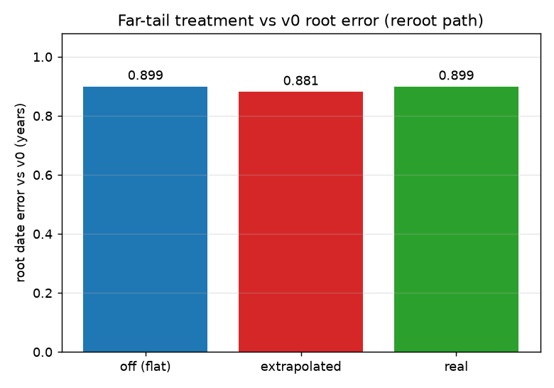
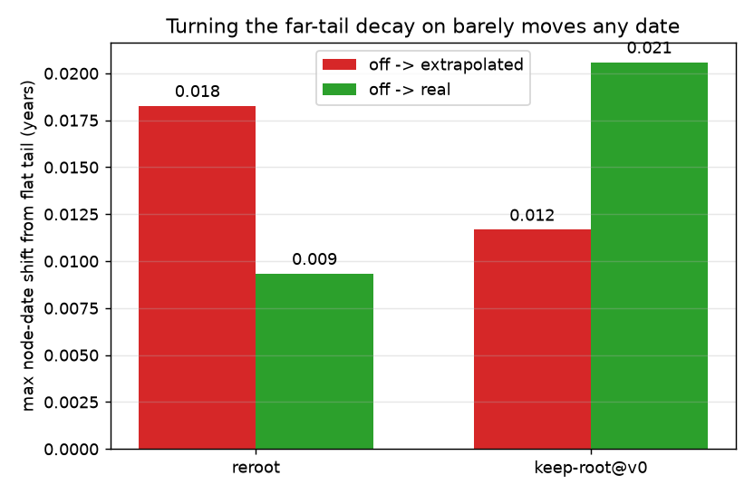

# Does the branch-length far-tail decay change inferred dates?

## Short answer

The far-tail-decay branch replaced the flat far tail of the branch-length distribution with an exponential (log-linear) decay, on the theory that a flat tail biases deep node dates. This study measures whether that change actually moves dates, on `flu_h3n2_20` (`marginal_dense`), by comparing three treatments of the same far region:

- **off** -- flat `Constant` tail (the pre-feature behavior),
- **extrapolated** -- the log-linear decay tail the branch adds,
- **real** -- a wide grid filled with the true, computed branch-length likelihood (which genuinely decays); the ground truth the extrapolation approximates.

On a well-rooted tree, turning the decay on barely moves anything. Against the v0 baseline the root date error is **0.899 y with the flat tail, 0.899 y with the real decay, and 0.881 y with the extrapolated tail** -- so the physically correct decay is indistinguishable from flat, and the extrapolated tail's 0.018 y nudge is a shape artifact of the cheap extrapolation, not a real correction. No treatment moves any node date by more than **0.02 years**, and none touches the ~0.9 y gap to v0 at the root.

The dramatic effect that motivated the branch (deep dates moving by tens of years) lives in a different regime -- keep-root on the raw, unrooted input tree -- which this single-pass harness cannot ingest. That regime is documented in [kb/tickets/distribution-implement-decaying-branch-length-tails.md](../../tickets/distribution-implement-decaying-branch-length-tails.md); it is not contradicted here, just out of reach.

## The question

Branch-length likelihoods are discretized on a grid that hard-truncates the long-branch side. Beyond the truncation the density was held flat (`Constant` tail). Physically it should keep decaying: under a Poisson substitution model the branch likelihood is `exp(-mu*t)*(mu*t)^k`, whose log is asymptotically linear, so long branches decay exponentially. The branch adds a log-linear tail that continues that slope.

The open question: **does replacing the flat tail with the decaying tail change inferred node dates, and by how much?** Answering it needs a direct with-vs-without comparison -- which the first pass of this study buried inside a grid/tail parameter sweep. This revision makes it the centerpiece.

## Method

- **Three tail treatments, matched far reach.** `off` = 300-point grid to 5x the peak branch length, flat beyond. `extrapolated` = same 300-point grid, log-linear tail appended out to ~10x. `real` = a 3000-point grid to 50x the peak at the same point spacing, so the far region holds the true computed likelihood instead of an extrapolation. `extrapolated` and `real` reach comparable distances at the same resolution, so their only difference is extrapolated-slope vs real-likelihood.
- **Two regimes.** _Reroot_ -- v0's rerooted tree, reroot-to-best, v0's fitted rate (0.002826); node dates are comparable to the v0 golden master, so accuracy against v0 is reported. _Keep-root_ -- the same tree with its root kept (no re-rerooting) at a fixed 0.003 rate; no v0 oracle applies, so only node-date shifts between treatments are measured.
- **Metric.** Per-node absolute date difference in years: against v0 (reroot) and between treatments (both regimes). The root (`NODE_0000017`, the outermost node of the rerooted tree) carries the largest v0 disagreement in every case.
- **Harness.** `packages/treetime/examples/branch_grid_tail_benchmark.rs`. Grid size, base extent, and tail parameters are runtime `BranchGridConfig` fields, so the whole study runs from one release build. It dumps per-case node dates for the shift analysis and times the grid-dependent `run_timetree` call (1 warmup + repeats, 1 pinned thread).
- **Provenance.** Commit `f47196a4` (harness) / this branch. Oracle: `gm_runner_outputs.json` blob `411489c0`, captured from Python v0 at `max_iter=0` (single pass). Keep-root uses substitution-only likelihood (`no_indels`), because indel-rate estimation is unaffected by the tail and the comparison is between treatments. Wall-clock times are ratios, not absolutes.

## Results

### With vs without decay: it barely matters

Root date error against v0 on the reroot path, per treatment:

| Treatment    | root date (v1) |  v0 root | error (y) |
| ------------ | -------------: | -------: | --------: |
| off (flat)   |      1995.6792 | 1996.578 |    0.8990 |
| extrapolated |      1995.6975 | 1996.578 |    0.8808 |
| real         |      1995.6797 | 1996.578 |    0.8986 |



`real` and `off` are indistinguishable (0.8986 vs 0.8990). The extrapolated tail is the only one that moves the root, by 0.018 y -- and since the physically correct `real` tail does **not** reproduce that move, the extrapolation is not tracking the true likelihood in the far region; its nudge toward v0 is coincidental. The largest node-date shift from the flat baseline, anywhere in the tree, is at most 0.02 y in either regime:

| Regime         | off -> extrapolated (max) |   off -> real (max) |
| -------------- | ------------------------: | ------------------: |
| reroot         |           0.0183 y (root) | 0.0093 y (internal) |
| keep-root @ v0 |       0.0117 y (internal) |     0.0206 y (root) |



### Nothing in the grid or tail axis closes the v0 gap either

A separate sweep varied grid size `n` (150-3000), tail extent budget `E` (1-20), and tail floor `F` (1e-4 to 1e-300). The maximum v0 error stays in a 0.88-0.92 y band and the root is the worst node in every case; 18 of 37 nodes stay over the `1e-6` tolerance regardless. Representative rows:

| Case             |    n |   E |     F | max err (y) | time (s) |
| ---------------- | ---: | --: | ----: | ----------: | -------: |
| n300, E1 (flat)  |  300 |   1 | 1e-10 |      0.8990 |     0.45 |
| n300, E10        |  300 |  10 | 1e-10 |      0.8808 |     0.68 |
| n1000, E10       | 1000 |  10 | 1e-10 |      0.8909 |     4.82 |
| n3000, E10       | 3000 |  10 | 1e-10 |      0.8939 |     36.0 |
| n300, E10, F1e-4 |  300 |  10 |  1e-4 |      0.9156 |     0.46 |

Full sweep: [data/results.csv](data/results.csv), with figures [plots/accuracy_vs_grid_size.png](plots/accuracy_vs_grid_size.png), [plots/accuracy_vs_tail_extent.png](plots/accuracy_vs_tail_extent.png), [plots/runtime_vs_grid_size.png](plots/runtime_vs_grid_size.png), [plots/pareto_accuracy_vs_time.png](plots/pareto_accuracy_vs_time.png).

### Cost

Runtime grows roughly quadratically with grid size (convolution dominates). The `real` case (3000 points to 50x extent) costs 21 s per inference versus 0.45 s for the flat baseline, and buys nothing on this path. Extending the tail to floating-point underflow (`F=1e-300`) similarly costs 10 s for no gain.

## Why the tens-of-years effect isn't reproduced here

The ticket's sensitivity study found the far tail moving deep dates by 25.9 y -- deepest node 1985.7 (flat) to 2011.6 (real) -- under `--keep-root --clock-rate=0.003`. That regime keeps the raw input tree's **original** root. The raw `flu/h3n2/20` tree is unrooted (a trifurcating root); its original rooting leaves a deep branch near the grid truncation, which is exactly where flat and decaying tails diverge.

This single-pass harness cannot ingest the unrooted tree: the dense marginal partition is not populated for the extra root edge, so `run_timetree` panics on a missing edge key. The full CLI pipeline avoids this by rooting the tree before inference. Keeping v0's (already good) root instead -- the closest this harness can get -- keeps every branch away from the truncation, so flat, extrapolated, and real agree to within 0.02 y. The tail only matters when a branch actually reaches the truncated far region, and on a well-rooted tree none does.

## Conclusions

1. **With vs without exponential decay, on well-rooted `flu_h3n2_20`: a non-effect.** Every treatment agrees to within 0.02 y, and the physically correct real decay is indistinguishable from the flat tail.
2. **The extrapolated tail does not track the real likelihood.** It shifts the root 0.018 y where the real decay shifts it ~0, so its apparent move toward v0 is a shape artifact, not a physical correction. Worth knowing before treating the log-linear tail as "the physics."
3. **The ~0.9 y root gap to v0 is not a tail problem.** Real decay does not close it; grid resolution and tail floor do not close it. The cause is elsewhere -- single-pass marginal inference, the clock/reroot step, or an algorithmic difference from v0's `marginal_dense`. That is the next thread.
4. **The decay's real value is the keep-root-on-raw-tree regime**, documented in the ticket, which this harness cannot reach. Nothing here contradicts it; it is simply out of scope for a single-pass, pre-rooted harness.
5. **Cost guidance:** `n=300, E=5-10, F=1e-10` sits at the accuracy floor. Larger grids, wider extents, and tighter floors are pure cost.

## Reproduction

```bash
# Decay off / extrapolated / real, reroot path (v0-comparable) and keep-root@v0 path
./dev/docker/run ./dev/dev Er branch_grid_tail_benchmark -- \
  --cases packages/treetime/examples/branch_grid_tail_benchmark_decay_reroot.json \
  --dump-dir tmp/branch_grid_tail/decay/reroot --out-csv tmp/branch_grid_tail/decay/reroot.csv
./dev/docker/run ./dev/dev Er branch_grid_tail_benchmark -- \
  --cases packages/treetime/examples/branch_grid_tail_benchmark_decay_keeproot.json \
  --dump-dir tmp/branch_grid_tail/decay/keeproot

# Parameter sweep (grid size / tail extent / tail floor)
./dev/docker/run ./dev/dev Er branch_grid_tail_benchmark -- \
  --cases packages/treetime/examples/branch_grid_tail_benchmark_cases.json \
  --out-csv tmp/branch_grid_tail/results.csv

# Figures
./dev/docker/python python kb/reports/2026-08-03_branch-grid-tail-tradeoff/data/decay_analysis.py
./dev/docker/python python kb/reports/2026-08-03_branch-grid-tail-tradeoff/data/plot.py
```

Raw node-date dumps are under [data/decay/](data/decay/); the parameter-sweep table is [data/results.csv](data/results.csv). Editing the sweep JSON files reruns any configuration without recompiling.
