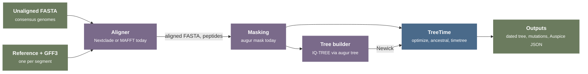

# Sequence alignment for end-to-end TreeTime runs

TreeTime reads a sequence alignment, a tree, and metadata. In Nextstrain pipelines, other tools produce the alignment: `augur align`, which wraps MAFFT, or Nextclade. This report surveys current alignment methods and tools, and assesses which of them TreeTime could include so that a run can start from unaligned sequences without external programs.

- **Scope**: assembled consensus genomes of viral and bacterial pathogens that are closely related within one dataset. The report covers pairwise alignment to a reference, de novo multiple sequence alignment, phylogeny-aware alignment, the processing steps between alignment and inference, mutation-based input formats, and Rust implementations. Read mapping and variant calling from raw reads are outside the scope, except where bacterial pipelines depend on them. Tree building is covered only as the next external step in the chain; [feat-tree-infer.md](feat-tree-infer.md) surveys it in detail
- **Evidence**: source code of TreeTime, Augur, Nextclade, Nextstrain pathogen workflows, and Rust crates at recorded commits; papers and preprints resolved by DOI; package registry metadata. Software versions: Augur 34.1.4 (2026-09-09) and Nextclade 3.24.0 (2026-09-30)
- **Limits**: no aligner was built, run, or benchmarked for this report. Speed and accuracy figures come from the cited papers and commit messages, measured on their own data

## Summary

- **Pipelines give TreeTime a reference-coordinate alignment.** All Nextstrain workflows surveyed except one build (rubella whole genome, de novo MSA) align each segment to one reference and remove insertions relative to it. High-volume pathogens moved from MAFFT to Nextclade for speed and memory. Smaller pathogens still use `augur align`, which runs a MAFFT multiple alignment and then removes the insertion columns. Bacterial workflows (tuberculosis) map reads and pass a VCF instead of an alignment
- **Reference-based pairwise alignment is the best fit for TreeTime.** Seed matching, a band around the seed chain, and affine-gap dynamic programming align a 30 kb viral genome to its reference independently of all other sequences. The result per sequence (substitutions, deletion ranges, missing ranges, and insertions, all in reference coordinates) is the data that TreeTime's sparse representation stores. Per-sequence alignment also parallelizes and streams, so it can remove the step that loads a dense alignment into memory
- **Nextclade's Rust aligner is the closest existing implementation, but TreeTime cannot depend on it as it is.** It is MIT-licensed, about 1,600 lines of code without tests plus the nucleotide alphabet it uses, and adds codon-aware gap costs from the genome annotation. The crate is not published, and its exact version pins conflict with TreeTime's. General Rust alignment crates either lack per-position gap costs or are heuristic and unmaintained
- **Alignment choices change TreeTime results.** Insertions removed during projection are invisible to TreeTime's indel term, the placement of ambiguous gaps decides whether identical deletions count as one event or several, the conversion of gaps to `N` removes deletion evidence, and a SNP-only alignment changes the unit of the clock rate. Each of these needs an approved target behavior before implementation
- **De novo and phylogeny-aware alignment form a separate, larger mode, and alignment alone does not make a run end-to-end.** Recent multiple aligners (TWILIGHT, HAlign 4) handle millions of SARS-CoV-2 genomes and keep insertions, and phylogeny-aware methods (PRANK, indelMaP) separate insertions from deletions. No study was found that measures how the choice of aligner changes the dating of closely related pathogens. TreeTime also needs a tree, which today comes from IQ-TREE ([feat-tree-infer.md](feat-tree-infer.md))

## Background

### Terms

A reference-coordinate alignment [1](#gloss-1) aligns each sequence to one reference and removes the columns where the reference has a gap. Every row then has the reference length, and column $i$ of every row corresponds to position $i$ of the reference. A multiple sequence alignment (MSA) aligns all sequences jointly and keeps the insertion columns. Augur converts an MSA into a reference-coordinate alignment by removing those columns.

For a reference $R$ and the pairwise alignment $A_q$ of query $q$ to $R$, let $P_R$ be the operation that removes the columns where the aligned reference has a gap. The projected row satisfies

$$
\left|P_R(A_q)\right| = |R|
$$

where:

- $|R|$ -- length of the reference sequence
- $P_R(A_q)$ -- the query row after removal of insertion columns

The length invariant is necessary but not sufficient: every kept column must also correspond to its reference position, and the bases that $P_R$ removes are lost unless the aligner records them separately.

### What TreeTime accepts today

- **Aligned FASTA only.** `struct AlignmentArgs` documents its flag as "Aligned FASTA input" [packages/app-commands/src/commands/shared/alignment.rs#L18](../../packages/app-commands/src/commands/shared/alignment.rs#L18). `fn get_common_length()` rejects sequences of different lengths and lists the names for each length [packages/treetime/src/seq/alignment.rs#L113](../../packages/treetime/src/seq/alignment.rs#L113). A public report describes unaligned input to `augur refine` that failed with an unexplained loading error [[issue](https://github.com/neherlab/treetime/issues/258)], and a maintainer states the input contract: "Sequences also have to be aligned" [[issue](https://github.com/neherlab/treetime/issues/306)]. The v0 web interface labelled its alignment upload "Select alignment file (ALIGNED!)" and listed unaligned sequences among common input problems ([kb/proposals/feat-inv-treetime-web-v0.md](../proposals/feat-inv-treetime-web-v0.md))
- **Gap policy.** `enum GapFill` selects `only-terminal` (default), `all`, or `none` [packages/treetime/src/seq/gap_fill.rs#L43](../../packages/treetime/src/seq/gap_fill.rs#L43), and `fn apply_gap_fill()` replaces the selected gaps with the unknown character before inference [packages/treetime/src/seq/gap_fill.rs#L5](../../packages/treetime/src/seq/gap_fill.rs#L5)
- **Indels from gap patterns.** TreeTime places insertion and deletion events on edges from the gap ranges of the aligned sequences, for example in `fn resolve_indels_backward()` [packages/treetime/src/seq/indel.rs#L180](../../packages/treetime/src/seq/indel.rs#L180), and adds a Poisson indel term to the branch-length likelihood in `fn poisson_indel_log_lh()` [packages/treetime/src/optimize/indel.rs#L74](../../packages/treetime/src/optimize/indel.rs#L74) ([kb/decisions/optimize-indel-contribution-to-likelihood.md](../decisions/optimize-indel-contribution-to-likelihood.md)). The gap placement of the aligner is therefore an input to branch-length optimization
- **Amino-acid partitions from pre-translated files.** `ancestral` reads one aligned peptide FASTA per CDS through the `--translations` template, with CDS coordinates from a GFF3 annotation [packages/app-commands/src/commands/ancestral/args.rs#L268-L297](../../packages/app-commands/src/commands/ancestral/args.rs#L268-L297) and `fn read_gff3_cds_features_filtered()` [packages/treetime-io/src/gff.rs#L29](../../packages/treetime-io/src/gff.rs#L29). In pipelines, Nextclade writes these peptide files
- **Variant input is not implemented.** `--vcf-reference` is parsed, but no VCF reader exists ([kb/issues/M-io-vcf-input-output-unimplemented.md](../issues/M-io-vcf-input-output-unimplemented.md)). MAPLE, Nextclade NDJSON, and UShER MAT inputs are open issues ranked in [kb/proposals/io-format-coverage.md](../proposals/io-format-coverage.md)
- **A tree is required.** `timetree` stops with a required-argument error when `--tree` is absent [packages/app-commands/src/commands/timetree/args.rs#L159](../../packages/app-commands/src/commands/timetree/args.rs#L159). TreeTime v0 has no internal tree builder either: `def tree_inference()` calls IQ-TREE, FastTree, or RAxML and raises an error when none of them runs [packages/legacy/treetime/treetime/utils.py#L410-L450](../../packages/legacy/treetime/treetime/utils.py#L410-L450)
- **Pipelines in one process.** The `pipeline` command chains TreeTime commands in one process. The dataset documentation states that subsampling, alignment, tree building, and export "still belong to Snakemake and Augur" [data/README.md#L67](../../data/README.md#L67)

## How Nextstrain pipelines align today

### `augur align`

- **One aligner.** `augur align` builds one of two MAFFT command lines [[src](https://github.com/nextstrain/augur/blob/0d287496eed3816f94d674f5a08201273f479487/augur/align.py#L253-L260)] [Katoh and Standley 2013](https://doi.org/10.1093/molbev/mst010) [[1](#ref-1)]:
  - New alignment: `mafft --reorder --anysymbol --nomemsave --adjustdirection --thread N`
  - Addition to an existing alignment: `mafft --add <seqs> --keeplength --reorder --anysymbol --nomemsave --adjustdirection --thread N <existing>`
- **MSA first, projection second.** `--reference-sequence` adds the reference to the input. After MAFFT, `strip_non_reference` removes every column where the reference has a gap and writes the removed insertions to a CSV file [[src](https://github.com/nextstrain/augur/blob/0d287496eed3816f94d674f5a08201273f479487/augur/align.py#L271-L379)]
- **Gap filling.** `--fill-gaps` replaces every `-` with `N`. Its help text says to use it "If gaps represent missing data rather than true indels" [[src](https://github.com/nextstrain/augur/blob/0d287496eed3816f94d674f5a08201273f479487/augur/align.py#L403-L417)]
- **Masking is a separate command.** `augur mask` sets sites from a BED file or list, and a number of bases at each end, to `N` [[src](https://github.com/nextstrain/augur/blob/0d287496eed3816f94d674f5a08201273f479487/augur/mask.py#L80-L125)]. It has no option to convert only terminal gaps to `N`; an open issue notes that a copied script for this "seems to travel around quite a bit" [[issue](https://github.com/nextstrain/augur/issues/1156)]
- **Tree building follows.** `augur tree` runs IQ-TREE by default with `-m GTR` [[src](https://github.com/nextstrain/augur/blob/0d287496eed3816f94d674f5a08201273f479487/augur/tree.py#L29-L50)] [Minh et al. 2020](https://doi.org/10.1093/molbev/msaa015) [[2](#ref-2)]

### Nextclade

Nextclade aligns each query sequence pairwise to the reference of a dataset, removes insertions relative to the reference, and records them separately [Aksamentov et al. 2021](https://doi.org/10.21105/joss.03773) [[3](#ref-3)]. With a genome annotation it also translates each CDS and aligns the peptides. The algorithm is described under [Reference-based pairwise alignment](#reference-based-pairwise-alignment).

### Practice per pathogen

The workflows fall into three groups. All links point to the default-branch tips listed under [Sources of evidence](#sources-of-evidence).

- **Nextclade, reference-based**
  - SARS-CoV-2 (`ncov`): `nextclade run` with the reference and annotation, then masking of 100 bases at the start, 200 at the end, and two primer-affected sites [[src](https://github.com/nextstrain/ncov/blob/3432c85760b6c8cd0f815a85167ebb46c8131abb/defaults/parameters.yaml#L102-L107)]
  - Mpox: `nextclade3 run` with widened bands (`--excess-bandwidth 100 --terminal-bandwidth 300 --window-size 40 --min-seed-cover 0.1`), then `augur mask` with both ends and a BED file of repeat regions [[src](https://github.com/nextstrain/mpox/blob/3e484eb891e1b223f26029121fc94d1bbd891a6b/phylogenetic/rules/prepare_sequences.smk#L199-L270)]
  - Seasonal influenza: one build per segment, `nextclade3 run` with `--gap-alignment-side right`, CDS selection, and translations [[src](https://github.com/nextstrain/seasonal-flu/blob/f34feaa4650fe3cfd1fa41b11574f9647a92065a/workflow/snakemake_rules/core.smk#L26-L79)]
  - Ebola: Nextclade datasets per species [[src](https://github.com/nextstrain/ebola/blob/eadbca0b2bbcd471835170486af3828c99093f13/phylogenetic/rules/nextclade.smk#L1-L46)]
  - RSV: Nextclade for the genome; the duplicated region of the G gene is cut out, aligned with `augur align`, and put back [[src](https://github.com/nextstrain/rsv/blob/2433534935baac23c5cefcfdbc5fb33222b1d02d/workflow/snakemake_rules/core.smk#L387-L485)]
  - Measles: `nextclade run --input-ref` per gene region with relaxed seed cover [[src](https://github.com/nextstrain/measles/blob/309d337318f431cf0fef589b8699228ac9c82198/phylogenetic/rules/prepare_sequences.smk#L9-L31)]
  - Hepatitis B: the circular genome is rotated to the reference origin before alignment because about 10% of full-length genomes use another origin [[src](https://github.com/nextstrain/hepatitisB/blob/bdc5c3e8890e1e95db81b4bdae886caa98f7dacb/ingest/scripts/re-circularise.py#L1-L14)]
- **`augur align` (MAFFT) with projection to a reference**
  - Zika: `augur align --reference-sequence --fill-gaps --remove-reference` [[src](https://github.com/nextstrain/zika/blob/e63cb9cd103fe51bf7ab804ff02c913842df4e81/phylogenetic/rules/prepare_sequences.smk#L62-L89)]. Dengue, West Nile virus, mumps, oropouche (per segment), and yellow fever use the same pattern
  - Lassa (segments L and S): new GPC sequences are added to a curated alignment with `--existing-alignment` "to maintain codon alignment" [[src](https://github.com/nextstrain/lassa/blob/be1faa2a29cf12b3e058c8f5aedf9dfbb013c13c/phylogenetic/rules/prepare_sequences.smk#L100-L148)]
  - Avian influenza: per-segment alignment, then concatenation of segments for genome builds and masking of columns with low base support [[src](https://github.com/nextstrain/avian-flu/blob/f12b587ae209bbde4e5759988b32631bb47f12da/rules/genome.smk#L35-L95)]
  - Rubella: the whole-genome build runs `augur align` without a reference, which gives a de novo MSA [[src](https://github.com/nextstrain/rubella/blob/5d94165bbbb69a7fefd89d29bc7eb1df9ac2e5d5/phylogenetic/rules/prepare_sequences.smk#L75-L95)]
- **Read mapping and VCF (bacteria)**
  - Tuberculosis: reads are mapped to H37Rv with snippy, `snippy-core` builds a core alignment with a mask of repetitive regions, and a VCF of informative sites goes to `augur tree`, `refine`, `ancestral`, and `translate` with `--vcf-reference` [[src](https://github.com/nextstrain/tb/blob/d23ba2b8359dd777ae686067bb2f038ac1645acb/Snakefile#L324-L395)]

### From MAFFT to Nextclade

The commit history of the high-volume workflows records why they changed aligners:

- **2020-09-14, `ncov`**: MAFFT's reference mode replaced partitioned `augur align` runs. The commit message reports: "The partition with augur align approach requires ~10 min on 96 CPUs. The mafft reference alignment approach requires ~13 min on 8 CPUs, making it about 10 times faster" [[commit](https://github.com/nextstrain/ncov/commit/00d73bfae9b69316f64bc1bc4b3aab7a79dbb90f)]
- **2021-04-21, `ncov`**: "Use nextalign for alignment instead of mafft" [[commit](https://github.com/nextstrain/ncov/commit/ff49561d5e26860d830a1db72b3ee93d46a9fae1)]
- **2022-05-18, mpox**: the first workflow commit "swaps in nextalign for mafft for speed" [[commit](https://github.com/nextstrain/mpox/commit/30b3366062b9e3a4e0f13429bc0e2a144eae655e)]
- **2024, Nextclade 3**: the separate `nextalign` program was removed, and `nextclade run --input-ref` took its role [[issue](https://github.com/nextstrain/nextclade/issues/1456)]

The Augur maintainers decided not to make `augur align` call Nextclade. A maintainer's comment on the request explains:

> `augur align` has historically produced a multiple sequence alignment with a third-party tool, while `nextclade` produces a reference-based alignment. These are two distinctly different approaches to alignment that the user needs to make a thoughtful decision about

and

> each new pathogen will require some thoughtful tuning of alignment parameters to get high-quality alignments

[[issue](https://github.com/nextstrain/augur/issues/1462#issuecomment-2278477787)]. The issue was closed as not planned.

### Reported pain points

- **Memory and speed of MSA**: an early `ncov` commit partitioned MAFFT runs because "Aligning all available sequences with a single mafft process uses too much memory" [[commit](https://github.com/nextstrain/ncov/commit/2d759596eb6d5f0982b455f45bdf157e4b67e357)]
- **Divergent sequences**: the Nextclade documentation states that "Alignment may fail if the query sequence is too divergent from the reference sequence" [[doc](https://docs.nextstrain.org/projects/nextclade/en/stable/user/algorithm/01-sequence-alignment.html#:~:text=Alignment%20may%20fail)]. Workflows answer with per-pathogen parameters (mpox, measles, dengue) or curated alignments (Lassa GPC)
- **Insertions**: both aligners remove insertions relative to the reference. The RSV G-gene duplication needs a separate MSA
- **Terminal gaps versus missing data**: workflows choose between `--fill-gaps`, which also erases real deletions, manual masking, or a copied script
- **Segmented and circular genomes**: every segmented pathogen aligns segments separately and concatenates them by hand for genome builds; circular genomes need rotation first

## Method landscape

### Reference-based pairwise alignment

Each query is aligned to the reference independently of the other queries, so the cost grows linearly with the number of sequences. All tools in this group produce a reference-coordinate alignment and drop insertions, unless they record them separately.

#### Nextclade

Source read at Nextclade 3.24.0 (2026-09-30), commit `529db53e`. The algorithm has five steps:

1. **Seed index.** Three FM-indexes [2](#gloss-2) of the reference, each one dropping every third base in a different phase, so that seeds match the pattern `XX.XX.XX` and ignore most third-codon-position changes. Query k-mers that contain `N` are skipped [[src](https://github.com/nextstrain/nextclade/blob/529db53e8f5b16d8a5d1161abd8b60ef04109817/packages/nextclade/src/align/seed_match.rs#L224-L273)]
2. **Seed extension and chaining.** Exact hits are extended while fewer than 8 mismatches fall in a window of 30 bases, kept when at least 40 bases long, and chained by dynamic programming. Alignment fails when the chain covers less than 33% of the query [[src](https://github.com/nextstrain/nextclade/blob/529db53e8f5b16d8a5d1161abd8b60ef04109817/packages/nextclade/src/align/seed_match.rs#L457-L499)]
3. **Band.** A band [3](#gloss-3) around the seed chain, 9 extra cells wide between seeds and 50 at the ends [[src](https://github.com/nextstrain/nextclade/blob/529db53e8f5b16d8a5d1161abd8b60ef04109817/packages/nextclade/src/align/params.rs#L176-L213)]
4. **Dynamic programming.** Affine-gap [4](#gloss-4) alignment inside the band with integer scores: match $+3$, mismatch $-1$, gap open $-6$ outside CDS, $-7$ at a codon start and $-8$ elsewhere inside a CDS, gap extension $0$. Compatible IUPAC pairs score as matches, and `N` scores one less than a match. Terminal gaps are free, so the alignment is semi-global [5](#gloss-5) [[src](https://github.com/nextstrain/nextclade/blob/529db53e8f5b16d8a5d1161abd8b60ef04109817/packages/nextclade/src/align/score_matrix.rs#L100-L203)]. The per-position gap-open vector comes from the CDS annotation and gives codon-aware gap placement [6](#gloss-6) [[src](https://github.com/nextstrain/nextclade/blob/529db53e8f5b16d8a5d1161abd8b60ef04109817/packages/nextclade/src/align/gap_open.rs#L10-L44)]
5. **Retries and limits.** When the best path touches the band edge, the band widths double, up to 3 attempts. A band area above $5 \times 10^8$ cells stops the alignment with an error [[src](https://github.com/nextstrain/nextclade/blob/529db53e8f5b16d8a5d1161abd8b60ef04109817/packages/nextclade/src/align/align.rs#L70-L150)]

After alignment, `fn insertions_strip()` removes the insertion columns and records each insertion as the reference position before it plus the inserted bases [[src](https://github.com/nextstrain/nextclade/blob/529db53e8f5b16d8a5d1161abd8b60ef04109817/packages/nextclade/src/align/insertions_strip.rs#L54-L95)]. Unsequenced ends are written as `-`, and later analysis steps ignore them [[doc](https://github.com/nextstrain/nextclade/blob/529db53e8f5b16d8a5d1161abd8b60ef04109817/docs/user/algorithm/01-sequence-alignment.md?plain=1#L53)]. Presets for high-diversity and short sequences relax the seed and band parameters [[src](https://github.com/nextstrain/nextclade/blob/529db53e8f5b16d8a5d1161abd8b60ef04109817/packages/nextclade/src/align/params.rs#L216-L248)].

Properties that matter for TreeTime:

- **Gap extension costs nothing by default.** A deletion costs the same regardless of its length. This matches the assumption of TreeTime's Poisson indel term, which counts every indel as one event regardless of length ([indel-models/2-gap-treatment.md](indel-models/2-gap-treatment.md))
- **Stated scope.** The Nextclade paper describes the aligner as written for "fast pairwise alignment of similar sequences ($<10\%$ divergence) with limited insertions and deletions" and recommends MAFFT or minimap2 for more diverse data [[src](https://github.com/nextstrain/nextclade/blob/529db53e8f5b16d8a5d1161abd8b60ef04109817/paper/paper.md?plain=1#L118-L119)]
- **Documentation and code disagree on the alignment type.** The documentation describes the algorithm as a variation of the Smith-Waterman algorithm [[doc](https://github.com/nextstrain/nextclade/blob/529db53e8f5b16d8a5d1161abd8b60ef04109817/docs/user/algorithm/01-sequence-alignment.md?plain=1#L5-L12)]. The recurrence has no clamp at zero and its traceback starts at the last cell, so it is global alignment with free end gaps, not local alignment
- **Known defects in gap placement.** The Nextclade knowledge base records that `--gap-alignment-side` places ambiguous gaps on the side opposite to its documentation [[src](https://github.com/nextstrain/nextclade/blob/529db53e8f5b16d8a5d1161abd8b60ef04109817/kb/issues/M-align-gap-alignment-side-inverted.md?plain=1#L1-L20)], and that the codon-aware cost is charged only where a gap starts, so an ambiguous deletion can remove a start codon [[src](https://github.com/nextstrain/nextclade/blob/529db53e8f5b16d8a5d1161abd8b60ef04109817/kb/issues/M-align-gap-end-cost-in-cds.md?plain=1#L1-L16)]
- **Memory grows with band area.** Each cell holds a 32-bit score and an 8-bit path. For a 197 kb mpox genome the score matrix can reach about 1.6 GB per worker, which exceeds the WebAssembly memory limit with several workers [[src](https://github.com/nextstrain/nextclade/blob/529db53e8f5b16d8a5d1161abd8b60ef04109817/kb/known-issues/wasm-oom-large-genomes.md?plain=1#L1-L12)]
- **One reference per run.** The reference reader takes the first FASTA record, so segmented genomes need one run per segment [[src](https://github.com/nextstrain/nextclade/blob/529db53e8f5b16d8a5d1161abd8b60ef04109817/packages/nextclade/src/io/fasta.rs#L180-L190)]

#### MAFFT reference modes

MAFFT version 7 [Katoh and Standley 2013](https://doi.org/10.1093/molbev/mst010) [[1](#ref-1)] adds sequences to an existing alignment with `--add` and `--addfragments` [Katoh and Frith 2012](https://doi.org/10.1093/bioinformatics/bts578) [[4](#ref-4)]. With `--keeplength`, "(1) insertions in the new sequences are deleted and (2) all-gap sites in the original MSA are reinserted", which the authors describe as "useful for mapping new sequences to a reference MSA" [Katoh et al. 2019](https://doi.org/10.1093/bib/bbx108) [[5](#ref-5)]. This is the mode `ncov` used in 2020, and the mode that the MAPLE documentation recommends for building its input [[doc](https://github.com/NicolaDM/MAPLE/blob/784cc0f2f8c0bf0b733b45a7113eef250685cf45/README.md?plain=1#L38)].

#### Read mappers for genomes

- **ViralMSA** maps genomes to a reference with read mappers, "scales linearly with the number of sequences", and its alignments "omit insertions with respect to the reference genome" [Moshiri 2021](https://doi.org/10.1093/bioinformatics/btaa743) [[6](#ref-6)]. Its default mapper is now `rammap` [[src](https://github.com/niemasd/ViralMSA/blob/599bcd8e76023ad71b5da49fac6817d6b24d66df/ViralMSA.py#L27)]
- **minimap2** chains minimizer seeds and runs dynamic programming between anchors [Li 2018](https://doi.org/10.1093/bioinformatics/bty191) [[7](#ref-7)], and later versions align through long indels [Li 2021](https://doi.org/10.1093/bioinformatics/btab705) [[8](#ref-8)]. Pangolin runs `minimap2 -a -x asm20 --sam-hit-only --secondary=no --score-N=0` and converts the result to a reference-coordinate alignment with `gofasta` [[src](https://github.com/cov-lineages/pangolin/blob/ef3998fa4722739245092644d56686b8e71fae26/pangolin/scripts/preprocessing.smk#L33-L37)] [O'Toole et al. 2021](https://doi.org/10.1093/ve/veab064) [[9](#ref-9)]
- **rammap** is a Rust reimplementation of minimap2 whose preprint reports concordance with minimap2 [Wang and Li 2026](https://doi.org/10.64898/2026.05.26.726289) [[10](#ref-10)]. It is the only pure-Rust mapper of this kind found

Read mappers use one scalar gap cost, so they cannot prefer in-frame gaps inside a CDS, and their drop-off heuristics can split one genome into several alignment records.

### Pairwise dynamic programming

TreeTime needs global alignment of a query to a reference with free end gaps. The kernels differ in cost model and complexity, where $n$ and $m$ are the sequence lengths, $w$ is the band width, and $s$ is the alignment score or edit distance:

- **Full matrix.** Needleman and Wunsch [Needleman and Wunsch 1970](<https://doi.org/10.1016/0022-2836(70)90057-4>) [[11](#ref-11)] and Smith and Waterman [Smith and Waterman 1981](<https://doi.org/10.1016/0022-2836(81)90087-5>) [[12](#ref-12)] fill an $n \times m$ matrix in $O(nm)$ time. Gotoh added affine gaps at the same cost [Gotoh 1982](<https://doi.org/10.1016/0022-2836(82)90398-9>) [[13](#ref-13)], and Myers and Miller reduced the memory to linear [Myers and Miller 1988](https://doi.org/10.1093/bioinformatics/4.1.11) [[14](#ref-14)]. Position-dependent gap costs fit without change
- **Banded matrix.** Restricting the matrix to a band costs $O(nw)$ time. Ukkonen's band doubling finds the optimal alignment in $O(ns)$ [Ukkonen 1985](<https://doi.org/10.1016/s0019-9958(85)80046-2>) [[15](#ref-15)]. Nextclade uses a band from seeds with doubling on boundary hits
- **SIMD vectorization.** Striped Smith-Waterman [Farrar 2007](https://doi.org/10.1093/bioinformatics/btl582) [[16](#ref-16)], difference recurrences in ksw2 [Suzuki and Kasahara 2018](https://doi.org/10.1186/s12859-018-2014-8) [[17](#ref-17)], and the Parasail library [Daily 2016](https://doi.org/10.1186/s12859-016-0930-z) [[18](#ref-18)] speed up affine-gap alignment with scalar gap costs
- **Wavefront alignment.** WFA [7](#gloss-7) computes exact affine-gap alignments in $O(ns)$ time [Marco-Sola et al. 2021](https://doi.org/10.1093/bioinformatics/btaa777) [[19](#ref-19)], and BiWFA reduces the memory to $O(s)$ [Marco-Sola et al. 2023](https://doi.org/10.1093/bioinformatics/btad074) [[20](#ref-20)]. Its cost grows with divergence, which suits similar genomes, but its wavefronts assume the same gap cost at every position
- **Adaptive blocks.** Block Aligner moves, grows, and shrinks a SIMD block along the alignment and accepts position-specific scoring profiles [Liu and Steinegger 2023](https://doi.org/10.1093/bioinformatics/btad487) [[21](#ref-21)]. It is heuristic: the paper reports an error rate below 3%
- **Exact edit distance.** Edlib [Šošić and Šikić 2017](https://doi.org/10.1093/bioinformatics/btw753) [[22](#ref-22)], A*PA [Groot Koerkamp and Ivanov 2024](https://doi.org/10.1093/bioinformatics/btae032) [[23](#ref-23)], and A*PA2 [Groot Koerkamp 2024](https://doi.org/10.4230/LIPIcs.WABI.2024.17) [[24](#ref-24)] compute exact unit-cost edit distance. Unit costs cannot express affine gaps or codon-aware placement

Only full-matrix and banded dynamic programming accept a different gap cost at every reference position without redesign. Block Aligner's profile interface is the one library interface found that does.

### Seeding and chaining

- **Minimizers** select one k-mer per window to reduce index size [Roberts et al. 2004](https://doi.org/10.1093/bioinformatics/bth408) [[25](#ref-25)]. **Syncmers** select k-mers by their own content, so mutations in flanking bases cannot remove them [Edgar 2021](https://doi.org/10.7717/peerj.10805) [[26](#ref-26)]. **Strobemers** link k-mers and tolerate indels better [Sahlin 2021](https://doi.org/10.1101/gr.275648.121) [[27](#ref-27)]
- **Seed-chain-extend** has an average-case accuracy guarantee in almost $O(m \log n)$ time [Shaw and Yu 2023](https://doi.org/10.1101/gr.277637.122) [[28](#ref-28)]
- **SIMD minimizer computation** finds all minimizers of a human genome in seconds [Groot Koerkamp and Martayan 2025](https://doi.org/10.1101/2025.01.27.634998) [[29](#ref-29)] (preprint)
- Nextclade instead uses the codon-spaced FM-index described above. Spaced seeds that ignore third codon positions tolerate synonymous changes, which are the most common differences between related viral genomes

### De novo multiple sequence alignment

De novo MSA keeps insertion columns and needs no reference, but every method in this group aligns sequences jointly, so its cost and its result depend on the whole dataset.

- **Progressive [8](#gloss-8) and consistency aligners**
  - MAFFT's progressive and iterative modes [Katoh and Standley 2013](https://doi.org/10.1093/molbev/mst010) [[1](#ref-1)]
  - Clustal Omega, designed and evaluated for proteins [Sievers et al. 2011](https://doi.org/10.1038/msb.2011.75) [[30](#ref-30)]
  - Muscle5, which builds ensembles of alignments by perturbing parameters and guide trees and showed that high support in an RNA-virus phylogeny was an artefact of alignment bias [Edgar 2022](https://doi.org/10.1038/s41467-022-34630-w) [[31](#ref-31)]
  - Kalign 3 [Lassmann 2020](https://doi.org/10.1093/bioinformatics/btz795) [[32](#ref-32)]
  - FAMSA2, limited to proteins [Gudyś et al. 2026](https://doi.org/10.1038/s41587-026-03095-3) [[33](#ref-33)]
- **Large sets of similar DNA sequences**
  - HAlign 3 uses center-star alignment [9](#gloss-9) for "closely related viral or prokaryotic genomes" [Tang et al. 2022](https://doi.org/10.1093/molbev/msac166) [[34](#ref-34)]. HAlign 4 replaces the suffix tree with a BWT index and the band with WFA, and aligns 10 million SARS-CoV-2 genomes in about 12 minutes with 300 GB of memory on 96 threads [Zhou et al. 2024](https://doi.org/10.1093/bioinformatics/btae718) [[35](#ref-35)]. Its preprocessing replaces ambiguous `N` bases "with random bases", which turns missing data into false substitutions for phylogenetics. HAlign-G extends the approach to multiple genomes [Zhang et al. 2025](https://doi.org/10.1186/s13059-025-03881-3) [[36](#ref-36)]
  - WMSA clusters sequences and aligns cluster profiles [Wei et al. 2022](https://doi.org/10.1093/bioinformatics/btac658) [[37](#ref-37)]. FMAlign2 splits the alignment at exact-match chains and aligns the pieces in parallel [Zhang et al. 2024](https://doi.org/10.1093/bioinformatics/btae014) [[38](#ref-38)]
  - TWILIGHT runs progressive profile alignment along a given guide tree with banded, tiled profiles, removes gappy columns temporarily, and runs on CPUs or GPUs [Tseng et al. 2025](https://doi.org/10.1093/bioinformatics/btaf212) [[39](#ref-39)]. With the UShER tree as guide tree it aligned 8,112,719 SARS-CoV-2 genomes in 28 hours, and 21 of 22 known lineage-defining indels were present in all sequences of the matching variants. The authors note that reference-based tools "either discarded the insertions found relative to the reference sequence or left them unaligned"
- **Divide-and-conquer methods and HMM ensembles**
  - SATé co-estimates alignment and tree iteratively [Liu et al. 2009](https://doi.org/10.1126/science.1171243) [[40](#ref-40)]. SATé-II reports that selecting the alignment and tree pair by likelihood with gaps treated as missing data is uninformative, and attributes its gains to divide-and-conquer realignment [Liu et al. 2012](https://doi.org/10.1093/sysbio/syr095) [[41](#ref-41)]
  - PASTA aligns up to 200,000 sequences [Mirarab et al. 2015](https://doi.org/10.1089/cmb.2014.0156) [[42](#ref-42)]. UPP adds fragmentary sequences to a backbone alignment with an ensemble of profile hidden Markov models [10](#gloss-10) [Nguyen et al. 2015](https://doi.org/10.1186/s13059-015-0688-z) [[43](#ref-43)]. MAGUS merges subset alignments by graph clustering [Smirnov and Warnow 2021](https://doi.org/10.1093/bioinformatics/btaa992) [[44](#ref-44)], and WITCH weights several HMMs for each fragment [Shen et al. 2022](https://doi.org/10.1089/cmb.2021.0585) [[45](#ref-45)]. These methods target divergent or fragmentary data

### Phylogeny-aware and statistical alignment

TreeTime already holds a tree and ancestral sequences, so methods that use a tree during alignment are relevant as a later research direction.

- **PRANK** separates insertions from deletions along a guide tree. Its authors show that other aligners "infer systematically biased alignments with excess deletions and substitutions, too few insertions, and implausible insertion-deletion-event histories" [Löytynoja and Goldman 2008](https://doi.org/10.1126/science.1158395) [[46](#ref-46)]. **PAGAN** extends existing alignments with a phylogeny-aware graph algorithm [Löytynoja et al. 2012](https://doi.org/10.1093/bioinformatics/bts198) [[47](#ref-47)]
- **indelMaP** extends Fitch parsimony with separate insertion and deletion events and affine long indels. Its authors find it "most suitable for densely sampled datasets with closely to moderately related sequences" and well suited for epidemiological datasets [Iglhaut et al. 2024](https://doi.org/10.1093/molbev/msae109) [[48](#ref-48)]. TreeTime already runs Fitch parsimony on gap ranges, so this method is the closest published match to TreeTime's machinery. Its implementation is a Python prototype tested on up to 800 sequences
- **Statistical alignment** co-estimates alignment and tree by MCMC in BAli-Phy [Redelings and Suchard 2005](https://doi.org/10.1080/10635150590947041) [[49](#ref-49)], sums over alignments in Historian [Holmes 2017](https://doi.org/10.1093/bioinformatics/btw791) [[50](#ref-50)], and uses a cumulative indel model for fast pairwise statistical alignment [De Maio 2021](https://doi.org/10.1093/sysbio/syaa050) [[51](#ref-51)]. These methods do not reach thousands of whole genomes
- **Sequence graphs.** Partial-order alignment [11](#gloss-11) aligns a query to a graph of alternative paths. Theseus computes optimal affine-gap alignments of a sequence to a graph [Jiménez-Blanco et al. 2026](https://doi.org/10.1093/bioinformatics/btag561) [[52](#ref-52)]. A graph could hold insertions shared by several samples, but it needs a mapping onto TreeTime's partitions

### Alignment uncertainty and downstream inference

- Different aligners led to different conclusions on genomic data from seven yeast species [Wong et al. 2008](https://doi.org/10.1126/science.1151532) [[53](#ref-53)]
- In simulations, topological accuracy falls as alignment error rises, mostly for pectinate trees; for balanced ultrametric trees with equal branch lengths the effect was small [Ogden and Rosenberg 2006](https://doi.org/10.1080/10635150500541730) [[54](#ref-54)]
- On 200 chordate gene families, aligners form a similarity-based class and an evolution-based class, and "tree estimates and their branch lengths appear highly dependent on the class of aligner used" [Blackburne and Whelan 2013](https://doi.org/10.1093/molbev/mss256) [[55](#ref-55)]
- Almost all aligners bias ancestral reconstruction "towards reconstructed sequences longer than the true ancestors", from a preference for inferring insertions [Vialle et al. 2018](https://doi.org/10.1093/molbev/msy055) [[56](#ref-56)]
- GUIDANCE2 scores the reliability of alignment regions by perturbing guide trees, co-optimal solutions, and gap parameters [Sela et al. 2015](https://doi.org/10.1093/nar/gkv318) [[57](#ref-57)]

All of these studies use divergent genes or simulations. No study was found that measures the effect of the aligner on branch lengths, clock rates, or dates of closely related pathogen genomes. For SARS-CoV-2, the evidence points to errors in the consensus sequences rather than in the aligner (see [Masking](#masking-problematic-sites)).

### Machine-learning aligners

BetaAlign trains transformers on simulated alignments of about 10 sequences and is limited to 1024 tokens [Dotan et al. 2024](https://doi.org/10.1093/bioinformatics/btaf009) [[58](#ref-58)]. learnMSA trains profile HMMs for protein families [Becker and Stanke 2022](https://doi.org/10.1093/gigascience/giac104) [[59](#ref-59)]. No machine-learning method applies to nucleotide genome alignment at pathogen scale.

### Steps between alignment and inference

#### Masking problematic sites

- Some recurrent SARS-CoV-2 mutations came from single laboratories, sat at primer binding sites, and made it "appear as though there has been an excess of recurrent mutation or recombination" [Turakhia et al. 2020](https://doi.org/10.1371/journal.pgen.1009175) [[60](#ref-60)]. The authors published a list of problematic sites [12](#gloss-12) as a VCF file with `mask` and `caution` filters; the list has not been updated since 2022 [[src](https://github.com/W-L/ProblematicSites_SARS-CoV2/blob/a36cee5dc5ce8fabcfd23f73b690874c739c2928/problematic_sites_sarsCov2.vcf)]
- Waves of amplicon-scheme errors followed the waves of variants and affected the global tree; reassembling the reads with Viridian fixed them before alignment [Hunt et al. 2026](https://doi.org/10.1038/s41592-025-02947-1) [[61](#ref-61)]
- Workflows mask terminal regions and lists of sites (`ncov`, mpox above). TreeTime's `homoplasy` command already reports sites with recurrent mutations on a tree ([kb/features/homoplasy.md](../features/homoplasy.md))

#### Trimming

Alignment filters remove unreliable columns of divergent alignments. Trees from filtered alignments were "on average worse than those obtained from unfiltered MSAs", with light filtering (up to 20% of columns) having little effect [Tan et al. 2015](https://doi.org/10.1093/sysbio/syv033) [[62](#ref-62)]. ClipKIT keeps parsimony-informative sites instead and performed well in phylogenomic tests [Steenwyk et al. 2020](https://doi.org/10.1371/journal.pbio.3001007) [[63](#ref-63)]. These tools target divergent gene families; for closely related genomes aligned to one reference, column homology is rarely in doubt, and no benchmark on outbreak data was found.

#### Codon-aware alignment and translation

An out-of-frame placement of an ambiguous deletion turns one codon deletion into two partial-codon changes, which appear as false amino-acid substitutions. MACSE v2 aligns coding sequences while accounting for frameshifts and stop codons [Ranwez et al. 2018](https://doi.org/10.1093/molbev/msy159) [[64](#ref-64)]. Nextclade prefers in-frame gaps through its gap-open vector, detects frame shifts, and translates each CDS from the aligned nucleotides [[src](https://github.com/nextstrain/nextclade/blob/529db53e8f5b16d8a5d1161abd8b60ef04109817/packages/nextclade/src/translate/translate_genes.rs#L226-L300)]. TreeTime's `ancestral` command consumes these translations today.

#### Gaps, `N`, and ambiguity codes

- Treating gaps as missing data can make maximum likelihood inconsistent in a constructed case [Warnow 2012](https://doi.org/10.1371/currents.rrn1308) [[65](#ref-65)], but it is consistent when substitution rates are positive on all edges [Truszkowski and Goldman 2016](https://doi.org/10.1093/sysbio/syv089) [[66](#ref-66)]. [indel-models/2-gap-treatment.md](indel-models/2-gap-treatment.md) discusses the consequences for TreeTime
- Terminal gaps in a reference-coordinate alignment usually mean that the region was not sequenced. Internal gaps can be real deletions or alignment artefacts. `augur align --fill-gaps` converts all gaps to `N`, and the MAPLE documentation recommends masking deletions with reference bases because errors at common deletions cause high ancestral uncertainty [[doc](https://github.com/NicolaDM/MAPLE/blob/784cc0f2f8c0bf0b733b45a7113eef250685cf45/README.md?plain=1#L41)]. TreeTime's default keeps internal gaps as observed events and converts only terminal gaps

### Mutation-based and alignment-free inputs

- **Mutation-annotated trees.** UShER places samples on a tree by parsimony from a VCF of differences to the reference [Turakhia et al. 2021](https://doi.org/10.1038/s41588-021-00862-7) [[67](#ref-67)], and the daily mutation-annotated tree [13](#gloss-13) of public SARS-CoV-2 genomes is built this way [McBroome et al. 2021](https://doi.org/10.1093/molbev/msab264) [[68](#ref-68)]
- **MAPLE** infers maximum-likelihood trees at pandemic scale from a file that lists, for each sample, its differences from one reference [De Maio et al. 2023](https://doi.org/10.1038/s41588-023-01368-0) [[69](#ref-69)]. Each entry is a character and a position, with a length for runs of `N` or `-` [[src](https://github.com/NicolaDM/MAPLE/blob/784cc0f2f8c0bf0b733b45a7113eef250685cf45/example_files/MAPLE_alignment_example.txt)]. This is the same information as TreeTime's sparse sequence representation
- **Split k-mers.** SKA2 genotypes bacteria from reads or assemblies with or without a reference, "with no false positives" in outbreak simulations [Derelle et al. 2024](https://doi.org/10.1101/gr.279449.124) [[70](#ref-70)]. It is written in Rust under Apache-2.0 [[src](https://github.com/bacpop/ska.rust/tree/99bd6e013dc069320dc94833392efc0e9357d6e8)]. Split k-mers [14](#gloss-14) can miss SNPs that lie within half a split k-mer of each other
- **Distance-only methods** such as Mash give pairwise distances for tree building but no per-site states; a benchmark of 74 alignment-free methods scored trees by topology only [Zielezinski et al. 2019](https://doi.org/10.1186/s13059-019-1755-7) [[71](#ref-71)]. TreeTime needs per-site states, so these methods cannot replace an alignment for it

### Bacterial genomes

- The tuberculosis workflow maps reads and calls variants (snippy), masks repetitive regions, and passes a VCF of informative sites to TreeTime through Augur. Recombination is removed in other bacterial workflows with Gubbins [Croucher et al. 2015](https://doi.org/10.1093/nar/gku1196) [[72](#ref-72)]
- An alignment of variable sites only causes acquisition bias [15](#gloss-15): without correction, branch lengths are overestimated [Lewis 2001](https://doi.org/10.1080/106351501753462876) [[73](#ref-73)], and giving the number of unsampled invariant sites gives much better branch lengths than conditioning on variable sites [Leaché et al. 2015](https://doi.org/10.1093/sysbio/syv053) [[74](#ref-74)]

The clock rate that TreeTime reports is in substitutions per site per year. For an alignment of $L_{\mathrm{SNP}}$ variable columns from a genome of length $L$, the rate per alignment column relates to the rate per genome site approximately as

$$
\mu_{\mathrm{SNP}} \approx \mu \, \frac{L}{L_{\mathrm{SNP}}}
$$

where:

- $\mu$ -- clock rate in substitutions per genome site per year
- $\mu_{\mathrm{SNP}}$ -- clock rate in substitutions per alignment column per year
- $L$ -- genome length
- $L_{\mathrm{SNP}}$ -- number of columns in the SNP alignment

This relation ignores the maximum-likelihood bias above. A literature rate such as the *Mycobacterium tuberculosis* estimates [Menardo et al. 2019](https://doi.org/10.1371/journal.ppat.1008067) [[75](#ref-75)] applies only after this conversion. A public TreeTime issue shows a user who derived the rescaling by hand [[issue](https://github.com/neherlab/treetime/issues/316)]. TreeTime v1 has `--sequence-length` on `clock` and `timetree` [packages/app-commands/src/commands/timetree/args.rs#L272](../../packages/app-commands/src/commands/timetree/args.rs#L272). The bundled `data/tb` alignments (20, 100, and 149 samples) have 216 columns each, so they are SNP alignments of a genome of about 4.4 Mb, and rates estimated from them are per alignment column unless `--sequence-length` is set

### Phylogenetic placement

Placement methods add new sequences to a fixed tree: pplacer [Matsen et al. 2010](https://doi.org/10.1186/1471-2105-11-538) [[76](#ref-76)] and EPA-ng [Barbera et al. 2019](https://doi.org/10.1093/sysbio/syy054) [[77](#ref-77)] by likelihood on a reference alignment, and UShER and Nextclade by comparing mutation sets relative to the reference. All of them need sequences in the coordinates of the reference alignment.

### Rust implementations

Versions and release dates are from crates.io on 2026-10-04. TreeTime builds for Linux (GNU and musl), Windows (GNU), and macOS on x86_64 and aarch64 ([dev/cross/targets](../../dev/cross/targets)), so crates that build C code add cross-compilation work.

- **Nextclade aligner** (not a crate). MIT, pure Rust, codon-aware gap vector, IUPAC scoring. The workspace sets `publish = false` [[src](https://github.com/nextstrain/nextclade/blob/529db53e8f5b16d8a5d1161abd8b60ef04109817/Cargo.toml#L21-L22)], and it pins exact versions that differ from TreeTime's pins for `serde`, `clap`, `eyre`, `gcollections`, `ordered-float`, and `schemars` [[src](https://github.com/nextstrain/nextclade/blob/529db53e8f5b16d8a5d1161abd8b60ef04109817/Cargo.toml#L31-L85)]. Cargo allows one version per semver-compatible series, so a git dependency on the whole crate is expected to fail to resolve (not tested). The aligner module depends on the crate's alphabet, the gene map (only for the gap vector), the `bio` FM-index, and the error macros
- **`bio` 4.2.0 (2026-10-02)**, MIT, pure Rust. Global, semi-global, and local affine alignment, with one scalar gap cost; FM-index. Released two days before this survey, so it does not yet meet the seven-day release rule
- **`block-aligner` 0.5.1 (2024-06-23)**, MIT, pure Rust with SIMD backends selected at compile time (SSE2, AVX2, NEON, WebAssembly). Per-column gap open and close costs through its profile interface [[src](https://github.com/Daniel-Liu-c0deb0t/block-aligner/blob/4fcf630cf775de5b578fe63971f210e1dc958791/src/scores.rs#L390-L407)]. Heuristic; two contributors; no release since 2024
- **`rammap-core` 1.1.2 (2026-07-17)**, MIT, pure Rust minimap2 reimplementation with SIMD and WebAssembly backends. First published in 2026; scalar gap costs
- **`minimap2` 0.1.31+minimap2.2.30 (2026-02-22)**, MIT or Apache-2.0. Bindings that compile the C library
- **`parasail-rs` 0.9.2 (2026-09-30)**, BSD-3-Clause. Bindings built with CMake; scalar gap costs
- **`ksw2rs` 0.2.0 (2026-06-13)**, BSD-3-Clause. Port of one ksw2 kernel that still compiles C reference code on x86_64 and aarch64
- **`libwfa2` 0.1.1 (2024-09-19)**, MIT. Bindings whose build script runs `make` and `sed`
- **`simd-minimizers` 3.0.0 and `packed-seq` 5.0.0 (2026-07-07)**, MIT. SIMD minimizers for AVX2 and NEON, which TreeTime's release builds enable
- **`needletail` 0.7.3 (2026-04-20)**, MIT. FASTA and FASTQ parsing; TreeTime already has its own FASTA reader
- A*PA2 is not published on crates.io, uses MPL-2.0, and requires a nightly compiler

## Applicability to TreeTime

### What an end-to-end run needs

Today a Nextstrain build calls three external programs before TreeTime: an aligner, a masking step, and a tree builder. Built-in alignment removes the first two. The tree builder remains unless TreeTime also builds trees.

With built-in alignment, the aligner and masking boxes become TreeTime operations, and the hand-off between them can carry sparse data instead of a dense FASTA file.

### How alignment couples to TreeTime's inference

- **Sparse representation and memory.** A reference-based aligner produces, for each sequence, substitutions, deletion ranges, missing ranges, ambiguous positions, and insertions relative to the reference. TreeTime's sparse partitions store the same kinds of data, and [kb/proposals/mutation-first-sequence-representation.md](../proposals/mutation-first-sequence-representation.md) proposes to stop materializing full sequences. Each query is aligned independently, so sequences can be aligned as they are read and only their differences kept. This removes the dense load that [kb/issues/N-io-large-dataset-memory-constraint.md](../issues/N-io-large-dataset-memory-constraint.md) describes, and makes the length check of `fn get_common_length()` true by construction
- **Insertions are lost by projection.** After $P_R$, TreeTime can see deletions relative to the reference, and insertions only where the reference itself carries a deletion that some samples lack. A clade-defining insertion relative to the reference disappears from the indel term. Using the recorded insertions in the likelihood changes scientific output and needs an approved mapping onto TreeTime's partitions
- **Gap placement decides indel counts.** TreeTime derives indel events from gap ranges. Two samples that carry the same deletion inside a repeat, but with the gap placed at different positions, give two events instead of one. Pairwise alignment against one reference with a fixed tie-breaking rule places identical deletions in identical contexts at the same position; this is an inference from the algorithm, not a measured result, and it does not hold when nearby substitutions change the local scores. The codon-aware cost moves gaps inside a CDS, and the Nextclade defect in `--gap-alignment-side` means that the side setting must be part of any parity target
- **Gaps versus missing data.** TreeTime's default treats terminal gaps as missing and internal gaps as observed deletions. An aligner knows the alignment range of each query, so it can mark uncovered ends as missing directly instead of inferring them from leading and trailing gaps. Other policies exist: `augur align --fill-gaps` makes every gap missing, and the MAPLE documentation recommends replacing deletions with reference bases. The choice changes indel counts and therefore branch lengths
- **The reference is a coordinate anchor.** TreeTime reconstructs the root sequence; the reference only fixes the coordinates of mutation names and of the Auspice and node-data outputs. Choosing a reference should not change inference except through the alignment it produces
- **Translations.** Codon-aware alignment followed by translation per CDS produces the peptide alignments that `ancestral --translations` reads today. TreeTime already reads GFF3 CDS features, so it could build amino-acid partitions in the same process. [codon-substitution-models.md](codon-substitution-models.md) describes how differences between translators cause inconsistent amino-acid reconstructions, which argues for one translator shared with Nextclade
- **Segments.** One reference per segment gives one nucleotide partition per segment, which is the input model that [kb/issues/N-io-multi-segment-genome-input.md](../issues/N-io-multi-segment-genome-input.md) asks for
- **Masking and quality control.** Terminal masking, site lists from BED or VCF files, and per-sequence checks (fraction missing, failed alignment, frame shifts) are small steps that pipelines run between alignment and TreeTime
- **Constant sites.** Only SNP alignments and VCF input need the number of invariant sites. A whole-genome reference alignment includes the invariant sites

### Alignment result per sequence

Aligned FASTA is not the complete result of an alignment. A result record per input sequence keeps every piece of evidence:

- **Identity**: sequence name, reference and segment, orientation (forward or reverse complement), aligner version and parameters
- **Coverage**: alignment start and end in reference coordinates
- **Differences**: substitutions, deletion ranges, missing ranges (`N` runs and uncovered ends), and ambiguous positions with their IUPAC codes
- **Insertions**: reference position before each insertion and the inserted bases, as Nextclade and Augur already record them
- **Translations**: aligned peptide per CDS, peptide insertions, and frame shifts
- **Quality**: seed coverage, band retries, and the reason for a failure

Two invariants follow from this record: the projected row has length $|R|$ (see [Terms](#terms)), and every base of the input lies in exactly one of the aligned columns, the insertions, or the uncovered ends.

### Engineering constraints

- **Pure Rust.** TreeTime ships for seven targets including Windows (GNU) and musl Linux. Bindings that compile C or C++ (minimap2, Parasail, WFA2, Edlib) add a C toolchain and SIMD flags per target
- **Memory per worker.** Band memory grows with genome length times band width. At Nextclade's limit of $5 \times 10^8$ cells and about 5 bytes per cell, one alignment can use about 2.5 GB, so the number of parallel alignments must depend on genome length
- **Determinism.** Per-sequence alignment is independent of input order and thread count, which keeps outputs reproducible
- **Dependency rules.** Sequence alignment is not a listed responsibility in the project's technology list, so a library for it needs a decision and a new entry. Every pinned release must be at least seven days old
- **One implementation for all surfaces.** The command line, the web app, and the desktop app must call the same Rust operation, so that an unaligned upload in the app gives the same result as the command line

### Decisions

#### Settled

- **Keep aligned FASTA input.** Existing commands and every surveyed workflow use it, and it is the baseline against which a built-in aligner is compared ([packages/app-commands/src/commands/shared/alignment.rs#L18](../../packages/app-commands/src/commands/shared/alignment.rs#L18))
- **Output in reference coordinates.** All surveyed workflows except the rubella whole-genome build produce it, and mutation names in Augur and Auspice outputs use it (pipeline survey above)
- **Record insertions.** Projection otherwise loses their bases; Nextclade and Augur both write them to a separate output (source references above)
- **Report failures per sequence.** Nextclade documents alignment failures for divergent and low-quality sequences; a silent drop would make TreeTime input impossible to audit (documentation above)

#### Open

The questions below are independent unless a coupling is stated.

**A. Scope of the first alignment mode.** Pathogens with a reference dominate Nextstrain, but some workflows align de novo or need curated alignments. Which inputs should the first version support?

- A.a. **[recommended]** **Reference-based alignment of consensus genomes, one reference per segment.** Example: SARS-CoV-2, mpox, influenza segments, RSV, dengue against a GenBank or Nextclade dataset reference
- A.b. **De novo MSA.** Example: a TWILIGHT-style progressive alignment that uses TreeTime's current tree as guide tree, for rubella or divergent arenavirus sets
- A.c. **Both modes at once.** Example: a `--method` flag on one command; doubles the validation work before the first release

**B. Source of the aligner.** The Nextclade aligner fits but is not a crate; general crates lack codon-aware gaps or are unmaintained. Where should the implementation come from? Coupled with C.

- B.a. **[recommended]** **A shared crate extracted from Nextclade's `align/` module and used by both tools.** Example: a small crate with loose version requirements, owned in the Nextclade repository; a fix to the gap-side defect then reaches both tools at once
- B.b. **A copy inside a TreeTime crate under MIT attribution.** Example: `treetime-align` with Nextclade's seed, band, and DP code; fastest to start, but the two copies diverge
- B.c. **A new aligner from general crates.** Example: `simd-minimizers` seeds with a TreeTime-owned banded DP, or Block Aligner profiles for per-position gaps
- B.d. **C library bindings.** Example: `minimap2` bindings; mature mapper, scalar gap costs, C build on every target

**C. Parity target.** Users compare TreeTime output with Nextclade output. What behavior should a built-in aligner reproduce?

- C.a. **[recommended]** **Identical output to Nextclade for the same reference, annotation, and parameters**, with Nextclade's known gap-placement defects fixed in the shared code and recorded in `kb/decisions/`. Example: byte-identical aligned FASTA, insertions, and peptides on the bundled SARS-CoV-2 and mpox datasets
- C.b. **A TreeTime-specific target.** Example: always 5'-normalized gaps; requires a decision entry and breaks comparison with Nextclade

**D. Insertions in inference.** Projection drops insertion bases from the substitution data. Should TreeTime use the recorded insertions?

- D.a. **[recommended for the first version]** **Record and output only.** Example: insertions appear in the alignment result and in node data, but the indel term sees only reference-coordinate gaps, as today
- D.b. **Shared insertion events.** Example: identical insertions at the same reference position become one event that Fitch places on the tree and the Poisson term counts
- D.c. **Insertion columns.** Example: an MSA or a sequence graph keeps insertion columns, and partitions grow to cover them

**E. Gap semantics.** The policy decides which gaps count as deletions. Which default should the aligner produce?

- E.a. **[recommended]** **Uncovered ends missing, internal deletions observed**, with the alignment range from the aligner instead of leading and trailing gaps. Example: matches today's `only-terminal` default
- E.b. **All gaps missing.** Example: the `--fill-gaps` behavior of the MAFFT-based workflows, available as today's `all` mode

**F. Command-line surface.** Independent of A to E.

- F.a. **[recommended]** **A standalone `align` command and pipeline step.** It writes reference-coordinate FASTA, insertions, and peptides, and later a sparse format such as MAPLE that analysis commands read. Example: `treetime align --reference ref.fasta --annotation genes.gff3 --output-all out/` as the first step of a pipeline file
- F.b. **Alignment inside analysis commands.** Example: `treetime timetree --reference ref.fasta` accepts unaligned FASTA and aligns in memory without intermediate files

**G. Tree for end-to-end runs.** Independent of A to F.

- G.a. **[recommended]** **Keep `--tree` required for now.** Tree building is a separate decision with its own reference behavior and validation; [feat-tree-infer.md](feat-tree-infer.md) lists its methods and open decisions
- G.b. **Placement-based tree building.** Example: parsimony placement of samples by their mutation sets, as UShER does, followed by TreeTime's `optimize` and `prune`
- G.c. **Distance or approximate-likelihood tree building.** Example: neighbor joining or a FastTree-like method [Price et al. 2010](https://doi.org/10.1371/journal.pone.0009490) [[78](#ref-78)]; IQ-TREE [Wong et al. 2026](https://doi.org/10.1093/molbev/msag117) [[79](#ref-79)] remains the comparison target

**Recommended combination**: A.a with B.a, C.a, D.a, E.a, F.a, and G.a. A reference-based aligner shared with Nextclade gives Nextstrain users identical alignments in both tools, reaches the largest group of pathogens first, keeps every piece of evidence in the result record, and leaves the scientific changes (D.b, D.c, de novo alignment, tree building) to separate, approved decisions.

### Validation

- **Oracle, Nextclade.** Run the Nextclade command line with the same reference, annotation, and parameters, and compare aligned FASTA, insertions, and peptides. This is a parity check, not a correctness check
- **Oracle, MAFFT.** For pathogens aligned with `augur align`, compare substitution calls with `mafft --addfragments --keeplength`, and list differences in gap placement
- **Simulated truth.** Simulate sequences with indels on known trees with AliSim [Ly-Trong et al. 2022](https://doi.org/10.1093/molbev/msac092) [[80](#ref-80)] or INDELible [Fletcher and Yang 2009](https://doi.org/10.1093/molbev/msp098) [[81](#ref-81)], and measure gap placement accuracy and indel counts against the true events
- **Invariants and edge cases.** Projected length, conservation of input bases, deterministic tie-breaking, reverse complements, IUPAC codes, `N` runs, very short sequences, a wrong reference, and sequences too divergent for the band
- **Downstream effect.** Run `optimize`, `ancestral`, and `timetree` on the bundled datasets with the current alignments and with the built-in ones, and compare branch lengths, indel counts, clock rates, and node dates, separately for dense and sparse partitions. The bundled datasets contain no reference sequences; SARS-CoV-2, mpox, and RSV contain annotations. References must be added as registered fixtures
- **Performance.** Time and peak memory per genome and per thread for 30 kb (SARS-CoV-2) and 197 kb (mpox) genomes, against Nextclade on the same machine

## Cross-topic themes

- **Reference coordinates are the common language.** Nextclade, Augur, UShER, MAPLE, Pangolin, Auspice, and TreeTime's outputs all name mutations by reference position. Methods that keep insertion columns (MSA, graphs) must still project to reference coordinates for these consumers
- **Insertions are the weak point of every fast method.** Reference-based tools drop them; ViralMSA, MAFFT `--keeplength`, Nextclade, and Augur differ only in whether they record them. The MSA tools that keep them (TWILIGHT, HAlign) keep them as alignment columns, which likelihood programs treat as missing data in the samples without the insertion
- **Consensus errors matter more than aligner choice for closely related genomes.** Masking studies and the Viridian reassembly show systematic sequence errors that distort trees, while no study isolates the aligner's effect on closely related pathogens
- **Codon structure is the main pathogen-specific signal for gap placement.** Nextclade's codon-spaced seeds and codon-aware gap costs, MACSE's frameshift handling, and the Lassa workflow's curated codon alignment all address it

## Emerging trends

- **Rust in sequence analysis.** Nextclade, SKA2, rammap, `simd-minimizers`, `packed-seq`, and Sassy [Beeloo and Groot Koerkamp 2026](https://doi.org/10.1093/bioinformatics/btag244) [[82](#ref-82)] are recent Rust implementations, several with WebAssembly support
- **Alignment at the scale of millions of genomes.** TWILIGHT aligned 8 million public SARS-CoV-2 genomes and HAlign 4 reports 10 million in minutes; TWILIGHT uses a phylogeny as guide tree, which ties alignment to the tree a tool already has
- **Mutation lists replace full alignments.** UShER and MAPLE work on differences from a reference, and IQ-TREE 3 can write MAPLE files ([kb/issues/N-io-maple-alignment-input-unsupported.md](../issues/N-io-maple-alignment-input-unsupported.md)); this is the representation TreeTime's sparse mode uses
- **Fixing errors upstream.** Viridian reassembles reads with knowledge of the amplicon scheme instead of masking sites after alignment

## Controversies and conflicting evidence

- **MSA or reference alignment.** The Augur maintainers treat them as different methods that users must choose consciously, and kept `augur align` as an MSA wrapper. The TWILIGHT authors state that reference-based outputs are not true MSAs. Workflows nevertheless use both and project both to reference coordinates
- **Gaps as missing data.** Warnow showed a case of statistical inconsistency; Truszkowski and Goldman proved consistency under positive substitution rates. MAPLE's documentation recommends masking deletions, while TreeTime v1 uses deletions as evidence in its indel term
- **Alignment filtering.** Tan et al. found that filtering usually worsens single-gene trees; ClipKIT reports gains with a different selection rule. Neither tested outbreak data
- **Nextclade documentation and code.** The documentation describes a Smith-Waterman variant and 5' gap placement for `left`; the code computes semi-global alignment and places ambiguous gaps on the other side (Nextclade's own knowledge base)
- **Treatment of `N`.** HAlign 4 replaces `N` with random bases before alignment, which is incompatible with phylogenetic use; Nextclade and TreeTime treat `N` as missing data

## Gaps and open questions

- **No benchmark of aligners on real pathogen data scored by downstream inference.** No study compares Nextclade, MAFFT `--keeplength`, minimap2-based tools, and de novo MSA on closely related genomes by their effect on branch lengths, clock rates, or dates
- **No runtime measurements in this report.** Speed claims are from papers and commit messages; a banded alignment of a 30 kb genome is expected to take milliseconds, but this was not measured
- **Unverified build claims.** The failure of a git dependency on Nextclade follows from Cargo's resolution rules and the pinned versions; it was not tried. Windows and WebAssembly builds of `minimap2`, `rammap-core`, and `block-aligner` were not tried
- **No published description of Nextclade 3's aligner.** The journal paper describes the 2021 implementation; the current algorithm is documented only in its source and user documentation
- **Ownership of a shared aligner.** Option B.a needs agreement with the Nextclade maintainers on crate boundaries, versioning, and release process
- **Divergent pathogens.** How well the reference-based mode serves high-diversity sets (Lassa, rubella) with presets such as `high-diversity` was not measured

## Related knowledge base entries

- [kb/proposals/io-format-coverage.md](../proposals/io-format-coverage.md): ranking of input formats, including MAPLE, Nextclade NDJSON, VCF, and MAT
- [kb/proposals/unified-input-format-support.md](../proposals/unified-input-format-support.md): input paths that build sparse partitions without a dense alignment
- [kb/proposals/mutation-first-sequence-representation.md](../proposals/mutation-first-sequence-representation.md): storage of sequences as differences from the root
- [kb/issues/M-io-vcf-input-output-unimplemented.md](../issues/M-io-vcf-input-output-unimplemented.md): missing VCF reader
- [kb/issues/N-io-maple-alignment-input-unsupported.md](../issues/N-io-maple-alignment-input-unsupported.md): missing MAPLE reader
- [kb/issues/N-io-nextclade-ndjson-input-unsupported.md](../issues/N-io-nextclade-ndjson-input-unsupported.md): missing Nextclade NDJSON reader
- [kb/issues/N-io-large-dataset-memory-constraint.md](../issues/N-io-large-dataset-memory-constraint.md): memory of dense alignment loading
- [kb/issues/N-io-multi-segment-genome-input.md](../issues/N-io-multi-segment-genome-input.md): partitions per segment
- [kb/issues/H-timetree-tree-inference-unimplemented.md](../issues/H-timetree-tree-inference-unimplemented.md): missing tree inference
- [feat-tree-infer.md](feat-tree-infer.md): tree-building methods and open decisions for an end-to-end pipeline
- [indel-models/2-gap-treatment.md](indel-models/2-gap-treatment.md): gap treatment and the Poisson indel term
- [codon-substitution-models.md](codon-substitution-models.md): disagreement between translation paths

## Sources of evidence

Source code was read at these commits:

- TreeTime: the working tree of this repository on 2026-10-04
- Augur 34.1.4 (2026-09-09): `0d287496eed3816f94d674f5a08201273f479487`
- Nextclade 3.24.0 (2026-09-30): `529db53e8f5b16d8a5d1161abd8b60ef04109817`
- Nextstrain workflows at their default-branch tips on 2026-10-04: `ncov` `3432c857`, `mpox` `3e484eb8`, `seasonal-flu` `f34feaa4`, `zika` `e63cb9cd`, `ebola` `eadbca0b`, `rsv` `24335349`, `lassa` `be1faa2a`, `tb` `d23ba2b8`, `avian-flu` `f12b587a`, `dengue` `f6bb8a3a`, `measles` `309d3373`, `rubella` `5d94165b`, `hepatitisB` `bdc5c3e8`
- MAPLE `784cc0f2`, ViralMSA `599bcd8e`, Pangolin `ef3998fa`, Block Aligner `4fcf630c`

## Glossary

1.  **Reference-coordinate alignment.** An alignment in which every row has the length of one reference sequence, made by aligning each sequence to the reference and removing the columns where the reference has a gap. Insertions relative to the reference are removed from the rows. [↩](#gloss-use-1)
2.  **FM-index.** A compressed full-text index based on the Burrows-Wheeler transform that finds exact occurrences of a pattern in time proportional to the pattern length. [↩](#gloss-use-2)
3.  **Band.** The region of the dynamic-programming matrix near the expected alignment path. Banded alignment fills only this region, so its cost grows with sequence length times band width instead of the product of both sequence lengths. [↩](#gloss-use-3)
4.  **Affine gap cost.** A gap cost of the form $d + (g-1)e$ for a gap of length $g$, with an opening cost $d$ and an extension cost $e$. With $e = 0$, every gap costs the same regardless of its length. [↩](#gloss-use-4)
5.  **Semi-global alignment.** Global alignment in which gaps at the start and end of one or both sequences are free, so a partial query can align to part of the reference without penalty. [↩](#gloss-use-5)
6.  **Codon-aware gap placement.** Gap costs that depend on the position in the reference: lower at codon starts inside coding sequences and lowest outside them, so that ambiguous gaps preserve the reading frame. [↩](#gloss-use-6)
7.  **Wavefront alignment (WFA).** An exact affine-gap alignment algorithm that extends diagonals of equal score instead of filling the matrix, so its cost grows with the alignment score ([Marco-Sola et al. 2021](https://doi.org/10.1093/bioinformatics/btaa777) [[19](#ref-19)]). [↩](#gloss-use-7)
8.  **Progressive alignment.** Multiple alignment built by aligning sequences and groups of sequences in the order given by a guide tree, from the most similar to the least similar. [↩](#gloss-use-8)
9.  **Center-star alignment.** Multiple alignment built by aligning every sequence pairwise to one center sequence and merging the pairwise alignments through the center. [↩](#gloss-use-9)
10.  **Profile hidden Markov model.** A probabilistic model of an alignment with match, insertion, and deletion states for each column, used to align new sequences to the alignment. [↩](#gloss-use-10)
11.  **Partial-order alignment.** Alignment of a sequence to a directed acyclic graph whose paths represent the sequences already aligned, so that alternative variants share graph nodes. [↩](#gloss-use-11)
12.  **Problematic sites.** Genome positions where recurrent apparent mutations are likely sequencing, amplification, or assembly artefacts, listed so that pipelines can mask them before tree inference. [↩](#gloss-use-12)
13.  **Mutation-annotated tree (MAT).** A phylogeny in which each branch carries the mutations inferred on it, relative to a reference, stored instead of an alignment. [↩](#gloss-use-13)
14.  **Split k-mer.** A pair of k-mers that flank one middle base; samples that share the flanks are compared at the middle base without an alignment. [↩](#gloss-use-14)
15.  **Acquisition bias.** The bias that arises when only variable sites are analyzed although invariant sites exist; corrected by conditioning the likelihood on variability or by supplying the number of invariant sites. [↩](#gloss-use-15)

## References

1.  Katoh, K., and D. M. Standley. 2013. "MAFFT Multiple Sequence Alignment Software Version 7: Improvements in Performance and Usability." _Molecular Biology and Evolution_ 30(4):772-780. https://doi.org/10.1093/molbev/mst010 [↩¹](#cite-1a) [↩²](#cite-1b) [↩³](#cite-1c)
2.  Minh, Bui Quang, Heiko A Schmidt, Olga Chernomor, et al. 2020. "IQ-TREE 2: New Models and Efficient Methods for Phylogenetic Inference in the Genomic Era." _Molecular Biology and Evolution_ 37(5):1530-1534. https://doi.org/10.1093/molbev/msaa015 [↩](#cite-2)
3.  Aksamentov, Ivan, Cornelius Roemer, Emma Hodcroft, and Richard Neher. 2021. "Nextclade: clade assignment, mutation calling and quality control for viral genomes." _Journal of Open Source Software_ 6(67):3773. https://doi.org/10.21105/joss.03773 [↩](#cite-3)
4.  Katoh, Kazutaka, and Martin C. Frith. 2012. "Adding unaligned sequences into an existing alignment using MAFFT and LAST." _Bioinformatics_ 28(23):3144-3146. https://doi.org/10.1093/bioinformatics/bts578 [↩](#cite-4)
5.  Katoh, Kazutaka, John Rozewicki, and Kazunori D Yamada. 2019. "MAFFT online service: multiple sequence alignment, interactive sequence choice and visualization." _Briefings in Bioinformatics_ 20(4):1160-1166. https://doi.org/10.1093/bib/bbx108 [↩](#cite-5)
6.  Moshiri, Niema. 2021. "ViralMSA: massively scalable reference-guided multiple sequence alignment of viral genomes." _Bioinformatics_ 37(5):714-716. https://doi.org/10.1093/bioinformatics/btaa743 [↩](#cite-6)
7.  Li, Heng. 2018. "Minimap2: pairwise alignment for nucleotide sequences." _Bioinformatics_ 34(18):3094-3100. https://doi.org/10.1093/bioinformatics/bty191 [↩](#cite-7)
8.  Li, Heng. 2021. "New strategies to improve minimap2 alignment accuracy." _Bioinformatics_ 37(23):4572-4574. https://doi.org/10.1093/bioinformatics/btab705 [↩](#cite-8)
9.  O'Toole, Áine, Emily Scher, Anthony Underwood, et al. 2021. "Assignment of epidemiological lineages in an emerging pandemic using the pangolin tool." _Virus Evolution_ 7(2):veab064. https://doi.org/10.1093/ve/veab064 [↩](#cite-9)
10.  Wang, Jeremy R., and Heng Li. 2026. "Memory-safe high-performance sequence mapping with rammap." _bioRxiv_. https://doi.org/10.64898/2026.05.26.726289 [↩](#cite-10)
11.  Needleman, Saul B., and Christian D. Wunsch. 1970. "A general method applicable to the search for similarities in the amino acid sequence of two proteins." _Journal of Molecular Biology_ 48(3):443-453. https://doi.org/10.1016/0022-2836(70)90057-4 [↩](#cite-11)
12.  Smith, T.F., and M.S. Waterman. 1981. "Identification of common molecular subsequences." _Journal of Molecular Biology_ 147(1):195-197. https://doi.org/10.1016/0022-2836(81)90087-5 [↩](#cite-12)
13.  Gotoh, Osamu. 1982. "An improved algorithm for matching biological sequences." _Journal of Molecular Biology_ 162(3):705-708. https://doi.org/10.1016/0022-2836(82)90398-9 [↩](#cite-13)
14.  Myers, Eugene W., and Webb Miller. 1988. "Optimal alignments in linear space." _Bioinformatics_ 4(1):11-17. https://doi.org/10.1093/bioinformatics/4.1.11 [↩](#cite-14)
15.  Ukkonen, Esko. 1985. "Algorithms for approximate string matching." _Information and Control_ 64(1-3):100-118. https://doi.org/10.1016/s0019-9958(85)80046-2 [↩](#cite-15)
16.  Farrar, Michael. 2007. "Striped Smith-Waterman speeds database searches six times over other SIMD implementations." _Bioinformatics_ 23(2):156-161. https://doi.org/10.1093/bioinformatics/btl582 [↩](#cite-16)
17.  Suzuki, Hajime, and Masahiro Kasahara. 2018. "Introducing difference recurrence relations for faster semi-global alignment of long sequences." _BMC Bioinformatics_ 19(S1):45. https://doi.org/10.1186/s12859-018-2014-8 [↩](#cite-17)
18.  Daily, Jeff. 2016. "Parasail: SIMD C library for global, semi-global, and local pairwise sequence alignments." _BMC Bioinformatics_ 17(1):81. https://doi.org/10.1186/s12859-016-0930-z [↩](#cite-18)
19.  Marco-Sola, Santiago, Juan Carlos Moure, Miquel Moreto, and Antonio Espinosa. 2021. "Fast gap-affine pairwise alignment using the wavefront algorithm." _Bioinformatics_ 37(4):456-463. https://doi.org/10.1093/bioinformatics/btaa777 [↩](#cite-19)
20.  Marco-Sola, Santiago, Jordan M Eizenga, Andrea Guarracino, Benedict Paten, Erik Garrison, and Miquel Moreto. 2023. "Optimal gap-affine alignment in O(s) space." _Bioinformatics_ 39(2):btad074. https://doi.org/10.1093/bioinformatics/btad074 [↩](#cite-20)
21.  Liu, Daniel, and Martin Steinegger. 2023. "Block Aligner: an adaptive SIMD-accelerated aligner for sequences and position-specific scoring matrices." _Bioinformatics_ 39(8):btad487. https://doi.org/10.1093/bioinformatics/btad487 [↩](#cite-21)
22.  Šošić, Martin, and Mile Šikić. 2017. "Edlib: a C/C++ library for fast, exact sequence alignment using edit distance." _Bioinformatics_ 33(9):1394-1395. https://doi.org/10.1093/bioinformatics/btw753 [↩](#cite-22)
23.  Groot Koerkamp, Ragnar, and Pesho Ivanov. 2024. "Exact global alignment using A* with chaining seed heuristic and match pruning." _Bioinformatics_ 40(3):btae032. https://doi.org/10.1093/bioinformatics/btae032 [↩](#cite-23)
24.  Groot Koerkamp, Ragnar. 2024. "A*PA2: Up to 19x Faster Exact Global Alignment." _24th International Workshop on Algorithms in Bioinformatics (WABI 2024), LIPIcs_ 312:17:1-17:25. https://doi.org/10.4230/LIPIcs.WABI.2024.17 [↩](#cite-24)
25.  Roberts, Michael, Wayne Hayes, Brian R. Hunt, Stephen M. Mount, and James A. Yorke. 2004. "Reducing storage requirements for biological sequence comparison." _Bioinformatics_ 20(18):3363-3369. https://doi.org/10.1093/bioinformatics/bth408 [↩](#cite-25)
26.  Edgar, Robert. 2021. "Syncmers are more sensitive than minimizers for selecting conserved k-mers in biological sequences." _PeerJ_ 9:e10805. https://doi.org/10.7717/peerj.10805 [↩](#cite-26)
27.  Sahlin, Kristoffer. 2021. "Effective sequence similarity detection with strobemers." _Genome Research_ 31(11):2080-2094. https://doi.org/10.1101/gr.275648.121 [↩](#cite-27)
28.  Shaw, Jim, and Yun William Yu. 2023. "Proving sequence aligners can guarantee accuracy in almost O(m log n) time through an average-case analysis of the seed-chain-extend heuristic." _Genome Research_ 33(7):1175-1187. https://doi.org/10.1101/gr.277637.122 [↩](#cite-28)
29.  Groot Koerkamp, Ragnar, and Igor Martayan. 2025. "SimdMinimizers: Computing random minimizers, fast." _bioRxiv_. https://doi.org/10.1101/2025.01.27.634998 [↩](#cite-29)
30.  Sievers, Fabian, Andreas Wilm, David Dineen, et al. 2011. "Fast, scalable generation of high‐quality protein multiple sequence alignments using Clustal Omega." _Molecular Systems Biology_ 7(1):MSB201175. https://doi.org/10.1038/msb.2011.75 [↩](#cite-30)
31.  Edgar, Robert C. 2022. "Muscle5: High-accuracy alignment ensembles enable unbiased assessments of sequence homology and phylogeny." _Nature Communications_ 13(1):6968. https://doi.org/10.1038/s41467-022-34630-w [↩](#cite-31)
32.  Lassmann, Timo. 2020. "Kalign 3: multiple sequence alignment of large datasets." _Bioinformatics_ 36(6):1928-1929. https://doi.org/10.1093/bioinformatics/btz795 [↩](#cite-32)
33.  Gudyś, Adam, Andrzej Zielezinski, Cedric Notredame, and Sebastian Deorowicz. 2026. "Fast and accurate multiple-protein-sequence alignment at scale with FAMSA2." _Nature Biotechnology_. https://doi.org/10.1038/s41587-026-03095-3 [↩](#cite-33)
34.  Tang, Furong, Jiannan Chao, Yanming Wei, et al. 2022. "HAlign 3: Fast Multiple Alignment of Ultra-Large Numbers of Similar DNA/RNA Sequences." _Molecular Biology and Evolution_ 39(8):msac166. https://doi.org/10.1093/molbev/msac166 [↩](#cite-34)
35.  Zhou, Tong, Pinglu Zhang, Quan Zou, and Wu Han. 2024. "HAlign 4: a new strategy for rapidly aligning millions of sequences." _Bioinformatics_ 40(12):btae718. https://doi.org/10.1093/bioinformatics/btae718 [↩](#cite-35)
36.  Zhang, Pinglu, Tong Zhou, Yanming Wei, et al. 2025. "HAlign-G: rapid and low-memory multiple-genome aligner for large-scale closely related genomes." _Genome Biology_ 26(1):406. https://doi.org/10.1186/s13059-025-03881-3 [↩](#cite-36)
37.  Wei, Yanming, Quan Zou, Furong Tang, and Liang Yu. 2022. "WMSA: a novel method for multiple sequence alignment of DNA sequences." _Bioinformatics_ 38(22):5019-5025. https://doi.org/10.1093/bioinformatics/btac658 [↩](#cite-37)
38.  Zhang, Pinglu, Huan Liu, Yanming Wei, Yixiao Zhai, Qinzhong Tian, and Quan Zou. 2024. "FMAlign2: a novel fast multiple nucleotide sequence alignment method for ultralong datasets." _Bioinformatics_ 40(1):btae014. https://doi.org/10.1093/bioinformatics/btae014 [↩](#cite-38)
39.  Tseng, Yu-Hsiang, Sumit Walia, and Yatish Turakhia. 2025. "Ultrafast and ultralarge multiple sequence alignments using TWILIGHT." _Bioinformatics_ 41(Supplement_1):i332-i341. https://doi.org/10.1093/bioinformatics/btaf212 [↩](#cite-39)
40.  Liu, Kevin, Sindhu Raghavan, Serita Nelesen, C. Randal Linder, and Tandy Warnow. 2009. "Rapid and Accurate Large-Scale Coestimation of Sequence Alignments and Phylogenetic Trees." _Science_ 324(5934):1561-1564. https://doi.org/10.1126/science.1171243 [↩](#cite-40)
41.  Liu, Kevin, Tandy J. Warnow, Mark T. Holder, et al. 2012. "SATé-II: Very Fast and Accurate Simultaneous Estimation of Multiple Sequence Alignments and Phylogenetic Trees." _Systematic Biology_ 61(1):90. https://doi.org/10.1093/sysbio/syr095 [↩](#cite-41)
42.  Mirarab, Siavash, Nam Nguyen, Sheng Guo, Li-San Wang, Junhyong Kim, and Tandy Warnow. 2015. "PASTA: Ultra-Large Multiple Sequence Alignment for Nucleotide and Amino-Acid Sequences." _Journal of Computational Biology_ 22(5):377-386. https://doi.org/10.1089/cmb.2014.0156 [↩](#cite-42)
43.  Nguyen, Nam-phuong D., Siavash Mirarab, Keerthana Kumar, and Tandy Warnow. 2015. "Ultra-large alignments using phylogeny-aware profiles." _Genome Biology_ 16(1):124. https://doi.org/10.1186/s13059-015-0688-z [↩](#cite-43)
44.  Smirnov, Vladimir, and Tandy Warnow. 2021. "MAGUS: Multiple sequence Alignment using Graph clUStering." _Bioinformatics_ 37(12):1666-1672. https://doi.org/10.1093/bioinformatics/btaa992 [↩](#cite-44)
45.  Shen, Chengze, Minhyuk Park, and Tandy Warnow. 2022. "WITCH: Improved Multiple Sequence Alignment Through Weighted Consensus Hidden Markov Model Alignment." _Journal of Computational Biology_ 29(8):782-801. https://doi.org/10.1089/cmb.2021.0585 [↩](#cite-45)
46.  Löytynoja, Ari, and Nick Goldman. 2008. "Phylogeny-Aware Gap Placement Prevents Errors in Sequence Alignment and Evolutionary Analysis." _Science_ 320(5883):1632-1635. https://doi.org/10.1126/science.1158395 [↩](#cite-46)
47.  Löytynoja, Ari, Albert J. Vilella, and Nick Goldman. 2012. "Accurate extension of multiple sequence alignments using a phylogeny-aware graph algorithm." _Bioinformatics_ 28(13):1684-1691. https://doi.org/10.1093/bioinformatics/bts198 [↩](#cite-47)
48.  Iglhaut, Clara, Jūlija Pečerska, Manuel Gil, and Maria Anisimova. 2024. "Please Mind the Gap: Indel-Aware Parsimony for Fast and Accurate Ancestral Sequence Reconstruction and Multiple Sequence Alignment Including Long Indels." _Molecular Biology and Evolution_ 41(7):msae109. https://doi.org/10.1093/molbev/msae109 [↩](#cite-48)
49.  Redelings, Benjamin D., and Marc A. Suchard. 2005. "Joint Bayesian Estimation of Alignment and Phylogeny." _Systematic Biology_ 54(3):401-418. https://doi.org/10.1080/10635150590947041 [↩](#cite-49)
50.  Holmes, Ian H. 2017. "Historian: accurate reconstruction of ancestral sequences and evolutionary rates." _Bioinformatics_ 33(8):1227-1229. https://doi.org/10.1093/bioinformatics/btw791 [↩](#cite-50)
51.  De Maio, Nicola. 2021. "The Cumulative Indel Model: Fast and Accurate Statistical Evolutionary Alignment." _Systematic Biology_ 70(2):236-257. https://doi.org/10.1093/sysbio/syaa050 [↩](#cite-51)
52.  Jiménez-Blanco, Albert, Lorién López-Villellas, Juan Carlos Moure, Miquel Moreto, and Santiago Marco-Sola. 2026. "Theseus: fast and optimal affine-gap sequence-to-graph alignment." _Bioinformatics_ 42(9):btag561. https://doi.org/10.1093/bioinformatics/btag561 [↩](#cite-52)
53.  Wong, Karen M., Marc A. Suchard, and John P. Huelsenbeck. 2008. "Alignment Uncertainty and Genomic Analysis." _Science_ 319(5862):473-476. https://doi.org/10.1126/science.1151532 [↩](#cite-53)
54.  Ogden, T Heath, and Michael S Rosenberg. 2006. "Multiple Sequence Alignment Accuracy and Phylogenetic Inference." _Systematic Biology_ 55(2):314-328. https://doi.org/10.1080/10635150500541730 [↩](#cite-54)
55.  Blackburne, B. P., and S. Whelan. 2013. "Class of Multiple Sequence Alignment Algorithm Affects Genomic Analysis." _Molecular Biology and Evolution_ 30(3):642-653. https://doi.org/10.1093/molbev/mss256 [↩](#cite-55)
56.  Vialle, Ricardo Assunção, Asif U Tamuri, and Nick Goldman. 2018. "Alignment Modulates Ancestral Sequence Reconstruction Accuracy." _Molecular Biology and Evolution_ 35(7):1783-1797. https://doi.org/10.1093/molbev/msy055 [↩](#cite-56)
57.  Sela, Itamar, Haim Ashkenazy, Kazutaka Katoh, and Tal Pupko. 2015. "GUIDANCE2: accurate detection of unreliable alignment regions accounting for the uncertainty of multiple parameters." _Nucleic Acids Research_ 43(W1):W7-W14. https://doi.org/10.1093/nar/gkv318 [↩](#cite-57)
58.  Dotan, Edo, Elya Wygoda, Noa Ecker, et al. 2024. "BetaAlign: a deep learning approach for multiple sequence alignment." _Bioinformatics_ 41(1):btaf009. https://doi.org/10.1093/bioinformatics/btaf009 [↩](#cite-58)
59.  Becker, Felix, and Mario Stanke. 2022. "learnMSA: learning and aligning large protein families." _GigaScience_ 11:giac104. https://doi.org/10.1093/gigascience/giac104 [↩](#cite-59)
60.  Turakhia, Yatish, Nicola De Maio, Bryan Thornlow, et al. 2020. "Stability of SARS-CoV-2 phylogenies." _PLOS Genetics_ 16(11):e1009175. https://doi.org/10.1371/journal.pgen.1009175 [↩](#cite-60)
61.  Hunt, Martin, Angie S. Hinrichs, Daniel Anderson, et al. 2026. "Addressing pandemic-wide systematic errors in the SARS-CoV-2 phylogeny." _Nature Methods_ 23(3):653-662. https://doi.org/10.1038/s41592-025-02947-1 [↩](#cite-61)
62.  Tan, Ge, Matthieu Muffato, Christian Ledergerber, et al. 2015. "Current Methods for Automated Filtering of Multiple Sequence Alignments Frequently Worsen Single-Gene Phylogenetic Inference." _Systematic Biology_ 64(5):778-791. https://doi.org/10.1093/sysbio/syv033 [↩](#cite-62)
63.  Steenwyk, Jacob L., Thomas J. Buida, Yuanning Li, Xing-Xing Shen, and Antonis Rokas. 2020. "ClipKIT: A multiple sequence alignment trimming software for accurate phylogenomic inference." _PLOS Biology_ 18(12):e3001007. https://doi.org/10.1371/journal.pbio.3001007 [↩](#cite-63)
64.  Ranwez, Vincent, Emmanuel J P Douzery, Cédric Cambon, Nathalie Chantret, and Frédéric Delsuc. 2018. "MACSE v2: Toolkit for the Alignment of Coding Sequences Accounting for Frameshifts and Stop Codons." _Molecular Biology and Evolution_ 35(10):2582-2584. https://doi.org/10.1093/molbev/msy159 [↩](#cite-64)
65.  Warnow, Tandy. 2012. "Standard maximum likelihood analyses of alignments with gaps can be statistically inconsistent." _PLoS Currents_ 4:RRN1308. https://doi.org/10.1371/currents.rrn1308 [↩](#cite-65)
66.  Truszkowski, Jakub, and Nick Goldman. 2016. "Maximum Likelihood Phylogenetic Inference is Consistent on Multiple Sequence Alignments, with or without Gaps." _Systematic Biology_ 65(2):328-333. https://doi.org/10.1093/sysbio/syv089 [↩](#cite-66)
67.  Turakhia, Yatish, Bryan Thornlow, Angie S. Hinrichs, et al. 2021. "Ultrafast Sample placement on Existing tRees (UShER) enables real-time phylogenetics for the SARS-CoV-2 pandemic." _Nature Genetics_ 53(6):809-816. https://doi.org/10.1038/s41588-021-00862-7 [↩](#cite-67)
68.  McBroome, Jakob, Bryan Thornlow, Angie S Hinrichs, et al. 2021. "A Daily-Updated Database and Tools for Comprehensive SARS-CoV-2 Mutation-Annotated Trees." _Molecular Biology and Evolution_ 38(12):5819-5824. https://doi.org/10.1093/molbev/msab264 [↩](#cite-68)
69.  De Maio, Nicola, Prabhav Kalaghatgi, Yatish Turakhia, Russell Corbett-Detig, Bui Quang Minh, and Nick Goldman. 2023. "Maximum likelihood pandemic-scale phylogenetics." _Nature Genetics_ 55(5):746-752. https://doi.org/10.1038/s41588-023-01368-0 [↩](#cite-69)
70.  Derelle, Romain, Johanna von Wachsmann, Tommi Mäklin, et al. 2024. "Seamless, rapid, and accurate analyses of outbreak genomic data using split k-mer analysis." _Genome Research_ 34(10):1661-1673. https://doi.org/10.1101/gr.279449.124 [↩](#cite-70)
71.  Zielezinski, Andrzej, Hani Z. Girgis, Guillaume Bernard, et al. 2019. "Benchmarking of alignment-free sequence comparison methods." _Genome Biology_ 20(1):144. https://doi.org/10.1186/s13059-019-1755-7 [↩](#cite-71)
72.  Croucher, Nicholas J., Andrew J. Page, Thomas R. Connor, et al. 2015. "Rapid phylogenetic analysis of large samples of recombinant bacterial whole genome sequences using Gubbins." _Nucleic Acids Research_ 43(3):e15. https://doi.org/10.1093/nar/gku1196 [↩](#cite-72)
73.  Lewis, Paul O. 2001. "A Likelihood Approach to Estimating Phylogeny from Discrete Morphological Character Data." _Systematic Biology_ 50(6):913-925. https://doi.org/10.1080/106351501753462876 [↩](#cite-73)
74.  Leaché, Adam D., Barbara L. Banbury, Joseph Felsenstein, Adrián Nieto-Montes de Oca, and Alexandros Stamatakis. 2015. "Short Tree, Long Tree, Right Tree, Wrong Tree: New Acquisition Bias Corrections for Inferring SNP Phylogenies." _Systematic Biology_ 64(6):1032-1047. https://doi.org/10.1093/sysbio/syv053 [↩](#cite-74)
75.  Menardo, Fabrizio, Sebastian Duchêne, Daniela Brites, and Sebastien Gagneux. 2019. "The molecular clock of Mycobacterium tuberculosis." _PLOS Pathogens_ 15(9):e1008067. https://doi.org/10.1371/journal.ppat.1008067 [↩](#cite-75)
76.  Matsen, Frederick A, Robin B Kodner, and E Virginia Armbrust. 2010. "pplacer: linear time maximum-likelihood and Bayesian phylogenetic placement of sequences onto a fixed reference tree." _BMC Bioinformatics_ 11(1):538. https://doi.org/10.1186/1471-2105-11-538 [↩](#cite-76)
77.  Barbera, Pierre, Alexey M Kozlov, Lucas Czech, et al. 2019. "EPA-ng: Massively Parallel Evolutionary Placement of Genetic Sequences." _Systematic Biology_ 68(2):365-369. https://doi.org/10.1093/sysbio/syy054 [↩](#cite-77)
78.  Price, Morgan N., Paramvir S. Dehal, and Adam P. Arkin. 2010. "FastTree 2 - Approximately Maximum-Likelihood Trees for Large Alignments." _PLoS ONE_ 5(3):e9490. https://doi.org/10.1371/journal.pone.0009490 [↩](#cite-78)
79.  Wong, Thomas K F, Nhan Ly-Trong, Huaiyan Ren, et al. 2026. "IQ-TREE 3: phylogenomic inference software using complex evolutionary models." _Molecular Biology and Evolution_ 43(5):msag117. https://doi.org/10.1093/molbev/msag117 [↩](#cite-79)
80.  Ly-Trong, Nhan, Suha Naser-Khdour, Robert Lanfear, and Bui Quang Minh. 2022. "AliSim: A Fast and Versatile Phylogenetic Sequence Simulator for the Genomic Era." _Molecular Biology and Evolution_ 39(5):msac092. https://doi.org/10.1093/molbev/msac092 [↩](#cite-80)
81.  Fletcher, W., and Z. Yang. 2009. "INDELible: A Flexible Simulator of Biological Sequence Evolution." _Molecular Biology and Evolution_ 26(8):1879-1888. https://doi.org/10.1093/molbev/msp098 [↩](#cite-81)
82.  Beeloo, Rick, and Ragnar Groot Koerkamp. 2026. "Sassy: fuzzy searching DNA sequences using SIMD." _Bioinformatics_ 42(5):btag244. https://doi.org/10.1093/bioinformatics/btag244 [↩](#cite-82)
