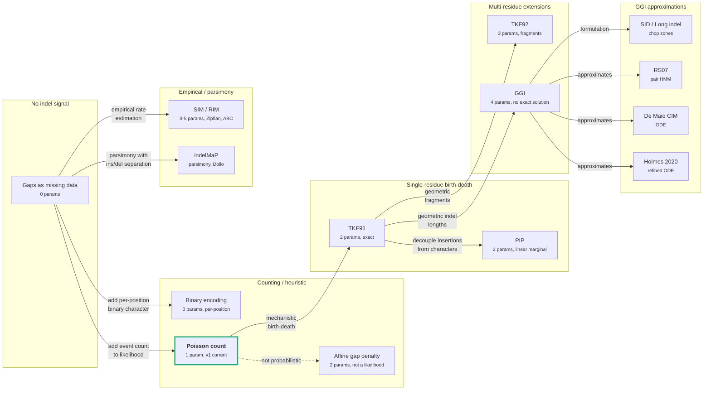

# Chapter 6: Comparative analysis and software landscape

[Back to index](README.md) | Previous: [Chapter 5: Empirical models and parsimony](5-empirical.md)

## Model hierarchy

The models span a range from no indel signal (gaps as missing data) to full mechanistic birth-death processes (GGI). They relate by extension ("adds multi-residue indels to TKF91") and approximation ("RS07 approximates GGI via pair HMM"). Complexity increases left to right; vertical grouping shows model families.

The key question for TreeTime: where on this spectrum does the marginal return on realism drop below the implementation and computational cost?

## Impact on branch length estimates

The models differ in how they affect branch length optimization:

**No impact (gaps as missing data).** Branches with only indel evidence get zero length. This is the status quo in most software and in TreeTime v0.

**Scalar correction (Poisson count, TreeTime v1).** Branches with indels get positive length proportional to event count. The correction is a single scalar added to the substitution likelihood. The optimum $t^* = k/\mu$ depends on event count only. Simple, effective for preventing zero-length assignment.

**Length-aware correction (Poisson with weights, proposed E1).** Branches with long indels get proportionally more length than branches with short indels. Still a scalar correction. More accurate for datasets with variable indel lengths.

**Rate-aware correction (separate ins/del, proposed E2).** Allows deletion-dominated branches to be distinguished from insertion-dominated branches. Two scalars added to the substitution likelihood. More accurate when the ins/del rate ratio departs from 1.

**Full pair HMM (TKF91, RS07, PIP).** Branch length is jointly estimated with alignment and indel parameters. The indel model influences not just the branch length optimum but also the shape of the likelihood surface (curvature, multimodality). This is the most accurate approach but requires a fundamentally different optimizer architecture.

## Software landscape

### ML phylogenetic inference (gaps as missing data)

**[RAxML-NG](https://github.com/amkozlov/raxml-ng)** (C++, 461 stars). The standard ML tree inference tool. Gaps map to bitmask `1111` (all nucleotide states) in libpll-2 (`src/maps.c`), contributing zero information to site likelihoods. Branch lengths optimized by Newton-Raphson with six NR variants (`nr_fast`, `nr_safe`, `FALLBACK`) and per-branch rollback. Indels have no effect on branch length estimates. The `FALLBACK` mode starts with `nr_fast` and switches to `nr_safe` when overall likelihood decreases.

**[IQ-TREE](https://github.com/iqtree/iqtree3)** (C++, 120 stars for v3). ML tree inference with model selection. `STATE_UNKNOWN` sets partial likelihoods to `1.0` for all states (`alignment/pattern.cpp`). Branch lengths optimized by Newton-Raphson (inherited from PLL) with bisection fallback when the Hessian is non-negative, and per-round monotonicity check (reverts all branch lengths if total likelihood decreases). Indels have no effect on branch length estimates. v3 adds no indel model relative to v2.

**[PhyML](https://github.com/stephaneguindon/phyml)** (C, 195 stars). ML tree inference. Gaps as missing data. Branch lengths optimized by Brent's method. Indels have no effect on branch length estimates.

**[FastTree](http://www.microbesonline.org/fasttree/)** (C, distributed via microbesonline.org, no GitHub repo). Approximate ML for large trees. Gaps as missing data. Uses a minimum-evolution criterion for initial branch lengths, then NNI with branch length optimization. Indels have no effect on branch length estimates.

### Bayesian phylogenetic inference

**[BEAST](https://github.com/beast-dev/beast-mcmc)** (Java, 239 stars). Bayesian MCMC phylogenetics. Default: gaps as missing data. Optional: TKF91 via `dr.oldevomodel.indel.TKF91Likelihood`, which wraps `HomologyRecursion` (680-line DP over alignment columns). Uses `BFloat` arbitrary-precision arithmetic to avoid underflow. When TKF91 is enabled, branch lengths are jointly estimated with indel parameters ($\lambda$, $\mu$) via MCMC proposals. The TKF91 module is in the `oldevomodel` package, indicating it is legacy code not actively maintained.

**[MrBayes](https://github.com/NBISweden/MrBayes)** (C, 260 stars). Bayesian MCMC phylogenetics. Gaps as missing data only. No indel model. Branch lengths sampled via MCMC with substitution likelihood only.

**[HyPhy](https://github.com/veg/hyphy)** (C++, 251 stars). Selection analysis framework. Gaps as missing data. Branch lengths from substitution model only. Focused on dN/dS estimation, not indel modeling.

### Bayesian joint alignment and phylogeny

**[BAli-Phy](https://github.com/bredelings/BAli-Phy)** (C++, 49 stars). Bayesian co-estimation of alignment, phylogeny, and evolutionary parameters via MCMC. Supports three indel models, more than any other phylogenetic inference tool: RS07 (default), TKF91 (`TKF1`), and TKF92 (`TKF2`). All implemented as pair HMMs [†3](#gloss-pairhmm) with 5 states (Start, Match, Gap-in-1, Gap-in-2, End) in `src/imodel/imodel.cc`. Branch lengths are jointly sampled with alignment, topology, and indel parameters. MCMC moves include alignment realignment (`AlignmentMove`), topology changes (`TopologyMove`), edge length proposals (`EdgeMove`), and per-parameter moves for $\lambda$, $\mu$, $r$ (TKF92), and $\rho = \lambda + \mu$. The RS07 model's `fragmentize` operation adds geometric self-loops to pair HMM states, making indel lengths geometric with parameter $\epsilon$. Indel parameters directly influence the branch length posterior: higher indel rates widen the branch length distribution because the same alignment is consistent with a broader range of evolutionary distances.

**[StatAlign](https://github.com/statalign/statalign)** (Java, 5 stars). Bayesian MCMC statistical alignment. Uses TKF92 pair HMMs (`HmmTkf92` with 5 states). Parameters: fragment length $r$, insertion rate $\lambda$, deletion rate $\mu$. MCMC moves over alignment columns, topology, edge lengths, and TKF92 parameters. Alignment stored as linked lists of `AlignColumn` objects with `orphan` flags distinguishing homologous from inserted columns. Felsenstein likelihoods cached per column. Supports structural alignment (`StructAlign` plugin) and RNA structure prediction (`PPFold`, `RNAAliFold`). Low activity since 2020.

### Progressive alignment with indel models

**[PRANK](https://github.com/ariloytynoja/prank-msa)** (C++, 33 stars). Phylogeny-aware progressive alignment. Does not use a formal indel model (TKF91/PIP/etc.) for gap placement. Instead uses a heuristic strategy that infers ancestral sequences and places gaps on tree branches, defaulting to inferring ancestral residues as absent when ambiguous. This reduces the "gap attraction" problem where unrelated regions get aligned. Branch lengths are taken from the input guide tree and not re-estimated. Indels influence the alignment but not the branch lengths. PRANK is a major influence on modern phylogeny-aware alignment tools but uses heuristic gap costs, not probabilistic indel models.

**[Historian](https://github.com/ihh/dart)** (C++, 32 stars, part of the DART toolkit). Progressive alignment with MCMC refinement using the RS07 pair HMM. Computes a fast initial alignment via progressive application of the pair HMM forward-backward algorithm, then refines via MCMC moves. Uses phylogenetic transducers [†4](#gloss-transducer) (composition of pair HMMs along tree edges) for multi-sequence likelihood. Branch lengths are taken from the input tree. The `ihh/trajectory-likelihood` repository (14 stars) implements the related trajectory likelihood calculations from Miklos, Lunter & Holmes 2004, De Maio 2021, and Holmes 2020.

**[ProPIP](https://github.com/acg-team/ProPIP)** (C++, 7 stars). ML progressive alignment under the Poisson Indel Process. The first polynomial-time progressive aligner with a rigorous indel model. Estimates indel rates ($\lambda$, $\mu$) from the data during alignment, unlike PRANK which uses fixed heuristic gap costs. Supports Gamma rate heterogeneity across sites. Branch lengths and alignment are jointly estimated in the progressive ML framework. ProPIP tends to infer shorter gaps than tools using multi-residue indel models because PIP assumes single-character insertions.

### Ancestral sequence reconstruction with indels

**[ARPIP](https://github.com/acg-team/bpp-arpip)** (C++, 11 stars). ML ancestral sequence reconstruction under PIP. Two-step DP: first find the most probable indel points on each branch, then reconstruct ancestral sequences on the pruned subtree. Produces uncertainty profiles for inferred sequences. Branch lengths are fixed from the input tree. Indels influence which ancestral positions are inferred as present or absent, but do not feed back into branch length estimation.

**[FastML](http://fastml.tau.ac.il/)** (web server only, no public repository). ML ancestral reconstruction. Uses binary encoding of indels (two-state character per alignment position) for indel reconstruction, analyzed under a simple substitution model. Branch lengths from substitution model only.

**[GRASP](https://github.com/bodenlab/GRASP)** (Java, 12 stars). Ancestral reconstruction using partial-order graphs [†10](#gloss-pog) (POGs). Handles alternative splicings and repeat variation. Does not use a probabilistic indel model. Branch lengths from input tree.

### ML phylogenetic inference with indel models

**[rust-phylo](https://github.com/acg-team/rust-phylo)** (Rust, 11 stars). ML phylogenetics library implementing TKF91, TKF92, and PIP as pluggable indel models alongside substitution models (JC69, K80, TN93, HKY, GTR, WAG, HIVB, BLOSUM). The combined TKF+substitution cost function (`TKFCost`) sums indel and substitution log-likelihoods. Branch length optimization uses Brent's method (`argmin::BrentOpt`) per edge with the combined cost function, so indels directly influence branch length estimates. Model parameter optimization ($\lambda$, $\mu$, $r$) also uses Brent's method. Caches per-node TKF intermediate values (`TKFIndelModelInfo`) and invalidates selectively for dirty nodes. Includes a reference implementation for testing (`tkf91_indel_logl_without_aggregation`). The most architecturally relevant comparison for TreeTime: same language (Rust), same per-edge optimization approach (Brent vs Newton-Raphson), similar caching strategy.

**[indelMaP](https://github.com/acg-team/indelMaP)** (Python, 5 stars). Indel-aware parsimony for ancestral reconstruction. Also available in Rust: [rust-indelMaP](https://github.com/acg-team/rust-indelMaP) (1 star). Uses the Dollo principle with affine gap penalties to separate insertion from deletion events on the tree. Branch lengths are not estimated (parsimony, not ML).

### Indel parameter estimation

**[SpartaABC](https://github.com/gilloe/SpartaABC)** (C++ + Python, 4 stars). ABC-based estimation of indel rates and length distributions under the SIM/RIM models. Webserver: https://spartaabc.tau.ac.il/. Simulates 100,000 MSAs via Gillespie algorithm, computes 27 summary statistics, accepts closest 0.1%. Does not perform branch length optimization; estimates indel parameters conditional on a fixed tree with known branch lengths. Running time ~328 minutes per dataset.

**TreeTime v0** (Python). Gaps as missing data. Branch lengths optimized by Brent's method (`scipy.optimize.minimize_scalar`) in $\sqrt{t}$ space. Indels have no effect on branch length estimates. `GTR.state_pair()` uses `ignore_gaps=True` to exclude gap positions.

**TreeTime v1** (Rust). Poisson indel count model (see [Chapter 2](2-gap-treatment.md)). Branch lengths optimized by Newton-Raphson with analytical derivatives. The Poisson indel log-likelihood and its derivatives are added to the substitution log-likelihood in the Newton step. The only ML phylogenetics tool that integrates indel likelihood into per-edge Newton-Raphson optimization without requiring joint alignment-phylogeny inference.

## Software at a glance

| Software                                             |   ★ | Tech        | Last active | Indel model          | BL method      | Indels in BL? |
| :--------------------------------------------------- | --: | :---------- | :---------- | :------------------- | :------------- | :------------ |
| [RAxML-NG](https://github.com/amkozlov/raxml-ng)     | 461 | C++         | 2026-03-27  | Missing data         | Newton-Raphson | No            |
| [IQ-TREE](https://github.com/iqtree/iqtree3)         | 120 | C++         | 2026-03-27  | Missing data         | Newton-Raphson | No            |
| [PhyML](https://github.com/stephaneguindon/phyml)    | 195 | C           | 2026-03-19  | Missing data         | Brent          | No            |
| [BEAST](https://github.com/beast-dev/beast-mcmc)     | 239 | Java        | 2026-03-20  | Missing data / TKF91 | MCMC           | Optional      |
| [MrBayes](https://github.com/NBISweden/MrBayes)      | 260 | C           | 2026-01-09  | Missing data         | MCMC           | No            |
| [BAli-Phy](https://github.com/bredelings/BAli-Phy)   |  49 | C++/Haskell | 2026-03-29  | RS07 / TKF91 / TKF92 | MCMC (joint)   | Yes           |
| [StatAlign](https://github.com/statalign/statalign)  |   5 | Java        | 2020-04-12  | TKF92                | MCMC (joint)   | Yes           |
| [Historian](https://github.com/ihh/dart)             |  32 | C++         | 2020-06-13  | RS07                 | Fixed tree     | No            |
| [PRANK](https://github.com/ariloytynoja/prank-msa)   |  33 | C++         | 2026-03-19  | Heuristic            | Fixed tree     | No            |
| [ProPIP](https://github.com/acg-team/ProPIP)         |   7 | C++         | 2021-08-04  | PIP                  | ML (joint)     | Yes           |
| [ARPIP](https://github.com/acg-team/bpp-arpip)       |  11 | C++         | 2023-10-02  | PIP                  | Fixed tree     | No            |
| [rust-phylo](https://github.com/acg-team/rust-phylo) |  11 | Rust        | 2026-03-25  | TKF91 / TKF92 / PIP  | Brent (joint)  | Yes           |
| [indelMaP](https://github.com/acg-team/indelMaP)     |   5 | Python      | 2023-11-07  | Parsimony            | N/A            | N/A           |
| [SpartaABC](https://github.com/gilloe/SpartaABC)     |   4 | C++/Python  | 2021-08-10  | SIM/RIM              | Fixed tree     | No            |
| TreeTime v0                                          |   - | Python      | -           | Missing data         | Brent          | No            |
| TreeTime v1                                          |   - | Rust        | -           | Poisson count        | Newton-Raphson | Yes           |

## Glossary

1.  **Pair HMM.** See [consolidated glossary](#gloss-pairhmm). [↩](#gloss-use-3)
2.  **Phylogenetic transducer.** See [consolidated glossary](#gloss-transducer). [↩](#gloss-use-4)
3.  **POG (partial order graph).** See [consolidated glossary](#gloss-pog). [↩](#gloss-use-10)

See [consolidated glossary](glossary.md) for all term definitions across chapters.
