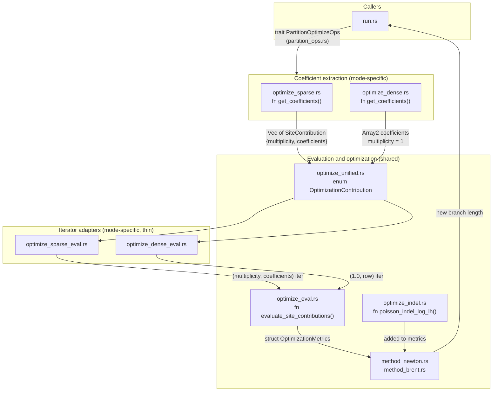

# Optimize module: dense/sparse architecture

## Why are there separate dense/sparse optimize files?

The branch-length optimizer needs per-site coefficients in eigenvalue space ($k_c$) to evaluate likelihoods. Dense and sparse partitions store marginal messages in fundamentally different data structures, so extracting those coefficients requires different code. That is the **only** reason for the split. Once coefficients are extracted, every file downstream is shared.

**What each file does:**

- [`optimize_dense.rs`](../../packages/treetime/src/partition/optimize_dense.rs) - fn `get_coefficients()` ([partition/optimize_dense.rs#L38](../../packages/treetime/src/partition/optimize_dense.rs#L38)) reads dense `Array2` messages, one matrix multiply produces all coefficients at once
- [`optimize_sparse.rs`](../../packages/treetime/src/partition/optimize_sparse.rs) - fn `get_coefficients()` ([partition/optimize_sparse.rs#L45](../../packages/treetime/src/partition/optimize_sparse.rs#L45)) reads sparse variable-site maps and fitch subs, computes coefficients per-site with explicit multiplicities
- [`optimize_dense_eval.rs`](../../packages/treetime/src/optimize/dense_eval.rs) / [`optimize_sparse_eval.rs`](../../packages/treetime/src/optimize/sparse_eval.rs) - thin adapters (under 25 lines each) that format the above into a common `(multiplicity, coefficients)` iterator
- [`optimize_eval.rs`](../../packages/treetime/src/optimize/eval.rs) - fn `evaluate_site_contributions()` ([optimize/eval.rs#L32](../../packages/treetime/src/optimize/eval.rs#L32)), the single shared evaluator that consumes that iterator and computes log-likelihood + derivatives
- [`optimize_unified.rs`](../../packages/treetime/src/partition/optimization_contribution.rs) - enum `OptimizationContribution` ([partition/optimization_contribution.rs#L96](../../packages/treetime/src/partition/optimization_contribution.rs#L96)) wraps both modes so callers never see dense vs sparse. Contains the actual optimization loop, solvers dispatch, zero-branch detection, grid search

**Is this arrangement optimal?** The two `_eval` adapter files are borderline redundant. They exist only because fn `evaluate_mixed_impl()` ([optimize/likelihood.rs#L230](../../packages/treetime/src/optimize/likelihood.rs#L230)) needs to pass a `compute_derivatives` flag that the enum's own fn `evaluate()` ([optimize/dispatch.rs#L130](../../packages/treetime/src/optimize/dispatch.rs#L130)) does not expose. Folding them into `dispatch.rs` or adding the flag to the enum method would eliminate two files. The two coefficient extraction files (`optimize_dense.rs`, `optimize_sparse.rs`) are genuinely necessary - the input data structures differ.

## Data flow

One diagram showing the per-edge optimization path from partition data to new branch length. Files are grouped by role: mode-specific extraction at the top, shared evaluation and optimization below.



## Components

Ordered by data flow: callers, mode-specific extraction, shared evaluation, solvers.

### `run.rs` - orchestrator

Top-level fn `run_optimize()` [optimize/run.rs#L100](../../packages/treetime/src/commands/optimize/run.rs#L100) and fn `run_optimize_loop()` [optimize/run.rs#L275](../../packages/treetime/src/commands/optimize/run.rs#L275). Loads inputs, creates partitions, runs the iterative loop. Each iteration: marginal reconstruction, likelihood evaluation, branch-length optimization, damping, topology cleanup. Owns convergence logic (converged, oscillating, worsened, numerical failure).

fn `collect_optimize_partitions()` [optimize/run.rs#L442](../../packages/treetime/src/commands/optimize/run.rs#L442) erases the dense/sparse distinction into `Vec<Arc<RwLock<dyn PartitionOptimizeOps>>>`, then passes that to fn `run_optimize_mixed()` [optimize/dispatch.rs#L533](../../packages/treetime/src/optimize/dispatch.rs#L533).

### `partition_ops.rs` - trait boundary between partitions and optimizer

trait `PartitionOptimizeOps` [partition/optimization_contribution.rs#L13](../../packages/treetime/src/partition/optimization_contribution.rs#L13): the interface `dispatch.rs` requires from a partition. Two methods:

- fn `PartitionOptimizeOps::create_edge_contribution()` [partition/optimization_contribution.rs#L15](../../packages/treetime/src/partition/optimization_contribution.rs#L15) - return an enum `OptimizationContribution` for one edge
- fn `PartitionOptimizeOps::edge_indel_count()` [partition/optimization_contribution.rs#L18](../../packages/treetime/src/partition/optimization_contribution.rs#L18) - return the number of indel events on one edge

Implemented by struct `PartitionMarginalSparse` [partition/marginal_sparse.rs#L29](../../packages/treetime/src/partition/marginal_sparse.rs#L29) ([impl](../../packages/treetime/src/partition/marginal_sparse.rs#L293)) and struct `PartitionMarginalDense` [partition/marginal_dense.rs#L31](../../packages/treetime/src/partition/marginal_dense.rs#L31) ([impl](../../packages/treetime/src/partition/marginal_dense.rs#L131)). Each delegates to fn `OptimizationContribution::from_sparse()` [partition/optimization_contribution.rs#L120](../../packages/treetime/src/partition/optimization_contribution.rs#L120) or fn `OptimizationContribution::from_dense()` [partition/optimization_contribution.rs#L106](../../packages/treetime/src/partition/optimization_contribution.rs#L106).

Extends trait `PartitionBranchOps` [partition/traits.rs#L81](../../packages/treetime/src/partition/traits.rs#L81) (fn `edge_subs()` [partition/traits.rs#L91](../../packages/treetime/src/partition/traits.rs#L91), fn `edge_effective_length()` [partition/traits.rs#L95](../../packages/treetime/src/partition/traits.rs#L95), fn `sequence_length()` [partition/traits.rs#L83](../../packages/treetime/src/partition/traits.rs#L83) - used by fn `initial_guess_mixed()` [optimize/dispatch.rs#L729](../../packages/treetime/src/optimize/dispatch.rs#L729)).

### `optimize_dense.rs` - dense coefficient extraction

fn `get_coefficients()` [partition/optimize_dense.rs#L38](../../packages/treetime/src/partition/optimize_dense.rs#L38) takes `msg_to_parent` and `msg_to_child` (each `Array2<f64>`, one row per alignment position) and computes `coefficients = msg_to_child.dot(V) * msg_to_parent.dot(V_inv^T)`, where V and V_inv are the GTR eigenvector matrices. Each row is a per-position coefficient vector $k_c$. All positions represented, multiplicity implicitly 1.

Output: struct `PartitionContribution` [partition/optimize_dense.rs#L27](../../packages/treetime/src/partition/optimize_dense.rs#L27) `{ coefficients: Array2<f64>, gtr: GTR }`.

### `optimize_sparse.rs` - sparse coefficient extraction

fn `get_coefficients()` [partition/optimize_sparse.rs#L45](../../packages/treetime/src/partition/optimize_sparse.rs#L45) reads variable-site maps (`msg_to_child.variable`, `msg_to_parent.variable`), fitch substitutions, and fixed-state counts. Same dot-product math as dense but applied per site or per group:

1. Variable positions (union of variable maps and fitch subs): multiplicity 1.0 each
2. Fixed-state groups (positions where parent and child share a fixed state): multiplicity = count of positions in that group

Each site produces a struct `SiteContribution` [partition/optimize_sparse.rs#L35](../../packages/treetime/src/partition/optimize_sparse.rs#L35) `{ multiplicity, coefficients }`.

Output: struct `PartitionContribution` [partition/optimize_sparse.rs#L40](../../packages/treetime/src/partition/optimize_sparse.rs#L40) `{ site_contributions: Vec<SiteContribution>, gtr: GTR }`.

### `optimize_dense_eval.rs` / `optimize_sparse_eval.rs` - thin iterator adapters

Adapt each struct `PartitionContribution` into the `(multiplicity, coefficients)` iterator that fn `evaluate_site_contributions()` [optimize/eval.rs#L32](../../packages/treetime/src/optimize/eval.rs#L32) expects. Both under 25 lines.

- fn `evaluate_dense_contribution()` [optimize/dense_eval.rs#L6](../../packages/treetime/src/optimize/dense_eval.rs#L6) - iterates `coefficients.outer_iter()` with multiplicity 1.0
- fn `evaluate_sparse_contribution()` [optimize/sparse_eval.rs#L6](../../packages/treetime/src/optimize/sparse_eval.rs#L6) - iterates `site_contributions` with stored multiplicities

These exist as separate files because fn `evaluate_mixed_impl()` [optimize/likelihood.rs#L230](../../packages/treetime/src/optimize/likelihood.rs#L230) calls fn `evaluate_dense_contribution_impl()` [optimize/dense_eval.rs#L14](../../packages/treetime/src/optimize/dense_eval.rs#L14) / fn `evaluate_sparse_contribution_impl()` [optimize/sparse_eval.rs#L14](../../packages/treetime/src/optimize/sparse_eval.rs#L14) directly with a `compute_derivatives` flag, bypassing enum `OptimizationContribution`'s fn `evaluate()` [partition/optimization_contribution.rs#L130](../../packages/treetime/src/partition/optimization_contribution.rs#L130).

### `optimize_eval.rs` - shared site evaluator

fn `evaluate_site_contributions()` [optimize/eval.rs#L32](../../packages/treetime/src/optimize/eval.rs#L32) computes log-likelihood, gradient, and Hessian from an iterator of `(multiplicity, coefficients)` pairs:

- Site likelihood: $L_i(t) = \sum_c k_{ic} e^{\lambda_c t}$
- Gradient: posterior mean eigenvalue $\ell'_i = \sum_c w_{ic} \lambda_c$
- Hessian: posterior variance of eigenvalues in centered (Welford) form $\ell''_i = -\sum_c w_{ic} (\lambda_c - \ell'_i)^2$

Dense and sparse arrive as different iterators but the evaluation is identical.

### `optimize_unified.rs` - enum wrapper and optimization dispatch

enum `OptimizationContribution` [partition/optimization_contribution.rs#L96](../../packages/treetime/src/partition/optimization_contribution.rs#L96) wraps `Dense(PartitionContribution)` or `Sparse(PartitionContribution)` with uniform accessors:

- fn `evaluate()` [optimize/dispatch.rs#L130](../../packages/treetime/src/optimize/dispatch.rs#L130)
- fn `sites()` [optimize/dispatch.rs#L146](../../packages/treetime/src/optimize/dispatch.rs#L146)
- fn `gtr()` [optimize/zero_boundary.rs#L166](../../packages/treetime/src/optimize/zero_boundary.rs#L166)
- fn `all_sites_valid_at_zero()` [optimize/zero_boundary.rs#L180](../../packages/treetime/src/optimize/zero_boundary.rs#L180)
- fn `zero_branch_length_derivative()` [optimize/likelihood.rs#L209](../../packages/treetime/src/optimize/likelihood.rs#L209)

struct `OptimizationMetrics` [optimize/likelihood.rs#L69](../../packages/treetime/src/optimize/likelihood.rs#L69) holds log-likelihood, first and second derivatives.

Optimization functions (all mode-agnostic, operate on `&[OptimizationContribution]`):

- fn `run_optimize_mixed()` [optimize/dispatch.rs#L533](../../packages/treetime/src/optimize/dispatch.rs#L533) - per-edge loop: collect contributions, check zero-branch shortcut, dispatch to solver, reconcile boundary
- fn `initial_guess_mixed()` [optimize/dispatch.rs#L729](../../packages/treetime/src/optimize/dispatch.rs#L729) - substitution-counting initial branch length estimates
- fn `is_zero_branch_optimal()` [optimize/likelihood.rs#L328](../../packages/treetime/src/optimize/likelihood.rs#L328) - derivative-sign test (unimodal models only)
- fn `evaluate_mixed()` [optimize/likelihood.rs#L222](../../packages/treetime/src/optimize/likelihood.rs#L222) / fn `evaluate_with_indels()` [optimize/likelihood.rs#L247](../../packages/treetime/src/optimize/likelihood.rs#L247) - sum contributions across partitions
- fn `reconcile_zero_boundary()` [optimize/likelihood.rs#L490](../../packages/treetime/src/optimize/likelihood.rs#L490) - grid search fallback for boundary cases

### `method_newton.rs` / `method_brent.rs` - solvers

Newton and Brent implementations in three coordinate spaces each (t, sqrt(t), log(t)). Called from fn `run_optimize_mixed()` [optimize/dispatch.rs#L533](../../packages/treetime/src/optimize/dispatch.rs#L533). Consume `&[OptimizationContribution]` and struct `OptimizationMetrics`. No awareness of dense vs sparse.

### `optimize_indel.rs` - indel contribution

Poisson log-likelihood for indel events: $\ell(t) = k \ln(\mu t) - \mu t - \ln(k!)$. Added to substitution metrics in fn `evaluate_with_indels()` [optimize/likelihood.rs#L247](../../packages/treetime/src/optimize/likelihood.rs#L247).

- fn `estimate_indel_rate()` [optimize/indel.rs#L55](../../packages/treetime/src/optimize/indel.rs#L55) - MLE from total indel count / total branch length
- fn `poisson_indel_log_lh()` [optimize/indel.rs#L21](../../packages/treetime/src/optimize/indel.rs#L21) - per-edge Poisson log-likelihood with derivatives

---

## Asymmetries and proposed improvements

### A1. `evaluate_mixed_impl()` re-dispatches on the enum it already abstracts

fn `evaluate_mixed_impl()` [optimize/likelihood.rs#L230](../../packages/treetime/src/optimize/likelihood.rs#L230) manually matches on `OptimizationContribution::Dense` / `Sparse` and calls into the `_eval` adapter files. But fn `sites()` [partition/optimization_contribution.rs#L146](../../packages/treetime/src/partition/optimization_contribution.rs#L146) and fn `gtr()` [optimize/dispatch.rs#L166](../../packages/treetime/src/optimize/dispatch.rs#L166) already provide the unified interface. The body could be:

```rust
for contribution in contributions {
    let metrics = evaluate_site_contributions(
        contribution.sites(),
        &contribution.gtr().eigvals,
        branch_length,
        compute_derivatives,
    );
    total_metrics.add(&metrics);
}
```

This would eliminate both [`optimize_dense_eval.rs`](../../packages/treetime/src/optimize/dense_eval.rs) and [`optimize_sparse_eval.rs`](../../packages/treetime/src/optimize/sparse_eval.rs) as production code. Tests that call the adapters directly (9 test files) could call fn `evaluate_site_contributions()` [optimize/eval.rs#L32](../../packages/treetime/src/optimize/eval.rs#L32) with the appropriate iterator, or call fn `OptimizationContribution::evaluate()` on a wrapped contribution.

### A2. fn `evaluate()` lacks `compute_derivatives` parameter

fn `OptimizationContribution::evaluate()` [optimize/likelihood.rs#L130](../../packages/treetime/src/optimize/likelihood.rs#L130) always computes derivatives. This is why fn `evaluate_mixed_impl()` exists as a separate function instead of calling `evaluate()` in a loop. Adding a `compute_derivatives: bool` parameter to `evaluate()` would unify the two paths:

```rust
pub fn evaluate(&self, branch_length: f64, compute_derivatives: bool) -> OptimizationMetrics {
    evaluate_site_contributions(self.sites(), &self.gtr().eigvals, branch_length, compute_derivatives)
}
```

fn `evaluate_mixed_impl()` then becomes trivial and could be inlined into fn `evaluate_mixed()` [optimize/likelihood.rs#L222](../../packages/treetime/src/optimize/likelihood.rs#L222) and fn `evaluate_mixed_log_lh_only()` [optimize/likelihood.rs#L226](../../packages/treetime/src/optimize/likelihood.rs#L226).

### A3. Two structs named `PartitionContribution` with different shapes

struct `optimize_dense::PartitionContribution` [partition/optimize_dense.rs#L27](../../packages/treetime/src/partition/optimize_dense.rs#L27) holds `coefficients: Array2<f64>`. struct `optimize_sparse::PartitionContribution` [partition/optimize_sparse.rs#L40](../../packages/treetime/src/partition/optimize_sparse.rs#L40) holds `site_contributions: Vec<SiteContribution>`. Same name, different fields, disambiguated only by module path. Confusing when reading enum `OptimizationContribution` [partition/optimization_contribution.rs#L96](../../packages/treetime/src/partition/optimization_contribution.rs#L96) which wraps `Dense(optimize_dense::PartitionContribution)` and `Sparse(optimize_sparse::PartitionContribution)`.

Options: rename to `DensePartitionContribution` / `SparsePartitionContribution`, or unify (see A4).

### A4. Dense representation is a special case of sparse

Dense stores an `Array2` where every row has implicit multiplicity 1. Sparse stores `Vec<SiteContribution>` where each entry has explicit multiplicity. Dense is the degenerate case where all multiplicities are 1 and the coefficient vectors happen to be stacked in a matrix.

A single struct `PartitionContribution { sites: Vec<SiteContribution>, gtr: GTR }` could represent both. fn `optimize_dense::get_coefficients()` would produce one `SiteContribution` per row with `multiplicity: 1.0`. This would eliminate the enum `OptimizationContribution` entirely - no dispatch needed anywhere.

Tradeoff: dense currently benefits from a single `Array2` matrix multiply (`msg_to_child.dot(V) * msg_to_parent.dot(V_inv^T)`) to extract all coefficients at once. A `Vec<SiteContribution>` representation would still allow the same matrix multiply for extraction, then split the result into per-row `Array1` entries. The split is an allocation cost proportional to alignment length. Evaluation performance is unaffected - fn `evaluate_site_contributions()` iterates site-by-site regardless of backing storage.

### A5. `from_dense()` is infallible, `from_sparse()` returns `Result`

fn `OptimizationContribution::from_dense()` [partition/optimization_contribution.rs#L106](../../packages/treetime/src/partition/optimization_contribution.rs#L106) returns `Self`. fn `OptimizationContribution::from_sparse()` [partition/optimization_contribution.rs#L120](../../packages/treetime/src/partition/optimization_contribution.rs#L120) returns `Result<Self, Report>`. The sparse side can fail because it looks up variable positions via `ok_or_eyre()` [partition/optimize_sparse.rs#L74](../../packages/treetime/src/partition/optimize_sparse.rs#L74). This forces trait `PartitionOptimizeOps::create_edge_contribution()` [partition/optimization_contribution.rs#L15](../../packages/treetime/src/partition/optimization_contribution.rs#L15) to return `Result`, and the dense impl wraps its infallible value in `Ok()` [partition/marginal_dense.rs#L136](../../packages/treetime/src/partition/marginal_dense.rs#L136).

The sparse lookups should not fail in well-formed data (they look up positions that were collected from the same edge moments before). These could be converted to index-based access or debug assertions, making both paths infallible and simplifying the trait signature.

### Summary

Applying A1 + A2 would eliminate `optimize_dense_eval.rs` and `optimize_sparse_eval.rs` (2 files, ~50 lines) and simplify `evaluate_mixed_impl` into a one-liner. No behavior change.

Applying A3 renames two structs for clarity. No behavior change.

Applying A4 would also eliminate the `OptimizationContribution` enum and the `optimize_dense.rs` / `optimize_sparse.rs` split into a single representation, at the cost of a per-edge allocation for dense mode. Larger refactor, measurable simplification.

A5 is a minor cleanup that would simplify the trait signature.
