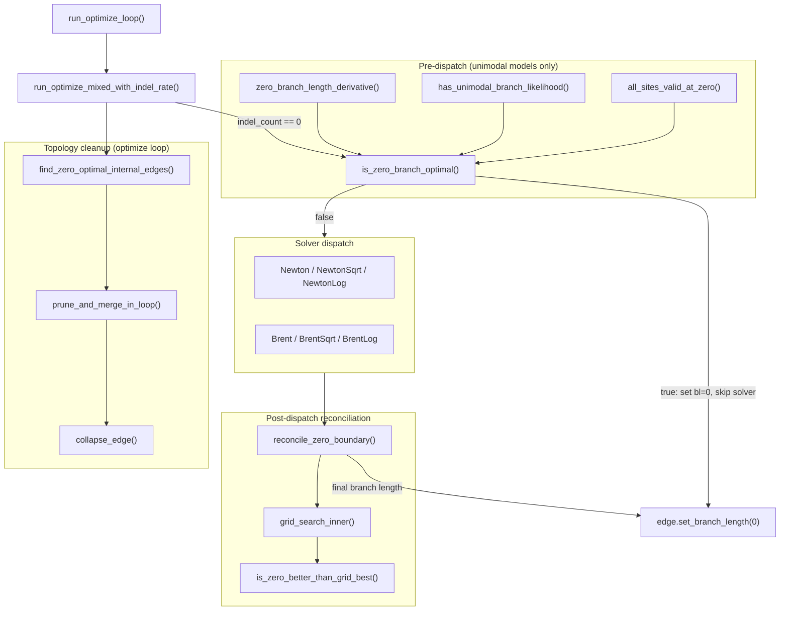

# Zero branch length optimization

How TreeTime v1 decides when an edge has zero optimal branch length, handles boundary conditions, and collapses degenerate edges. The central file is [commands/optimize/optimize_unified.rs](../../packages/treetime/src/commands/optimize/optimize_unified.rs).

## Model classification

Whether the zero-branch shortcut applies depends on the substitution model. The `unimodal_branch_likelihood` flag ([gtr/gtr.rs#L208](../../packages/treetime/src/gtr/gtr.rs#L208)) on `GTR` records this classification, set during `GTR::new()` ([gtr/gtr.rs#L231](../../packages/treetime/src/gtr/gtr.rs#L231)).

JC69 ([gtr/get_gtr.rs#L192](../../packages/treetime/src/gtr/get_gtr.rs#L192)), F81 ([gtr/get_gtr.rs#L255](../../packages/treetime/src/gtr/get_gtr.rs#L255)), and binary models ([gtr/gtr.rs#L280](../../packages/treetime/src/gtr/gtr.rs#L280)) are classified as unimodal [1](#gloss-1). K80, HKY85, TN93, and general GTR are not. The theoretical basis is [Dinh and Matsen 2017](https://doi.org/10.1214/16-AAP1240) [[1](#ref-1)], Corollary 3.1: models with a single distinct nonzero eigenvalue have at most one stationary point on $(0, \infty)$.

This classification drives the entire zero-branch pipeline. Unimodal models get a cheap derivative test. Non-unimodal models skip the test and rely on post-solver grid search to catch boundary errors.

## Per-edge optimization pipeline

Each edge goes through three phases inside `run_optimize_mixed_with_indel_rate()` ([commands/optimize/optimize_unified.rs#L552](../../packages/treetime/src/commands/optimize/optimize_unified.rs#L552)): input protection, the optimizer itself, and post-optimization reconciliation.

### Phase 1: Input domain protection

Before the optimizer runs, two guards ensure the starting branch length is in the evaluator's well-defined domain.

**Indel-bearing edges.** The Poisson derivative diverges at $t = 0$ when $k > 0$, where $t$ is the branch length and $k$ is the indel count on the edge. The starting point is bumped to $\max(k / \text{rate}, 1/L)$, where $L$ is the total alignment length across all partitions ([commands/optimize/optimize_unified.rs#L588](../../packages/treetime/src/commands/optimize/optimize_unified.rs#L588)).

**Invalid-at-zero edges.** When any site has $L_i(0) \leq 0$ (where $L_i$ is the per-site likelihood, computed as $L_i(0) = \sum_c k_{ic}$ with $k_{ic}$ being the eigenvalue-space coefficients), evaluating $\ln L_i$ produces $-\infty$. The starting point is bumped to $1/L$ ([commands/optimize/optimize_unified.rs#L600](../../packages/treetime/src/commands/optimize/optimize_unified.rs#L600)).

During optimization, `min_branch_length_for_indels()` ([commands/optimize/optimize_unified.rs#L371](../../packages/treetime/src/commands/optimize/optimize_unified.rs#L371)) provides a floor for Newton/Brent steps: $0.01/L$ for indel-bearing edges, $0$ otherwise.

### Phase 2: Pre-dispatch shortcut

Before dispatching to a solver, `is_zero_branch_optimal()` ([commands/optimize/optimize_unified.rs#L328](../../packages/treetime/src/commands/optimize/optimize_unified.rs#L328)) checks whether the edge can be set to zero immediately ([commands/optimize/optimize_unified.rs#L607](../../packages/treetime/src/commands/optimize/optimize_unified.rs#L607)). This requires four conditions to hold simultaneously:

1. Every partition uses a unimodal model (`has_unimodal_branch_likelihood()`, [commands/optimize/optimize_unified.rs#L192](../../packages/treetime/src/commands/optimize/optimize_unified.rs#L192))
2. No indels on this edge (`indel_count == 0`)
3. Every site has positive finite likelihood at $t = 0$ (`all_sites_valid_at_zero()`, [commands/optimize/optimize_unified.rs#L180](../../packages/treetime/src/commands/optimize/optimize_unified.rs#L180))
4. The total derivative of log-likelihood at $t = 0$ is finite and negative

The derivative is computed by `zero_branch_length_derivative()` ([commands/optimize/optimize_unified.rs#L209](../../packages/treetime/src/commands/optimize/optimize_unified.rs#L209)):

$$\frac{d}{dt} \log L(0) = \sum_i m_i \frac{\sum_c k_{ic} \lambda_c}{\sum_c k_{ic}}$$

where $m_i$ is the multiplicity of site pattern $i$ and $\lambda_c$ are the GTR eigenvalues. This is a weighted average of eigenvalues per site, summed over all sites.

If the derivative is negative, the log-likelihood decreases as $t$ moves away from zero, and unimodality guarantees zero is the global maximum. The edge is set to zero and the solver is skipped. If any condition fails, the edge falls through to Newton/Brent.

### Phase 3: Post-dispatch reconciliation

After the solver returns a candidate branch length, `reconcile_zero_boundary()` ([commands/optimize/optimize_unified.rs#L490](../../packages/treetime/src/commands/optimize/optimize_unified.rs#L490)) checks for three failure modes ([commands/optimize/optimize_unified.rs#L689](../../packages/treetime/src/commands/optimize/optimize_unified.rs#L689)):

1. Positive but worse than zero. The solver returned a tiny positive value (e.g. $10^{-12}$) when zero has higher likelihood. Methods like NewtonLog and Brent variants place a strictly positive lower bound on the bracket, so they cannot return exact zero even when zero is optimal. Detected by `is_zero_better_than_grid_best()` ([commands/optimize/optimize_unified.rs#L281](../../packages/treetime/src/commands/optimize/optimize_unified.rs#L281)), which compares the log-likelihood at zero against $\log L(t_{\text{best}})$ at the best positive candidate.

2. Exactly zero on a non-unimodal model. Newton/Brent clamped to zero via step limiting, but a better positive mode may exist. The K80 counterexample from [Dinh and Matsen 2017](https://doi.org/10.1214/16-AAP1240) [[1](#ref-1)] with transition/transversion ratio $\kappa = 3$ has a mode near $t \approx 0.2$ that the solver misses when it clamps from a starting point $t_0 \approx 0.6$.

3. Exactly zero with invalid evaluation domain. The solver returned zero on a partition where $L_i(0) \leq 0$. The caller bumped the input away from zero (Phase 1), but step clamping brought it back. Preserving this zero would re-enter the invalid domain on the next marginal update.

All three cases route to `grid_search_inner()` ([commands/optimize/optimize_unified.rs#L399](../../packages/treetime/src/commands/optimize/optimize_unified.rs#L399)), which evaluates 100 log-spaced candidates produced by `grid_search_branch_lengths()` ([commands/optimize/optimize_unified.rs#L388](../../packages/treetime/src/commands/optimize/optimize_unified.rs#L388)). The grid spans from $0.1/L$ to $\max(1.5t + 1/L, 0.5)$, with log spacing providing uniform resolution per decade across the 3-4 orders of magnitude that branch lengths span. The grid search compares its best positive candidate against zero and returns whichever has higher log-likelihood.

## Topology cleanup

After branch-length optimization, the optimize loop collapses zero-length edges and restructures the tree.

`find_zero_optimal_internal_edges()` ([commands/optimize/run.rs#L563](../../packages/treetime/src/commands/optimize/run.rs#L563)) runs after `run_optimize_mixed()` and before damping ([commands/optimize/run.rs#L362](../../packages/treetime/src/commands/optimize/run.rs#L362)). It collects internal edges with branch length exactly zero and no mutations or indels on any partition. Leaf edges are excluded, matching v0's `prune_short_branches` which skips terminals.

`prune_and_merge_in_loop()` ([commands/optimize/run.rs#L599](../../packages/treetime/src/commands/optimize/run.rs#L599)) then overrides damped branch lengths back to zero for these edges and collapses each one ([commands/optimize/run.rs#L368](../../packages/treetime/src/commands/optimize/run.rs#L368)). The underlying `collapse_edge()` ([representation/algo/topology_cleanup/collapse.rs#L33](../../packages/treetime/src/representation/algo/topology_cleanup/collapse.rs#L33)) removes the target node, reparents its children to the source, sums branch lengths, composes substitutions via the Markov semigroup property (reversions cancel), concatenates indels, and drops stale partition entries. `collapse_edge()` is also used by the prune command ([commands/prune/run.rs#L195](../../packages/treetime/src/commands/prune/run.rs#L195), [commands/prune/run.rs#L241](../../packages/treetime/src/commands/prune/run.rs#L241)).

After collapsing, sibling branches in newly formed polytomies that share identical substitutions are merged under new internal nodes.

## Data flow

## Decision matrix

| Model class                          | Indels  | Sites valid at zero | Path                                                                                          |
| ------------------------------------ | ------- | ------------------- | --------------------------------------------------------------------------------------------- |
| Unimodal (JC69, F81, binary)         | none    | yes                 | Derivative shortcut. Negative derivative -> zero. Otherwise solver.                           |
| Unimodal                             | none    | no                  | Solver with bumped start ($1/L$). Post-dispatch reconciliation if solver returns zero.        |
| Unimodal                             | present | any                 | Solver with Poisson floor. Zero never optimal (Poisson $-\infty$).                            |
| Non-unimodal (K80, HKY85, TN93, GTR) | none    | yes                 | Solver. Post-dispatch grid search if solver returns zero or a positive value worse than zero. |
| Non-unimodal                         | none    | no                  | Solver with bumped start. Post-dispatch grid search if solver returns zero (invalid domain).  |
| Non-unimodal                         | present | any                 | Solver with Poisson floor. Zero never optimal.                                                |

## Glossary

1.  **Unimodal (branch-length likelihood).** A per-edge log-likelihood function with at most one local maximum on $(0, \infty)$. Proven for models with a single distinct nonzero eigenvalue: JC69, F81, and binary symmetric models ([Dinh and Matsen 2017](https://doi.org/10.1214/16-AAP1240) [[1](#ref-1)], Corollary 3.1). Models with multiple distinct nonzero eigenvalues (K80, HKY85, TN93, GTR) can have two local maxima. [↩](#gloss-use-1)

## References

1.  Dinh, Vu, and Frederick A. Matsen IV. 2017. "The Shape of the One-Dimensional Phylogenetic Likelihood Function." _Annals of Applied Probability_ 27(3):1646-1677. https://doi.org/10.1214/16-AAP1240 [↩¹](#cite-1a) [↩²](#cite-1b)
