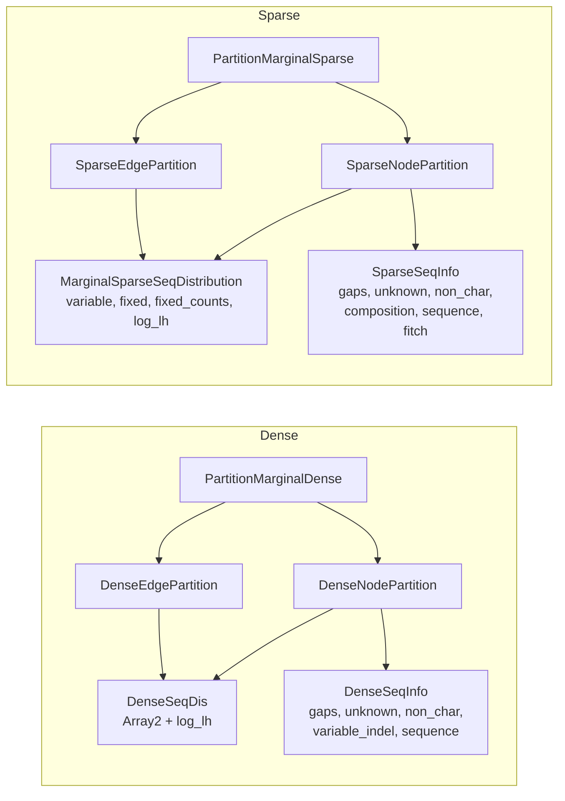

# Dense and sparse partition types have structural and naming asymmetries

The two distribution types have inconsistent names (`DenseSeqDis` vs `MarginalSparseSeqDistribution`). Several other structural differences exist but are domain-inherent and require no action.

## Type structure

Both partition types implement `PartitionBranchOps`, `PartitionMarginalOps`, `PartitionOptimizeOps`, `PartitionRerootOps`, `PartitionTimetreeOps`, `HasLogLh`. Sparse also implements `PartitionCompressed`.

## Actionable asymmetries

### Naming: `DenseSeqDis` vs `MarginalSparseSeqDistribution`

`DenseSeqDis` [packages/treetime/src/representation/payload/dense.rs#L45](../../packages/treetime/src/representation/payload/dense.rs#L45) abbreviates "Distribution" to 3 characters. `MarginalSparseSeqDistribution` [packages/treetime/src/representation/payload/sparse.rs#L159](../../packages/treetime/src/representation/payload/sparse.rs#L159) spells it out and adds a redundant "Marginal" prefix (sparse distributions exist only in marginal context; the Fitch counterpart is separately named `FitchSeqDistribution` [packages/treetime/src/representation/payload/sparse.rs#L187](../../packages/treetime/src/representation/payload/sparse.rs#L187)).

**Fix:** rename to `DenseSeqDistribution` and `SparseSeqDistribution`. Pure mechanical rename, ~17 files, zero functional change.

## Domain-inherent asymmetries (no action needed)

The remaining differences follow from dense storing full N-by-K matrices while sparse stores deltas from a reference. Forcing a shared generic shape would lose type safety or add indirection without benefit.

- Node/edge inner types differ: dense uses `Array2<f64>` profiles, sparse uses `BTreeMap<usize, VarPos>` variable-site maps + `BTreeMap<AsciiChar, Array1<f64>>` fixed-state vectors. Same `profile`/`msg_*` field names, different inner types. This is the representation difference itself
- Fitch substitution storage: sparse edges carry `subs_fitch`/`subs_ml` with composition/inversion/chaining methods. Dense edges have none - substitutions are derived on-the-fly by argmax comparison of endpoint posteriors
- Composition tracking: sparse carries explicit `Composition` counts. Dense does not need them - character frequencies are implicit in the full matrix
- Reroot: `PartitionRerootOps` is a no-op for dense [packages/treetime/src/representation/partition/marginal_dense.rs#L55](../../packages/treetime/src/representation/partition/marginal_dense.rs#L55), ~120 lines for sparse [packages/treetime/src/representation/partition/marginal_sparse.rs#L133](../../packages/treetime/src/representation/partition/marginal_sparse.rs#L133). Dense recomputes profiles from scratch after topology changes; sparse must update mutation lists, edge messages, and root sequence
- `PartitionCompressed`: sparse-only [packages/treetime/src/representation/partition/marginal_sparse.rs#L39](../../packages/treetime/src/representation/partition/marginal_sparse.rs#L39). Compression is a sparse concept with no dense counterpart
- `SparseSeqInfo` has 6 fields vs `DenseSeqInfo` has 5: `DenseSeqInfo` tracks `gaps`, `unknown`, `non_char`, `variable_indel`, `sequence`. `SparseSeqInfo` also has `composition` and `fitch` (sparse bookkeeping)

## Tests needed

- Property test: for any random tree with gaps and unknowns, dense and sparse `edge_effective_length()` agree on every edge
- Golden master: `ancestral --dense=true` and `--dense=false` on `flu/h3n2/20`, `ebola`, `sc2` - branch lengths, log-likelihoods, reconstructed sequences agree within `1e-6` relative

## Cross-references

- [M-ancestral-dense-sparse-divergence.md](../issues/M-ancestral-dense-sparse-divergence.md) - S3 may contribute to the ~2.5% population with elevated divergence
- [M-ancestral-sparse-alphabet-mismatch.md](../issues/M-ancestral-sparse-alphabet-mismatch.md) - another dense/sparse behavioral difference

## Related issues

- Source: [N-representation-dense-sparse-partition-asymmetry.md](../issues/N-representation-dense-sparse-partition-asymmetry.md) -- delete after full resolution
